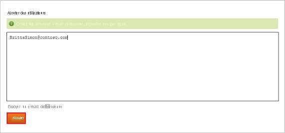

# Didacticiel : Intégration d’Azure Active Directory avec Datahug

Dans ce tutoriel, vous allez apprendre à intégrer Datahug à Azure Active Directory (Azure AD). Quand vous intégrez Datahug à Azure AD, vous pouvez :

* dans Azure AD, contrôler qui a accès à Datahug.
* permettre à vos utilisateurs de se connecter automatiquement à Datahug avec leurs comptes Azure AD.
* Gérer vos comptes à un emplacement central : le Portail Azure.

## Prérequis

Pour commencer, vous devez disposer de ce qui suit :

* Un abonnement Azure AD Si vous ne disposez d’aucun abonnement, vous pouvez obtenir [un compte gratuit](https://azure.microsoft.com/free/)
* Un abonnement Datahug pour lequel l’authentification unique (SSO) est activée.

## Description du scénario

Dans ce didacticiel, vous configurez et testez l’authentification unique Azure AD dans un environnement de test.

* Datahug prend en charge l’authentification unique lancée par le **fournisseur de services** et le **fournisseur d’identité**.

## Ajouter Datahug depuis la galerie

Pour configurer l’intégration de Datahug dans Azure AD, vous devez ajouter Datahug à partir de la galerie à votre liste d’applications SaaS gérées.

1. Connectez-vous au portail Azure avec un compte professionnel ou scolaire ou avec un compte personnel Microsoft.
1. Dans le panneau de navigation gauche, sélectionnez le service **Azure Active Directory**.
1. Accédez à **Applications d’entreprise**, puis sélectionnez **Toutes les applications**.
1. Pour ajouter une nouvelle application, sélectionnez **Nouvelle application**.
1. Dans la section **Ajouter à partir de la galerie**, tapez **Datahug** dans la zone de recherche.
1. Sélectionnez **Datahug** dans le volet de résultats, puis ajoutez l’application. Patientez quelques secondes pendant que l’application est ajoutée à votre locataire.

## Configurer et tester l’authentification unique Azure AD pour Datahug

Configurez et testez l’authentification unique Azure AD avec Datahug à l’aide d’un utilisateur de test appelé **B.Simon**. Pour que l’authentification unique fonctionne, vous devez établir un lien entre un utilisateur Azure AD et l’utilisateur associé dans Datahug.

Pour configurer et tester l’authentification unique Azure AD avec Datahug, procédez comme suit :

1. **[Configurer l’authentification unique Azure AD](#configure-azure-ad-sso)** pour permettre à vos utilisateurs d’utiliser cette fonctionnalité.
    1. **[Créer un utilisateur de test Azure AD](#create-an-azure-ad-test-user)** pour tester l’authentification unique Azure AD avec B. Simon.
    1. **[Affecter l’utilisateur de test Azure AD](#assign-the-azure-ad-test-user)** pour permettre à B. Simon d’utiliser l’authentification unique Azure AD.
1. **[Configurer l’authentification unique Datahug](#configure-datahug-sso)** pour configurer les paramètres de l’authentification unique côté application.
    1. **[Créer un utilisateur de test Datahug](#create-datahug-test-user)** pour avoir un équivalent de B.Simon dans Datahug lié à la représentation de l’utilisateur Azure AD.
1. **[Tester l’authentification unique](#test-sso)** pour vérifier si la configuration fonctionne.

## Configurer l’authentification unique Azure AD

Effectuez les étapes suivantes pour activer l’authentification unique Azure AD dans le Portail Azure.

1. Dans le Portail Azure, accédez à la page d’intégration de l’application **Datahug**, recherchez la section **Gérer** et sélectionnez **Authentification unique**.
1. Dans la page **Sélectionner une méthode d’authentification unique**, sélectionnez **SAML**.
1. Dans la page **Configurer l’authentification unique avec SAML**, cliquez sur l’icône de crayon de **Configuration SAML de base** afin de modifier les paramètres.

   

4. À la section **Configuration SAML de base**, si vous souhaitez configurer l’application en mode initié par **IDP**, suivez les étapes ci-dessous :

    a. Dans la zone de texte **Identificateur**, tapez une URL au format suivant : `https://apps.datahug.com/identity/<uniqueID>`

    b. Dans la zone de texte **URL de réponse**, tapez une URL au format suivant : `https://apps.datahug.com/identity/<uniqueID>/acs`

5. Si vous souhaitez configurer l’application en **mode démarré par le fournisseur de services**, cliquez sur **Définir des URL supplémentaires**, puis effectuez les étapes suivantes :

    Dans la zone de texte **URL de connexion**, tapez l’URL : `https://apps.datahug.com/`

    > [!NOTE]
    > Il ne s’agit pas de valeurs réelles. Mettez à jour ces valeurs avec l’identificateur et l’URL de réponse réels. Pour obtenir ces valeurs, contactez l’[équipe de support technique Datahug](https://www.sap.com/corporate/en/company/office-locations.html). Vous pouvez également consulter les modèles figurant à la section **Configuration SAML de base** dans le portail Azure.

6. Dans la page **Configurer l’authentification unique avec SAML**, dans la section **Certificat de signature SAML**, cliquez sur **Télécharger** pour télécharger le fichier **XML de métadonnées de fédération** en fonction des options définies selon vos besoins, puis enregistrez-le sur votre ordinateur.

    

7. Dans la section **Certificat de signature SAML**, cliquez sur le bouton **Modifier** pour ouvrir la boîte de dialogue **Certificat de signature SAML** et effectuez les étapes suivantes.

    

    a. Dans **Option de signature**, sélectionnez **Signer l’assertion SAML**.

    b. Dans **Algorithme de signature**, sélectionnez **SHA-1**.
    
    c. Cliquez sur **Enregistrer**.

8. Dans la section **Configurer Datahug**, copiez la ou les URL appropriées en fonction de vos besoins.

    

### Créer un utilisateur de test Azure AD 

Dans cette section, vous allez créer un utilisateur de test appelé B. Simon dans le portail Azure.

1. Dans le volet gauche du Portail Azure, sélectionnez **Azure Active Directory**, **Utilisateurs**, puis **Tous les utilisateurs**.
1. Sélectionnez **Nouvel utilisateur** dans la partie supérieure de l’écran.
1. Dans les propriétés **Utilisateur**, effectuez les étapes suivantes :
   1. Dans le champ **Nom**, entrez `B.Simon`.  
   1. Dans le champ **Nom de l’utilisateur**, entrez username@companydomain.extension. Par exemple : `B.Simon@contoso.com`.
   1. Cochez la case **Afficher le mot de passe**, puis notez la valeur affichée dans le champ **Mot de passe**.
   1. Cliquez sur **Créer**.

### Affecter l’utilisateur de test Azure AD

Dans cette section, vous allez autoriser B.Simon à utiliser l’authentification unique Azure en lui accordant l’accès à Datahug.

1. Dans le portail Azure, sélectionnez **Applications d’entreprise**, puis **Toutes les applications**.
1. Dans la liste des applications, sélectionnez **Datahug**.
1. Dans la page de vue d’ensemble de l’application, recherchez la section **Gérer** et sélectionnez **Utilisateurs et groupes**.
1. Sélectionnez **Ajouter un utilisateur**, puis **Utilisateurs et groupes** dans la boîte de dialogue **Ajouter une attribution**.
1. Dans la boîte de dialogue **Utilisateurs et groupes**, sélectionnez **B. Simon** dans la liste Utilisateurs, puis cliquez sur le bouton **Sélectionner** au bas de l’écran.
1. Si vous attendez qu’un rôle soit attribué aux utilisateurs, vous pouvez le sélectionner dans la liste déroulante **Sélectionner un rôle** . Si aucun rôle n’a été configuré pour cette application, vous voyez le rôle « Accès par défaut » sélectionné.
1. Dans la boîte de dialogue **Ajouter une attribution**, cliquez sur le bouton **Attribuer**.

## Configurer l’authentification unique Datahug

Pour configurer l’authentification unique côté **Datahug**, vous devez envoyer le **XML des métadonnées de fédération** téléchargé et les URL appropriées copiées à partir du portail Azure à l’[équipe du support technique Datahug](https://www.sap.com/corporate/en/company/office-locations.html). Celles-ci configurent ensuite ce paramètre pour que la connexion SSO SAML soit définie correctement des deux côtés.

### Créer un utilisateur de test Datahug

Pour se connecter à Datahug, les utilisateurs d’Azure AD doivent être provisionnés dans Datahug.  
Pour Datahug, l’approvisionnement est une tâche manuelle.

**Pour approvisionner un compte d’utilisateur, procédez comme suit :**

1. Connectez-vous à votre site d’entreprise Datahug en tant qu’administrateur.

2. Passez la souris sur **l’icône d’engrenage** dans le coin supérieur droit et cliquez sur **Paramètres**.
   
    

3. Choisissez **Personnes** et cliquez sur l’onglet **Ajouter des utilisateurs**.

    

4. Tapez l’adresse électronique de la personne pour laquelle vous souhaitez créer un compte et cliquez sur **Ajouter**.

    

    > [!NOTE] 
    > Vous pouvez envoyer un courrier d’inscription à l’utilisateur en sélectionnant **Send welcome email** (Envoyer un e-mail de bienvenue).  
    > Si vous créez un compte pour l’équipe commerciale, n’envoyez pas l’e-mail de bienvenue.

## Tester l’authentification unique (SSO)

Dans cette section, vous allez tester votre configuration de l’authentification unique Azure AD avec les options suivantes. 

#### Lancée par le fournisseur de services :

* Cliquez sur **Tester cette application** dans le portail Azure. Cette opération redirige vers l’URL de connexion Datahug, d’où vous pouvez lancer le flux de connexion.  

* Accédez directement à l’URL de connexion Datahug pour lancer le flux de connexion.

#### Lancée par le fournisseur d’identité :

* Cliquez sur **Tester cette application** dans le Portail Azure ; vous êtes alors automatiquement connecté à l’application Datahug pour laquelle vous avez configuré l’authentification unique. 

Vous pouvez aussi utiliser Mes applications de Microsoft pour tester l’application dans n’importe quel mode. Si, quand vous cliquez sur la mosaïque Datahug dans Mes applications, le mode Fournisseur de services est configuré, vous êtes redirigé vers la page de connexion de l’application pour lancer le flux de connexion ; s’il s’agit du mode Fournisseur d’identité, vous êtes automatiquement connecté à l’application Datahug pour laquelle vous avez configuré l’authentification unique. Pour plus d’informations sur Mes applications, consultez [Présentation de Mes applications](https://support.microsoft.com/account-billing/sign-in-and-start-apps-from-the-my-apps-portal-2f3b1bae-0e5a-4a86-a33e-876fbd2a4510).

## Étapes suivantes

Une fois que vous avez configuré Datahug, vous pouvez appliquer le contrôle de session, qui protège contre l’exfiltration et l’infiltration des données sensibles de votre organisation en temps réel. Le contrôle de session est étendu à partir de l’accès conditionnel. [Découvrez comment appliquer un contrôle de session avec Microsoft Cloud App Security](/cloud-app-security/proxy-deployment-aad).