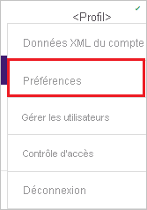
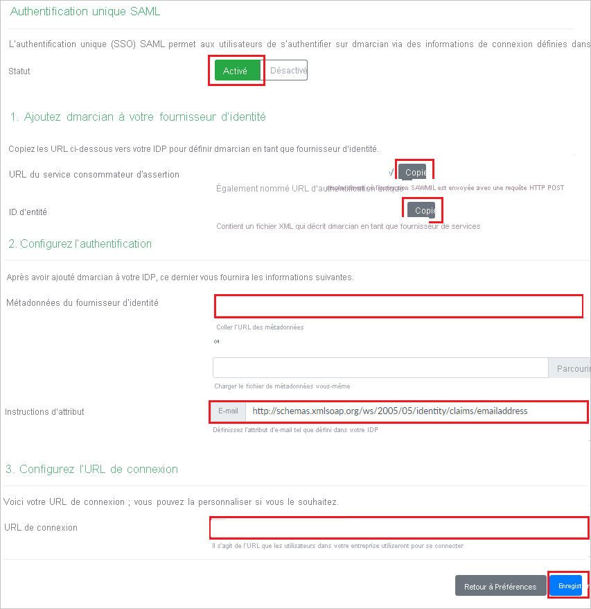
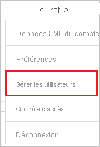
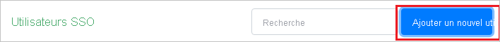
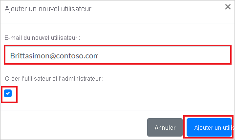

# Tutoriel : Intégrer dmarcian à Azure Active Directory

Dans ce tutoriel, vous allez apprendre à intégrer dmarcian à Azure Active Directory (Azure AD). Quand vous intégrez dmarcian à Azure AD, vous pouvez :

* Dans Azure AD, contrôler qui a accès à dmarcian
* Permettre à vos utilisateurs de se connecter automatiquement à dmarcian avec leur compte Azure AD
* Gérer vos comptes à un emplacement central : le Portail Azure.

## Prérequis

Pour commencer, vous devez disposer de ce qui suit :

* Un abonnement Azure AD Si vous ne disposez d’aucun abonnement, vous pouvez obtenir [un compte gratuit](https://azure.microsoft.com/free/).
* Un abonnement dmarcian pour lequel l’authentification unique (SSO) est activée.

## Description du scénario

Dans ce tutoriel, vous allez configurer et tester l’authentification unique Azure AD dans un environnement de test.

* dmarcian prend en charge l’authentification unique initiée par le **fournisseur de services et le fournisseur d’identité**.

## Ajouter dmarcian à partir de la galerie

Pour configurer l’intégration de dmarcian à Azure AD, vous devez ajouter dmarcian à partir de la galerie à votre liste d’applications SaaS gérées.

1. Connectez-vous au portail Azure avec un compte professionnel ou scolaire ou avec un compte personnel Microsoft.
1. Dans le panneau de navigation gauche, sélectionnez le service **Azure Active Directory**.
1. Accédez à **Applications d’entreprise**, puis sélectionnez **Toutes les applications**.
1. Pour ajouter une nouvelle application, sélectionnez **Nouvelle application**.
1. Dans la section **Ajouter à partir de la galerie**, tapez **dmarcian** dans la zone de recherche.
1. Sélectionnez **dmarcian** dans le volet de résultats, puis ajoutez l’application. Patientez quelques secondes pendant que l’application est ajoutée à votre locataire.

## Configurer et tester l’authentification unique Azure AD pour dmarcian

Configurez et testez l’authentification unique Azure AD avec dmarcian au moyen d’un utilisateur de test appelé **B.Simon**. Pour que l’authentification unique fonctionne, vous devez établir un lien entre un utilisateur Azure AD et l’utilisateur dmarcian associé.

Pour configurer et tester l’authentification unique Azure AD avec dmarcian, procédez comme suit :

1. **[Configurer l’authentification unique Azure AD](#configure-azure-ad-sso)** pour permettre à vos utilisateurs d’utiliser cette fonctionnalité.
    1. **[Créer un utilisateur de test Azure AD](#create-an-azure-ad-test-user)** pour tester l’authentification unique Azure AD avec B. Simon.
    1. **[Affecter l’utilisateur de test Azure AD](#assign-the-azure-ad-test-user)** pour permettre à B. Simon d’utiliser l’authentification unique Azure AD.
1. **[Configurer l’authentification unique de dmarcian](#configure-dmarcian-sso)** pour configurer les paramètres de l’authentification unique côté application.
    1. **[Créer un utilisateur de test dmarcian](#create-dmarcian-test-user)** pour avoir dans dmarcian un équivalent de B. Simon lié à la représentation Azure AD associée.
1. **[Tester l’authentification unique](#test-sso)** pour vérifier si la configuration fonctionne.

## Configurer l’authentification unique Azure AD

Effectuez les étapes suivantes pour activer l’authentification unique Azure AD dans le Portail Azure.

1. Dans le portail Azure, accédez à la page d’intégration de l’application **dmarcian**, recherchez la section **Gérer** et sélectionnez **Authentification unique**.
1. Dans la page **Sélectionner une méthode d’authentification unique**, sélectionnez **SAML**.
1. Dans la page **Configurer l’authentification unique avec SAML**, cliquez sur l’icône de crayon pour **Configuration SAML de base** afin de modifier les paramètres.

   

4. À la section **Configuration SAML de base**, si vous souhaitez configurer l’application en mode initié par **IDP**, suivez les étapes ci-dessous :

    a. Dans la zone de texte **Identificateur**, tapez une URL au format suivant :

    | **Identificateur** |
    |-----|
    | `https://us.dmarcian.com/sso/saml/<ACCOUNT_ID>/sp.xml` |
    | `https://dmarcian-eu.com/sso/saml/<ACCOUNT_ID>/sp.xml` |
    | `https://dmarcian-ap.com/sso/saml/<ACCOUNT_ID>/sp.xml` |
    

    b. Dans la zone de texte **URL de réponse**, tapez une URL au format suivant :

    | **URL de réponse** |
    |----|
    | `https://us.dmarcian.com/login/<ACCOUNT_ID>/handle/` |
    | `https://dmarcian-eu.com/login/<ACCOUNT_ID>/handle/` |
    | `https://dmarcian-ap.com/login/<ACCOUNT_ID>/handle/` |
   

5. Si vous souhaitez configurer l’application en **mode démarré par le fournisseur de services**, cliquez sur **Définir des URL supplémentaires**, puis effectuez les étapes suivantes :

    Dans la zone de texte **URL d’authentification**, tapez une URL au format suivant :
    
    | **URL d’authentification** |
    |-----|
    | `https://us.dmarcian.com/login/<ACCOUNT_ID>` |
    | `https://dmarcian-eu.com/login/<ACCOUNT_ID>` |
    | `https://dmarciam-ap.com/login/<ACCOUNT_ID>` |
     
    > [!NOTE] 
    > Il ne s’agit pas de valeurs réelles. Vous mettez à jour ces valeurs avec l’identificateur, l’URL de réponse et l’URL de connexion réels. La procédure est expliquée plus loin dans le didacticiel.

4. Dans la page **Configurer l’authentification unique avec SAML**, dans la section **Certificat de signature SAML**, cliquez sur le bouton Copier pour copier l’**URL des métadonnées de fédération d’application**, puis enregistrez-la sur votre ordinateur.

    

### Créer un utilisateur de test Azure AD

Dans cette section, vous allez créer un utilisateur de test appelé B. Simon dans le portail Azure.

1. Dans le volet gauche du Portail Azure, sélectionnez **Azure Active Directory**, **Utilisateurs**, puis **Tous les utilisateurs**.
1. Sélectionnez **Nouvel utilisateur** dans la partie supérieure de l’écran.
1. Dans les propriétés **Utilisateur**, effectuez les étapes suivantes :
   1. Dans le champ **Nom**, entrez `B.Simon`.  
   1. Dans le champ **Nom de l’utilisateur**, entrez username@companydomain.extension. Par exemple : `B.Simon@contoso.com`.
   1. Cochez la case **Afficher le mot de passe**, puis notez la valeur affichée dans le champ **Mot de passe**.
   1. Cliquez sur **Créer**.

### Affecter l’utilisateur de test Azure AD

Dans cette section, vous allez autoriser B.Simon à utiliser l’authentification unique Azure en accordant l’accès à dmarcian.

1. Dans le portail Azure, sélectionnez **Applications d’entreprise**, puis **Toutes les applications**.
1. Dans la liste des applications, sélectionnez **dmarcian**.
1. Dans la page de vue d’ensemble de l’application, recherchez la section **Gérer** et sélectionnez **Utilisateurs et groupes**.
1. Sélectionnez **Ajouter un utilisateur**, puis **Utilisateurs et groupes** dans la boîte de dialogue **Ajouter une attribution**.
1. Dans la boîte de dialogue **Utilisateurs et groupes**, sélectionnez **B. Simon** dans la liste Utilisateurs, puis cliquez sur le bouton **Sélectionner** au bas de l’écran.
1. Si vous attendez une valeur de rôle dans l’assertion SAML, dans la boîte de dialogue **Sélectionner un rôle**, sélectionnez le rôle approprié pour l’utilisateur dans la liste, puis cliquez sur le bouton **Sélectionner** en bas de l’écran.
1. Dans la boîte de dialogue **Ajouter une attribution**, cliquez sur le bouton **Attribuer**.

## Configurer l’authentification unique dmarcian

1. Afin d’automatiser la configuration dans dmarcian, vous devez installer l’**extension de navigateur permettant la connexion sécurisée à Mes applications** en cliquant sur **Installer l’extension**.

    

2. Après l’ajout de l’extension au navigateur, cliquez sur **Configurer dmarcian** pour être dirigé vers l’application dmarcian. À partir de là, indiquez les informations d’identification de l’administrateur pour vous connecter à dmarcian. Cette extension de navigateur configure automatiquement l’application et automatise les étapes 3 à 6.

    

3. Si vous souhaitez configurer manuellement dmarcian, ouvrez une nouvelle fenêtre de navigateur web, connectez-vous à votre site d’entreprise dmarcian en tant qu’administrateur et effectuez les étapes suivantes :

4. Cliquez sur **Profile** en haut à droite et accédez à **Preferences**.

    

5. Faites défiler, puis cliquez sur la section **Authentification unique** et sur **Configurer**.

    

6. Sur la page **Authentification unique SAML**, définissez **État** sur **Activé** et suivez les étapes ci-après :

    

    a. Sous la section **Add dmarcian to your Identity Provider** (Ajouter dmarcian à votre fournisseur d’identité), cliquez sur **COPIER** pour copier l’**URL du service consommateur d’assertion** de votre instance et collez-la dans la zone de texte **URL de réponse** dans la section **Configuration SAML de base** du portail Azure.

    b. Sous la section **Add dmarcian to your Identity Provider** (Ajouter dmarcian à votre fournisseur d’identité), cliquez sur **COPIER** pour copier l’**ID d’entité** de votre instance et collez-la dans la zone de texte **Identificateur** dans la section **Configuration SAML de base** du portail Azure.

    c. Sous la section **Set up Authentication** (Configurer l’authentification), dans la zone de texte **Identity Provider Metadata** (Métadonnées du fournisseur d’identité), collez **l’URL des métadonnées de fédération d’application**, que vous avez copiée à partir du Portail Azure.

    d. Sous la section **Set up Authentication** (Configurer l’authentification), dans la zone de texte **Attribute Statements** (Instructions d’attribut), collez l’URL `http://schemas.xmlsoap.org/ws/2005/05/identity/claims/emailaddress`.

    e. Sous la section **Set up Login URL** (Configurer l’URL de connexion), copiez l’**URL de connexion** de votre instance et collez-la dans la zone de texte **URL de connexion** de la section **Configuration SAML de base** du portail Azure.

    > [!Note]
    > Vous pouvez modifier l’**URL de connexion** en fonction de votre organisation.

    f. Cliquez sur **Enregistrer**.

### Créer un utilisateur de test dmarcian

Pour se connecter à dmarcian, les utilisateurs Azure AD doivent être approvisionnés dans dmarcian. Dans dmarcian, l’approvisionnement est une tâche manuelle.

**Pour approvisionner un compte d’utilisateur, procédez comme suit :**

1. Connectez-vous à dmarcian en tant qu’administrateur de la sécurité.

2. Cliquez sur **Profile** en haut à droite et accédez à **Manage Users** (Gérer les utilisateurs).

    

3. Sur le côté droit de la section **SSO Users** (Utilisateurs SSO), cliquez sur **Ajouter un nouvel utilisateur**.

    

4. Dans la fenêtre contextuelle **Ajouter un nouvel utilisateur**, procédez comme suit :

    

    a. Dans la zone de texte **Nouvel e-mail d’utilisateur**, entrez l’e-mail de l’utilisateur, par exemple **brittasimon\@contoso.com**.

    b. Si vous souhaitez accorder des droits d’administrateur à l’utilisateur, sélectionnez **Make User an Admin** (Rendre l’utilisateur administrateur).

    c. Cliquez sur **Add User**.

## Tester l’authentification unique (SSO) 

Dans cette section, vous allez tester votre configuration de l’authentification unique Azure AD avec les options suivantes. 

#### Lancée par le fournisseur de services :

* Cliquez sur **Tester cette application** dans le portail Azure. Vous êtes alors redirigé vers l’URL de connexion de dmarcian, à partir de laquelle vous pouvez lancer le flux de connexion.  

* Accédez directement à l’URL de connexion de dmarcian pour initier le flux de connexion.

#### Lancée par le fournisseur d’identité :

* Cliquez sur **Tester cette application** dans Portail Azure : vous devez être connecté automatiquement à l’instance de dmarcian pour laquelle vous avez configuré l’authentification unique. 

Vous pouvez aussi utiliser Mes applications de Microsoft pour tester l’application dans n’importe quel mode. Quand vous cliquez sur la vignette dmarcian dans Mes applications, si le mode Fournisseur de services est configuré, vous êtes redirigé vers la page de connexion de l’application pour lancer le flux de connexion ; si le mode Fournisseur d’identité est configuré, vous êtes automatiquement connecté à l’instance de dmarcian pour laquelle vous avez configuré l’authentification unique. Pour plus d’informations sur Mes applications, consultez [Présentation de Mes applications](../user-help/my-apps-portal-end-user-access.md).

## Étapes suivantes

Une fois que vous avez configuré dmarcian, vous pouvez appliquer le contrôle de session, qui protège contre l’exfiltration et l’infiltration des données sensibles de votre organisation en temps réel. Le contrôle de session est étendu à partir de l’accès conditionnel. [Découvrez comment appliquer un contrôle de session avec Microsoft Cloud App Security](/cloud-app-security/proxy-deployment-aad).
