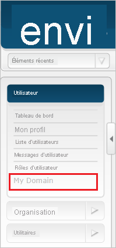
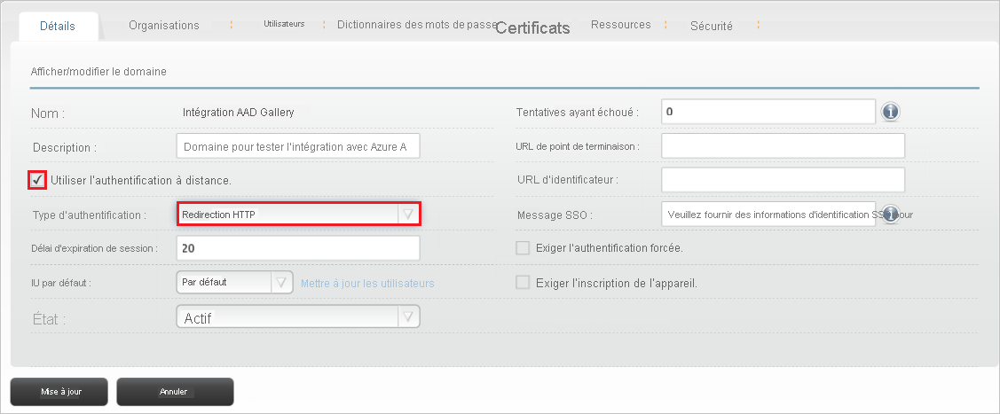
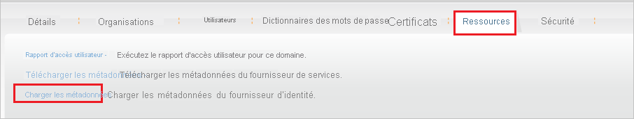
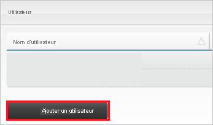

# Didacticiel : intégration d’Azure Active Directory à Envi MMIS

Dans ce didacticiel, vous allez apprendre à intégrer Envi MMIS à Azure Active Directory (Azure AD). Quand vous intégrez Envi MMIS à Azure AD, vous pouvez :

* Contrôler dans Azure AD qui a accès à Envi MMIS.
* Permettre à vos utilisateurs de se connecter automatiquement à Envi MMIS avec leur compte Azure AD.
* Gérer vos comptes à un emplacement central : le Portail Azure.

## Prérequis

Pour commencer, vous devez disposer de ce qui suit :

* Un abonnement Azure AD Si vous ne disposez d’aucun abonnement, vous pouvez obtenir [un compte gratuit](https://azure.microsoft.com/free/)
* Un abonnement Envi MMIS pour lequel l’authentification unique est activée.

## Description du scénario

Dans ce didacticiel, vous configurez et testez l’authentification unique Azure AD dans un environnement de test.

* Envi MMIS prend en charge l’authentification unique lancée par le **fournisseur de services** et le **fournisseur d’identité**.

## Ajouter Envi MMIS à partir de la galerie

Pour configurer l’intégration d’Envi MMIS à Azure AD, vous devez ajouter Envi MMIS à partir de la galerie à votre liste d’applications SaaS gérées.

1. Connectez-vous au portail Azure avec un compte professionnel ou scolaire ou avec un compte personnel Microsoft.
1. Dans le panneau de navigation gauche, sélectionnez le service **Azure Active Directory**.
1. Accédez à **Applications d’entreprise**, puis sélectionnez **Toutes les applications**.
1. Pour ajouter une nouvelle application, sélectionnez **Nouvelle application**.
1. Dans la section **Ajouter à partir de la galerie**, tapez **Envi MMIS** dans la zone de recherche.
1. Sélectionnez **Envi MMIS** dans le volet de résultats, puis ajoutez l’application. Patientez quelques secondes pendant que l’application est ajoutée à votre locataire.

## Configurer et tester l’authentification unique Azure AD pour Envi MMIS

Configurez et testez l’authentification unique Azure AD avec Envi MMIS pour un utilisateur de test appelé **B.Simon**. Pour que l’authentification unique fonctionne, vous devez établir un lien entre un utilisateur Azure AD et l’utilisateur Envi MMIS associé.

Pour configurer et tester l’authentification unique Azure AD avec Envi MMIS, effectuez les étapes suivantes :

1. **[Configurer l’authentification unique Azure AD](#configure-azure-ad-sso)** pour permettre à vos utilisateurs d’utiliser cette fonctionnalité.
    1. **[Créer un utilisateur de test Azure AD](#create-an-azure-ad-test-user)** pour tester l’authentification unique Azure AD avec B. Simon.
    1. **[Affecter l’utilisateur de test Azure AD](#assign-the-azure-ad-test-user)** pour permettre à B. Simon d’utiliser l’authentification unique Azure AD.
1. **[Configurer l’authentification unique Envi MMIS](#configure-envi-mmis-sso)** pour configurer les paramètres de l’authentification unique côté application.
    1. **[Créer un utilisateur de test Envi MMIS](#create-envi-mmis-test-user)** pour avoir un équivalent de B.Simon dans Envi MMIS, lié à la représentation Azure AD associée.
1. **[Tester l’authentification unique](#test-sso)** pour vérifier si la configuration fonctionne.

## Configurer l’authentification unique Azure AD

Effectuez les étapes suivantes pour activer l’authentification unique Azure AD dans le Portail Azure.

1. Dans le portail Azure, accédez à la page d’intégration de l’application **Envi MMIS**, recherchez la section **Gérer** et sélectionnez **Authentification unique**.
1. Dans la page **Sélectionner une méthode d’authentification unique**, sélectionnez **SAML**.
1. Dans la page **Configurer l’authentification unique avec SAML**, cliquez sur l’icône de crayon de **Configuration SAML de base** afin de modifier les paramètres.

   

4. À la section **Configuration SAML de base**, si vous souhaitez configurer l’application en mode initié par **IDP**, suivez les étapes ci-dessous :

    a. Dans la zone de texte **Identificateur**, tapez une URL au format suivant : `https://www.<CUSTOMER DOMAIN>.com/Account`

    b. Dans la zone de texte **URL de réponse**, tapez une URL au format suivant : `https://www.<CUSTOMER DOMAIN>.com/Account/Acs`

5. Si vous souhaitez configurer l’application en **mode démarré par le fournisseur de services**, cliquez sur **Définir des URL supplémentaires**, puis effectuez les étapes suivantes :

    Dans la zone de texte **URL de connexion**, tapez une URL au format suivant : `https://www.<CUSTOMER DOMAIN>.com/Account`

    > [!NOTE]
    > Il ne s’agit pas de valeurs réelles. Mettez à jour ces valeurs avec l’identificateur, l’URL de réponse et l’URL de connexion réels. Pour obtenir ces valeurs, contactez [l’équipe du support technique d’Envi MMIS](mailto:support@ioscorp.com). Vous pouvez également consulter les modèles figurant à la section **Configuration SAML de base** dans le portail Azure.

6. Dans la page **Configurer l’authentification unique avec SAML**, dans la section **Certificat de signature SAML**, cliquez sur **Télécharger** pour télécharger le fichier **XML de métadonnées de fédération** en fonction des options définies selon vos besoins, puis enregistrez-le sur votre ordinateur.

    

7. Dans la section **Configurer Envi MMIS**, copiez la ou les URL appropriées en fonction de vos besoins.

    

### Créer un utilisateur de test Azure AD 

Dans cette section, vous allez créer un utilisateur de test appelé B. Simon dans le portail Azure.

1. Dans le volet gauche du Portail Azure, sélectionnez **Azure Active Directory**, **Utilisateurs**, puis **Tous les utilisateurs**.
1. Sélectionnez **Nouvel utilisateur** dans la partie supérieure de l’écran.
1. Dans les propriétés **Utilisateur**, effectuez les étapes suivantes :
   1. Dans le champ **Nom**, entrez `B.Simon`.  
   1. Dans le champ **Nom de l’utilisateur**, entrez username@companydomain.extension. Par exemple : `B.Simon@contoso.com`.
   1. Cochez la case **Afficher le mot de passe**, puis notez la valeur affichée dans le champ **Mot de passe**.
   1. Cliquez sur **Créer**.

### Affecter l’utilisateur de test Azure AD

Dans cette section, vous allez autoriser B.Simon à utiliser l’authentification unique Azure en lui accordant l’accès à Envi MMIS.

1. Dans le portail Azure, sélectionnez **Applications d’entreprise**, puis **Toutes les applications**.
1. Dans la liste des applications, sélectionnez **Envi MMIS**.
1. Dans la page de vue d’ensemble de l’application, recherchez la section **Gérer** et sélectionnez **Utilisateurs et groupes**.
1. Sélectionnez **Ajouter un utilisateur**, puis **Utilisateurs et groupes** dans la boîte de dialogue **Ajouter une attribution**.
1. Dans la boîte de dialogue **Utilisateurs et groupes**, sélectionnez **B. Simon** dans la liste Utilisateurs, puis cliquez sur le bouton **Sélectionner** au bas de l’écran.
1. Si vous attendez qu’un rôle soit attribué aux utilisateurs, vous pouvez le sélectionner dans la liste déroulante **Sélectionner un rôle** . Si aucun rôle n’a été configuré pour cette application, vous voyez le rôle « Accès par défaut » sélectionné.
1. Dans la boîte de dialogue **Ajouter une attribution**, cliquez sur le bouton **Attribuer**.

## Configurer l’authentification unique Envi MMIS

1. Dans une autre fenêtre de navigateur web, connectez-vous à votre site Envi MMIS en tant qu’administrateur.

2. Cliquez sur l’onglet **My Domain** (Mon domaine).

    

3. Cliquez sur **Modifier**.

    

4. Cochez la case **Use remote authentication** (Utiliser l’authentification distante), puis sélectionnez **HTTP Redirect** (Redirection HTTP) dans la liste déroulante **Authentication Type** (Type d’authentification).

    

5. Sélectionnez l’onglet **Resources** (Ressources), puis cliquez sur **Upload Metadata** (Charger les métadonnées).

    

6. Dans la section **Upload Metadata** (Charger les métadonnées), procédez comme suit :

    

    a. Dans la liste déroulante **Upload From** (Charger à partir de), sélectionnez **File** (Fichier).

    b. Chargez le fichier de métadonnées téléchargé à partir du Portail Azure en sélectionnant **l’icône de choix de fichier**.

    c. Cliquez sur **OK**.

7. Une fois que vous avez chargé le fichier de métadonnées téléchargé, les champs sont automatiquement renseignés. Cliquez sur **Update**.

    

### Créer un utilisateur de test Envi MMIS

Pour se connecter à Envi MMIS, les utilisateurs Azure AD doivent être provisionnés dans Envi MMIS. Dans le cas d’Envi MMIS, l’approvisionnement est une tâche manuelle.

**Pour approvisionner un compte d’utilisateur, procédez comme suit :**

1. Connectez-vous à votre site d’entreprise Envi MMIS en tant qu’administrateur.

2. Cliquez sur l’onglet **User List** (Liste d’utilisateurs).

    

3. Cliquez sur le bouton **Add User** (Ajouter un utilisateur).

    

4. Dans la section **Add User** , procédez comme suit :

    

    a. Dans la zone de texte **User Name** (Nom d’utilisateur), tapez le nom d’utilisateur du compte de Britta Simon, comme **brittasimon\@contoso.com**.
    
    b. Dans la zone de texte **First Name** (Prénom), tapez le prénom de Britta Simon, tel que **Britta**.

    c. Dans la zone de texte **Last Name** (Nom de famille), tapez le nom de Britta Simon, par exemple **Simon**.

    d. Dans la zone de texte **Title** (Titre), entrez le titre de l’utilisateur.
    
    e. Dans la zone de texte **Email Address** (Adresse e-mail), tapez l’adresse e-mail du compte de Britta Simon, comme **brittasimon\@contoso.com**.

    f. Dans la zone de texte **SSO User Name** (Nom d’utilisateur SSO), tapez le nom d’utilisateur du compte de Britta Simon, comme **brittasimon\@contoso.com**.

    g. Cliquez sur **Enregistrer**.

## Tester l’authentification unique (SSO)

Dans cette section, vous allez tester votre configuration de l’authentification unique Azure AD avec les options suivantes. 

#### Lancée par le fournisseur de services :

* Cliquez sur **Tester cette application** dans le portail Azure. Vous êtes redirigé vers l’URL de connexion à Envi MMIS, à partir de laquelle vous pouvez lancer le processus de connexion.  

* Accédez directement à l’URL de connexion Envi MMIS pour lancer le processus de connexion.

#### Lancée par le fournisseur d’identité :

* Cliquez sur **Tester cette application** dans le portail Azure : vous devez être connecté automatiquement à l’instance de Envi MMIS pour laquelle vous avez configuré l’authentification unique. 

Vous pouvez aussi utiliser Mes applications de Microsoft pour tester l’application dans n’importe quel mode. Si, quand vous cliquez sur la vignette Envi MMIS dans Mes applications, le mode Fournisseur de services est configuré, vous êtes redirigé vers la page de connexion de l’application pour lancer le flux de connexion ; s’il s’agit du mode Fournisseur d’identité, vous êtes automatiquement connecté à l’instance d’Envi MMISpour laquelle vous avez configuré l’authentification unique. Pour plus d’informations sur Mes applications, consultez [Présentation de Mes applications](https://support.microsoft.com/account-billing/sign-in-and-start-apps-from-the-my-apps-portal-2f3b1bae-0e5a-4a86-a33e-876fbd2a4510).

## Étapes suivantes

Après avoir configuré Envi MMIS, vous pouvez appliquer un contrôle de session qui protège l’exfiltration et l’infiltration des données sensibles de votre organisation en temps réel. Le contrôle de session est étendu à partir de l’accès conditionnel. [Découvrez comment appliquer un contrôle de session avec Microsoft Cloud App Security](/cloud-app-security/proxy-deployment-aad).