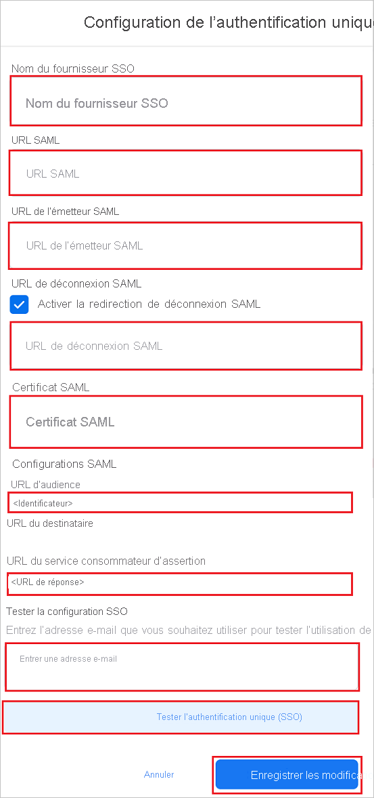

# Tutoriel : Intégration de l’authentification unique (SSO) Azure Active Directory à Facebook Work Accounts

Dans ce tutoriel, vous allez apprendre à intégrer Facebook Work Accounts à Azure Active Directory (Azure AD). Voici ce que vous pouvez faire quand vous intégrez Facebook Work Accounts à Azure AD :

* Contrôler dans Azure AD qui a accès à Facebook Work Accounts.
* Permettre à vos utilisateurs de se connecter automatiquement à Facebook Work Accounts avec leur compte Azure AD.
* Gérer vos comptes à un emplacement central : le Portail Azure.

## Prérequis

Pour commencer, vous devez disposer de ce qui suit :

* Un abonnement Azure AD Si vous ne disposez d’aucun abonnement, vous pouvez obtenir [un compte gratuit](https://azure.microsoft.com/free/).
* Un abonnement à Facebook Work Accounts pour lequel l’authentification unique (SSO) est activée.

## Description du scénario

Dans ce tutoriel, vous allez configurer et tester l’authentification unique Azure AD dans un environnement de test.

* Facebook Work Accounts prend en charge l’authentification unique lancée par le **fournisseur de service et le fournisseur d’identité**.

## Ajouter Facebook Work Accounts à partir de la galerie

Pour configurer l’intégration de Facebook Work Accounts à Azure AD, vous devez ajouter Facebook Work Accounts à partir de la galerie à votre liste d’applications SaaS managées.

1. Connectez-vous au portail Azure avec un compte professionnel ou scolaire ou avec un compte personnel Microsoft.
1. Dans le panneau de navigation gauche, sélectionnez le service **Azure Active Directory**.
1. Accédez à **Applications d’entreprise**, puis sélectionnez **Toutes les applications**.
1. Pour ajouter une nouvelle application, sélectionnez **Nouvelle application**.
1. Dans la section **Ajouter à partir de la galerie**, tapez **Facebook Work Accounts** dans la zone de recherche.
1. Sélectionnez **Facebook Work Accounts** dans le volet de résultats, puis ajoutez l’application. Patientez quelques secondes pendant que l’application est ajoutée à votre locataire.

## Configurer et tester l’authentification unique Azure AD pour Facebook Work Accounts

Configurez et testez l’authentification unique Azure AD avec Facebook Work Accounts à l’aide d’un utilisateur test nommé **B.Simon**. Pour que l’authentification unique fonctionne, vous devez établir un lien entre un utilisateur Azure AD et l’utilisateur Facebook Work Accounts associé.

Pour configurer et tester l’authentification unique Azure AD avec Facebook Work Accounts, effectuez les étapes suivantes :

1. **[Configurer l’authentification unique Azure AD](#configure-azure-ad-sso)** pour permettre à vos utilisateurs d’utiliser cette fonctionnalité.
    1. **[Créer un utilisateur de test Azure AD](#create-an-azure-ad-test-user)** pour tester l’authentification unique Azure AD avec B. Simon.
    1. **[Affecter l’utilisateur de test Azure AD](#assign-the-azure-ad-test-user)** pour permettre à B. Simon d’utiliser l’authentification unique Azure AD.
1. **[Configurer l’authentification unique de Facebook Work Accounts](#configure-facebook-work-accounts-sso)** pour configurer les paramètres d’authentification unique côté application.
    1. **[Créer un utilisateur test Facebook Work Accounts](#create-facebook-work-accounts-test-user)** pour avoir dans Facebook Work Accounts un équivalent de B.Simon lié à la représentation Azure AD associée.
1. **[Tester l’authentification unique](#test-sso)** pour vérifier si la configuration fonctionne.

## Configurer l’authentification unique Azure AD

Effectuez les étapes suivantes pour activer l’authentification unique Azure AD dans le Portail Azure.

1. Dans le portail Azure, accédez à la page d’intégration de l’application **Facebook Work Accounts**, recherchez la section **Gérer** et sélectionnez **Authentification unique**.
1. Dans la page **Sélectionner une méthode d’authentification unique**, sélectionnez **SAML**.
1. Dans la page **Configurer l’authentification unique avec SAML**, cliquez sur l’icône de crayon de **Configuration SAML de base** afin de modifier les paramètres.

   

1. Dans la section **Configuration SAML de base**, si vous souhaitez configurer l’application en mode lancé par le **fournisseur d’identité**, effectuez les étapes suivantes :

    a. Dans la zone de texte **Identificateur**, tapez une URL au format suivant : `https://work.facebook.com/company/<ID>`

    b. Dans la zone de texte **URL de réponse**, tapez une URL au format suivant : ` https://work.facebook.com/work/saml.php?__cid=<ID>`

1. Si vous souhaitez configurer l’application en **mode démarré par le fournisseur de services**, cliquez sur **Définir des URL supplémentaires**, puis effectuez les étapes suivantes :

    Dans la zone de texte **URL de connexion**, tapez l’URL : `https://work.facebook.com`

    > [!NOTE]
    > Il ne s’agit pas de valeurs réelles. Mettez à jour ces valeurs avec l’identificateur et l’URL de réponse réels. Pour obtenir ces valeurs, contactez l’[équipe du support de Facebook Work Accounts](mailto:WorkplaceSupportPartnerships@fb.com). Vous pouvez également consulter les modèles figurant à la section **Configuration SAML de base** dans le portail Azure.

1. Dans la page **Configurer l’authentification unique avec SAML**, dans la section **Certificat de signature SAML**, recherchez **Certificat (en base64)** , puis sélectionnez **Télécharger** pour télécharger le certificat et l’enregistrer sur votre ordinateur.

    

1. Dans la section **Configurer Facebook Work Accounts**, copiez la ou les URL appropriées correspondant à vos besoins.

    

### Créer un utilisateur de test Azure AD

Dans cette section, vous allez créer un utilisateur de test appelé B. Simon dans le portail Azure.

1. Dans le volet gauche du Portail Azure, sélectionnez **Azure Active Directory**, **Utilisateurs**, puis **Tous les utilisateurs**.
1. Sélectionnez **Nouvel utilisateur** dans la partie supérieure de l’écran.
1. Dans les propriétés **Utilisateur**, effectuez les étapes suivantes :
   1. Dans le champ **Nom**, entrez `B.Simon`.  
   1. Dans le champ **Nom de l’utilisateur**, entrez username@companydomain.extension. Par exemple : `B.Simon@contoso.com`.
   1. Cochez la case **Afficher le mot de passe**, puis notez la valeur affichée dans le champ **Mot de passe**.
   1. Cliquez sur **Créer**.

### Affecter l’utilisateur de test Azure AD

Dans cette section, vous allez autoriser B.Simon à utiliser l’authentification unique Azure en accordant l’accès à Facebook Work Accounts.

1. Dans le portail Azure, sélectionnez **Applications d’entreprise**, puis **Toutes les applications**.
1. Dans la liste des applications, sélectionnez **Facebook Work Accounts**.
1. Dans la page de vue d’ensemble de l’application, recherchez la section **Gérer** et sélectionnez **Utilisateurs et groupes**.
1. Sélectionnez **Ajouter un utilisateur**, puis **Utilisateurs et groupes** dans la boîte de dialogue **Ajouter une attribution**.
1. Dans la boîte de dialogue **Utilisateurs et groupes**, sélectionnez **B. Simon** dans la liste Utilisateurs, puis cliquez sur le bouton **Sélectionner** au bas de l’écran.
1. Si vous attendez qu’un rôle soit attribué aux utilisateurs, vous pouvez le sélectionner dans la liste déroulante **Sélectionner un rôle** . Si aucun rôle n’a été configuré pour cette application, vous voyez le rôle « Accès par défaut » sélectionné.
1. Dans la boîte de dialogue **Ajouter une attribution**, cliquez sur le bouton **Attribuer**.

## Configurer l’authentification unique de Facebook Work Accounts

1. Connectez-vous à votre site d’entreprise Facebook Work Accounts en tant qu’administrateur.

1. Accédez à **Sécurité** > **Authentification unique**.

1. Cochez la case **Authentification unique (SSO)** , puis cliquez sur **+Ajouter un nouveau fournisseur d’authentification unique**.

    

1. Dans la page de **configuration de l’authentification unique**, effectuez les étapes suivantes :

    

    1. Entrez un **nom valide pour le fournisseur SSO**.

    1. Dans la zone de texte de l’**URL SAML**, collez la valeur de l’**URL de connexion** que vous avez copiée à partir du portail Azure.

    1. Dans la zone de texte de l’**URL de l’émetteur**, collez la valeur de l’**identificateur Azure AD** que vous avez copiée à partir du portail Azure.

    1. Cochez la case de **redirection de la déconnexion SAML** et, dans la zone de texte de l’**URL de déconnexion SAML**, collez la valeur de l’**URL de déconnexion** que vous avez copiée à partir du portail Azure.

    1. Ouvrez le **certificat (Base64)** téléchargé à partir du portail Azure dans le Bloc-notes, puis collez le contenu dans la zone de texte du **certificat SAML**.

    1. Copiez la valeur de l’**URL de l’audience**, puis collez-la dans la zone de texte **Identificateur** de la section **Configuration SAML de base** du portail Azure.

    1. Copiez la valeur de l’**URL ACS (Assertion Consumer Service)** , puis collez-la dans la zone de texte **URL de réponse** de la section **Configuration SAML de base** du portail Azure.

    1. Dans la section **Tester la configuration SSO**, entrez une adresse e-mail valide dans la zone de texte, puis cliquez sur **Tester l’authentification unique**.

    1. Cliquez sur **Enregistrer les modifications**.

### Créer un utilisateur test Facebook Work Accounts

Dans cette section, vous allez créer une utilisatrice nommée Britta Simon dans Facebook Work Accounts. Contactez l’[équipe du support de Facebook Work Accounts](mailto:WorkplaceSupportPartnerships@fb.com) pour ajouter les utilisateurs à la plateforme Facebook Work Accounts. Les utilisateurs doivent être créés et activés avant que vous utilisiez l’authentification unique.

## Tester l’authentification unique (SSO) 

Dans cette section, vous allez tester votre configuration de l’authentification unique Azure AD avec les options suivantes. 

#### Lancée par le fournisseur de services :

* Cliquez sur **Tester cette application** dans le portail Azure. Vous êtes alors redirigé vers l’URL d’authentification Facebook Work Accounts où vous pouvez lancer le processus de connexion.  

* Accédez directement à l’URL d’authentification Facebook Work Accounts pour lancer le processus de connexion.

#### Lancée par le fournisseur d’identité :

* Cliquez sur **Tester cette application** dans le portail Azure : vous devriez être connecté automatiquement à l’application Facebook Work Accounts pour laquelle vous avez configuré l’authentification unique. 

Vous pouvez aussi utiliser Mes applications de Microsoft pour tester l’application dans n’importe quel mode. Si, quand vous cliquez sur la vignette Facebook Work Accounts dans Mes applications, le mode Fournisseur de services est configuré, vous êtes redirigé vers la page d’authentification de l’application pour lancer le flux de connexion. S’il s’agit du mode Fournisseur d’identité, vous êtes automatiquement connecté à l’application Facebook Work Accounts pour laquelle vous avez configuré l’authentification unique. Pour plus d’informations sur Mes applications, consultez [Présentation de Mes applications](../user-help/my-apps-portal-end-user-access.md).

## Étapes suivantes

Après avoir configuré Facebook Work Accounts, vous pouvez appliquer le contrôle de session, qui protège votre organisation contre l’exfiltration et l’infiltration de ses données sensibles en temps réel. Le contrôle de session est étendu à partir de l’accès conditionnel. [Découvrez comment appliquer un contrôle de session avec Microsoft Cloud App Security](/cloud-app-security/proxy-deployment-aad).