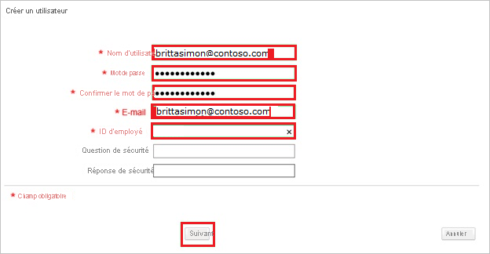

# Tutoriel : Intégration de l’authentification unique Azure AD à FM:Systems

Dans ce tutoriel, vous allez apprendre à intégrer FM:Systems à Azure Active Directory (Azure AD). Quand vous intégrez FM:Systems à Azure AD, vous pouvez :

* Contrôler dans Azure AD qui a accès à FM:Systems.
* Permettre à vos utilisateurs de se connecter automatiquement à FM:Systems avec leur compte Azure AD.
* Gérer vos comptes à un emplacement central : le Portail Azure.

## Prérequis

Pour configurer l’intégration d’Azure AD à FM:Systems, vous avez besoin des éléments suivants :

* Un abonnement Azure AD Si vous n’avez pas d’environnement Azure AD, vous pouvez obtenir un [compte gratuit](https://azure.microsoft.com/free/).
* Un abonnement FM:Systems pour lequel l’authentification unique (SSO) est activée.

## Description du scénario

Dans ce didacticiel, vous configurez et testez l’authentification unique Azure AD dans un environnement de test.

* FM:Systems prend en charge l’authentification unique lancée par le **fournisseur d’identité**.

> [!NOTE]
> L’identificateur de cette application étant une valeur de chaîne fixe, une seule instance peut être configurée dans un locataire.

## Ajouter FM:Systems à partir de la galerie

Pour configurer l’intégration de FM:Systems à Azure AD, vous devez ajouter FM:Systems disponible dans la galerie, à votre liste d’applications SaaS gérées.

1. Connectez-vous au portail Azure avec un compte professionnel ou scolaire ou avec un compte personnel Microsoft.
1. Dans le panneau de navigation gauche, sélectionnez le service **Azure Active Directory**.
1. Accédez à **Applications d’entreprise**, puis sélectionnez **Toutes les applications**.
1. Pour ajouter une nouvelle application, sélectionnez **Nouvelle application**.
1. Dans la section **Ajouter à partir de la galerie**, tapez **FM:Systems** dans la zone de recherche.
1. Sélectionnez **FM:Systems** dans le volet de résultats, puis ajoutez l’application. Patientez quelques secondes pendant que l’application est ajoutée à votre locataire.

## Configurer et tester l’authentification unique Azure AD pour FM:Systems

Configurez et testez l’authentification unique Azure AD avec FM:Systems pour un utilisateur test appelé **B.Simon**. Pour que l’authentification unique fonctionne, vous devez établir un lien entre un utilisateur Azure AD et l’utilisateur FM:Systems associé.

Pour configurer et tester l’authentification unique Azure AD avec FM:Systems, effectuez les étapes suivantes :

1. **[Configurer l’authentification unique Azure AD](#configure-azure-ad-sso)** pour permettre à vos utilisateurs d’utiliser cette fonctionnalité.
    1. **[Créer un utilisateur de test Azure AD](#create-an-azure-ad-test-user)** pour tester l’authentification unique Azure AD avec B. Simon.
    1. **[Affecter l’utilisateur de test Azure AD](#assign-the-azure-ad-test-user)** pour permettre à B. Simon d’utiliser l’authentification unique Azure AD.
1. **[Configurer l’authentification unique FM:Systems](#configure-fmsystems-sso)** pour configurer les paramètres de l’authentification unique côté application.
    1. **[Créer un utilisateur test FM:Systems](#create-fmsystems-test-user)** pour avoir dans FM:Systems un équivalent de B.Simon lié à la représentation Azure AD de l’utilisateur.
1. **[Tester l’authentification unique](#test-sso)** pour vérifier si la configuration fonctionne.

## Configurer l’authentification unique Azure AD

Effectuez les étapes suivantes pour activer l’authentification unique Azure AD dans le Portail Azure.

1. Dans le portail Azure, accédez à la page d’intégration de l’application **FM:Systems**, recherchez la section **Gérer** et sélectionnez **Authentification unique**.
1. Dans la page **Sélectionner une méthode d’authentification unique**, sélectionnez **SAML**.
1. Dans la page **Configurer l’authentification unique avec SAML**, cliquez sur l’icône de crayon de **Configuration SAML de base** afin de modifier les paramètres.

   

4. Dans la section **Configuration SAML de base**, effectuez l’étape suivante :

    Dans la zone de texte **URL de réponse**, tapez une URL au format suivant : `https://<companyname>.fmshosted.com/fminteract/ConsumerService2.aspx`
    
    > [!NOTE]
    > Cette valeur n’est pas la valeur réelle. Mettez à jour la valeur avec l’URL de réponse réelle. Contactez l’[équipe du support FM:Systems](https://fmsystems.com/support-services/) pour obtenir la valeur. Vous pouvez également consulter les modèles figurant à la section **Configuration SAML de base** dans le portail Azure.

5. Sur la page **Configurer l’authentification unique avec SAML**, dans la section **Certificat de signature SAML**, cliquez sur **Télécharger** pour télécharger le fichier **XML de métadonnées de fédération** en fonction des options définies selon vos besoins, puis enregistrez-le sur votre ordinateur.

    

6. Dans la section **Configurer FM:Systems**, copiez la ou les URL appropriées en fonction de vos besoins.

    

### Créer un utilisateur de test Azure AD 

Dans cette section, vous allez créer un utilisateur de test appelé B. Simon dans le portail Azure.

1. Dans le volet gauche du Portail Azure, sélectionnez **Azure Active Directory**, **Utilisateurs**, puis **Tous les utilisateurs**.
1. Sélectionnez **Nouvel utilisateur** dans la partie supérieure de l’écran.
1. Dans les propriétés **Utilisateur**, effectuez les étapes suivantes :
   1. Dans le champ **Nom**, entrez `B.Simon`.  
   1. Dans le champ **Nom de l’utilisateur**, entrez username@companydomain.extension. Par exemple : `B.Simon@contoso.com`.
   1. Cochez la case **Afficher le mot de passe**, puis notez la valeur affichée dans le champ **Mot de passe**.
   1. Cliquez sur **Créer**.

### Affecter l’utilisateur de test Azure AD

Dans cette section, vous allez autoriser B.Simon à utiliser l’authentification unique Azure en lui accordant l’accès à FM:Systems.

1. Dans le portail Azure, sélectionnez **Applications d’entreprise**, puis **Toutes les applications**.
1. Dans la liste des applications, sélectionnez **FM:Systems**.
1. Dans la page de vue d’ensemble de l’application, recherchez la section **Gérer** et sélectionnez **Utilisateurs et groupes**.
1. Sélectionnez **Ajouter un utilisateur**, puis **Utilisateurs et groupes** dans la boîte de dialogue **Ajouter une attribution**.
1. Dans la boîte de dialogue **Utilisateurs et groupes**, sélectionnez **B. Simon** dans la liste Utilisateurs, puis cliquez sur le bouton **Sélectionner** au bas de l’écran.
1. Si vous attendez qu’un rôle soit attribué aux utilisateurs, vous pouvez le sélectionner dans la liste déroulante **Sélectionner un rôle** . Si aucun rôle n’a été configuré pour cette application, vous voyez le rôle « Accès par défaut » sélectionné.
1. Dans la boîte de dialogue **Ajouter une attribution**, cliquez sur le bouton **Attribuer**.

## Configurer l’authentification unique FM:Systems

Pour configurer l’authentification unique côté **FM:Systems**, vous devez envoyer le **XML des métadonnées de fédération** téléchargé et les URL copiées appropriées à partir du portail Azure à l’[équipe du support FM:Systems](https://fmsystems.com/support-services/). Celles-ci configurent ensuite ce paramètre pour que la connexion SSO SAML soit définie correctement des deux côtés.

### Créer un utilisateur de test FM:Systems

1. Dans une fenêtre de navigateur web, connectez-vous à votre site d’entreprise FM:Systems en tant qu’administrateur.

2. Accédez à **System Administration \> Manage Security \> Users \> User list**.
   
    

3. Cliquez sur **Créer un utilisateur**.
   
    

4. Dans la section **Create User** , procédez comme suit :
   
     (Créer un utilisateur)
   
    a. Entrez les valeurs appropriées dans les champs **Nom d’utilisateur**, **Mot de passe**, **Confirmer le mot de passe**, **Adresse e-mail** et **Numéro d’employé** d’un compte Azure Active Directory valide que vous souhaitez approvisionner.
   
    b. Cliquez sur **Suivant**.

## Tester l’authentification unique (SSO)

Dans cette section, vous allez tester votre configuration de l’authentification unique Azure AD avec les options suivantes.

* Dans le portail Azure, cliquez sur Tester cette application. Vous devez alors être automatiquement connecté à l’instance de FM:Systems pour laquelle vous avez configuré l’authentification unique.

* Vous pouvez utiliser Mes applications de Microsoft. Quand vous cliquez sur la vignette FM:Systems dans Mes applications, vous devez être connecté automatiquement à l’application FM:Systems pour laquelle vous avez configuré l’authentification unique. Pour plus d’informations sur Mes applications, consultez [Présentation de Mes applications](../user-help/my-apps-portal-end-user-access.md).

## Étapes suivantes

Après avoir configuré FM:Systems, vous pouvez appliquer le contrôle de session, qui protège contre l’exfiltration et l’infiltration des données sensibles de votre organisation en temps réel. Le contrôle de session est étendu à partir de l’accès conditionnel. [Découvrez comment appliquer un contrôle de session avec Microsoft Cloud App Security](/cloud-app-security/proxy-deployment-aad).