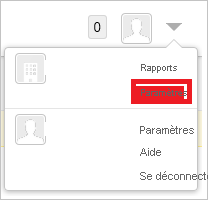
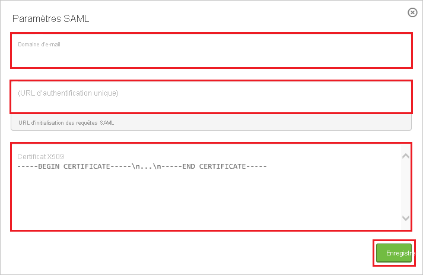
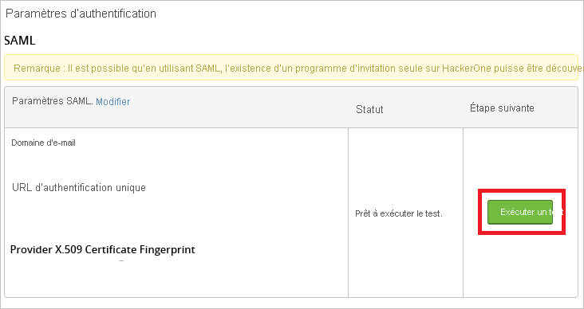
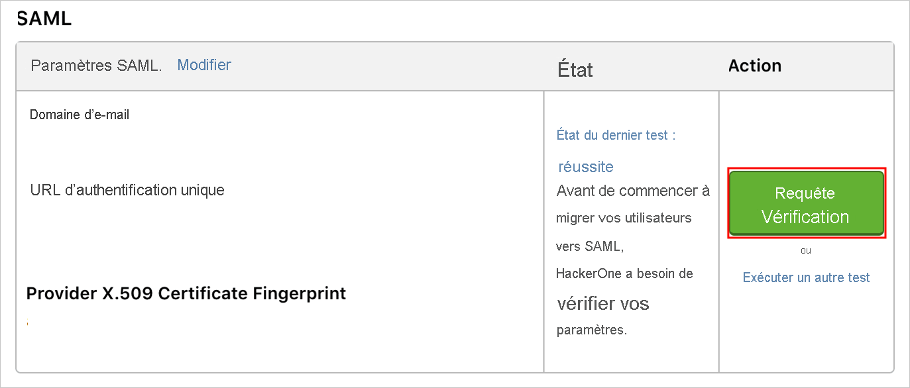

# Didacticiel : Intégration d’Azure Active Directory à HackerOne

Dans ce didacticiel, vous allez apprendre à intégrer HackerOne à Azure Active Directory (Azure AD). Quand vous intégrez HackerOne à Azure AD, vous pouvez :

* Contrôler dans Azure AD qui a accès à HackerOne.
* Permettre à vos utilisateurs de se connecter automatiquement à HackerOne avec leur compte Azure AD.
* Gérer vos comptes à un emplacement central : le Portail Azure.

## Prérequis

Pour commencer, vous devez disposer de ce qui suit :

* Un abonnement Azure AD Si vous ne disposez d’aucun abonnement, vous pouvez obtenir [un compte gratuit](https://azure.microsoft.com/free/).
* Un abonnement HackerOne pour lequel l’authentification unique est activée.

## Description du scénario

Dans ce didacticiel, vous configurez et testez l’authentification unique Azure AD dans un environnement de test.

* HackerOne prend en charge l’authentification unique lancée par le **fournisseur de services**.
* HackerOne prend en charge l’attribution d’utilisateurs **juste-à-temps**.

> [!NOTE]
> L’identificateur de cette application étant une valeur de chaîne fixe, une seule instance peut être configurée dans un locataire.

## Ajouter HackerOne à partir de la galerie

Pour configurer l’intégration de HackerOne à Azure AD, vous devez ajouter HackerOne à partir de la galerie à votre liste d’applications SaaS gérées.

1. Connectez-vous au portail Azure avec un compte professionnel ou scolaire ou avec un compte personnel Microsoft.
1. Dans le panneau de navigation gauche, sélectionnez le service **Azure Active Directory**.
1. Accédez à **Applications d’entreprise**, puis sélectionnez **Toutes les applications**.
1. Pour ajouter une nouvelle application, sélectionnez **Nouvelle application**.
1. Dans la section **Ajouter à partir de la galerie**, dans la zone de recherche, tapez **HackerOne**.
1. Sélectionnez **HackerOne** dans le volet de résultats, puis ajoutez l’application. Patientez quelques secondes pendant que l’application est ajoutée à votre locataire.

## Configurer et tester l’authentification unique Azure AD pour HackerOne

Configurez et testez l’authentification unique Azure AD avec HackerOne à l’aide d’un utilisateur de test appelé **B.Simon**. Pour que l’authentification unique fonctionne, vous devez établir un lien entre un utilisateur Azure AD et l’utilisateur HackerOne associé.

Pour configurer et tester l’authentification unique Azure AD avec HackerOne, effectuez les étapes suivantes :

1. **[Configurer l’authentification unique Azure AD](#configure-azure-ad-sso)** pour permettre à vos utilisateurs d’utiliser cette fonctionnalité.
    1. **[Créer un utilisateur de test Azure AD](#create-an-azure-ad-test-user)** pour tester l’authentification unique Azure AD avec B. Simon.
    1. **[Affecter l’utilisateur de test Azure AD](#assign-the-azure-ad-test-user)** pour permettre à B. Simon d’utiliser l’authentification unique Azure AD.
1. **[Configurer l’authentification unique HackerOne](#configure-hackerone-sso)** pour configurer les paramètres de l’authentification unique côté application.
    1. **[Créer un utilisateur de test HackerOne](#create-hackerone-test-user)** pour avoir un équivalent de B.Simon dans HackerOne lié à la représentation Azure AD associée.
1. **[Tester l’authentification unique](#test-sso)** pour vérifier si la configuration fonctionne.

## Configurer l’authentification unique Azure AD

Effectuez les étapes suivantes pour activer l’authentification unique Azure AD dans le Portail Azure.

1. Dans le portail Azure, dans la page d’intégration de l’application **HackerOne**, recherchez la section **Gérer**, puis sélectionnez **Authentification unique**.
1. Dans la page **Sélectionner une méthode d’authentification unique**, sélectionnez **SAML**.
1. Dans la page **Configurer l’authentification unique avec SAML**, cliquez sur l’icône de crayon de **Configuration SAML de base** afin de modifier les paramètres.

   

4. Dans la section **Configuration SAML de base**, effectuez les étapes suivantes :

    a. Dans la zone de texte **Identificateur (ID d’entité)**, tapez la valeur : `hackerone.com`

    b. Dans la zone de texte **URL de connexion**, saisissez une URL au format suivant : `https://hackerone.com/users/saml/sign_in?email=<CONFIGURED_DOMAIN>`

    > [!Note]
    > La valeur de l’URL de connexion n’est pas réelle. Mettez-la à jour avec l’URL de connexion réelle. Vous pouvez également consulter les modèles figurant à la section **Configuration SAML de base** dans le portail Azure.

5. Dans la page **Configurer l’authentification unique avec SAML**, dans la section **Certificat de signature SAML**, cliquez sur **Télécharger** pour télécharger le **Certificat (Base64)** en fonction des options définies par rapport à vos besoins, puis enregistrez-le sur votre ordinateur.

    

6. Dans la section **Configurer HackerOne**, copiez la ou les URL appropriées en fonction de vos besoins.

    

### Créer un utilisateur de test Azure AD

Dans cette section, vous allez créer un utilisateur de test appelé B. Simon dans le portail Azure.

1. Dans le volet gauche du Portail Azure, sélectionnez **Azure Active Directory**, **Utilisateurs**, puis **Tous les utilisateurs**.
1. Sélectionnez **Nouvel utilisateur** dans la partie supérieure de l’écran.
1. Dans les propriétés **Utilisateur**, effectuez les étapes suivantes :
   1. Dans le champ **Nom**, entrez `B.Simon`.  
   1. Dans le champ **Nom de l’utilisateur**, entrez username@companydomain.extension. Par exemple : `B.Simon@contoso.com`.
   1. Cochez la case **Afficher le mot de passe**, puis notez la valeur affichée dans le champ **Mot de passe**.
   1. Cliquez sur **Créer**.

### Affecter l’utilisateur de test Azure AD

Dans cette section, vous allez autoriser B.Simon à utiliser l’authentification unique Azure en lui accordant l’accès à HackerOne.

1. Dans le portail Azure, sélectionnez **Applications d’entreprise**, puis **Toutes les applications**.
1. Dans la liste des applications, sélectionnez **HackerOne**.
1. Dans la page de vue d’ensemble de l’application, recherchez la section **Gérer** et sélectionnez **Utilisateurs et groupes**.
1. Sélectionnez **Ajouter un utilisateur**, puis **Utilisateurs et groupes** dans la boîte de dialogue **Ajouter une attribution**.
1. Dans la boîte de dialogue **Utilisateurs et groupes**, sélectionnez **B. Simon** dans la liste Utilisateurs, puis cliquez sur le bouton **Sélectionner** au bas de l’écran.
1. Si vous attendez qu’un rôle soit attribué aux utilisateurs, vous pouvez le sélectionner dans la liste déroulante **Sélectionner un rôle** . Si aucun rôle n’a été configuré pour cette application, vous voyez le rôle « Accès par défaut » sélectionné.
1. Dans la boîte de dialogue **Ajouter une attribution**, cliquez sur le bouton **Attribuer**.

## Configurer l’authentification unique HackerOne

1. Connectez-vous à votre locataire HackerOne en tant qu’administrateur.

2. Dans le menu situé en haut, cliquez sur **Paramètres**.

    

3. Accédez à **Authentication** et cliquez sur **Add SAML settings**.

    

4. Dans la boîte de dialogue **SAML Settings** (Paramètres SAML), procédez comme suit :

    

    a. Dans la zone de texte **Email Domain** , entrez un domaine enregistré.

    b. Dans les zones de texte **Single Sign On URL** (URL d’authentification unique), collez la valeur de l’**URL de connexion** que vous avez copiée à partir du portail Azure.

    c. Ouvrez le **Fichier de certificat** téléchargé à partir du portail Azure dans le Bloc-notes, copiez son contenu dans le Presse-papiers, puis collez-le dans la zone de texte **Certificat X509**.

    d. Cliquez sur **Enregistrer**.

5. Dans la boîte de dialogue Authentication Settings, procédez comme suit :

    

    a. Cliquez sur **Run test**.

6. Lorsque le test s’achève et que le champ **Status** (État) indique **Last test status: success** (État du dernier test : réussite), sélectionnez le bouton **Request Verification** (Demande de vérification) pour envoyer vos paramètres à HackerOne pour approbation.

    

7. Une fois les paramètres approuvés par HackerOne, vous pouvez sélectionner le bouton **Migrate Users** (Migrer les utilisateurs) pour exiger l’authentification unique pour tous les utilisateurs.

    

### Créer un utilisateur de test HackerOne

Dans cette section, un utilisateur appelé Britta Simon est créé dans HackerOne. HackerOne prend en charge l’attribution d’utilisateurs juste-à-temps, option activée par défaut. Vous n’avez aucune opération à effectuer dans cette section. S’il n’existe pas encore d’utilisateur dans HackerOne, il en est créé un après l’authentification.

## Tester l’authentification unique (SSO)

Dans cette section, vous allez tester votre configuration de l’authentification unique Azure AD avec les options suivantes. 

* Cliquez sur **Tester cette application** dans le portail Azure. Vous êtes alors redirigé vers l’URL de connexion à Hackerone, d’où vous pouvez lancer le flux de connexion. 

* Accédez directement à l’URL de connexion à HackerOne pour lancer le flux de connexion.

* Vous pouvez utiliser Mes applications de Microsoft. Quand vous cliquez sur la vignette HackerOne dans Mes applications, vous êtes redirigé vers l’URL de connexion à HackerOne. Pour plus d’informations sur Mes applications, consultez [Présentation de Mes applications](../user-help/my-apps-portal-end-user-access.md).

## Étapes suivantes

Une fois que vous avez configuré HackerOne, vous pouvez appliquer le contrôle de session, qui protège contre l’exfiltration et l’infiltration des données sensibles de votre organisation en temps réel. Le contrôle de session est étendu à partir de l’accès conditionnel. [Découvrez comment appliquer un contrôle de session avec Microsoft Cloud App Security](/cloud-app-security/proxy-deployment-aad).
