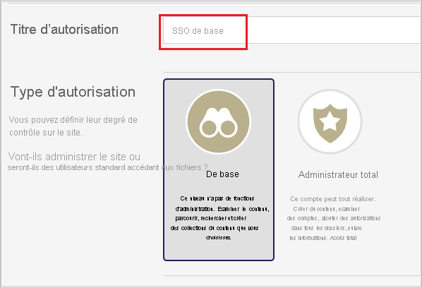
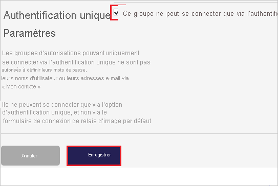
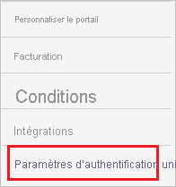
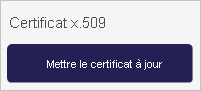
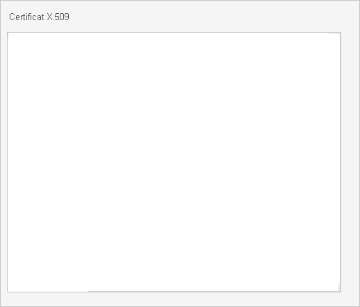
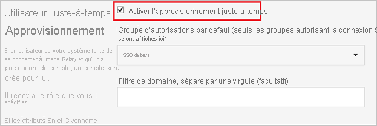
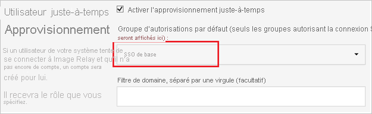
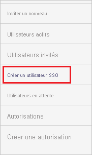
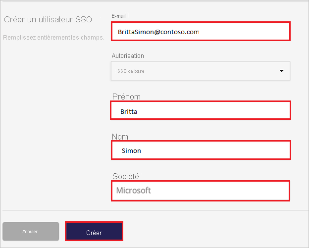

# Didacticiel : Intégration d’Azure Active Directory à ImageRelay

Dans ce didacticiel, vous allez apprendre à intégrer Image Relay avec Azure Active Directory (Azure AD). Quand vous intégrez Image Relay à Azure AD, vous pouvez :

* Dans Azure AD, vous contrôlez qui a accès à Image Relay.
* Permettre à vos utilisateurs de se connecter automatiquement à Image Relay avec leurs comptes Azure AD.
* Gérer vos comptes à un emplacement central : le Portail Azure.

## Prérequis

Pour commencer, vous devez disposer de ce qui suit :

* Un abonnement Azure AD Si vous ne disposez d’aucun abonnement, vous pouvez obtenir [un compte gratuit](https://azure.microsoft.com/free/).
* Abonnement Image Relay pour lequel l’authentification unique est activée.

## Description du scénario

Dans ce didacticiel, vous configurez et testez l’authentification unique Azure AD dans un environnement de test.

* Image Relay prend en charge l’authentification unique initiée par le **fournisseur de services**.

## Ajout d’Image Relay à partir de la galerie

Pour configurer l’intégration d’Image Relay avec Azure AD, vous devez ajouter Image Relay à partir de la galerie à votre liste d’applications SaaS gérées.

1. Connectez-vous au portail Azure avec un compte professionnel ou scolaire ou avec un compte personnel Microsoft.
1. Dans le panneau de navigation gauche, sélectionnez le service **Azure Active Directory**.
1. Accédez à **Applications d’entreprise**, puis sélectionnez **Toutes les applications**.
1. Pour ajouter une nouvelle application, sélectionnez **Nouvelle application**.
1. Dans la section **Ajouter à partir de la galerie**, tapez **Image Relay** dans la zone de recherche.
1. Sélectionnez **Image Relay** dans le volet de résultats, puis ajoutez l’application. Patientez quelques secondes pendant que l’application est ajoutée à votre locataire.

## Configurer et tester l’authentification unique Azure AD pour Image Relay

Configurez et testez l’authentification unique Azure AD dans Image Relay à l’aide d’un utilisateur de test nommé **B.Simon**. Pour que l’authentification unique fonctionne, vous devez établir un lien entre un utilisateur Azure AD et l’utilisateur associé dans Image Relay.

Pour configurer et tester Azure AD SSO avec Image Relay, effectuez les étapes suivantes :

1. **[Configurer l’authentification unique Azure AD](#configure-azure-ad-sso)** pour permettre à vos utilisateurs d’utiliser cette fonctionnalité.
    1. **[Créer un utilisateur de test Azure AD](#create-an-azure-ad-test-user)** pour tester l’authentification unique Azure AD avec B. Simon.
    1. **[Affecter l’utilisateur de test Azure AD](#assign-the-azure-ad-test-user)** pour permettre à B. Simon d’utiliser l’authentification unique Azure AD.
1. **[Configurer l’authentification unique Image Relay](#configure-image-relay-sso)** pour configurer les paramètres de l’authentification unique côté application.
    1. **[Créer l’utilisateur de test Image Relay](#create-image-relay-test-user)** pour avoir dans Image Relay un équivalent de B.Simon lié à la représentation Azure AD associée.
1. **[Tester l’authentification unique](#test-sso)** pour vérifier si la configuration fonctionne.

## Configurer l’authentification unique Azure AD

Effectuez les étapes suivantes pour activer l’authentification unique Azure AD dans le Portail Azure.

1. Dans le portail Azure, accédez à la page d’intégration de l’application **Image Relay**, recherchez la section **Gérer** et sélectionnez **Authentification unique**.
1. Dans la page **Sélectionner une méthode d’authentification unique**, sélectionnez **SAML**.
1. Dans la page **Configurer l’authentification unique avec SAML**, cliquez sur l’icône de crayon de **Configuration SAML de base** afin de modifier les paramètres.

   

4. Dans la section **Configuration SAML de base**, effectuez les étapes suivantes :

    a. Dans la zone de texte **Identificateur (ID d’entité)** , saisissez une URL au format suivant : `https://<COMPANYNAME>.imagerelay.com/sso/metadata`

    b. Dans la zone de texte **URL de connexion**, saisissez une URL au format suivant : `https://<COMPANYNAME>.imagerelay.com/`

    > [!NOTE]
    > Il ne s’agit pas de valeurs réelles. Mettez à jour ces valeurs avec l’identificateur et l’URL de connexion réels. Pour obtenir ces valeurs, contactez l’[équipe de support technique d’Image Relay](http://support.imagerelay.com/). Vous pouvez également consulter les modèles figurant à la section **Configuration SAML de base** dans le portail Azure.

4. Dans la page **Configurer l’authentification unique avec SAML**, dans la section **Certificat de signature SAML**, cliquez sur **Télécharger** pour télécharger le **Certificat (Base64)** en fonction des options définies par rapport à vos besoins, puis enregistrez-le sur votre ordinateur.

    

6. Dans la section **Configurer Image Relay**, copiez l’URL ou les URL appropriées, en fonction de vos besoins.

    

### Créer un utilisateur de test Azure AD

Dans cette section, vous allez créer un utilisateur de test appelé B. Simon dans le portail Azure.

1. Dans le volet gauche du Portail Azure, sélectionnez **Azure Active Directory**, **Utilisateurs**, puis **Tous les utilisateurs**.
1. Sélectionnez **Nouvel utilisateur** dans la partie supérieure de l’écran.
1. Dans les propriétés **Utilisateur**, effectuez les étapes suivantes :
   1. Dans le champ **Nom**, entrez `B.Simon`.  
   1. Dans le champ **Nom de l’utilisateur**, entrez username@companydomain.extension. Par exemple : `B.Simon@contoso.com`.
   1. Cochez la case **Afficher le mot de passe**, puis notez la valeur affichée dans le champ **Mot de passe**.
   1. Cliquez sur **Créer**.

### Affecter l’utilisateur de test Azure AD

Dans cette section, vous allez autoriser B.Simon à utiliser l’authentification unique Azure en lui accordant l’accès à Image Relay.

1. Dans le portail Azure, sélectionnez **Applications d’entreprise**, puis **Toutes les applications**.
1. Dans la liste des applications, sélectionnez **Image Relay**.
1. Dans la page de vue d’ensemble de l’application, recherchez la section **Gérer** et sélectionnez **Utilisateurs et groupes**.
1. Sélectionnez **Ajouter un utilisateur**, puis **Utilisateurs et groupes** dans la boîte de dialogue **Ajouter une attribution**.
1. Dans la boîte de dialogue **Utilisateurs et groupes**, sélectionnez **B. Simon** dans la liste Utilisateurs, puis cliquez sur le bouton **Sélectionner** au bas de l’écran.
1. Si vous attendez qu’un rôle soit attribué aux utilisateurs, vous pouvez le sélectionner dans la liste déroulante **Sélectionner un rôle** . Si aucun rôle n’a été configuré pour cette application, vous voyez le rôle « Accès par défaut » sélectionné.
1. Dans la boîte de dialogue **Ajouter une attribution**, cliquez sur le bouton **Attribuer**.

## Configurer l’authentification unique Image Relay

1. Dans une autre fenêtre de navigateur, connectez-vous à votre site d’entreprise Image Relay en tant qu’administrateur.

2. Dans la barre d’outils du haut, cliquez sur la charge de travail **Utilisateurs et autorisations**.

     

3. Cliquez sur **Créer une nouvelle autorisation**.

    

4. Dans la charge de travail **Paramètres d’authentification unique**, sélectionnez la case à cocher **Ce groupe peut se connecter uniquement via l’authentification unique**, puis cliquez sur **Enregistrer**.

     

5. Accédez à **Paramètres du compte**.

     

6. Accédez à la charge de travail **Paramètres d’authentification unique** .

    

7. Dans la boîte de dialogue **SAML Settings** (Paramètres SAML), procédez comme suit :

    

    a. Dans la zone de texte **Login URL** (URL de connexion), collez la valeur **URL de connexion** que vous avez copiée dans le Portail Azure.

    b. Dans la zone de texte **Logout URL** (URL de déconnexion), collez la valeur de l’**URL de déconnexion** que vous avez copiée à partir du portail Azure.

    c. Sous **Name Id Format** (Format d’ID de nom), sélectionnez **urn:oasis:names:tc:SAML:1.1:nameid-format:emailAddress**.

    d. Sous **Binding Options for Requests from the Service Provider (Image Relay)** (Options de liaison pour les demandes provenant du fournisseur de services (ImageRelay)), sélectionnez **POST Binding** (Liaison POST).

    e. Sous **Certificat x.509**, cliquez sur **Mettre à jour le certificat**.

    

    f. Ouvrez le certificat que vous avez téléchargé dans le Bloc-notes, copiez son contenu, puis collez-le dans la zone de texte **Certificat x.509**.

    

    g. Dans la section **Approvisionnement juste à temps des utilisateurs**, sélectionnez la case à cocher **Activer l’approvisionnement juste à temps des utilisateurs**.

    

    h. Sélectionnez le groupe d’autorisations (par exemple, **SSO de base**) qui sera autorisé à se connecter uniquement via l’authentification unique.

    

    i. Cliquez sur **Enregistrer**.

### Créer l’utilisateur de test Image Relay

L’objectif de cette section est de créer un utilisateur appelé Britta Simon dans Image Relay.

**Pour créer un utilisateur appelé Britta Simon dans Image Relay, procédez comme suit :**

1. Connectez-vous à votre site d’entreprise Image Relay tant qu’administrateur.

2. Accédez à **Utilisateurs et autorisations** et sélectionnez **Créer un utilisateur SSO**.

     

3. Renseignez les champs **E-mail**, **Prénom**, **Nom** et **Société** de l’utilisateur que vous souhaitez configurer, puis sélectionnez le groupe d’autorisations (par exemple authentification unique de base), qui peut se connecter uniquement via l’authentification unique.

    

4. Cliquez sur **Créer**.

## Tester l’authentification unique (SSO)

Dans cette section, vous allez tester votre configuration de l’authentification unique Azure AD avec les options suivantes. 

* Cliquez sur **Tester cette application** dans le portail Azure. Vous êtes alors redirigé vers l’URL de connexion Image Relay où vous pouvez initier le flux de connexion. 

* Accédez directement à l’URL de connexion Image Relay pour initier le flux de connexion.

* Vous pouvez utiliser Mes applications de Microsoft. Le fait de cliquer sur la vignette Image Relay dans Mes applications vous redirige vers l’URL de connexion à Image Relay. Pour plus d’informations sur Mes applications, consultez [Présentation de Mes applications](../user-help/my-apps-portal-end-user-access.md).

## Étapes suivantes

Une fois que vous avez configuré Image Relay, vous pouvez appliquer le contrôle de session, qui protège contre l’exfiltration et l’infiltration des données sensibles de votre organisation en temps réel. Le contrôle de session est étendu à partir de l’accès conditionnel. [Découvrez comment appliquer un contrôle de session avec Microsoft Cloud App Security](/cloud-app-security/proxy-deployment-aad).
