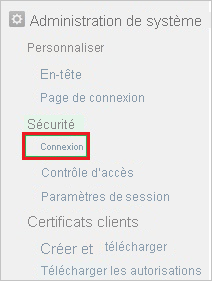
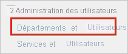

# Tutoriel : Intégration de l’authentification unique Azure AD à Kintone

Dans ce tutoriel, vous allez découvrir comment intégrer Kintone à Azure Active Directory (Azure AD). Quand vous intégrez Kintone à Azure AD, vous pouvez :

* Contrôler, dans Azure AD, qui a accès à Kintone.
* Permettre à vos utilisateurs de se connecter automatiquement à Kintone avec leur compte Azure AD.
* Gérer vos comptes à un emplacement central : le Portail Azure.

## Prérequis

Pour configurer l’intégration d’Azure AD avec Kintone, vous avez besoin des éléments suivants :

* Un abonnement Azure AD Si vous n’avez pas d’environnement Azure AD, vous pouvez obtenir un [compte gratuit](https://azure.microsoft.com/free/).
* Un abonnement Kintone pour lequel l’authentification unique est activée.

## Description du scénario

Dans ce didacticiel, vous configurez et testez l’authentification unique Azure AD dans un environnement de test.

* Kintone prend en charge l’authentification unique lancée par le **fournisseur de services**.

## Ajouter Kintone à partir de la galerie

Pour configurer l’intégration de Kintone avec Azure AD, vous devez ajouter Kintone, disponible dans la galerie, à votre liste d’applications SaaS gérées.

1. Connectez-vous au portail Azure avec un compte professionnel ou scolaire ou avec un compte personnel Microsoft.
1. Dans le panneau de navigation gauche, sélectionnez le service **Azure Active Directory**.
1. Accédez à **Applications d’entreprise**, puis sélectionnez **Toutes les applications**.
1. Pour ajouter une nouvelle application, sélectionnez **Nouvelle application**.
1. Dans la section **Ajouter à partir de la galerie**, tapez **Kintone** dans la zone de recherche.
1. Sélectionnez **Kintone** dans le panneau de résultats, puis ajoutez l’application. Patientez quelques secondes pendant que l’application est ajoutée à votre locataire.

## Configurer et tester l’authentification unique Azure AD pour Kintone

Configurez et testez l’authentification unique Azure AD avec Kintone à l’aide d’un utilisateur test appelé **B.Simon**. Pour que l’authentification unique fonctionne, vous devez établir une relation entre un utilisateur Azure AD et l’utilisateur associé dans Kintone.

Pour configurer et tester l’authentification unique Azure AD avec Kintone, effectuez les étapes suivantes :

1. **[Configurer l’authentification unique Azure AD](#configure-azure-ad-sso)** pour permettre à vos utilisateurs d’utiliser cette fonctionnalité.
    1. **[Créer un utilisateur de test Azure AD](#create-an-azure-ad-test-user)** pour tester l’authentification unique Azure AD avec B. Simon.
    1. **[Affecter l’utilisateur de test Azure AD](#assign-the-azure-ad-test-user)** pour permettre à B. Simon d’utiliser l’authentification unique Azure AD.
1. **[Configurer l’authentification unique Kintone](#configure-kintone-sso)** pour configurer les paramètres de l’authentification unique côté application.
    1. **[Créer un utilisateur test Kintone](#create-kintone-test-user)** pour avoir, dans Kintone, un équivalent de B.Simon lié à la représentation Azure AD de l’utilisateur.
1. **[Tester l’authentification unique](#test-sso)** pour vérifier si la configuration fonctionne.

## Configurer l’authentification unique Azure AD

Effectuez les étapes suivantes pour activer l’authentification unique Azure AD dans le Portail Azure.

1. Dans le portail Azure, dans la page d’intégration de l’application **Kintone**, recherchez la section **Gérer** et sélectionnez **Authentification unique**.
1. Dans la page **Sélectionner une méthode d’authentification unique**, sélectionnez **SAML**.
1. Dans la page **Configurer l’authentification unique avec SAML**, cliquez sur l’icône de crayon de **Configuration SAML de base** afin de modifier les paramètres.

   

4. Dans la section **Configuration SAML de base**, effectuez les étapes suivantes :

    a. Dans la zone de texte **Identificateur (ID d’entité)** , tapez une URL en utilisant un des modèles suivants :
    
   | **Identificateur** |
   |---|
   | `https://<companyname>.cybozu.com` |
   | `https://<companyname>.kintone.com` |
    
    b. Dans la zone de texte **URL de connexion**, saisissez une URL au format suivant : `https://<companyname>.kintone.com`

    > [!NOTE]
    > Il ne s’agit pas de valeurs réelles. Mettez à jour ces valeurs avec l’identificateur et l’URL de connexion réels. Pour obtenir ces valeurs, contactez [l’équipe de support technique Kintone](https://www.kintone.com/contact/). Vous pouvez également consulter les modèles figurant à la section **Configuration SAML de base** dans le portail Azure.

5. Dans la page **Configurer l’authentification unique avec SAML**, dans la section **Certificat de signature SAML**, cliquez sur **Télécharger** pour télécharger le **Certificat (Base64)** en fonction des options définies par rapport à vos besoins, puis enregistrez-le sur votre ordinateur.

    

6. Dans la section **Configurer Kintone**, copiez la ou les URL appropriées en fonction de vos besoins.

    

### Créer un utilisateur de test Azure AD

Dans cette section, vous allez créer un utilisateur de test appelé B. Simon dans le portail Azure.

1. Dans le volet gauche du Portail Azure, sélectionnez **Azure Active Directory**, **Utilisateurs**, puis **Tous les utilisateurs**.
1. Sélectionnez **Nouvel utilisateur** dans la partie supérieure de l’écran.
1. Dans les propriétés **Utilisateur**, effectuez les étapes suivantes :
   1. Dans le champ **Nom**, entrez `B.Simon`.  
   1. Dans le champ **Nom de l’utilisateur**, entrez username@companydomain.extension. Par exemple : `B.Simon@contoso.com`.
   1. Cochez la case **Afficher le mot de passe**, puis notez la valeur affichée dans le champ **Mot de passe**.
   1. Cliquez sur **Créer**.

### Affecter l’utilisateur de test Azure AD

Dans cette section, vous allez autoriser B.Simon à utiliser l’authentification unique Azure en lui accordant l’accès à Kintone.

1. Dans le portail Azure, sélectionnez **Applications d’entreprise**, puis **Toutes les applications**.
1. Dans la liste des applications, sélectionnez **Kintone**.
1. Dans la page de vue d’ensemble de l’application, recherchez la section **Gérer** et sélectionnez **Utilisateurs et groupes**.
1. Sélectionnez **Ajouter un utilisateur**, puis **Utilisateurs et groupes** dans la boîte de dialogue **Ajouter une attribution**.
1. Dans la boîte de dialogue **Utilisateurs et groupes**, sélectionnez **B. Simon** dans la liste Utilisateurs, puis cliquez sur le bouton **Sélectionner** au bas de l’écran.
1. Si vous attendez qu’un rôle soit attribué aux utilisateurs, vous pouvez le sélectionner dans la liste déroulante **Sélectionner un rôle** . Si aucun rôle n’a été configuré pour cette application, vous voyez le rôle « Accès par défaut » sélectionné.
1. Dans la boîte de dialogue **Ajouter une attribution**, cliquez sur le bouton **Attribuer**.

## Configurer l’authentification unique Kintone

1. Dans une autre fenêtre de navigateur web, connectez-vous à votre site d’entreprise **Kintone** en tant qu’administrateur.

1. Cliquez sur l’**icône Paramètres**.

    

1. Cliquez sur **Users & System Administration**.

     (Administration système et des utilisateurs)

1. Sous **System Administration \> Security**, cliquez sur **Login**.

    

1. Cliquez sur **Enable SAML authentication**.

    

1. Dans la section SAML Authentication, procédez comme suit :

    

    a. Dans la zone de texte **Login URL** (URL de connexion), collez la valeur **URL de connexion** que vous avez copiée dans le portail Azure.

    b. Dans la zone de texte **Logout URL** (URL de déconnexion), collez la valeur de l’**URL de déconnexion** que vous avez copiée à partir du portail Azure.

    c. Cliquez sur **Parcourir** pour charger le fichier de certificat téléchargé à partir du portail Azure.

    d. Cliquez sur **Enregistrer**.

### Créer un utilisateur de test Kintone

Pour pouvoir se connecter à Kintone, les utilisateurs Azure AD doivent être provisionnés dans Kintone. Dans le cas de Kintone, l’approvisionnement est une tâche manuelle.

### Pour approvisionner un compte d’utilisateur, procédez comme suit :

1. Connectez-vous à votre site d’entreprise **Kintone** en tant qu’administrateur.

1. Cliquez sur l’**icône Paramètres**.

    

1. Cliquez sur **Users & System Administration**.

     (Administration système et des utilisateurs)

1. Sous **User Administration**, cliquez sur **Departments & Users**.

     (Services et utilisateurs)

1. Cliquez sur **New User**.

    

1. Dans la section **New User**, procédez comme suit :

     (Nouveaux utilisateurs)

    a. Dans les zones de texte correspondantes, tapez un **Nom d’affichage**, un **Nom de connexion**, un **Nouveau mot de passe**, confirmez-le dans **Confirmer le mot de passe**, tapez une **Adresse e-mail** et indiquez d’autres détails d’un compte Azure AD valide que vous voulez provisionner.

    b. Cliquez sur **Enregistrer**.

> [!NOTE]
> Vous pouvez utiliser tout autre outil ou n’importe quelle API de création de compte d’utilisateur fournis par Kintone pour provisionner des comptes d’utilisateurs Azure AD.

## Tester l’authentification unique (SSO)

Dans cette section, vous allez tester votre configuration de l’authentification unique Azure AD avec les options suivantes. 

* Cliquez sur **Tester cette application** dans le portail Azure. Vous êtes alors redirigé vers l’URL d’authentification Kintone, à partir de laquelle vous pouvez lancer le processus de connexion. 

* Accédez directement à l’URL d’authentification Kintone pour lancer le processus de connexion.

* Vous pouvez utiliser Mes applications de Microsoft. Le fait de cliquer sur la vignette Kintone dans Mes applications vous redirige vers l’URL d’authentification Kintone. Pour plus d’informations sur Mes applications, consultez [Présentation de Mes applications](../user-help/my-apps-portal-end-user-access.md).

## Étapes suivantes

Après avoir configuré Kintone, vous pouvez appliquer le contrôle de session, qui protège contre l’exfiltration et l’infiltration des données sensibles de votre organisation en temps réel. Le contrôle de session est étendu à partir de l’accès conditionnel. [Découvrez comment appliquer un contrôle de session avec Microsoft Cloud App Security](/cloud-app-security/proxy-deployment-aad).