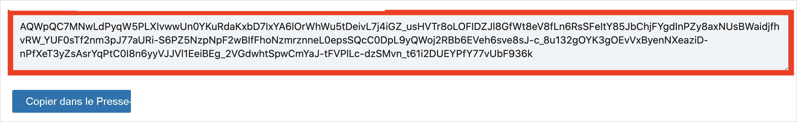
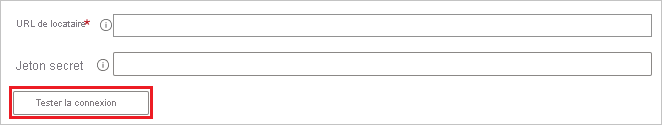

# Tutoriel : Configurer LinkedIn Learning pour l’approvisionnement automatique d’utilisateurs

Ce tutoriel décrit les étapes à effectuer dans LinkedIn Learning et Azure Active Directory (Azure AD) pour configurer le provisionnement automatique d’utilisateurs. Une fois celui-ci configuré, Azure AD procède automatiquement au provisionnement et au déprovisionnement des utilisateurs et des groupes dans [LinkedIn Learning](https://learning.linkedin.com/) à l’aide du service de provisionnement d’Azure AD. Pour découvrir les informations importantes sur ce que fait ce service, comment il fonctionne et consulter le forum aux questions, reportez-vous à l’article [Automatiser l’attribution et l’annulation de l’attribution des utilisateurs dans les applications SaaS avec Azure Active Directory](../manage-apps/user-provisioning.md). 

## Fonctionnalités prises en charge
> [!div class="checklist"]
> * Créer des utilisateurs dans LinkedIn Learning
> * Supprimer des utilisateurs dans LinkedIn Learning quand ils ne nécessitent plus d’accès
> * Conserver les attributs utilisateur synchronisés entre Azure AD et LinkedIn Learning
> * Provisionner des groupes et des appartenances aux groupes dans LinkedIn Learning
> * [Authentification unique](linkedinlearning-tutorial.md) à LinkedIn Learning (recommandé)

## Prérequis

Le scénario décrit dans ce tutoriel part du principe que vous disposez des prérequis suivants :

* [Un locataire Azure AD](https://docs.microsoft.com/azure/active-directory/develop/quickstart-create-new-tenant) 
* Un compte d’utilisateur dans Azure AD avec l’[autorisation](https://docs.microsoft.com/azure/active-directory/users-groups-roles/directory-assign-admin-roles) de configurer l’approvisionnement (par exemple, Administrateur d’application, Administrateur d’application cloud, Propriétaire d’application ou Administrateur général). 
* Approbation et SCIM activés pour LinkedIn Learning (contact par e-mail).

## Étape 1. Planifier votre déploiement de l’approvisionnement
1. En savoir plus sur le [fonctionnement du service d’approvisionnement](https://docs.microsoft.com/azure/active-directory/manage-apps/user-provisioning).
2. Déterminez qui sera dans l’[étendue pour l’approvisionnement](https://docs.microsoft.com/azure/active-directory/manage-apps/define-conditional-rules-for-provisioning-user-accounts).
3. Déterminez les données à [mapper entre Azure AD et LinkedIn Learning](https://docs.microsoft.com/azure/active-directory/manage-apps/customize-application-attributes). 

## Étape 2. Configurer LinkedIn Learning pour prendre en charge le provisionnement avec Azure AD
1. Accédez aux [paramètres de LinkedIn Learning](https://www.linkedin.com/learning-admin/settings/global). Sélectionnez **Configuration SCIM**, puis sélectionnez **Ajouter une configuration SCIM**.

   

2. Entrez un nom pour la configuration, puis activez **Affecter automatiquement des licences**. Puis cliquez sur **Generate Token** (Générer un jeton).

   

3. Une fois la configuration créée, un **jeton d’accès** devrait être généré. Conservez cette copie pour une utilisation ultérieure.

   

4. Vous pouvez réémettre les configurations existantes (ce qui génère un nouveau jeton) ou les supprimer.

## Étape 3. Ajouter LinkedIn Learning à partir de la galerie d’applications Azure AD

Ajoutez LinkedIn Learning à partir de la galerie d’applications Azure AD pour commencer à gérer le provisionnement vers LinkedIn Learning. Si vous avez déjà configuré LinkedIn Learning pour l’authentification unique, vous pouvez utiliser la même application. Toutefois, il est recommandé de créer une application distincte lors du test initial de l’intégration. En savoir plus sur l’ajout d’une application à partir de la galerie [ici](https://docs.microsoft.com/azure/active-directory/manage-apps/add-gallery-app). 

## Étape 4. Définir qui sera dans l’étendue pour l’approvisionnement 

Le service d’approvisionnement Azure AD vous permet de définir l’étendue des utilisateurs approvisionnés en fonction de l’affectation à l’application et/ou en fonction des attributs de l’utilisateur/groupe. Si vous choisissez de définir l’étendue de l’approvisionnement pour votre application en fonction de l’attribution, vous pouvez utiliser les étapes de [suivantes](../manage-apps/assign-user-or-group-access-portal.md) pour affecter des utilisateurs et des groupes à l’application. Si vous choisissez de définir l’étendue de l’approvisionnement en fonction uniquement des attributs de l’utilisateur ou du groupe, vous pouvez utiliser un filtre d’étendue comme décrit [ici](https://docs.microsoft.com/azure/active-directory/manage-apps/define-conditional-rules-for-provisioning-user-accounts). 

* Quand vous affectez des utilisateurs et des groupes à LinkedIn Learning, vous devez sélectionner un rôle différent du rôle **Accès par défaut**. Les utilisateurs disposant du rôle Accès par défaut sont exclus de l’approvisionnement et sont marqués comme non autorisés dans les journaux de configuration. Si le seul rôle disponible dans l’application est le rôle d’accès par défaut, vous pouvez [mettre à jour le manifeste de l’application](https://docs.microsoft.com/azure/active-directory/develop/howto-add-app-roles-in-azure-ad-apps) pour ajouter des rôles supplémentaires. 

* Commencez progressivement. Testez avec un petit ensemble d’utilisateurs et de groupes avant d’effectuer un déploiement général. Lorsque l’étendue de l’approvisionnement est définie sur les utilisateurs et les groupes attribués, vous pouvez contrôler cela en affectant un ou deux utilisateurs ou groupes à l’application. Lorsque l’étendue est définie sur tous les utilisateurs et groupes, vous pouvez spécifier un [filtre d’étendue basé sur l’attribut](https://docs.microsoft.com/azure/active-directory/manage-apps/define-conditional-rules-for-provisioning-user-accounts). 

## Étape 5. Configuration de l’approvisionnement automatique des utilisateurs sur LinkedIn Learning 

Cette section vous guide tout au long des étapes de configuration du service d’approvisionnement d’Azure AD pour créer, mettre à jour et désactiver des utilisateurs et/ou des groupes dans TestApp en fonction des assignations d’utilisateurs et/ou de groupes dans Azure AD.

### Pour configurer l’approvisionnement automatique de comptes d’utilisateur pour LinkedIn Learning dans Azure AD :

1. Connectez-vous au [portail Azure](https://portal.azure.com). Sélectionnez **Applications d’entreprise**, puis **Toutes les applications**.

    

2. Dans la liste des applications, sélectionnez **LinkedIn Learning**.

    

3. Sélectionnez l’onglet **Approvisionnement**.

    

4. Définissez le **Mode d’approvisionnement** sur **Automatique**.

    

5. Dans la section **Informations d’identification de l’administrateur**, entrez `https://api.linkedin.com/scim` dans **URL de locataire**. Entrez la valeur du jeton d’accès récupérée précédemment dans **Jeton secret**. Cliquez sur **Tester la connexion** pour vérifier qu’Azure AD peut se connecter à LinkedIn Learning. Si la connexion échoue, vérifiez que votre compte LinkedIn Learning dispose d’autorisations d’administrateur et réessayez.

    

6. Dans le champ **E-mail de notification**, entrez l’adresse e-mail de la personne ou du groupe qui doit recevoir les notifications d’erreur de provisionnement et sélectionnez la case à cocher **Envoyer une notification par e-mail en cas de défaillance**.

    

7. Sélectionnez **Enregistrer**.

8. Dans la section **Mappages**, sélectionnez **Attribuer les utilisateurs Azure Active Directory**.

9. Dans la section **Mappages d’attributs**, passez en revue les attributs utilisateur qui sont synchronisés entre Azure AD et LinkedIn Learning. Les attributs sélectionnés en tant que propriétés de **Correspondance** sont utilisés pour faire correspondre les comptes utilisateur dans LinkedIn Learning pour les opérations de mise à jour. Si vous choisissez de modifier l’[attribut cible correspondant](https://docs.microsoft.com/azure/active-directory/manage-apps/customize-application-attributes), vous devez vérifier que l’API LinkedIn Learning prend en charge le filtrage des utilisateurs en fonction de cet attribut. Cliquez sur le bouton **Enregistrer** pour valider les modifications.

   |Attribut|Type|Pris en charge pour le filtrage|
   |---|---|---|
   |externalId|String|&check;|
   |userName|String|
   |name.givenName|String|
   |name.familyName|String|
   |displayName|String|
   |addresses[type eq "work"].locality|String|
   |title|String|
   |emails[type eq "work"].value|String|
   |urn:ietf:params:scim:schemas:extension:enterprise:2.0:User:manager|Informations de référence|
   |urn:ietf:params:scim:schemas:extension:enterprise:2.0:User:department|String|

10. Dans la section **Mappages**, sélectionnez **Attribuer les groupes Azure Active Directory**.

11. Dans la section **Mappage d’attributs**, passez en revue les attributs de groupe qui sont synchronisés entre Azure AD et LinkedIn Learning . Les attributs sélectionnés en tant que propriétés de **Correspondance** sont utilisés pour faire correspondre les groupes dans LinkedIn Learning pour les opérations de mise à jour. Cliquez sur le bouton **Enregistrer** pour valider les modifications.

    |Attribut|Type|Pris en charge pour le filtrage|
    |---|---|---|
    |displayName|String|&check;|
    |membres|Informations de référence|
    |externalId|String|

12. Pour configurer des filtres d’étendue, reportez-vous aux instructions suivantes fournies dans [Approvisionnement d’applications basé sur les attributs avec filtres d’étendue](../manage-apps/define-conditional-rules-for-provisioning-user-accounts.md).

13. Pour activer le service d’approvisionnement Azure AD pour LinkedIn Learning, définissez **l’État d’approvisionnement** sur **Activé** dans la section **Paramètres**.

    

14. Définissez les utilisateurs et/ou groupes que vous aimeriez approvisionner sur LinkedIn Learning en choisissant les valeurs souhaitées dans **Étendue** dans la section **Paramètres**.

    

15. Lorsque vous êtes prêt à effectuer l’approvisionnement, cliquez sur **Enregistrer**.

    

Cette opération démarre le cycle de synchronisation initiale de tous les utilisateurs et groupes définis dans **Étendue** dans la section **Paramètres**. Le cycle de synchronisation initiale prend plus de temps que les cycles de synchronisation suivants, qui se produisent toutes les 40 minutes environ tant que le service de provisionnement Azure AD est en cours d’exécution. 

## Étape 6. Surveiller votre déploiement
Une fois que vous avez configuré l’approvisionnement, utilisez les ressources suivantes pour surveiller votre déploiement :

1. Utilisez les [journaux d’approvisionnement](https://docs.microsoft.com/azure/active-directory/reports-monitoring/concept-provisioning-logs) pour déterminer quels utilisateurs ont été configurés avec succès ou échoué.
2. Consultez la [barre de progression](https://docs.microsoft.com/azure/active-directory/app-provisioning/application-provisioning-when-will-provisioning-finish-specific-user) pour afficher l’état du cycle d’approvisionnement et quand il se termine
3. Si la configuration de l’approvisionnement semble se trouver dans un état non sain, l’application passe en quarantaine. Pour en savoir plus sur les états de quarantaine, cliquez [ici](https://docs.microsoft.com/azure/active-directory/manage-apps/application-provisioning-quarantine-status).  

## Ressources supplémentaires

* [Gestion de l’approvisionnement de comptes d’utilisateur pour les applications d’entreprise](../manage-apps/configure-automatic-user-provisioning-portal.md)
* [Qu’est-ce que l’accès aux applications et l’authentification unique avec Azure Active Directory ?](../manage-apps/what-is-single-sign-on.md)

## Étapes suivantes

* [Découvrez comment consulter les journaux d’activité et obtenir des rapports sur l’activité d’approvisionnement](../manage-apps/check-status-user-account-provisioning.md)
