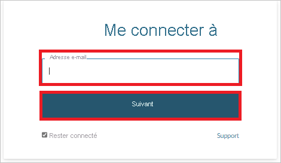
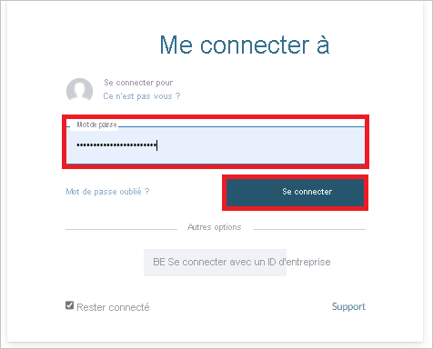

# Tutoriel : Configurer LogMeIn pour le provisionnement automatique des utilisateurs

Ce tutoriel décrit les étapes à suivre dans LogMeIn et Azure Active Directory (Azure AD) pour configurer le provisionnement automatique des utilisateurs. Une fois configuré, Azure AD provisionne et déprovisionne automatiquement les utilisateurs et les groupes dans [LogMeIn](https://www.logmein.com/) à l’aide du service Provisionnement Azure AD. Pour découvrir les informations importantes sur ce que fait ce service, comment il fonctionne et consulter le forum aux questions, reportez-vous à l’article [Automatiser l’attribution et l’annulation de l’attribution des utilisateurs dans les applications SaaS avec Azure Active Directory](../app-provisioning/user-provisioning.md). 

## Fonctionnalités prises en charge
> [!div class="checklist"]
> * Créer des utilisateurs dans LogMeIn
> * Supprimer des utilisateurs dans LogMeIn lorsqu’ils n’ont plus besoin d’accès
> * Conserver les attributs utilisateur synchronisés entre Azure AD et LogMeIn
> * Provisionner des groupes et des appartenances aux groupes dans LogMeIn
> * [Authentification unique](./logmein-tutorial.md) auprès de LogMeIn (recommandée)

## Prérequis

Le scénario décrit dans ce tutoriel part du principe que vous disposez des prérequis suivants :

* [Un locataire Azure AD](../develop/quickstart-create-new-tenant.md) 
* Un compte d’utilisateur dans Azure AD avec l’[autorisation](../roles/permissions-reference.md) de configurer l’approvisionnement (par exemple, administrateur d’application, administrateur d’application Cloud, propriétaire d’application ou administrateur général). 
* Une organisation créée dans LogMeIn Organization Center avec au moins un domaine vérifié 
* Un compte utilisateur dans LogMeIn Organization Center avec l’[autorisation](https://support.goto.com/meeting/help/manage-organization-users-g2m710102) de configurer le provisionnement (par exemple, le rôle d’administrateur d’organisation avec des autorisations d’accès en lecture et en écriture), comme indiqué à l’étape 2.

## Étape 1. Planifier votre déploiement de l’approvisionnement
1. En savoir plus sur le [fonctionnement du service d’approvisionnement](../app-provisioning/user-provisioning.md).
2. Déterminez qui sera dans l’[étendue pour l’approvisionnement](../app-provisioning/define-conditional-rules-for-provisioning-user-accounts.md).
3. Déterminez les données à [mapper entre Azure AD et LogMeIn](../app-provisioning/customize-application-attributes.md). 

## Étape 2. Configurer LogMeIn pour prendre en charge le provisionnement avec Azure AD

1. Connectez-vous à [Organization Center](https://organization.logmeininc.com).

2. Le domaine utilisé dans l’adresse e-mail de votre compte est le domaine que vous êtes invité à vérifier dans un délai de 10 jours.  

3. Vous pouvez vérifier la propriété de votre domaine à l’aide de l’une des méthodes suivantes :

   **Méthode 1 : ajouter un enregistrement DNS à votre fichier de zone de domaine.**  
   Pour utiliser la méthode DNS, vous devez placer un enregistrement DNS au niveau du domaine de messagerie au sein de votre zone DNS.  Les exemples utilisant « main.com » comme domaine ressemblent à ce qui suit : `@ IN TXT "logmein-verification-code=668e156b-f5d3-430e-9944-f1d4385d043e"` OU `main.com. IN TXT “logmein-verification-code=668e156b-f5d3-430e-9944-f1d4385d043e”`

   Voici les instructions détaillées :
     1. Connectez-vous au compte de votre domaine sur votre hôte de domaine.
     2. Accédez à la page de mise à jour des enregistrements DNS de votre domaine.
     3. Recherchez les enregistrements TXT de votre domaine, puis ajoutez un enregistrement TXT pour le domaine et pour chaque sous-domaine.
     4. Enregistrez toutes les modifications.
     5. Vous pouvez vérifier que la modification a eu lieu en ouvrant une ligne de commande et en entrant l’une des commandes suivantes (en fonction de votre système d’exploitation, avec « main.com » comme exemple de domaine) :
         * Pour les systèmes Unix et Linux : `$ dig TXT main.com`
         * Pour les systèmes Windows : `c:\ > nslookup -type=TXT main.com`
     6. La réponse s’affiche sur sa propre ligne.

   **Méthode 2 : charger un fichier de serveur web sur le site web spécifique.**
   Chargez un fichier de texte brut à la racine de votre serveur web contenant une chaîne de vérification sans espaces ni caractères spéciaux en dehors de la chaîne.
   
      * Lieu : `http://<yourdomain>/logmein-verification-code.txt`
      * Contenu : `logmein-verification-code=668e156b-f5d3-430e-9944-f1d4385d043e`

4. Une fois que vous avez ajouté l’enregistrement DNS ou le fichier TXT, revenez à [Organization Center](https://organization.logmeininc.com) et cliquez sur **Vérifier**.

5. Vous avez créé une organisation dans Organization Center en vérifiant votre domaine, et le compte utilisé au cours de ce processus de vérification est désormais l’administrateur de l’organisation.

## Étape 3. Ajouter LogMeIn à partir de la galerie d’applications Azure AD

Ajoutez LogMeIn à partir de la galerie d’applications Azure AD pour commencer à gérer le provisionnement sur LogMeIn. Si vous avez déjà configuré LogMeIn pour l’authentification unique (SSO), vous pouvez utiliser la même application. Toutefois, il est recommandé de créer une application distincte lors du test initial de l’intégration. En savoir plus sur l’ajout d’une application à partir de la galerie [ici](../manage-apps/add-application-portal.md). 

## Étape 4. Définir qui sera dans l’étendue pour l’approvisionnement 

Le service d’approvisionnement Azure AD vous permet de définir l’étendue des utilisateurs approvisionnés en fonction de l’affectation à l’application et/ou en fonction des attributs de l’utilisateur/groupe. Si vous choisissez de définir l’étendue de l’approvisionnement pour votre application en fonction de l’attribution, vous pouvez utiliser les étapes de [suivantes](../manage-apps/assign-user-or-group-access-portal.md) pour affecter des utilisateurs et des groupes à l’application. Si vous choisissez de définir l’étendue de l’approvisionnement en fonction uniquement des attributs de l’utilisateur ou du groupe, vous pouvez utiliser un filtre d’étendue comme décrit [ici](../app-provisioning/define-conditional-rules-for-provisioning-user-accounts.md). 

* Quand vous attribuez des utilisateurs et des groupes à LogMeIn, vous devez sélectionner un rôle différent du rôle **Accès par défaut**. Les utilisateurs disposant du rôle Accès par défaut sont exclus de l’approvisionnement et sont marqués comme non autorisés dans les journaux de configuration. Si le seul rôle disponible dans l’application est le rôle d’accès par défaut, vous pouvez [mettre à jour le manifeste de l’application](../develop/howto-add-app-roles-in-azure-ad-apps.md) pour ajouter des rôles supplémentaires. 

* Commencez progressivement. Testez avec un petit ensemble d’utilisateurs et de groupes avant d’effectuer un déploiement général. Lorsque l’étendue de l’approvisionnement est définie sur les utilisateurs et les groupes attribués, vous pouvez contrôler cela en affectant un ou deux utilisateurs ou groupes à l’application. Lorsque l’étendue est définie sur tous les utilisateurs et groupes, vous pouvez spécifier un [filtre d’étendue basé sur l’attribut](../app-provisioning/define-conditional-rules-for-provisioning-user-accounts.md). 

## Étape 5. Configurer le provisionnement automatique des utilisateurs sur LogMeIn 

Cette section vous guide tout au long des étapes de configuration du service d’approvisionnement d’Azure AD pour créer, mettre à jour et désactiver des utilisateurs et/ou des groupes dans TestApp en fonction des assignations d’utilisateurs et/ou de groupes dans Azure AD.

### Pour configurer le provisionnement automatique des utilisateurs pour LogMeIn dans Azure AD :

1. Connectez-vous au [portail Azure](https://portal.azure.com). Sélectionnez **Applications d’entreprise**, puis **Toutes les applications**.

    

2. Dans la liste des applications, sélectionnez **LogMeIn**.

    

3. Sélectionnez l’onglet **Approvisionnement**.

    

4. Définissez le **Mode d’approvisionnement** sur **Automatique**.

    

5. Sous la section **Informations d’identification de l’administrateur**, cliquez sur **Autoriser**. Vous êtes redirigé vers la page d’autorisation de **LogMeIn**. Entrez votre nom d’utilisateur LogMeIn et cliquez sur le bouton **Suivant**. Entrez votre mot de passe LogMeIn et cliquez sur le bouton **Connexion**. Cliquez sur **Tester la connexion** pour vérifier qu’Azure AD peut se connecter à LogMeIn. Si la connexion échoue, vérifiez que votre compte LogMeIn dispose des autorisations d’administrateur et réessayez.

    

      

      

6. Dans le champ **E-mail de notification**, entrez l’adresse e-mail de la personne ou du groupe qui doit recevoir les notifications d’erreur de provisionnement et sélectionnez la case à cocher **Envoyer une notification par e-mail en cas de défaillance**.

    

7. Sélectionnez **Enregistrer**.

8. Dans la section **Mappages**, sélectionnez **Synchroniser les utilisateurs Azure Active Directory sur LogMeIn**.

9. Dans la section **Mappages des attributs**, passez en revue les attributs utilisateur qui sont synchronisés entre Azure AD et LogMeIn. Les attributs sélectionnés en tant que propriétés de **Correspondance** sont utilisés pour faire correspondre les comptes d’utilisateur dans LogMeIn pour les opérations de mise à jour. Si vous choisissez de modifier l’[attribut cible correspondant](../app-provisioning/customize-application-attributes.md), vous devez vérifier que l’API LogMeIn prend en charge le filtrage des utilisateurs en fonction de cet attribut. Cliquez sur le bouton **Enregistrer** pour valider les modifications.

   |Attribut|Type|
   |---|---|
   |userName|String|
   |externalId|String|
   |active|Boolean|
   |name.givenName|String|
   |name.familyName|String|
   |urn:ietf:params:scim:schemas:extension:enterprise:2.0:User:department|String|
   |urn:ietf:params:scim:schemas:extension:enterprise:2.0:User:employeeNumber|String|
   |urn:ietf:params:scim:schemas:extension:enterprise:2.0:User:costCenter|String|
   |urn:ietf:params:scim:schemas:extension:enterprise:2.0:User:division|String|

10. Dans la section **Mappages**, sélectionnez **Synchroniser les groupes Azure Active Directory avec LogMeIn**.

11. Dans la section **Mappage des attributs**, passez en revue les attributs de groupe qui sont synchronisés entre Azure AD et LogMeIn. Les attributs sélectionnés comme propriétés de **Correspondance** sont utilisés afin de faire correspondre les groupes dans LogMeIn pour les opérations de mise à jour. Cliquez sur le bouton **Enregistrer** pour valider les modifications.

      |Attribut|Type|
      |---|---|
      |displayName|String|
      |externalId|String|
      |membres|Informations de référence|

12. Pour configurer des filtres d’étendue, reportez-vous aux instructions suivantes fournies dans [Approvisionnement d’applications basé sur les attributs avec filtres d’étendue](../app-provisioning/define-conditional-rules-for-provisioning-user-accounts.md).

13. Pour activer le service de provisionnement d’Azure AD pour LogMeIn, attribuez la valeur **Activé** au paramètre **État du provisionnement** dans la section **Paramètres**.

    

14. Définissez les utilisateurs et/ou les groupes que vous souhaitez provisionner sur LogMeIn en choisissant les valeurs souhaitées dans **Étendue** de la section **Paramètres**.

    

15. Lorsque vous êtes prêt à effectuer l’approvisionnement, cliquez sur **Enregistrer**.

    

Cette opération démarre le cycle de synchronisation initiale de tous les utilisateurs et groupes définis dans **Étendue** dans la section **Paramètres**. Le cycle de synchronisation initiale prend plus de temps que les cycles de synchronisation suivants, qui se produisent toutes les 40 minutes environ tant que le service de provisionnement Azure AD est en cours d’exécution. 

## Étape 6. Surveiller votre déploiement
Une fois que vous avez configuré l’approvisionnement, utilisez les ressources suivantes pour surveiller votre déploiement :

1. Utilisez les [journaux d’approvisionnement](../reports-monitoring/concept-provisioning-logs.md) pour déterminer quels utilisateurs ont été configurés avec succès ou échoué.
2. Consultez la [barre de progression](../app-provisioning/application-provisioning-when-will-provisioning-finish-specific-user.md) pour afficher l’état du cycle d’approvisionnement et quand il se termine
3. Si la configuration de l’approvisionnement semble se trouver dans un état non sain, l’application passe en quarantaine. Pour en savoir plus sur les états de quarantaine, cliquez [ici](../app-provisioning/application-provisioning-quarantine-status.md).  

## Ressources supplémentaires

* [Gestion de l’approvisionnement de comptes d’utilisateur pour les applications d’entreprise](../app-provisioning/configure-automatic-user-provisioning-portal.md)
* [Qu’est-ce que l’accès aux applications et l’authentification unique avec Azure Active Directory ?](../manage-apps/what-is-single-sign-on.md)

## Étapes suivantes

* [Découvrez comment consulter les journaux d’activité et obtenir des rapports sur l’activité d’approvisionnement](../app-provisioning/check-status-user-account-provisioning.md)