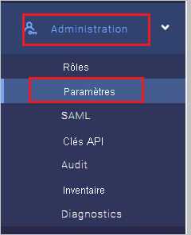
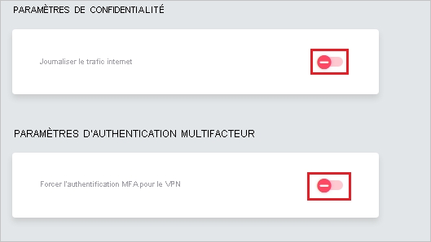
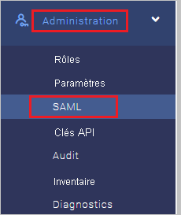
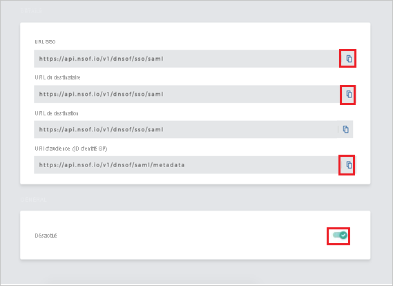
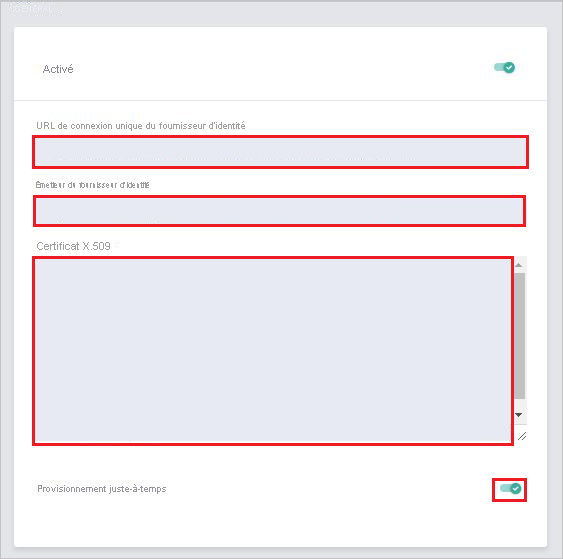

# Tutoriel : Intégration d’Azure Active Directory à Meta Networks Connector

Dans ce tutoriel, vous apprenez à intégrer Meta Networks Connector à Azure Active Directory (Azure AD). Quand vous intégrez Meta Networks Connector à Azure AD, vous pouvez :

* Contrôler, dans Azure AD qui a accès à Meta Networks Connector.
* Autoriser les utilisateurs à se connecter automatiquement à Meta Networks Connector avec leur compte Azure AD.
* Gérer vos comptes à un emplacement central : le Portail Azure.

## Prérequis

Pour commencer, vous devez disposer de ce qui suit :

* Un abonnement Azure AD Si vous ne disposez d’aucun abonnement, vous pouvez obtenir [un compte gratuit](https://azure.microsoft.com/free/)
* Abonnement à Meta Networks Connector pour lequel l’authentification unique (SSO) est activée.

## Description du scénario

Dans ce didacticiel, vous configurez et testez l’authentification unique Azure AD dans un environnement de test.

* Meta Networks Connector prend en charge l’authentification unique lancée par le **fournisseur de services** et le **fournisseur d’identité**.
 
* Meta Networks Connector prend en charge l’attribution d’utilisateurs **Juste-à-temps**.

* Meta Networks Connector prend en charge l’[attribution d’utilisateurs automatisée](meta-networks-connector-provisioning-tutorial.md).

## Ajouter Meta Networks Connector à partir de la galerie

Pour configurer l’intégration de Meta Networks Connector à Azure AD, vous devez ajouter Meta Networks Connector à votre liste d’applications SaaS gérées, à partir de la galerie.

1. Connectez-vous au portail Azure avec un compte professionnel ou scolaire ou avec un compte personnel Microsoft.
1. Dans le panneau de navigation gauche, sélectionnez le service **Azure Active Directory**.
1. Accédez à **Applications d’entreprise**, puis sélectionnez **Toutes les applications**.
1. Pour ajouter une nouvelle application, sélectionnez **Nouvelle application**.
1. Dans la section **Ajouter à partir de la galerie**, tapez **Meta Networks Connector** dans la zone de recherche.
1. Sélectionnez **Meta Networks Connector** dans le volet de résultats, puis ajoutez l’application. Patientez quelques secondes pendant que l’application est ajoutée à votre locataire.

## Configurer et tester l’authentification unique Azure AD pour Meta Networks Connector

Configurez et testez l’authentification unique Azure AD avec Meta Networks Connector à l’aide d’un utilisateur de test nommé **B.Simon**. Pour que l’authentification unique fonctionne, vous devez établir un lien entre un utilisateur Azure AD et l’utilisateur Meta Networks Connector associé.

Pour configurer et tester l’authentification unique Azure AD avec Meta Networks Connector, effectuez les étapes suivantes :

1. **[Configurer l’authentification unique Azure AD](#configure-azure-ad-sso)** pour permettre à vos utilisateurs d’utiliser cette fonctionnalité.
    1. **[Créer un utilisateur de test Azure AD](#create-an-azure-ad-test-user)** pour tester l’authentification unique Azure AD avec B. Simon.
    1. **[Affecter l’utilisateur de test Azure AD](#assign-the-azure-ad-test-user)** pour permettre à B. Simon d’utiliser l’authentification unique Azure AD.
1. **[Configurer l’authentification unique de Meta Networks Connector](#configure-meta-networks-connector-sso)** pour configurer les paramètres de l’authentification unique côté application.
    1. **[Créer l’utilisateur de test Meta Networks Connector](#create-meta-networks-connector-test-user)** pour avoir dans Meta Networks Connector un équivalent de B.Simon lié à la représentation Azure AD associée.
1. **[Tester l’authentification unique](#test-sso)** pour vérifier si la configuration fonctionne.

## Configurer l’authentification unique Azure AD

Effectuez les étapes suivantes pour activer l’authentification unique Azure AD dans le Portail Azure.

1. Dans le portail Azure, accédez à la page d’intégration de l’application **Meta Networks Connector**, recherchez la section **Gérer** et sélectionnez **Authentification unique**.
1. Dans la page **Sélectionner une méthode d’authentification unique**, sélectionnez **SAML**.
1. Dans la page **Configurer l’authentification unique avec SAML**, cliquez sur l’icône de crayon de **Configuration SAML de base** afin de modifier les paramètres.

   

4. À la section **Configuration SAML de base**, si vous souhaitez configurer l’application en mode initié par **IDP**, suivez les étapes ci-dessous :

    a. Dans la zone de texte **Identificateur**, tapez une URL au format suivant : `https://login.nsof.io/v1/<ORGANIZATION-SHORT-NAME>/saml/metadata`

    b. Dans la zone de texte **URL de réponse**, tapez une URL au format suivant : `https://login.nsof.io/v1/<ORGANIZATION-SHORT-NAME>/sso/saml`

5. Si vous souhaitez configurer l’application en **mode démarré par le fournisseur de services**, cliquez sur **Définir des URL supplémentaires**, puis effectuez les étapes suivantes :

    a. Dans la zone de texte **URL de connexion**, tapez une URL au format suivant : `https://<ORGANIZATION-SHORT-NAME>.metanetworks.com/login`.

    b. Dans la zone de texte **État de relais**, entrez une URL en utilisant le modèle suivant : `https://<ORGANIZATION-SHORT-NAME>.metanetworks.com/#/`

    > [!NOTE]
    > Il ne s’agit pas de valeurs réelles. Mettez à jour ces valeurs avec l’identificateur, l’URL de réponse et l’URL de connexion réels. La procédure est expliquée plus loin dans le tutoriel.

6. L’application Meta Networks Connector attend les assertions SAML dans un format spécifique, ce qui vous oblige à ajouter des mappages d’attributs personnalisés à votre configuration des attributs du jeton SAML. La capture d’écran suivante montre la liste des attributs par défaut. Cliquez sur l’icône **Modifier** pour ouvrir la boîte de dialogue **Attributs d’utilisateur**.

    
    
7. En plus de ce qui précède, l’application Meta Networks Connector s’attend à ce que quelques attributs supplémentaires soient repassés dans la réponse SAML. Dans la section **Revendications des utilisateurs** de la boîte de dialogue **Attributs utilisateur**, effectuez les étapes suivantes pour ajouter le jeton SAML comme indiqué dans le tableau ci-dessous :
    
    | Nom | Attribut source | Espace de noms|
    | ---------------| --------------- | -------- |
    | firstname | user.givenname | |
    | lastname | user.surname | |
    | emailaddress| user.mail| `http://schemas.xmlsoap.org/ws/2005/05/identity/claims` |
    | name | user.userprincipalname| `http://schemas.xmlsoap.org/ws/2005/05/identity/claims` |
    | phone | user.telephonenumber | |

    a. Cliquez sur le bouton **Ajouter une nouvelle revendication** pour ouvrir la boîte de dialogue **Gérer les revendications des utilisateurs**.

    

    

    b. Dans la zone de texte **Attribut**, indiquez le nom d’attribut pour cette ligne.

    c. Laissez le champ **Espace de noms** vide.

    d. Sélectionnez Source comme **Attribut**.

    e. Dans la liste **Attribut de la source**, tapez la valeur d’attribut indiquée pour cette ligne.

    f. Cliquez sur **OK**

    g. Cliquez sur **Enregistrer**.

8. Dans la page **Configurer l’authentification unique avec SAML**, dans la section **Certificat de signature SAML**, cliquez sur **Télécharger** pour télécharger le **Certificat (Base64)** en fonction des options définies par rapport à vos besoins, puis enregistrez-le sur votre ordinateur.

    

9. Dans la section **Configurer Meta Networks Connector**, copiez l’URL ou les URL appropriées, en fonction de vos besoins.

    

### Créer un utilisateur de test Azure AD 

Dans cette section, vous allez créer un utilisateur de test appelé B. Simon dans le portail Azure.

1. Dans le volet gauche du Portail Azure, sélectionnez **Azure Active Directory**, **Utilisateurs**, puis **Tous les utilisateurs**.
1. Sélectionnez **Nouvel utilisateur** dans la partie supérieure de l’écran.
1. Dans les propriétés **Utilisateur**, effectuez les étapes suivantes :
   1. Dans le champ **Nom**, entrez `B.Simon`.  
   1. Dans le champ **Nom de l’utilisateur**, entrez username@companydomain.extension. Par exemple : `B.Simon@contoso.com`.
   1. Cochez la case **Afficher le mot de passe**, puis notez la valeur affichée dans le champ **Mot de passe**.
   1. Cliquez sur **Créer**.

### Affecter l’utilisateur de test Azure AD

Dans cette section, vous allez autoriser B.Simon à utiliser l’authentification unique Azure en accordant l’accès à Meta Networks Connector.

1. Dans le portail Azure, sélectionnez **Applications d’entreprise**, puis **Toutes les applications**.
1. Dans la liste des applications, sélectionnez **Meta Networks Connector**.
1. Dans la page de vue d’ensemble de l’application, recherchez la section **Gérer** et sélectionnez **Utilisateurs et groupes**.
1. Sélectionnez **Ajouter un utilisateur**, puis **Utilisateurs et groupes** dans la boîte de dialogue **Ajouter une attribution**.
1. Dans la boîte de dialogue **Utilisateurs et groupes**, sélectionnez **B. Simon** dans la liste Utilisateurs, puis cliquez sur le bouton **Sélectionner** au bas de l’écran.
1. Si vous attendez qu’un rôle soit attribué aux utilisateurs, vous pouvez le sélectionner dans la liste déroulante **Sélectionner un rôle** . Si aucun rôle n’a été configuré pour cette application, vous voyez le rôle « Accès par défaut » sélectionné.
1. Dans la boîte de dialogue **Ajouter une attribution**, cliquez sur le bouton **Attribuer**.

## Configurer l’authentification unique Meta Networks Connector

1. Ouvrez un nouvel onglet dans votre navigateur et connectez-vous à votre compte d’administrateur Meta Networks Connector.
    
    > [!NOTE]
    > Meta Networks Connector est un système sécurisé. Par conséquent, avant d’accéder à son portail, vous devez faire approuver votre adresse IP publique pour qu’elle figure dans la liste verte de ce système. Pour obtenir votre adresse IP publique, suivez le lien spécifié [ici](https://whatismyipaddress.com/). Envoyez votre adresse IP à l’[équipe du support technique de Meta Networks Connector](mailto:support@metanetworks.com) pour qu’elle soit ajoutée à la liste verte.
    
2. Accédez à **Administrator** (Administrateur) et sélectionnez **Settings** (Paramètres).
    
    
    
3. Assurez-vous que les options **Log Internet Traffic** (Journaliser le trafic Internet) et **Force VPN MFA** (Forcer l’authentification multifacteur VPN) sont désactivées.
    
    
    
4. Accédez à **Administrator** (Administrateur) et sélectionnez **SAML** (SAML).
    
    
    
5. Effectuez les étapes suivantes dans la page **DETAILS** (DÉTAILS) :
    
    
    
    a. Copiez la valeur de **SSO URL** (URL SSO) et collez-la dans la zone de texte **URL de connexion** de la section **Domaine et URL Meta Networks Connector**.
    
    b. Copiez la valeur de **Recipient URL** (URL du destinataire) et collez-la dans la zone de texte **URL de réponse** de la section **Domaine et URL Meta Networks Connector**.
    
    c. Copiez la valeur de **Audience URI (SP Entity ID)** (URI d’audience - ID d’entité SP) et collez-la dans la zone de texte **Identificateur (ID d’entité)** de la section **Domaine et URL Meta Networks Connector**.
    
    d. Activez SAML.
    
6. Sous l’onglet **GENERAL**, effectuez les étapes suivantes :

    

    a. Dans la zone **Identity Provider Single Sign-On URL** (URL d’authentification unique du fournisseur d’identité), collez l’**URL de connexion** que vous avez copiée à partir du portail Azure.

    b. Dans la zone **Identity Provider Issuer** (Émetteur du fournisseur d’identité), collez l’**identificateur Azure AD** que vous avez copié à partir du portail Azure.

    c. Dans le bloc-notes, ouvrez le certificat téléchargé à partir du portail Azure et collez-le dans la zone de texte **X.509 Certificate** (Certificat X.509).

    d. Activez l’option **Just-in-Time Provisioning** (Provisionnement juste-à-temps).

### Créer l’utilisateur de test Meta Networks Connector

Dans cette section, un utilisateur nommé Britta Simon est créé dans Meta Networks Connector. Meta Networks Connector prend en charge le provisionnement juste-à-temps, une option activée par défaut. Vous n’avez aucune opération à effectuer dans cette section. Si l’utilisateur souhaité n’existe pas déjà dans Meta Networks Connector, il est créé quand vous tentez d’accéder à Meta Networks Connector.

>[!Note]
>Si vous devez créer un utilisateur manuellement, contactez [l’équipe du support technique du client Meta Networks Connector](mailto:support@metanetworks.com).

Meta Networks prend également en charge l’attribution automatique d’utilisateurs ; vous trouverez plus d’informations [ici](./meta-networks-connector-provisioning-tutorial.md) sur la façon de configurer l’attribution automatique d’utilisateurs.

## Tester l’authentification unique (SSO) 

Dans cette section, vous allez tester votre configuration de l’authentification unique Azure AD avec les options suivantes. 

#### Lancée par le fournisseur de services :

* Cliquez sur **Tester cette application** dans le portail Azure. Vous êtes alors redirigé vers l’URL de connexion de Meta Networks Connector, où vous pouvez lancer le flux de connexion.  

* Accédez directement à l’URL de connexion de Meta Networks Connector pour lancer le flux de connexion à partir de là.

#### Lancée par le fournisseur d’identité :

* Dans le portail Azure, cliquez sur **Tester cette application**. Vous êtes alors automatiquement connecté à l’instance de Meta Networks Connector pour laquelle vous avez configuré l’authentification unique. 

Vous pouvez aussi utiliser Mes applications de Microsoft pour tester l’application dans n’importe quel mode. Si, quand vous cliquez sur la vignette Meta Networks Connector dans Mes applications, le mode Fournisseur de services est configuré, vous êtes redirigé vers la page de connexion de l’application pour lancer le flux de connexion ; s’il s’agit du mode Fournisseur d’identité, vous êtes automatiquement connecté à l’instance de Meta Networks Connector pour laquelle vous avez configuré l’authentification unique. Pour plus d’informations sur Mes applications, consultez [Présentation de Mes applications](https://support.microsoft.com/account-billing/sign-in-and-start-apps-from-the-my-apps-portal-2f3b1bae-0e5a-4a86-a33e-876fbd2a4510).

## Étapes suivantes

Après avoir configuré Meta Networks Connector, vous pouvez appliquer le contrôle de session, qui protège en temps réel contre l’exfiltration et l’infiltration des données sensibles de votre organisation. Le contrôle de session est étendu à partir de l’accès conditionnel. [Découvrez comment appliquer un contrôle de session avec Microsoft Cloud App Security](/cloud-app-security/proxy-deployment-aad).