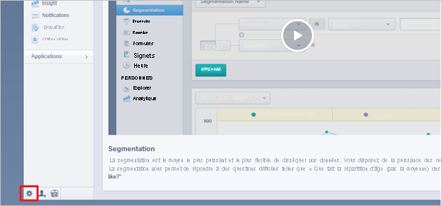
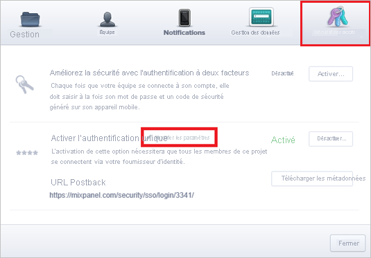
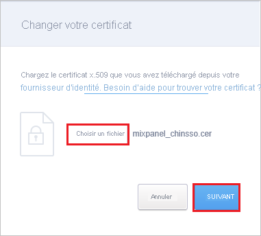
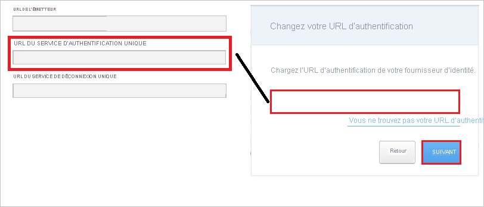
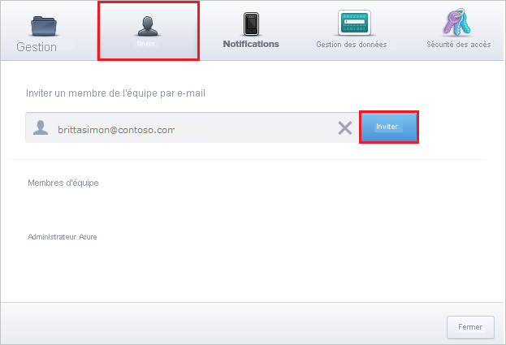

# Didacticiel : Intégration d’Azure Active Directory à Mixpanel

Dans ce tutoriel, vous allez apprendre à intégrer Mixpanel avec Azure Active Directory (Azure AD). Quand vous intégrez Mixpanel à Azure AD, vous pouvez :

* Dans Azure AD, contrôlez qui a accès à Mixpanel.
* Permettre à vos utilisateurs de se connecter automatiquement à Mixpanel avec leurs comptes Azure AD.
* Gérer vos comptes à un emplacement central : le Portail Azure.

## Prérequis

Pour commencer, vous devez disposer de ce qui suit :

* Un abonnement Azure AD Si vous ne disposez d’aucun abonnement, vous pouvez obtenir [un compte gratuit](https://azure.microsoft.com/free/).
* Un abonnement Mixpanel pour lequel l’authentification unique est activée.

## Description du scénario

Dans ce didacticiel, vous configurez et testez l’authentification unique Azure AD dans un environnement de test.

* Mixpanel prend en charge l’authentification unique initiée par le **fournisseur de services**.

> [!NOTE]
> L’identificateur de cette application étant une valeur de chaîne fixe, une seule instance peut être configurée dans un locataire.

## Ajouter Mixpanel à partir de la galerie

Pour configurer l’intégration de Mixpanel à Azure AD, vous devez ajouter Mixpanel à votre liste d’applications SaaS gérées à partir de la galerie.

1. Connectez-vous au portail Azure avec un compte professionnel ou scolaire ou avec un compte personnel Microsoft.
1. Dans le panneau de navigation gauche, sélectionnez le service **Azure Active Directory**.
1. Accédez à **Applications d’entreprise**, puis sélectionnez **Toutes les applications**.
1. Pour ajouter une nouvelle application, sélectionnez **Nouvelle application**.
1. Dans la section **Ajouter à partir de la galerie**, tapez **Mixpanel** dans la zone de recherche.
1. Sélectionnez **Mixpanel** dans le volet de résultats, puis ajoutez l’application. Patientez quelques secondes pendant que l’application est ajoutée à votre locataire.

## Configurer et tester l’authentification unique Azure AD pour Mixpanel

Configurez et testez l’authentification unique (SSO) Azure AD avec Mixpanel à l’aide d’un utilisateur de test nommé **B.Simon**. Pour que l’authentification unique fonctionne, vous devez établir un lien entre un utilisateur Azure AD et l’utilisateur associé dans Mixpanel.

Pour configurer et tester l’authentification unique Azure AD auprès de Mixpanel, effectuez les étapes suivantes :

1. **[Configurer l’authentification unique Azure AD](#configure-azure-ad-sso)** pour permettre à vos utilisateurs d’utiliser cette fonctionnalité.
    1. **[Créer un utilisateur de test Azure AD](#create-an-azure-ad-test-user)** pour tester l’authentification unique Azure AD avec B. Simon.
    1. **[Affecter l’utilisateur de test Azure AD](#assign-the-azure-ad-test-user)** pour permettre à B. Simon d’utiliser l’authentification unique Azure AD.
1. **[Configurer l’authentification unique Mixpanel](#configure-mixpanel-sso)** pour configurer les paramètres de l’authentification unique côté application.
    1. **[Créer un utilisateur de test Mixpanel](#create-mixpanel-test-user)** pour obtenir un équivalent de B.Simon dans Mixpanel lié à la représentation Azure AD associée.
1. **[Tester l’authentification unique](#test-sso)** pour vérifier si la configuration fonctionne.

## Configurer l’authentification unique Azure AD

Effectuez les étapes suivantes pour activer l’authentification unique Azure AD dans le Portail Azure.

1. Dans le portail Azure, accédez à la page d’intégration de l’application **Mixpanel**, recherchez la section **Gérer** et sélectionnez **Authentification unique**.
1. Dans la page **Sélectionner une méthode d’authentification unique**, sélectionnez **SAML**.
1. Dans la page **Configurer l’authentification unique avec SAML**, cliquez sur l’icône de crayon de **Configuration SAML de base** afin de modifier les paramètres.

   

4. Dans la section **Configuration SAML de base**, effectuez l’étape suivante :

    Dans la zone de texte **URL de connexion**, tapez l’URL : `https://mixpanel.com/login/`

    > [!NOTE]
    > Inscrivez-vous à l’adresse [https://mixpanel.com/register/](https://mixpanel.com/register/) pour configurer vos informations d’identification et contactez [l’équipe du support technique Mixpanel](mailto:support@mixpanel.com) pour activer les paramètres d’authentification unique de votre abonné. Vous pouvez également obtenir la valeur de l’URL de connexion si nécessaire à partir de votre équipe de support Mixpanel. 

5. Dans la page **Configurer l’authentification unique avec SAML**, dans la section **Certificat de signature SAML**, cliquez sur **Télécharger** pour télécharger le **Certificat (Base64)** en fonction des options définies par rapport à vos besoins, puis enregistrez-le sur votre ordinateur.

    

6. Dans la section **Configurer Mixpanel**, copiez la ou les URL appropriées en fonction de vos besoins.

    

### Créer un utilisateur de test Azure AD 

Dans cette section, vous allez créer un utilisateur de test appelé B. Simon dans le portail Azure.

1. Dans le volet gauche du Portail Azure, sélectionnez **Azure Active Directory**, **Utilisateurs**, puis **Tous les utilisateurs**.
1. Sélectionnez **Nouvel utilisateur** dans la partie supérieure de l’écran.
1. Dans les propriétés **Utilisateur**, effectuez les étapes suivantes :
   1. Dans le champ **Nom**, entrez `B.Simon`.  
   1. Dans le champ **Nom de l’utilisateur**, entrez username@companydomain.extension. Par exemple : `B.Simon@contoso.com`.
   1. Cochez la case **Afficher le mot de passe**, puis notez la valeur affichée dans le champ **Mot de passe**.
   1. Cliquez sur **Créer**.

### Affecter l’utilisateur de test Azure AD

Dans cette section, vous allez autoriser B.Simon à utiliser l’authentification unique Azure en lui accordant l’accès à Mixpanel.

1. Dans le portail Azure, sélectionnez **Applications d’entreprise**, puis **Toutes les applications**.
1. Dans la liste des applications, sélectionnez **Mixpanel**.
1. Dans la page de vue d’ensemble de l’application, recherchez la section **Gérer** et sélectionnez **Utilisateurs et groupes**.
1. Sélectionnez **Ajouter un utilisateur**, puis **Utilisateurs et groupes** dans la boîte de dialogue **Ajouter une attribution**.
1. Dans la boîte de dialogue **Utilisateurs et groupes**, sélectionnez **B. Simon** dans la liste Utilisateurs, puis cliquez sur le bouton **Sélectionner** au bas de l’écran.
1. Si vous attendez qu’un rôle soit attribué aux utilisateurs, vous pouvez le sélectionner dans la liste déroulante **Sélectionner un rôle** . Si aucun rôle n’a été configuré pour cette application, vous voyez le rôle « Accès par défaut » sélectionné.
1. Dans la boîte de dialogue **Ajouter une attribution**, cliquez sur le bouton **Attribuer**.

## Configurer l’authentification unique Mixpanel

1. Dans une autre fenêtre de navigateur, connectez-vous à votre application Mixpanel en tant qu’administrateur.

2. Dans le coin gauche en bas de la page, cliquez sur l’icône représentant un petit **engrenage** . 
   
     

3. Cliquez sur l’onglet **Sécurité d’accès**, puis cliquez sur **Modifier les paramètres**.
   
     

4. Sur la page **Modifier votre certificat**, cliquez sur **Choisir un fichier** pour importer votre certificat téléchargé, puis cliquez sur **SUIVANT**.
   
     

5.  Dans la zone de texte URL d’authentification, sur la page de dialogue **Modifier l’URL d’authentification**, collez la valeur de l’**URL de connexion**, que vous avez copiée sur le portail Azure. Puis cliquez sur **SUIVANT**.
   
     

6. Cliquez sur **Done**.

### Créer un utilisateur de test Mixpanel

L’objectif de cette section est de créer un utilisateur appelé Britta Simon dans Mixpanel. 

1. Connectez-vous à votre site d’entreprise Mixpanel en tant qu’administrateur.

2. Dans le coin gauche en bas de la page, cliquez sur le bouton représentant un petit engrenage pour ouvrir la fenêtre **Paramètres** .

3. Cliquez sur l’onglet **Équipe** .

4. Dans la zone de texte **membre de l’équipe** , entrez l’adresse de messagerie de Britta dans le portail Azure.
   
     

5. Cliquez sur **Invite**. 

> [!Note]
> L’utilisateur recevra un e-mail pour configurer son profil.

## Tester l’authentification unique (SSO)

Dans cette section, vous allez tester votre configuration de l’authentification unique Azure AD avec les options suivantes. 

* Cliquez sur **Tester cette application** dans le portail Azure. Cette opération redirige vers l’URL de connexion à Mixpanel, d’où vous pouvez lancer le processus de connexion. 

* Accédez directement à l’URL de connexion à Mixpanel pour lancer le flux de connexion.

* Vous pouvez utiliser Mes applications de Microsoft. Un clic sur la vignette Mixpanel dans Mes applications vous redirige vers l’URL de connexion à Mixpanel. Pour plus d’informations sur Mes applications, consultez [Présentation de Mes applications](../user-help/my-apps-portal-end-user-access.md).

## Étapes suivantes

Une fois que vous avez configuré Mixpanel, vous pouvez appliquer le contrôle de session, qui protège contre l’exfiltration et l’infiltration des données sensibles de votre organisation en temps réel. Le contrôle de session est étendu à partir de l’accès conditionnel. [Découvrez comment appliquer un contrôle de session avec Microsoft Cloud App Security](/cloud-app-security/proxy-deployment-aad).