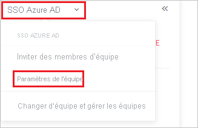
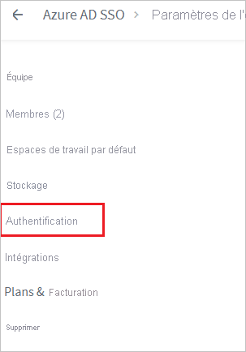
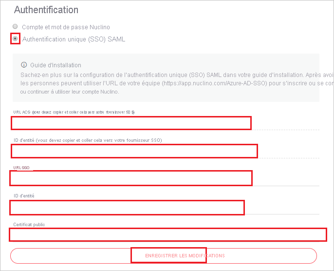

# Tutoriel : Intégration de l’authentification unique Azure Active Directory à Nuclino

Dans ce tutoriel, vous allez apprendre à intégrer Nuclino à Azure Active Directory (Azure AD). Quand vous intégrez Nuclino à Azure AD, vous pouvez :

* Contrôler qui a accès à Nuclino dans Azure AD.
* Permettre à vos utilisateurs de se connecter automatiquement à Nuclino avec leur compte Azure AD.
* Gérer vos comptes à un emplacement central : le Portail Azure.

## Prérequis

Pour commencer, vous devez disposer de ce qui suit :

* Un abonnement Azure AD Si vous ne disposez d’aucun abonnement, vous pouvez obtenir [un compte gratuit](https://azure.microsoft.com/free/).
* Un abonnement Nuclino pour lequel l’authentification unique est activée

## Description du scénario

Dans ce tutoriel, vous allez configurer et tester l’authentification unique Azure AD dans un environnement de test.

* Nuclino prend en charge l’authentification unique initiée par le **fournisseur de services et le fournisseur d’identité**.
* Nuclino prend en charge l’attribution d’utilisateurs **juste-à-temps**.

## Ajouter Nuclino à partir de la galerie

Pour configurer l’intégration de Nuclino dans Azure AD, vous devez ajouter Nuclino depuis la galerie à votre liste d’applications SaaS gérées.

1. Connectez-vous au portail Azure avec un compte professionnel ou scolaire ou avec un compte personnel Microsoft.
1. Dans le panneau de navigation gauche, sélectionnez le service **Azure Active Directory**.
1. Accédez à **Applications d’entreprise**, puis sélectionnez **Toutes les applications**.
1. Pour ajouter une nouvelle application, sélectionnez **Nouvelle application**.
1. Dans la section **Ajouter à partir de la galerie**, tapez **Nuclino** dans la zone de recherche.
1. Sélectionnez **Nuclino** dans le volet de résultats, puis ajoutez l’application. Patientez quelques secondes pendant que l’application est ajoutée à votre locataire.

## Configurer et tester l’authentification unique Azure AD pour Nuclino

Configurez et testez l’authentification unique Azure AD avec Nuclino pour un utilisateur de test appelé **B.Simon**. Pour que l’authentification unique fonctionne, vous devez établir un lien entre un utilisateur Azure AD et l’utilisateur Nuclino associé.

Pour configurer et tester l’authentification unique Azure AD avec Nuclino, procédez comme suit :

1. **[Configurer l’authentification unique Azure AD](#configure-azure-ad-sso)** pour permettre à vos utilisateurs d’utiliser cette fonctionnalité.
    1. **[Créer un utilisateur de test Azure AD](#create-an-azure-ad-test-user)** pour tester l’authentification unique Azure AD avec B. Simon.
    1. **[Affecter l’utilisateur de test Azure AD](#assign-the-azure-ad-test-user)** pour permettre à B. Simon d’utiliser l’authentification unique Azure AD.
1. **[Configurer l’authentification unique Nuclino](#configure-nuclino-sso)** pour configurer les paramètres de l’authentification unique côté application.
    1. **[Créer un utilisateur de test Nuclino](#create-nuclino-test-user)** pour avoir dans Nuclino un équivalent de B.Simon lié à la représentation Azure AD associée.
1. **[Tester l’authentification unique](#test-sso)** pour vérifier si la configuration fonctionne.

## Configurer l’authentification unique Azure AD

Effectuez les étapes suivantes pour activer l’authentification unique Azure AD dans le Portail Azure.

1. Dans le portail Azure, accédez à la page d’intégration de l’application **Nuclino**, recherchez la section **Gérer** et sélectionnez **Authentification unique**.
1. Dans la page **Sélectionner une méthode d’authentification unique**, sélectionnez **SAML**.
1. Dans la page **Configurer l’authentification unique avec SAML**, cliquez sur l’icône de crayon de **Configuration SAML de base** afin de modifier les paramètres.

   

1. Dans la section **Configuration SAML de base**, si vous souhaitez configurer l’application en mode lancé par le **fournisseur d’identité**, effectuez les étapes suivantes :

    a. Dans la zone de texte **Identificateur**, tapez une URL au format suivant : `https://api.nuclino.com/api/sso/<UNIQUE-ID>/metadata`

    b. Dans la zone de texte **URL de réponse**, tapez une URL au format suivant : `https://api.nuclino.com/api/sso/<UNIQUE-ID>/acs`

    > [!NOTE]
    > Il ne s’agit pas de valeurs réelles. Mettez à jour ces valeurs avec l’identificateur et l’URL de réponse réels à partir de la section **Authentification**, expliquée plus loin dans ce didacticiel.

1. Si vous souhaitez configurer l’application en **mode démarré par le fournisseur de services**, cliquez sur **Définir des URL supplémentaires**, puis effectuez les étapes suivantes :

    Dans la zone de texte **URL de connexion**, tapez une URL au format suivant : `https://app.nuclino.com/<UNIQUE-ID>/login`

    > [!NOTE]
    > Il ne s’agit pas de valeurs réelles. Mettez à jour ces valeurs avec l’identificateur, l’URL de réponse et l’URL de connexion réels. Pour obtenir ces valeur, contactez l’[équipe du support Nuclino](mailto:contact@nuclino.com). Vous pouvez également consulter les modèles figurant à la section **Configuration SAML de base** dans le portail Azure.

6. Votre application Nuclino s’attend à recevoir les assertions SAML dans un format spécifique, ce qui vous oblige à ajouter des mappages d’attributs personnalisés à votre configuration Attributs du jeton SAML. La capture d’écran suivante montre la liste des attributs par défaut.

    

7. En plus de ce qui précède, l’application Nuclino s’attend à ce que quelques attributs supplémentaires soient repassés dans la réponse SAML. Ces attributs sont également préremplis, mais vous pouvez les examiner pour voir s’ils répondent à vos besoins.

    | Nom |  Attribut source|
    | ---------------| --------- |
    | first_name | user.givenname |
    | last_name | user.surname |

1. Dans la page **Configurer l’authentification unique avec SAML**, dans la section **Certificat de signature SAML**, recherchez **Certificat (en base64)** , puis sélectionnez **Télécharger** pour télécharger le certificat et l’enregistrer sur votre ordinateur.

    

1. Dans la section **Configurer Nuclino**, copiez la ou les URL appropriées en fonction de vos besoins.

    

### Créer un utilisateur de test Azure AD

Dans cette section, vous allez créer un utilisateur de test appelé B. Simon dans le portail Azure.

1. Dans le volet gauche du Portail Azure, sélectionnez **Azure Active Directory**, **Utilisateurs**, puis **Tous les utilisateurs**.
1. Sélectionnez **Nouvel utilisateur** dans la partie supérieure de l’écran.
1. Dans les propriétés **Utilisateur**, effectuez les étapes suivantes :
   1. Dans le champ **Nom**, entrez `B.Simon`.  
   1. Dans le champ **Nom de l’utilisateur**, entrez username@companydomain.extension. Par exemple : `B.Simon@contoso.com`.
   1. Cochez la case **Afficher le mot de passe**, puis notez la valeur affichée dans le champ **Mot de passe**.
   1. Cliquez sur **Créer**.

### Affecter l’utilisateur de test Azure AD

Dans cette section, vous allez autoriser B.Simon à utiliser l’authentification unique Azure en lui accordant l’accès à Nuclino.

1. Dans le portail Azure, sélectionnez **Applications d’entreprise**, puis **Toutes les applications**.
1. Dans la liste des applications, sélectionnez **Nuclino**.
1. Dans la page de vue d’ensemble de l’application, recherchez la section **Gérer** et sélectionnez **Utilisateurs et groupes**.
1. Sélectionnez **Ajouter un utilisateur**, puis **Utilisateurs et groupes** dans la boîte de dialogue **Ajouter une attribution**.
1. Dans la boîte de dialogue **Utilisateurs et groupes**, sélectionnez **B. Simon** dans la liste Utilisateurs, puis cliquez sur le bouton **Sélectionner** au bas de l’écran.
1. Si vous attendez une valeur de rôle dans l’assertion SAML, dans la boîte de dialogue **Sélectionner un rôle**, sélectionnez le rôle approprié pour l’utilisateur dans la liste, puis cliquez sur le bouton **Sélectionner** en bas de l’écran.
1. Dans la boîte de dialogue **Ajouter une attribution**, cliquez sur le bouton **Attribuer**.

## Configurer l’authentification unique Nuclino

1. Pour automatiser la configuration dans Nuclino, vous devez installer l’**extension de navigateur My Apps Secure Sign-in** en cliquant sur **Installer l’extension**.

    

2. Après l’ajout de l’extension au navigateur, cliquez sur **Configurer Nuclino** pour être dirigé vers l’application Nuclino. À partir de là, indiquez les informations d’identification de l’administrateur pour vous connecter à Nuclino. Cette extension de navigateur configure automatiquement l’application pour vous et automatise les étapes 3 à 7.

    

3. Si vous souhaitez configurer manuellement Nuclino, ouvrez une nouvelle fenêtre de navigateur web, connectez-vous à votre site d’entreprise Nuclino en tant qu’administrateur et effectuez les étapes suivantes :

4. Cliquez sur l’**icône**.

    

5. Cliquez sur l’**authentification unique Azure AD** et sélectionnez **Paramètres d’équipe** dans la liste déroulante.

    

6. Sélectionnez **Authentification** à partir du volet de navigation gauche.

    

7. Dans la section **Authentication**, procédez comme suit :

    

    a. Sélectionnez **Authentification unique SAML (SSO)** .

    b. Copiez la valeur **URL ACS (vous devez la copier et la coller dans votre fournisseur d’authentification unique)** et collez-la dans la zone de texte **URL de réponse** de la section **Configuration SAML de base** dans le portail Azure.

    c. Copiez la valeur **ID d’entité (vous devez la copier et la coller dans votre fournisseur d’authentification unique)** et collez-la dans la zone de texte **Identificateur** de la section **Configuration SAML de base** dans le portail Azure.

    d. Dans la zone de texte **URL SSO**, collez la valeur **URL de connexion** que vous avez copiée dans le portail Azure.

    e. Dans la zone de texte **ID d’entité**, collez la valeur **Identificateur Azure AD** que vous avez copiée dans le portail Azure.

    f. Ouvrez votre **Certificat (Base64)** téléchargé dans le Bloc-notes. Copiez son contenu dans le Presse-papiers, puis collez-le dans la zone de texte **Certificat public**.

    g. Cliquez sur **ENREGISTRER LES MODIFICATIONS**.

### Créer un utilisateur de test Nuclino

Dans cette section, un utilisateur appelé B.Simon est créé dans Nuclino. Nuclino prend en charge l’approvisionnement d’utilisateurs juste-à-temps, option activée par défaut. Vous n’avez aucune opération à effectuer dans cette section. S’il n’existe pas encore d’utilisateur dans Nuclino, il en est créé un après l’authentification.

> [!Note]
> Si vous devez créer un utilisateur manuellement, contactez [l’équipe de support Nuclino](mailto:contact@nuclino.com).

## Tester l’authentification unique (SSO) 

Dans cette section, vous allez tester votre configuration de l’authentification unique Azure AD avec les options suivantes. 

#### Lancée par le fournisseur de services :

* Cliquez sur **Tester cette application** dans le portail Azure. Vous êtes alors redirigé vers l’URL de connexion de Nuclino, à partir de laquelle vous pouvez lancer le flux de connexion.  

* Accédez directement à l’URL de connexion de Nuclino pour initier le flux de connexion.

#### Lancée par le fournisseur d’identité :

* Cliquez sur **Tester cette application** dans Portail Azure : vous devez être connecté automatiquement à l’instance de Nuclino pour laquelle vous avez configuré l’authentification unique. 

Vous pouvez aussi utiliser Mes applications de Microsoft pour tester l’application dans n’importe quel mode. Quand vous cliquez sur la vignette Nuclino dans Mes applications, si le mode Fournisseur de services est configuré, vous êtes redirigé vers la page de connexion de l’application pour lancer le flux de connexion ; si le mode Fournisseur d’identité est configuré, vous êtes automatiquement connecté à l’instance de Nuclino pour laquelle vous avez configuré l’authentification unique. Pour plus d’informations sur Mes applications, consultez [Présentation de Mes applications](../user-help/my-apps-portal-end-user-access.md).

## Étapes suivantes

Une fois que vous avez configuré Nuclino, vous pouvez appliquer le contrôle de session, qui protège contre l’exfiltration et l’infiltration des données sensibles de votre organisation en temps réel. Le contrôle de session est étendu à partir de l’accès conditionnel. [Découvrez comment appliquer un contrôle de session avec Microsoft Cloud App Security](/cloud-app-security/proxy-deployment-aad).
