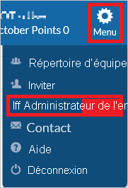
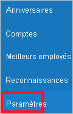
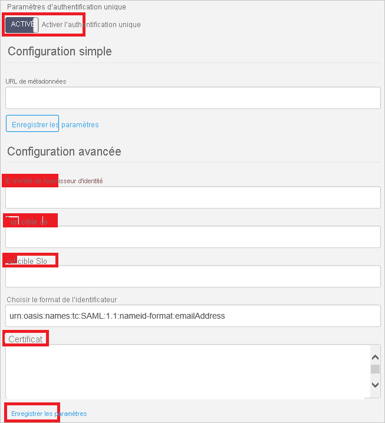
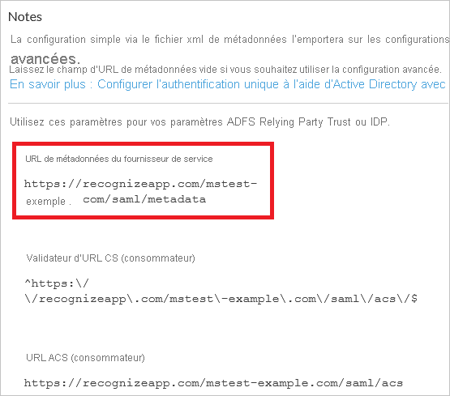
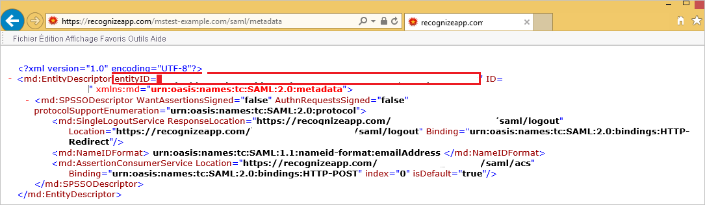

# Didacticiel : Intégration d’Azure Active Directory à Recognize

Dans ce tutoriel, vous allez apprendre à intégrer Recognize à Azure Active Directory (Azure AD). Quand vous intégrez Recognize à Azure AD, vous pouvez :

* Contrôler dans Azure AD qui a accès à Recognize.
* Permettre à vos utilisateurs de se connecter automatiquement à Recognize avec leur compte Azure AD.
* Gérer vos comptes à un emplacement central : le Portail Azure.

## Prérequis

Pour commencer, vous devez disposer de ce qui suit :

* Un abonnement Azure AD Si vous ne disposez d’aucun abonnement, vous pouvez obtenir [un compte gratuit](https://azure.microsoft.com/free/).
* Un abonnement Recognize pour lequel l’authentification unique est activée

## Description du scénario

Dans ce didacticiel, vous configurez et testez l’authentification unique Azure AD dans un environnement de test.

* Recognize prend en charge l’authentification unique initiée par le **fournisseur de services**.

## Ajouter Recognize à partir de la galerie

Pour configurer l’intégration de Recognize à Azure AD, vous devez ajouter Recognize à partir de la galerie à votre liste d’applications SaaS gérées.

1. Connectez-vous au portail Azure avec un compte professionnel ou scolaire ou avec un compte personnel Microsoft.
1. Dans le panneau de navigation gauche, sélectionnez le service **Azure Active Directory**.
1. Accédez à **Applications d’entreprise**, puis sélectionnez **Toutes les applications**.
1. Pour ajouter une nouvelle application, sélectionnez **Nouvelle application**.
1. Dans la section **Ajouter à partir de la galerie**, saisissez **Recognize** dans la zone de recherche.
1. Sélectionnez **Recognize** dans le volet de résultats, puis ajoutez l’application. Patientez quelques secondes pendant que l’application est ajoutée à votre locataire.

## Configurer et tester l’authentification unique Azure AD pour Recognize

Configurez et testez l’authentification unique Azure AD avec Recognize à l’aide d’un utilisateur de test appelé **B.Simon**. Pour que l’authentification unique fonctionne, vous devez établir un lien entre un utilisateur Azure AD et l’utilisateur associé dans Recognize.

Pour configurer et tester l’authentification unique Azure AD avec Recognize, procédez comme suit :

1. **[Configurer l’authentification unique Azure AD](#configure-azure-ad-sso)** pour permettre à vos utilisateurs d’utiliser cette fonctionnalité.
    1. **[Créer un utilisateur de test Azure AD](#create-an-azure-ad-test-user)** pour tester l’authentification unique Azure AD avec B. Simon.
    1. **[Affecter l’utilisateur de test Azure AD](#assign-the-azure-ad-test-user)** pour permettre à B. Simon d’utiliser l’authentification unique Azure AD.
1. **[Configurer l’authentification unique de Recognize](#configure-recognize-sso)** pour configurer les paramètres de l’authentification unique côté application.
    1. **[Créer un utilisateur de test Recognize](#create-recognize-test-user)** pour avoir un équivalent de B.Simon dans Recognize lié à la représentation Azure AD de l’utilisateur.
1. **[Tester l’authentification unique](#test-sso)** pour vérifier si la configuration fonctionne.

## Configurer l’authentification unique Azure AD

Effectuez les étapes suivantes pour activer l’authentification unique Azure AD dans le Portail Azure.

1. Dans le portail Azure, accédez à la page d’intégration de l’application **Recognize**, recherchez la section **Gérer** et sélectionnez **Authentification unique**.
1. Dans la page **Sélectionner une méthode d’authentification unique**, sélectionnez **SAML**.
1. Dans la page **Configurer l’authentification unique avec SAML**, cliquez sur l’icône de crayon de **Configuration SAML de base** afin de modifier les paramètres.

   

4. Dans la section **Configuration SAML de base**, si vous disposez d’un **fichier de métadonnées du fournisseur de services**, suivez les étapes ci-dessous :

    >[!NOTE]
    >Vous obtiendrez le **fichier de métadonnées de fournisseur de services** dans la section **Configurer l’authentification unique Recognize** du tutoriel.

    a. Cliquez sur **Charger un fichier de métadonnées**.

    

    b. Cliquez sur le **logo du dossier** pour sélectionner le fichier de métadonnées, puis cliquez sur **Charger**.

    

    c. Une fois le fichier de métadonnées chargé, la valeur **Identificateur** est automatiquement renseignée dans la section Configuration SAML de base.

     Dans la zone de texte **URL de connexion**, entrez une URL au format suivant :  `https://recognizeapp.com/<YOUR_DOMAIN>/saml/sso`

    > [!Note]
    > Si la valeur **Identificateur** n’est pas renseignée automatiquement, vous l’obtiendrez en ouvrant l’URL de métadonnées du fournisseur de services à partir de la section Paramètres d’authentification unique qui est expliquée plus loin dans la section **Configurer l’authentification unique Recognize** du tutoriel. La valeur de l’URL de connexion n’est pas réelle. Mettez à jour la valeur avec l’URL de connexion réelle. Pour obtenir cette valeur, contactez l’[équipe du support technique de Recognize](mailto:support@recognizeapp.com). Vous pouvez également consulter les modèles figurant à la section **Configuration SAML de base** dans le portail Azure.

5. Dans la page **Configurer l’authentification unique avec SAML**, dans la section **Certificat de signature SAML**, cliquez sur **Télécharger** pour télécharger le **Certificat (Base64)** en fonction des options définies par rapport à vos besoins, puis enregistrez-le sur votre ordinateur.

    

6. Dans la section **Configurer Recognize**, copiez l’URL ou les URL appropriées en fonction de vos besoins.

    

### Créer un utilisateur de test Azure AD 

Dans cette section, vous allez créer un utilisateur de test appelé B. Simon dans le portail Azure.

1. Dans le volet gauche du Portail Azure, sélectionnez **Azure Active Directory**, **Utilisateurs**, puis **Tous les utilisateurs**.
1. Sélectionnez **Nouvel utilisateur** dans la partie supérieure de l’écran.
1. Dans les propriétés **Utilisateur**, effectuez les étapes suivantes :
   1. Dans le champ **Nom**, entrez `B.Simon`.  
   1. Dans le champ **Nom de l’utilisateur**, entrez username@companydomain.extension. Par exemple : `B.Simon@contoso.com`.
   1. Cochez la case **Afficher le mot de passe**, puis notez la valeur affichée dans le champ **Mot de passe**.
   1. Cliquez sur **Créer**.

### Affecter l’utilisateur de test Azure AD

Dans cette section, vous allez autoriser B.Simon à utiliser l’authentification unique Azure en lui accordant l’accès à Recognize.

1. Dans le portail Azure, sélectionnez **Applications d’entreprise**, puis **Toutes les applications**.
1. Dans la liste des applications, sélectionnez **Recognize**.
1. Dans la page de vue d’ensemble de l’application, recherchez la section **Gérer** et sélectionnez **Utilisateurs et groupes**.
1. Sélectionnez **Ajouter un utilisateur**, puis **Utilisateurs et groupes** dans la boîte de dialogue **Ajouter une attribution**.
1. Dans la boîte de dialogue **Utilisateurs et groupes**, sélectionnez **B. Simon** dans la liste Utilisateurs, puis cliquez sur le bouton **Sélectionner** au bas de l’écran.
1. Si vous attendez qu’un rôle soit attribué aux utilisateurs, vous pouvez le sélectionner dans la liste déroulante **Sélectionner un rôle** . Si aucun rôle n’a été configuré pour cette application, vous voyez le rôle « Accès par défaut » sélectionné.
1. Dans la boîte de dialogue **Ajouter une attribution**, cliquez sur le bouton **Attribuer**.

## Configurer l’authentification unique de Recognize

1. Dans une autre fenêtre de navigateur web, connectez-vous à votre locataire Recognize en tant qu’administrateur.

2. Dans l’angle supérieur droit, cliquez sur **Menu**. Accédez à **Administrateur d’entreprise**.
   
    

3. Dans le volet de navigation gauche, cliquez sur **Paramètres**.
   
    

4. Dans la section **Paramètres d’authentification unique** , procédez comme suit.
   
    
    
    a. Pour **Activer l’authentification unique**, sélectionnez **Activé**.

    b. Dans la zone de texte **IDP Entity ID**, collez l’**Identificateur Azure AD** que vous avez copié dans le portail Azure.
    
    c. Dans la zone de texte **Sso target url**, collez la valeur **URL de connexion**, que vous avez copiée dans le portail Azure.
    
    d. Dans la zone de texte **Slo target url**, collez la valeur de l’**URL de déconnexion** que vous avez copiée à partir du portail Azure. 
    
    e. Ouvrez dans le Bloc-notes votre fichier **Certificate(Base64)** téléchargé, copiez son contenu dans le Presse-papiers, puis collez-le dans la zone de texte **Certificate** (Certificat).
    
    f. Cliquez sur le bouton **Enregistrer les paramètres**. 

5. En regard de la section **Paramètres d’authentification unique**, copiez l’URL sous **URL de métadonnées du fournisseur de services**.
   
    

6. Ouvrez le **lien URL de métadonnées** dans un navigateur vide pour télécharger le document de métadonnées. Copiez la valeur EntityDescriptor value(entityID) à partir du fichier, puis collez-la dans la zone de texte **Identificateur** dans la section **Configuration SAML de base** dans le portail Azure.
    
    

### Créer un utilisateur de test Recognize

Pour se connecter à Recognize, les utilisateurs d’Azure AD doivent être approvisionnés dans Recognize. Dans le cas de Recognize, l’approvisionnement est une tâche manuelle.

Cette application ne prend pas en charge l’approvisionnement SCIM, mais inclut une autre synchronisation de l’autre utilisateur qui approvisionne les utilisateurs. 

**Pour approvisionner un compte d’utilisateur, procédez comme suit :**

1. Connectez-vous à votre site d’entreprise Recognize en tant qu’administrateur.

2. Dans l’angle supérieur droit, cliquez sur **Menu**. Accédez à **Administrateur d’entreprise**.

3. Dans le volet de navigation gauche, cliquez sur **Paramètres**.

4. Dans la section **Synchronisation de l’utilisateur**, procédez comme suit.
   
    
   
    a. Pour l’option **Synchronisation activée**, sélectionnez **Activé**.
   
    b. Pour **Choisir le fournisseur de synchronisation**, sélectionnez **Microsoft / Office 365**.
   
    c. Cliquez sur **Run User Sync (Exécuter la synchronisation des utilisateurs)** .

## Tester l’authentification unique (SSO) 

Dans cette section, vous allez tester votre configuration de l’authentification unique Azure AD avec les options suivantes. 

* Cliquez sur **Tester cette application** dans le portail Azure. Vous êtes alors redirigé vers l’URL de connexion de Recognize, à partir de laquelle vous pouvez lancer le flux de connexion. 

* Accédez directement à l’URL de connexion de Recognize pour initier le flux de connexion.

* Vous pouvez utiliser Mes applications de Microsoft. Quand vous cliquez sur la vignette Recognize dans Mes applications, vous êtes redirigé vers l’URL de connexion de Recognize. Pour plus d’informations sur Mes applications, consultez [Présentation de Mes applications](../user-help/my-apps-portal-end-user-access.md).

## Étapes suivantes

Une fois que vous avez configuré Recognize, vous pouvez appliquer le contrôle de session, qui protège contre l’exfiltration et l’infiltration des données sensibles de votre organisation en temps réel. Le contrôle de session est étendu à partir de l’accès conditionnel. [Découvrez comment appliquer un contrôle de session avec Microsoft Cloud App Security](/cloud-app-security/proxy-deployment-aad).
