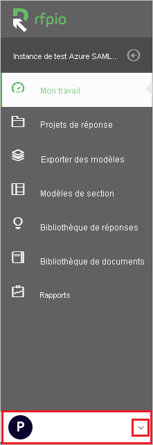
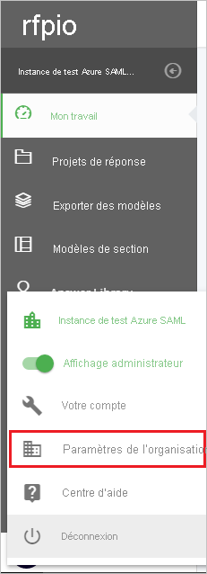
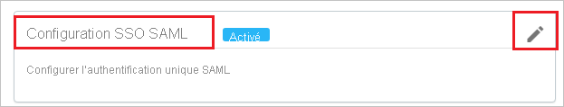
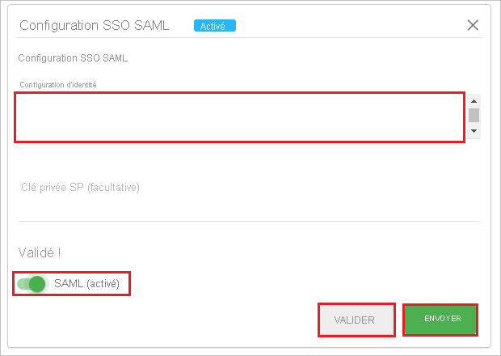
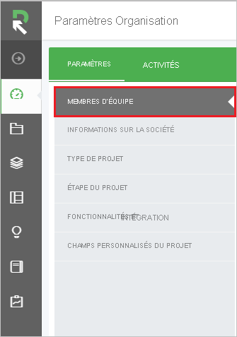

# Tutoriel : Intégration de l’authentification unique Azure AD à RFPIO

Dans ce tutoriel, vous allez apprendre à intégrer RFPIO à Azure Active Directory (Azure AD). Quand vous intégrez RFPIO à Azure AD, vous pouvez :

* dans Azure AD, contrôler qui a accès à RFPIO.
* permettre à vos utilisateurs de se connecter automatiquement à RFPIO avec leurs comptes Azure AD.
* Gérer vos comptes à un emplacement central : le Portail Azure.

## Prérequis

Pour configurer l’intégration d’Azure AD avec RFPIO, vous avez besoin des éléments suivants :

* Un abonnement Azure AD Si vous n’avez pas d’environnement Azure AD, vous pouvez obtenir un [compte gratuit](https://azure.microsoft.com/free/).
* Abonnement RFPIO pour lequel l’authentification unique est activée.

## Description du scénario

Dans ce didacticiel, vous configurez et testez l’authentification unique Azure AD dans un environnement de test.

* RFPIO prend en charge l’authentification unique lancée par le **fournisseur de services et le point de distribution d’émission**.

* RFPIO prend en charge l’[attribution automatique d’utilisateurs](rfpio-provisioning-tutorial.md).

> [!NOTE]
> L’identificateur de cette application étant une valeur de chaîne fixe, une seule instance peut être configurée dans un locataire.

## Ajout de RFPIO depuis la galerie

Pour configurer l’intégration de RFPIO avec Azure AD, vous devez ajouter RFPIO à partir de la galerie à votre liste d’applications SaaS gérées.

1. Connectez-vous au portail Azure avec un compte professionnel ou scolaire ou avec un compte personnel Microsoft.
1. Dans le panneau de navigation gauche, sélectionnez le service **Azure Active Directory**.
1. Accédez à **Applications d’entreprise**, puis sélectionnez **Toutes les applications**.
1. Pour ajouter une nouvelle application, sélectionnez **Nouvelle application**.
1. Dans la section **Ajouter à partir de la galerie**, tapez **RFPIO** dans la zone de recherche.
1. Sélectionnez **RFPIO** dans le volet des résultats, puis ajoutez l’application. Patientez quelques secondes pendant que l’application est ajoutée à votre locataire.

## Configurer et tester l’authentification unique Azure AD pour RFPIO

Configurez et testez l’authentification unique Azure AD avec RFPIO pour un utilisateur de test appelé **B.Simon**. Pour que l’authentification unique fonctionne, vous devez établir un lien entre un utilisateur Azure AD et l’utilisateur associé dans RFPIO.

Pour configurer et tester l’authentification unique Azure AD auprès de RFPIO, effectuez les étapes suivantes :

1. **[Configurer l’authentification unique Azure AD](#configure-azure-ad-sso)** pour permettre à vos utilisateurs d’utiliser cette fonctionnalité.
    1. **[Créer un utilisateur de test Azure AD](#create-an-azure-ad-test-user)** pour tester l’authentification unique Azure AD avec B. Simon.
    1. **[Affecter l’utilisateur de test Azure AD](#assign-the-azure-ad-test-user)** pour permettre à B. Simon d’utiliser l’authentification unique Azure AD.
1. **[Configurer l’authentification unique RFPIO](#configure-rfpio-sso)** pour configurer les paramètres de l’authentification unique côté application.
    1. **[Créer un utilisateur de test RFPIO](#create-rfpio-test-user)** pour avoir un équivalent de B.Simon dans RFPIO qui soit lié à la représentation de l’utilisateur Azure Active Directory.
1. **[Tester l’authentification unique](#test-sso)** pour vérifier si la configuration fonctionne.

## Configurer l’authentification unique Azure AD

Effectuez les étapes suivantes pour activer l’authentification unique Azure AD dans le Portail Azure.

1. Dans le Portail Azure, accédez à la page d’intégration de l’application **RFPIO**, recherchez la section **Gérer** et sélectionnez **Authentification unique**.
1. Dans la page **Sélectionner une méthode d’authentification unique**, sélectionnez **SAML**.
1. Dans la page **Configurer l’authentification unique avec SAML**, cliquez sur l’icône de crayon de **Configuration SAML de base** afin de modifier les paramètres.

   

1. Dans la section **Configuration SAML de base**, si vous souhaitez configurer l’application en mode lancé par le **fournisseur d’identité**, effectuez les étapes suivantes :

    a. Dans la zone de texte **Identificateur**, tapez une l’URL : `https://www.rfpio.com`

    b. Cliquez sur **Définir des URL supplémentaires**.

    c. Dans la zone de texte **État de relais**, entrez une valeur de chaîne. Contactez l’[équipe de support technique de RFPIO](https://www.rfpio.com/contact/) pour obtenir cette valeur.

1. Si vous souhaitez configurer l’application en **mode démarré par le fournisseur de services**, cliquez sur **Définir des URL supplémentaires**, puis effectuez les étapes suivantes :

    Dans la zone de texte **URL de connexion**, tapez l’URL : `https://www.app.rfpio.com`

1. L’application RFPIO s’attend à recevoir les assertions SAML dans un format spécifique, ce qui vous oblige à ajouter des mappages d’attributs personnalisés à votre configuration des attributs de jeton SAML. La capture d’écran suivante montre la liste des attributs par défaut.

    

1. En plus de ce qui précède, l’application RFPIO s’attend à ce que quelques attributs supplémentaires (présentés ci-dessous) soient repassés dans la réponse SAML. Ces attributs sont également préremplis, mais vous pouvez les examiner pour voir s’ils répondent à vos besoins.

    | Nom | Attribut source|
    | ------- | --------- |
    | first_name | user.givenname |
    | last_name | user.surname |

1. Sur la page **Configurer l’authentification unique avec SAML**, dans la section **Certificat de signature SAML**, cliquez sur **Télécharger** pour télécharger le fichier **XML de métadonnées de fédération** en fonction des options définies selon vos besoins, puis enregistrez-le sur votre ordinateur.

    

1. Dans la section **Configurer RFPIO**, copiez l’URL ou les URL appropriées en fonction de vos exigences.

    

### Créer un utilisateur de test Azure AD

Dans cette section, vous allez créer un utilisateur de test appelé B. Simon dans le portail Azure.

1. Dans le volet gauche du Portail Azure, sélectionnez **Azure Active Directory**, **Utilisateurs**, puis **Tous les utilisateurs**.
1. Sélectionnez **Nouvel utilisateur** dans la partie supérieure de l’écran.
1. Dans les propriétés **Utilisateur**, effectuez les étapes suivantes :
   1. Dans le champ **Nom**, entrez `B.Simon`.  
   1. Dans le champ **Nom de l’utilisateur**, entrez username@companydomain.extension. Par exemple : `B.Simon@contoso.com`.
   1. Cochez la case **Afficher le mot de passe**, puis notez la valeur affichée dans le champ **Mot de passe**.
   1. Cliquez sur **Créer**.

### Affecter l’utilisateur de test Azure AD

Dans cette section, vous allez autoriser B.Simon à utiliser l’authentification unique Azure en lui accordant l’accès à RFPIO.

1. Dans le portail Azure, sélectionnez **Applications d’entreprise**, puis **Toutes les applications**.
1. Dans la liste des applications, sélectionnez **RFPIO**.
1. Dans la page de vue d’ensemble de l’application, recherchez la section **Gérer** et sélectionnez **Utilisateurs et groupes**.
1. Sélectionnez **Ajouter un utilisateur**, puis **Utilisateurs et groupes** dans la boîte de dialogue **Ajouter une attribution**.
1. Dans la boîte de dialogue **Utilisateurs et groupes**, sélectionnez **B. Simon** dans la liste Utilisateurs, puis cliquez sur le bouton **Sélectionner** au bas de l’écran.
1. Si vous attendez qu’un rôle soit attribué aux utilisateurs, vous pouvez le sélectionner dans la liste déroulante **Sélectionner un rôle** . Si aucun rôle n’a été configuré pour cette application, vous voyez le rôle « Accès par défaut » sélectionné.
1. Dans la boîte de dialogue **Ajouter une attribution**, cliquez sur le bouton **Attribuer**.

## Configurer l’authentification unique RFPIO

1. Dans une autre fenêtre de navigateur web, connectez-vous au site web **RFPIO** en tant qu’administrateur.

1. Cliquez sur la liste déroulante située en bas à gauche.

    

1. Cliquez sur **Paramètres de l’organisation**. 

    

1. Cliquez sur **FONCTIONNALITÉS ET INTÉGRATION**.

    

1. Dans **Configuration SAML SSO**, cliquez sur **Modifier**.

    

1. Dans cette section, procédez comme suit :

    
    
    a. Copiez le contenu du **fichier XML de métadonnées téléchargé** et collez-le dans le champ **Configuration de l’identité**.

    > [!NOTE]
    > Pour copier le contenu du fichier **XML des métadonnées de fédération** téléchargé, utilisez **Notepad++** ou **XML Editor**.

    b. Cliquez sur **Valider**.

    c. Après avoir cliqué sur **Valider**, activez **SAML(Enabled)** .

    d. Cliquez sur **Envoyer**.

### Créer un utilisateur de test RFPIO

1. Connectez-vous à votre site d’entreprise RFPIO en tant qu’administrateur.

1. Cliquez sur la liste déroulante située en bas à gauche.

    

1. Cliquez sur **Paramètres de l’organisation**. 

    

1. Cliquez sur **MEMBRES DE L’ÉQUIPE**.

    

1. Cliquez sur **AJOUTER DES MEMBRES**.

    

1. Dans la section **Ajouter de nouveaux membres**. Procédez comme suit :

    

    a. Entrez l’**adresse e-mail** dans le champ **Entrer une adresse e-mail par ligne**.

    b. Veuillez sélectionner le **Rôle** selon vos exigences.

    c. Cliquez sur **AJOUTER DES MEMBRES**.

    > [!NOTE]
    > Le titulaire du compte Azure Active Directory reçoit un e-mail contenant un lien à suivre pour confirmer son compte et l’activer.

> [!NOTE]
> RFPIO prend aussi en charge l’attribution automatique d’utilisateurs. Vous trouverez [ici](./rfpio-provisioning-tutorial.md) plus d’informations sur la façon de configurer l’attribution automatique d’utilisateurs.  

## Tester l’authentification unique (SSO)

Dans cette section, vous allez tester votre configuration de l’authentification unique Azure AD avec les options suivantes. 

#### Lancée par le fournisseur de services :

* Cliquez sur **Tester cette application** dans le portail Azure. Vous êtes alors redirigé vers l’URL de connexion RFPIO à partir de laquelle vous pouvez lancer le flux de connexion.  

* Accédez directement à l’URL de connexion RFPIO pour lancer le flux de connexion.

#### Lancée par le fournisseur d’identité :

* Cliquez sur **Tester cette application** dans le Portail Azure. Vous devez être connecté automatiquement à l’application RFPIO pour laquelle vous avez configuré l’authentification unique. 

Vous pouvez aussi utiliser Mes applications de Microsoft pour tester l’application dans n’importe quel mode. Quand vous cliquez sur la mosaïque RFPIO dans Mes applications, si le mode Fournisseur de services est configuré, vous êtes redirigé vers la page de connexion de l’application pour lancer le flux de connexion ; si le mode Fournisseur d’identité est configuré, vous êtes automatiquement connecté à l’application RFPIO pour laquelle vous avez configuré l’authentification unique. Pour plus d’informations sur Mes applications, consultez [Présentation de Mes applications](https://support.microsoft.com/account-billing/sign-in-and-start-apps-from-the-my-apps-portal-2f3b1bae-0e5a-4a86-a33e-876fbd2a4510).

## Étapes suivantes

Une fois que vous avez configuré RFPIO, vous pouvez appliquer le contrôle de session, qui protège contre l’exfiltration et l’infiltration des données sensibles de votre organisation en temps réel. Le contrôle de session est étendu à partir de l’accès conditionnel. [Découvrez comment appliquer un contrôle de session avec Microsoft Cloud App Security](/cloud-app-security/proxy-deployment-aad).