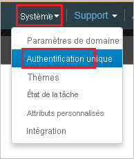
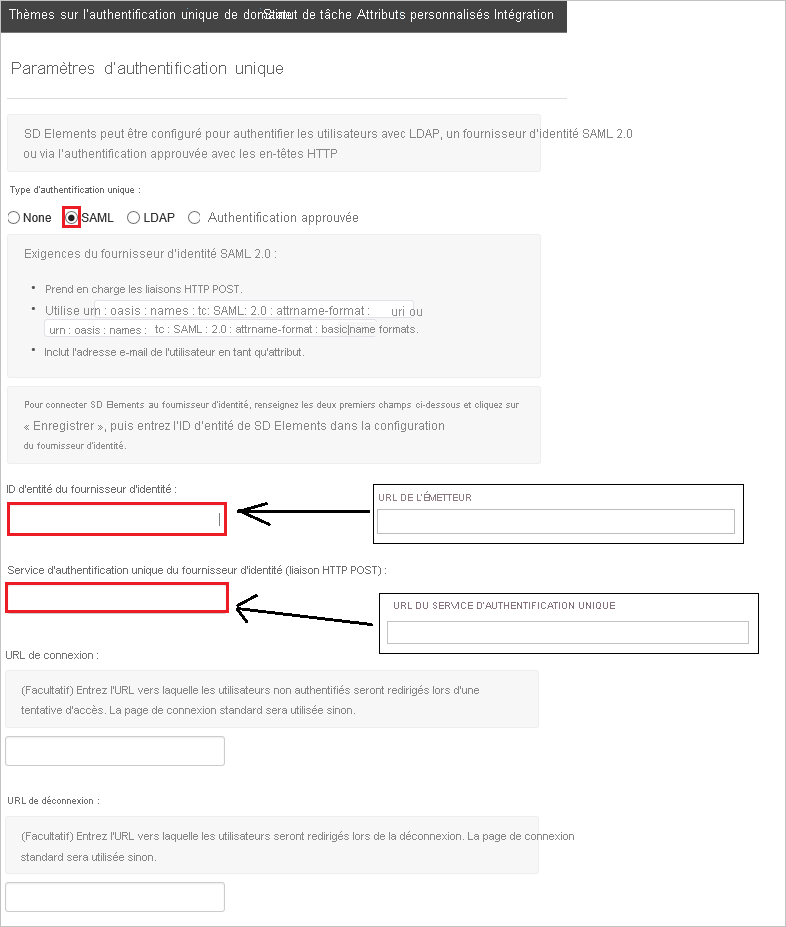
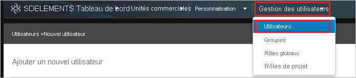
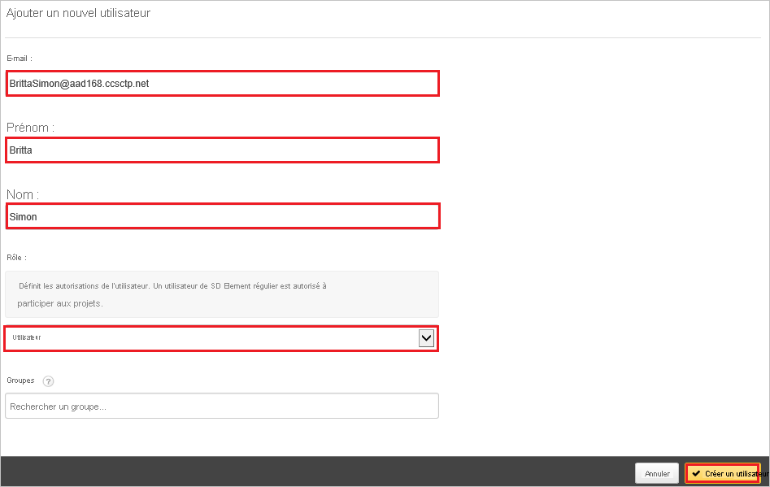

# Tutoriel : Intégration de l’authentification unique Azure Active Directory à SD Elements

Dans ce tutoriel, vous allez apprendre à intégrer SD Elements à Azure Active Directory (Azure AD). En intégrant SD Elements à Azure AD, vous pouvez :

* Contrôler, dans Azure AD, qui a accès à SD Elements
* Permettre aux utilisateurs de se connecter automatiquement à SD Elements avec leur compte Azure AD
* Gérer vos comptes à un emplacement central : le Portail Azure.

## Prérequis

Pour commencer, vous devez disposer de ce qui suit :

* Un abonnement Azure AD Si vous ne disposez d’aucun abonnement, vous pouvez obtenir [un compte gratuit](https://azure.microsoft.com/free/).
* Un abonnement SD Elements pour lequel l’authentification unique est activée.

## Description du scénario

Dans ce tutoriel, vous allez configurer et tester l’authentification unique Azure AD dans un environnement de test.

* SD Elements prend en charge l’authentification unique lancée par le **fournisseur d’identité**.

## Ajouter SD Elements à partir de la galerie

Pour configurer l’intégration de SD Elements avec Azure AD, vous devez ajouter SD Elements disponible dans la galerie à votre liste d’applications SaaS gérées.

1. Connectez-vous au portail Azure avec un compte professionnel ou scolaire ou avec un compte personnel Microsoft.
1. Dans le panneau de navigation gauche, sélectionnez le service **Azure Active Directory**.
1. Accédez à **Applications d’entreprise**, puis sélectionnez **Toutes les applications**.
1. Pour ajouter une nouvelle application, sélectionnez **Nouvelle application**.
1. Dans la section **Ajouter à partir de la galerie**, tapez **SD Elements** dans la zone de recherche.
1. Sélectionnez **SD Elements** dans le volet de résultats, puis ajoutez l’application. Patientez quelques secondes pendant que l’application est ajoutée à votre locataire.

## Configurer et tester l’authentification unique Azure AD pour SD Elements

Configurez et testez l’authentification unique Azure AD auprès de SD Elements avec un utilisateur de test nommé **B.Simon**. Pour que l’authentification unique fonctionne, vous devez établir un lien entre un utilisateur Azure AD et l’utilisateur SD Elements associé.

Pour configurer et tester l’authentification unique Azure AD avec SD Elements, effectuez les étapes suivantes :

1. **[Configurer l’authentification unique Azure AD](#configure-azure-ad-sso)** pour permettre à vos utilisateurs d’utiliser cette fonctionnalité.
    1. **[Créer un utilisateur de test Azure AD](#create-an-azure-ad-test-user)** pour tester l’authentification unique Azure AD avec B. Simon.
    1. **[Affecter l’utilisateur de test Azure AD](#assign-the-azure-ad-test-user)** pour permettre à B. Simon d’utiliser l’authentification unique Azure AD.
1. **[Configurer l’authentification unique SD Elements](#configure-sd-elements-sso)** pour configurer les paramètres de l’authentification unique côté application.
    1. **[Créer un utilisateur de test SD Elements](#create-sd-elements-test-user)** pour avoir un équivalent de B.Simon dans SD Elements lié à la représentation Azure AD associée.
1. **[Tester l’authentification unique](#test-sso)** pour vérifier si la configuration fonctionne.

## Configurer l’authentification unique Azure AD

Effectuez les étapes suivantes pour activer l’authentification unique Azure AD dans le Portail Azure.

1. Dans le Portail Azure, accédez à la page d’intégration de l’application **SD Elements**, recherchez la section **Gérer** et sélectionnez **Authentification unique**.
1. Dans la page **Sélectionner une méthode d’authentification unique**, sélectionnez **SAML**.
1. Dans la page **Configurer l’authentification unique avec SAML**, cliquez sur l’icône de crayon de **Configuration SAML de base** afin de modifier les paramètres.

   

1. Dans la page **Configurer l’authentification unique avec SAML**, effectuez les étapes suivantes :

    a. Dans la zone de texte **Identificateur**, tapez une URL au format suivant : `https://<TENANT_NAME>.sdelements.com/sso/saml2/metadata`

    b. Dans la zone de texte **URL de réponse**, tapez une URL au format suivant : `https://<TENANT_NAME>.sdelements.com/sso/saml2/acs/`

    > [!NOTE]
    > Il ne s’agit pas de valeurs réelles. Mettez à jour ces valeurs avec l’identificateur et l’URL de réponse réels. Pour obtenir ces valeurs, contactez l’[équipe de support technique SD Elements](mailto:support@sdelements.com). Vous pouvez également consulter les modèles figurant à la section **Configuration SAML de base** dans le portail Azure.

1. L’application SD Elements attend les assertions SAML dans un format spécifique, ce qui vous oblige à ajouter des mappages d’attributs personnalisés à la configuration des attributs du jeton SAML. La capture d’écran suivante montre la liste des attributs par défaut.

    

1. En plus de ce qui précède, l’application SD Elements s’attend à ce que quelques attributs supplémentaires (présentés ci-dessous) soient repassés dans la réponse SAML. Ces attributs sont également préremplis, mais vous pouvez les examiner pour voir s’ils répondent à vos besoins.

    | Nom |  Attribut source|
    | --- | --- |
    | email |user.mail |
    | firstname |user.givenname |
    | lastname |user.surname |

1. Dans la page **Configurer l’authentification unique avec SAML**, dans la section **Certificat de signature SAML**, recherchez **Certificat (en base64)** , puis sélectionnez **Télécharger** pour télécharger le certificat et l’enregistrer sur votre ordinateur.

    

1. Dans la section **Configurer SD Elements**, copiez l’URL ou les URL appropriées en fonction de vos besoins.

    

### Créer un utilisateur de test Azure AD

Dans cette section, vous allez créer un utilisateur de test appelé B. Simon dans le portail Azure.

1. Dans le volet gauche du Portail Azure, sélectionnez **Azure Active Directory**, **Utilisateurs**, puis **Tous les utilisateurs**.
1. Sélectionnez **Nouvel utilisateur** dans la partie supérieure de l’écran.
1. Dans les propriétés **Utilisateur**, effectuez les étapes suivantes :
   1. Dans le champ **Nom**, entrez `B.Simon`.  
   1. Dans le champ **Nom de l’utilisateur**, entrez username@companydomain.extension. Par exemple : `B.Simon@contoso.com`.
   1. Cochez la case **Afficher le mot de passe**, puis notez la valeur affichée dans le champ **Mot de passe**.
   1. Cliquez sur **Créer**.

### Affecter l’utilisateur de test Azure AD

Dans cette section, vous allez autoriser B.Simon à utiliser l’authentification unique Azure en lui accordant l’accès à SD Elements.

1. Dans le portail Azure, sélectionnez **Applications d’entreprise**, puis **Toutes les applications**.
1. Dans la liste des applications, sélectionnez **SD Elements**.
1. Dans la page de vue d’ensemble de l’application, recherchez la section **Gérer** et sélectionnez **Utilisateurs et groupes**.
1. Sélectionnez **Ajouter un utilisateur**, puis **Utilisateurs et groupes** dans la boîte de dialogue **Ajouter une attribution**.
1. Dans la boîte de dialogue **Utilisateurs et groupes**, sélectionnez **B. Simon** dans la liste Utilisateurs, puis cliquez sur le bouton **Sélectionner** au bas de l’écran.
1. Si vous attendez qu’un rôle soit attribué aux utilisateurs, vous pouvez le sélectionner dans la liste déroulante **Sélectionner un rôle** . Si aucun rôle n’a été configuré pour cette application, vous voyez le rôle « Accès par défaut » sélectionné.
1. Dans la boîte de dialogue **Ajouter une attribution**, cliquez sur le bouton **Attribuer**.

## Configurer l’authentification unique SD Elements

1. Pour activer l'authentification unique, contactez votre [équipe de support technique SD Elements](mailto:support@sdelements.com) et fournissez-leur le fichier de certificat téléchargé.

1. Dans une autre fenêtre de navigateur, authentifiez-vous auprès de votre client SD Elements en tant qu’administrateur.

1. Dans le menu du haut, cliquez sur **Système**, puis sur **Authentification unique**.

    

1. Dans la boîte de dialogue **Paramètres d’authentification unique** , procédez comme suit :

    

    a. Pour **SSO Type**, sélectionnez **SAML**.

    b. Dans la zone de texte **Identity Provider Entity ID** (ID d’entité du fournisseur d’identité), collez la valeur de l’**identificateur Azure AD**, que vous avez copiée à partir du portail Azure.

    c. Dans la zone de texte **Identity Provider Single Sign-On Service** (Service d’authentification unique du fournisseur d’identité), collez la valeur de l’**URL de connexion**, que vous avez copiée dans le portail Azure.

    d. Cliquez sur **Enregistrer**.

### Créer un utilisateur de test SD Elements

L’objectif de cette section est de créer un utilisateur appelé B.Simon dans SD Elements. Dans le cas de SD Elements, la création d'utilisateurs SD Elements est une tâche manuelle.

**Pour créer un utilisateur appelé B.Simon dans SD Elements, effectuez les étapes suivantes :**

1. Dans une autre fenêtre de navigateur, connectez-vous à votre site d’entreprise SD Elements en tant qu’administrateur.

1. Dans le menu situé en haut, cliquez sur **Gestion des utilisateurs**, puis sur **Utilisateurs**.

     

1. Cliquez sur **Add New User**.

    

1. Dans la boîte de dialogue **Ajouter un nouvel utilisateur**, procédez comme suit :

     

    a. Dans la zone de texte **E-mail**, entrez l’adresse e-mail de l’utilisateur, par exemple **b.simon@contoso.com** .

    b. Dans la zone de texte **First Name**, entrez le prénom de l’utilisateur, par exemple **B.** .

    c. Dans la zone de texte **Nom**, entrez le nom de l’utilisateur, par exemple **Simon**.

    d. Pour **Role**, sélectionnez **User**.

    e. Cliquez sur **Créer l’utilisateur**.

## Tester l’authentification unique (SSO) 

Dans cette section, vous allez tester votre configuration de l’authentification unique Azure AD avec les options suivantes.

* Cliquez sur Tester cette application dans le Portail Azure. Vous êtes alors automatiquement connecté à l’instance de SD Elements pour laquelle vous avez configuré l’authentification unique.

* Vous pouvez utiliser Mes applications de Microsoft. Quand vous cliquez sur la vignette SD Elements dans Mes applications, vous devez être connecté automatiquement à l’application SD Elements pour laquelle vous avez configuré l’authentification unique. Pour plus d’informations sur Mes applications, consultez [Présentation de Mes applications](../user-help/my-apps-portal-end-user-access.md).

## Étapes suivantes

Une fois que vous avez configuré SD Elements, vous pouvez appliquer le contrôle de session, qui protège contre l’exfiltration et l’infiltration des données sensibles de votre organisation en temps réel. Le contrôle de session est étendu à partir de l’accès conditionnel. [Découvrez comment appliquer un contrôle de session avec Microsoft Cloud App Security](/cloud-app-security/proxy-deployment-aad).
