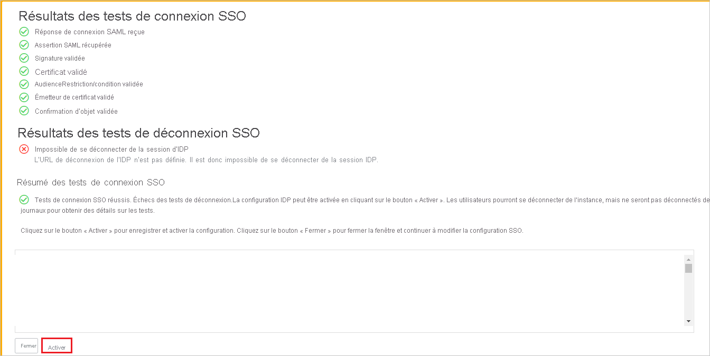

# Tutoriel : Intégration de l’authentification unique Azure Active Directory à ServiceNow

Dans ce tutoriel, vous allez apprendre à intégrer ServiceNow à Azure Active Directory (Azure AD). Quand vous intégrez ServiceNow à Azure AD, vous pouvez :

* Contrôler dans Azure AD qui a accès à ServiceNow.
* Permettre à vos utilisateurs de se connecter automatiquement à ServiceNow avec leur compte Azure AD.
* gérer vos comptes à un emplacement central : le portail Azure.

## Prérequis

Pour commencer, vous devez disposer de ce qui suit :

* Un abonnement Azure AD Si vous ne disposez d’aucun abonnement, vous pouvez obtenir [un compte gratuit](https://azure.microsoft.com/free/).
* Un abonnement ServiceNow pour lequel l’authentification unique est activée.
* Pour ServiceNow, une instance ou un locataire de ServiceNow prend en charge les versions Calgary, Kingston, London, Madrid, New York, Orlando et Paris ou ultérieures.
* Pour ServiceNow Express, une instance de ServiceNow Express, version Helsinki ou ultérieure.
* Le locataire ServiceNow doit avoir le [plug-in d’authentification unique à plusieurs fournisseurs](https://wiki.servicenow.com/index.php?title=Multiple_Provider_Single_Sign-On#gsc.tab=0) activé.
* Pour la configuration automatique, activez le plug-in multifournisseur pour ServiceNow.
* Pour installer l’application ServiceNow Classic (Mobile), accédez au magasin approprié et recherchez l’application ServiceNow Classic. Ensuite, téléchargez-la.

> [!NOTE]
> Cette intégration peut également être utilisée à partir de l’environnement cloud US Government Azure AD. Cette application est disponible dans la Galerie d’applications cloud US Government Azure AD et peut être configurée de la même façon que dans le cloud public.

## Description du scénario

Dans ce tutoriel, vous allez configurer et tester l’authentification unique Azure AD dans un environnement de test. 

* ServiceNow prend en charge l’authentification unique lancée par le **fournisseur de services**.

* ServiceNow prend en charge le [provisionnement d’utilisateurs automatisé](servicenow-provisioning-tutorial.md).

* Vous pouvez configurer l’application ServiceNow Classic (Mobile) avec Azure AD pour activer l’authentification unique. Il prend en charge les utilisateurs Android et iOS. Dans ce tutoriel, vous allez configurer et tester l’authentification unique Azure AD dans un environnement de test.

## Ajouter ServiceNow à partir de la galerie

Pour configurer l’intégration de ServiceNow à Azure AD, vous devez ajouter ServiceNow depuis la galerie à votre liste d’applications SaaS gérées.

1. Connectez-vous au portail Azure avec un compte professionnel ou scolaire ou avec un compte Microsoft personnel.
1. Dans le volet de gauche, sélectionnez le service **Azure Active Directory**.
1. Accédez à **Applications d’entreprise**, puis sélectionnez **Toutes les applications**.
1. Pour ajouter une nouvelle application, sélectionnez **Nouvelle application**.
1. Dans la section **Ajouter à partir de la galerie**, entrez **ServiceNow** dans la zone de recherche.
1. Sélectionnez **ServiceNow** dans le volet de résultats, puis ajoutez l’application. Patientez quelques secondes pendant que l’application est ajoutée à votre locataire.

## Configurer et tester l’authentification unique Azure AD pour ServiceNow

Configurez et testez l’authentification unique Azure AD avec ServiceNow à l’aide d’un utilisateur de test nommé **B.Simon**. Pour que l’authentification unique fonctionne, vous devez établir un lien entre un utilisateur Azure AD et l’utilisateur ServiceNow associé.

Pour configurer et tester l’authentification unique Azure AD avec ServiceNow, effectuez les étapes suivantes :

1. [Configurer l’authentification unique Azure AD](#configure-azure-ad-sso) pour permettre à vos utilisateurs d’utiliser cette fonctionnalité.
    1. [Créer un utilisateur de test Azure AD](#create-an-azure-ad-test-user) pour tester l’authentification unique Azure AD avec B.Simon.
    1. [Affecter l’utilisateur de test Azure AD](#assign-the-azure-ad-test-user) pour permettre à B.Simon d’utiliser l’authentification unique Azure AD.
    1. [Configurer l’authentification unique Azure AD pour ServiceNow Express](#configure-azure-ad-sso-for-servicenow-express) pour permettre à vos utilisateurs d’utiliser cette fonctionnalité.
2. [Configurer ServiceNow](#configure-servicenow) pour configurer les paramètres de l’authentification unique côté application.
    1. [Créer un utilisateur de test ServiceNow](#create-servicenow-test-user) pour avoir un équivalent de B.Simon dans ServiceNow lié à sa représentation dans Azure AD.
    1. [Configurer l’authentification unique ServiceNow Express](#configure-servicenow-express-sso) pour configurer les paramètres de l’authentification unique côté application.  
3. [Tester l’authentification unique](#test-sso) pour vérifier si la configuration fonctionne.
4. [Tester l’authentification unique pour ServiceNow Classic (Mobile)](#test-sso-for-servicenow-classic-mobile) pour vérifier si la configuration fonctionne.

## Configurer l’authentification unique Azure AD

Effectuez les étapes suivantes pour activer l’authentification unique Azure AD dans le Portail Azure.

1. Sur le portail Azure, accédez à la page d’intégration de l’application **ServiceNow**, puis recherchez la section **Gérer**. Sélectionnez **Authentification unique**.
1. Dans la page **Sélectionner une méthode d’authentification unique**, sélectionnez **SAML**.
1. Dans la page **Configurer l’authentification unique avec SAML**, sélectionnez l’icône de stylet pour **Configuration SAML de base** afin de modifier les paramètres.

   

1. Dans la section **Configuration SAML de base**, effectuez les étapes suivantes :

    a. Dans **URL de connexion**, entrez une URL dont le modèle est le suivant : `https://<instancename>.service-now.com/navpage.do`

    b. Dans **Identificateur (ID d’entité)** , entrez une URL dont le modèle est le suivant : `https://<instance-name>.service-now.com`

    c. Pour **URL de réponse**, entrez l’un des modèles d’URL suivants :

    | URL de réponse|
    |----------|
    | `https://<instancename>.service-now.com/navpage.do` |
    | `https://<instancename>.service-now.com/customer.do` | 

    d. Dans **URL de déconnexion**, entrez une URL dont le modèle est le suivant : `https://<instancename>.service-now.com/navpage.do`

    > [!NOTE]
    > Si le caractère « / » est ajouté dans la valeur de l’identificateur, supprimez-le manuellement.

    > [!NOTE]
    > Il ne s’agit pas de valeurs réelles. Vous devez mettre à jour ces valeurs avec l’URL de connexion, l’URL de réponse, l’URL de déconnexion et l’identificateur réels. La procédure est expliquée plus loin dans le tutoriel. Vous pouvez également consulter les modèles figurant à la section **Configuration SAML de base** dans le portail Azure.

1. Dans la page **Configurer l’authentification unique avec SAML**, dans la section **Certificat de signature SAML**, recherchez **Certificat (Base64)** . 

   

   a. Sélectionnez le bouton Copier pour copier l’**URL des métadonnées de fédération de l’application**, puis collez-la dans le Bloc-notes. Cette URL sera utilisée dans la suite du tutoriel.

    b. Sélectionnez **Télécharger** pour télécharger le **certificat (Base64)** , puis enregistrez le fichier du certificat sur votre ordinateur.

1. Dans la section **Configurer ServiceNow**, copiez l’URL ou les URL appropriées en fonction de vos besoins.

   

### Créer un utilisateur de test Azure AD

Dans cette section, vous allez créer un utilisateur de test appelé B.Simon dans le portail Azure.

1. Dans le volet gauche du portail Azure, sélectionnez **Azure Active Directory** > **Utilisateurs** > **Tous les utilisateurs**.
1. Sélectionnez **Nouvel utilisateur** dans la partie supérieure de l’écran.
1. Dans les propriétés **Utilisateur**, effectuez les étapes suivantes :
   1. Pour **Nom**, entrez `B.Simon`.  
   1. Entrez username@companydomain.extension comme **Nom d’utilisateur**. Par exemple : `B.Simon@contoso.com`.
   1. Sélectionnez **Afficher le mot de passe**, puis notez la valeur affichée dans la zone **Mot de passe**.
   1. Sélectionnez **Create** (Créer).

### Affecter l’utilisateur de test Azure AD

Dans cette section, vous allez autoriser B. Simon à utiliser l’authentification unique Azure en lui accordant l’accès à ServiceNow.

1. Dans le portail Azure, sélectionnez **Applications d’entreprise** > **Toutes les applications**.
1. Dans la liste des applications, sélectionnez **ServiceNow**.
1. Dans la page de vue d’ensemble de l’application, recherchez la section **Gérer** et sélectionnez **Utilisateurs et groupes**.
1. Sélectionnez **Ajouter un utilisateur**. Dans la boîte de dialogue **Ajouter une attribution**, sélectionnez **Utilisateurs et groupes**.
1. Dans la boîte de dialogue **Utilisateurs et groupes**, sélectionnez **B.Simon** dans la liste des utilisateurs, puis choisissez **Sélectionner**.
1. Si vous attendez qu’un rôle soit attribué aux utilisateurs, vous pouvez le sélectionner dans la liste déroulante **Sélectionner un rôle** . Si aucun rôle n’a été configuré pour cette application, vous voyez le rôle « Accès par défaut » sélectionné.
1. Dans la boîte de dialogue **Ajouter une attribution**, sélectionnez **Affecter**.

### Configurer l’authentification unique Azure AD pour ServiceNow Express

1. Dans le [portail Azure](https://portal.azure.com/), dans la page d’intégration de l’application **ServiceNow**, sélectionnez **Authentification unique**.

    

2. Dans la boîte de dialogue **Sélectionner une méthode d’authentification unique**, sélectionnez le mode **SAML/WS-Fed** pour activer l’authentification unique.

    

3. Dans la page **Configurer l’authentification unique avec SAML**, sélectionnez l’icône de stylet pour ouvrir la boîte de dialogue **Configuration SAML de base**.

    

4. Dans la section **Configuration SAML de base**, effectuez les étapes suivantes :

    a. Pour **URL de connexion**, entrez une URL dont le modèle est le suivant : `https://<instancename>.service-now.com/navpage.do`

    b. Pour **Identificateur (ID d’entité)** , entrez une URL dont le modèle est le suivant : `https://<instance-name>.service-now.com`

    c. Dans **URL de réponse**, entrez l’une des URL suivantes :

    | URL de réponse |
    |-----------|
    | `https://<instancename>.service-now.com/navpage.do` |
    | `https://<instancename>.service-now.com/customer.do` |

    d. Dans **URL de déconnexion**, entrez une URL dont le modèle est le suivant : `https://<instancename>.service-now.com/navpage.do`
    
    > [!NOTE]
    > Si le caractère « / » est ajouté dans la valeur de l’identificateur, supprimez-le manuellement.

    > [!NOTE]
    > Il ne s’agit pas de valeurs réelles. Vous devez mettre à jour ces valeurs avec l’URL de connexion, l’URL de réponse, l’URL de déconnexion et l’identificateur réels. La procédure est expliquée plus loin dans le tutoriel. Vous pouvez également consulter les modèles figurant à la section **Configuration SAML de base** dans le portail Azure.

5. Dans la page **Configurer l’authentification unique avec SAML**, dans la section **Certificat de signature SAML**, sélectionnez **Télécharger** pour télécharger le **certificat (Base64)** dont vous avez besoin parmi les options spécifiées. Enregistrez-le sur votre ordinateur.

    

6. Vous pouvez faire en sorte qu’Azure AD configure automatiquement ServiceNow pour l’authentification SAML. Pour activer ce service, accédez à la section **Configurer ServiceNow**, puis sélectionnez **Afficher les instructions détaillées** pour ouvrir la fenêtre **Configurer l’authentification**.

    

7. Dans le formulaire **Configurer l’authentification**, entrez le nom de votre instance ServiceNow, l’utilisateur administrateur et le mot de passe de l’administrateur. Sélectionnez **Configurer maintenant**. Le rôle **security_admin** doit être attribué au nom de l’utilisateur administrateur dans ServiceNow pour que cela fonctionne. Sinon, pour configurer manuellement ServiceNow de manière à utiliser Azure AD comme fournisseur d’identité SAML, sélectionnez **Configurer manuellement l’authentification unique**. Copiez **l’URL de déconnexion, l’identificateur Azure AD et l’URL de connexion** à partir de la section Référence rapide.

    

## Configurer ServiceNow

1. Connectez-vous à votre application ServiceNow en tant qu’administrateur.

1. Activez le plug-in **Integration - Multiple Provider Single Sign-On Installer** (Intégration - Programme d’installation de l’authentification unique à plusieurs fournisseurs) en effectuant les étapes suivantes :

    a. Dans le volet gauche, recherchez la section **System Definition** (Définition du système) dans la zone de recherche, puis sélectionnez **Plugins** (Plug-ins).

    

    b. Recherchez **Integration - Multiple Provider Single Sign-On Installer** (Intégration - Programme d’installation de l’authentification unique à plusieurs fournisseurs).

     

    c. Sélectionnez le plug-in. Cliquez avec le bouton droit et sélectionnez **Activate/Upgrade** (Activer/Mettre à niveau).

     

    d. Sélectionnez **Activer**.

     

1. Dans le volet gauche, recherchez la section **Multi-Provider SSO** (Authentification unique multifournisseur) dans la barre de recherche, puis sélectionnez **Properties** (Propriétés).

    

1. Dans la boîte de dialogue **Multiple Provider SSO Properties** (Propriétés de l’authentification unique multifournisseur), effectuez les étapes suivantes :

    

    * Pour **Enable multiple provider SSO** (Activer l’authentification unique multifournisseur), sélectionnez **Yes** (Oui).
  
    * Pour **Enable Auto Importing of users from all identity providers into the user table** (Activer l’importation automatique des utilisateurs à partir de tous les fournisseurs d’identité dans la table utilisateur), sélectionnez **Yes** (Oui).

    * Pour **Enable debug logging got the multiple provider SSO integration** (Activer l’enregistrement du débogage pour l’intégration de l’authentification unique multifournisseur), sélectionnez **Yes** (Oui).

    * Dans **The field on the user table that...** (Le champ dans la table utilisateur qui...), entrez **email**.
  
    * Sélectionnez **Enregistrer**.

1. Vous pouvez configurer ServiceNow automatiquement ou manuellement. Pour configurer ServiceNow automatiquement, effectuez les étapes suivantes :

    1. Revenez à la page d’authentification unique **ServiceNow** dans le portail Azure.

    1. Le service de configuration en un clic est fourni pour ServiceNow. Pour activer ce service, accédez à la section **Configuration de ServiceNow**, puis sélectionnez **Configurer ServiceNow** pour ouvrir la fenêtre **Configurer l’authentification**.

        

    1. Dans le formulaire **Configurer l’authentification**, entrez le nom de votre instance ServiceNow, l’utilisateur administrateur et le mot de passe de l’administrateur. Sélectionnez **Configurer maintenant**. Le rôle **security_admin** doit être attribué au nom d’utilisateur admin dans ServiceNow pour que cela fonctionne. Sinon, pour configurer manuellement ServiceNow de manière à utiliser Azure AD comme fournisseur d’identité SAML, sélectionnez **Configurer manuellement l’authentification unique**. Copiez **l’URL de déconnexion, l’ID d’entité SAML et l’URL du service d’authentification unique SAML** à partir de la section Référence rapide.

        

    1. Connectez-vous à votre application ServiceNow en tant qu’administrateur.

       * Dans la configuration automatique, tous les paramètres nécessaires sont configurés côté **ServiceNow**, mais le certificat X.509 (**X.509 Certificat)** n’est pas activé par défaut et définit la valeur de **Single Sign-On Script** (Script d’authentification unique) sur **MultiSSOv2_SAML2_custom**. Vous devrez le mapper manuellement à votre fournisseur d’identité dans ServiceNow. Procédez comme suit :

         1. Dans le volet gauche, recherchez la section **Multi-Provider SSO** (Authentification unique multifournisseur) dans la barre de recherche, puis sélectionnez **Identity Providers** (Fournisseurs d’identité).

            

         1. Sélectionnez le fournisseur d’identité généré automatiquement.

            

         1.  Dans la section **Fournisseur d’identité**, procédez comme suit :

             

               a. Pour **Name** (Nom), indiquez le nom de votre configuration (par exemple, **Microsoft Azure Federated Single Sign-On**).

               b. Copiez la valeur **ServiceNow Homepage** (Page d’accueil de ServiceNow) et collez-la dans **URL de connexion** dans la section **Configuration SAML de base ServiceNow** du portail Azure.

                > [!NOTE]
                > La page d’accueil de l’instance ServiceNow est une concaténation de votre **URL de locataire ServiceNow** et de **/navpage.do** (par exemple, `https://fabrikam.service-now.com/navpage.do`).

              c. Copiez la valeur **Entity ID / Issuer** (ID d’entité / Émetteur) et collez-la dans **Identificateur** dans la section **Configuration SAML de base ServiceNow** du portail Azure.

              d. Confirmez que **NameID Policy** (Stratégie NameID) a la valeur `urn:oasis:names:tc:SAML:1.1:nameid-format:unspecified`. 

              e. Cliquez sur **Advanced** (Avancé) et définissez la valeur de **Single Sign-On Script** (Script d’authentification unique) sur **MultiSSOv2_SAML2_custom**.

         1. Faites défiler la page jusqu’à la section **X.509 Certificate**  (Certificat X.509), puis sélectionnez **Edit** (Modifier).

             

         1. Sélectionnez le certificat, puis l’icône de flèche droite pour ajouter le certificat.

            

          1. Sélectionnez **Enregistrer**.

          1. Dans le coin supérieur droit de la page, sélectionnez **Test Connection** (Tester la connexion).

             

             > [!NOTE]
             > Si le test de connexion échoue et que vous ne pouvez pas activer cette connexion, ServiceNow propose le commutateur de remplacement. Vous devez entrer **Sys_properties. LIST** dans la **navigation de recherche** pour accéder à la nouvelle page de propriétés système. Vous devez y créer une nouvelle propriété sous le nom **glide.authenticate.multisso.test.connection.mandatory** en attribuant à **datatype** la valeur **True/False**, puis en définissant **value** sur **False**.

             > 
        
          1. Quand vous êtes invité à fournir vos informations d’identification, entrez-les. La page ci-après apparaît. L’erreur **SSO Logout Test Results** (Résultats des tests de déconnexion SSO) est attendue. Ignorez l’erreur et sélectionnez **Activate** (Activer).

             
  
1. Pour configurer **ServiceNow** automatiquement, effectuez les étapes suivantes :

    1. Connectez-vous à votre application ServiceNow en tant qu’administrateur.

    1. Dans le volet gauche, sélectionnez **Fournisseurs d’identité**.

        

    1. Dans la boîte de dialogue **Identity Providers** (Fournisseurs d’identité), sélectionnez **New** (Nouveau).

        

    1. Dans la boîte de dialogue **Identity Providers** (Fournisseurs d’identité), sélectionnez **SAML**.

        

    1. Dans **Import Identity Provider Metadata** (Importer les métadonnées du fournisseur d’identité), effectuez les étapes suivantes :

        

        1. Entrez l’**URL des métadonnées de fédération d’application** que vous avez copiée à partir du portail Azure.

        1. Sélectionnez **Importer**.

    1. L’URL des métadonnées IdP est alors lue et tous les champs sont renseignés.

        

        a. Pour **Name** (Nom), indiquez le nom de votre configuration (par exemple, **Microsoft Azure Federated Single Sign-On**).

        b. Copiez la valeur **ServiceNow Homepage** (Page d’accueil de ServiceNow). Collez-la dans **URL de connexion** dans la section **Configuration SAML de base ServiceNow** du portail Azure.

        > [!NOTE]
        > La page d’accueil de l’instance ServiceNow est une concaténation de votre **URL de locataire ServiceNow** et de **/navpage.do** (par exemple, `https://fabrikam.service-now.com/navpage.do`).

        c. Copiez la valeur **Entity ID / Issuer** (ID d’entité / Émetteur). Collez-la dans **Identificateur** dans la section **Configuration SAML de base ServiceNow** du portail Azure.

        d. Confirmez que **NameID Policy** (Stratégie NameID) a la valeur `urn:oasis:names:tc:SAML:1.1:nameid-format:unspecified`.

        e. Sélectionnez **Avancé**. Dans **User Field** (Champ utilisateur), entrez **email**.

        > [!NOTE]
        > Vous pouvez configurer Azure AD de manière à émettre l’ID d’utilisateur Azure AD (nom d’utilisateur principal) ou l’adresse e-mail comme identificateur unique dans le jeton SAML. Pour ce faire, accédez à la section **ServiceNow** > **Attributs** > **Authentification unique** du portail Azure et mappez le champ souhaité à l’attribut **nameidentifier**. La valeur stockée pour l’attribut sélectionné dans Azure AD (par exemple, nom d’utilisateur principal) doit correspondre à la valeur stockée dans ServiceNow pour le champ renseigné (par exemple, user_name).

        g. Dans le coin supérieur droit de la page, sélectionnez **Test Connection** (Tester la connexion).

        > [!NOTE]
        > Si le test de connexion échoue et que vous ne pouvez pas activer cette connexion, ServiceNow propose le commutateur de remplacement. Vous devez entrer **Sys_properties. LIST** dans la **navigation de recherche** pour accéder à la nouvelle page de propriétés système. Vous devez y créer une nouvelle propriété sous le nom **glide.authenticate.multisso.test.connection.mandatory** en attribuant à **datatype** la valeur **True/False**, puis en définissant **value** sur **False**.

          > 

        h. Quand vous êtes invité à fournir vos informations d’identification, entrez-les. La page ci-après apparaît. L’erreur **SSO Logout Test Results** (Résultats des tests de déconnexion SSO) est attendue. Ignorez l’erreur et sélectionnez **Activate** (Activer).

          

### Créer un utilisateur de test ServiceNow

L’objectif de cette section est de créer un utilisateur appelé B.Simon dans ServiceNow. ServiceNow prend en charge le provisionnement automatique d’utilisateurs, qui est activé par défaut.

> [!NOTE]
> Si vous devez créer un utilisateur manuellement, contactez l’[équipe du support technique de ServiceNow](https://www.servicenow.com/support/contact-support.html).

### Configurer l’authentification unique ServiceNow Express

1. Connectez-vous à votre application ServiceNow Express en tant qu’administrateur.

2. Dans le volet gauche, sélectionnez **Single Sign-On** (Authentification unique).

    

3. Dans la boîte de dialogue **Authentification unique**, sélectionnez l’icône de configuration en haut à droite et définissez les propriétés suivantes :

    

    a. Activez **Enable multiple provider SSO** (Activer l’authentification unique à plusieurs fournisseurs) à droite.

    b. Activez **Enable debug logging for the multiple provider SSO integration** (Activer l’enregistrement du débogage pour l’intégration de l’authentification unique à plusieurs fournisseurs) à droite.

    c. Dans **The field on the user table that...** (Le champ dans la table utilisateur qui...), entrez **user_name**.

4. Dans la boîte de dialogue **Single Sign-On** (Authentification unique), cliquez sur **Add New Certificate** (Ajouter un nouveau certificat).

    

5. Dans la boîte de dialogue **X.509 Certificates** (Certificats X.509), effectuez les étapes suivantes :

    

    a. Pour **Name** (Nom), attribuez un nom à votre configuration (par exemple : **TestSAML2.0**).

    b. Sélectionnez **Active**.

    c. Pour **Format**, sélectionnez **PEM**.

    d. Pour **Type**, sélectionnez **Trust Store Cert**.

    e. Dans le Bloc-notes, ouvrez le certificat encodé au format Base64 que vous avez téléchargé à partir du portail Azure. Copiez son contenu dans le Presse-papiers, puis collez-le dans la zone de texte **PEM Certificate** (Certificat PEM).

    f. Sélectionnez **Update** (Mettre à jour).

6. Dans la boîte de dialogue **Single Sign-On** (Authentification unique), cliquez sur **Add New IdP** (Ajouter un nouveau fournisseur d’identité).

    

7. Dans la boîte de dialogue **Add New Identity Provider** (Ajouter un nouveau fournisseur d’identité), sous **Configure Identity Provider** (Configurer un fournisseur d’identité), effectuez les étapes suivantes :

    

    a. Pour **Name** (Nom), attribuez un nom à votre configuration (par exemple : **SAML 2.0**).

    b. Pour **Identity Provider URL** (URL du fournisseur d’identité), collez la valeur de l’ID du fournisseur d’identité que vous avez copiée à partir du portail Azure.

    c. Pour **Identity Provider’s AuthnRequest** (Demande d’authentification du fournisseur d’identité), collez la valeur de l’URL de la demande d’authentification que vous avez copiée à partir du portail Azure.

    d. Pour **Identity Provider’s SingleLogoutRequest** (Demande de déconnexion unique du fournisseur d’identité), collez la valeur de l’URL de déconnexion que vous avez copiée à partir du portail Azure.

    e. Pour **Identity Provider Certificate** (Certificat du fournisseur d’identité), sélectionnez le certificat que vous avez créé à l’étape précédente.

8. Sélectionnez **Advanced Settings** (Paramètres avancés). Sous **Additional Identity Provider Properties** (Autres propriétés du fournisseur d’identité), effectuez les étapes suivantes :

    

    a. Pour **Protocol Binding for the IDP’s SingleLogoutRequest** (Liaison de protocole pour la demande de déconnexion unique du fournisseur d’identité), entrez **urn:oasis:names:tc:SAML:2.0:bindings:HTTP-Redirect**.

    b. Pour **NameID Policy** (Stratégie NameID), entrez **urn:oasis:names:tc:SAML:1.1:nameid-format:unspecified**.

    c. Pour **AuthnContextClassRef Method** (Métode AuthnContextClassRef), entrez `http://schemas.microsoft.com/ws/2008/06/identity/authenticationmethod/password`.

    d. Désactivez **Create AuthnContextClass** (Créer AuthnContextClass).

9. Sous **Additional Service Provider Properties** (Autres propriétés du fournisseur d’identité), procédez comme suit :

    

    a. Pour **ServiceNow Homepage** (Page d’accueil ServiceNow), entrez l’URL de la page d’accueil de votre instance ServiceNow.

    > [!NOTE]
    > La page d’accueil de l’instance ServiceNow est une concaténation de votre **URL de locataire ServiceNow** et de **/navpage.do** (par exemple, `https://fabrikam.service-now.com/navpage.do`).

    b. Pour **Entity ID / Issuer** (ID d’entité / Émetteur), entrez l’URL de votre locataire ServiceNow.

    c. Pour **Audience URI** (URI d’audience), entrez l’URL de votre locataire ServiceNow.

    d. Pour **Clock Skew** (Décalage de l’horloge), entrez **60**.

    e. Dans **User Field** (Champ utilisateur), entrez **email**.

    > [!NOTE]
    > Vous pouvez configurer Azure AD de manière à émettre l’ID d’utilisateur Azure AD (nom d’utilisateur principal) ou l’adresse e-mail comme identificateur unique dans le jeton SAML. Pour ce faire, accédez à la section **ServiceNow** > **Attributs** > **Authentification unique** du portail Azure et mappez le champ souhaité à l’attribut **nameidentifier**. La valeur stockée pour l’attribut sélectionné dans Azure AD (par exemple, nom d’utilisateur principal) doit correspondre à la valeur stockée dans ServiceNow pour le champ renseigné (par exemple, user_name).

    f. Sélectionnez **Enregistrer**.

## Tester l’authentification unique (SSO)

Quand vous sélectionnez la vignette ServiceNow dans le volet d’accès, vous devez être connecté automatiquement à l’application ServiceNow pour laquelle vous avez configuré l’authentification unique. Pour plus d’informations sur le panneau d’accès, consultez [Présentation du panneau d’accès](../user-help/my-apps-portal-end-user-access.md).

## Tester l’authentification unique pour ServiceNow Classic (Mobile)

1. Ouvrez votre application **ServiceNow Classic (Mobile)** et effectuez les étapes suivantes :

    a. Sélectionnez le signe plus dans le coin inférieur droit.

    

    b. Entrez le nom de votre instance ServiceNow, puis sélectionnez **Continue** (Continuer).

    

    c. Dans la page **Log in** (Connexion), effectuez les étapes suivantes :

    

    *  Entrer un nom d’utilisateur dans **Username**, par exemple B.simon@contoso.com.

    *  Sélectionnez **USE EXTERNAL LOGIN** (Utiliser une connexion externe). Vous êtes redirigé vers la page Azure AD pour la connexion.

    *  Entrez vos informations d’identification. Si une authentification tierce ou toute autre fonctionnalité de sécurité est activée, l’utilisateur doit répondre en conséquence. La **page d’accueil** de l’application s’affiche.

        

## Étapes suivantes

Après avoir configuré ServiceNow, vous pouvez appliquer des contrôles de session qui protègent en temps réel contre l’exfiltration et l’infiltration des données sensibles de votre organisation. Les contrôles de session sont étendus à partir de l’accès conditionnel. [Découvrir comment appliquer un contrôle de session avec Microsoft Cloud App Security](https://docs.microsoft.com/cloud-app-security/proxy-deployment-aad)

