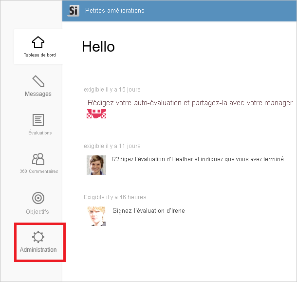
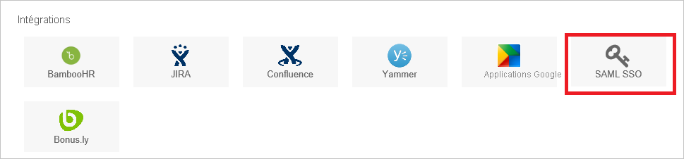
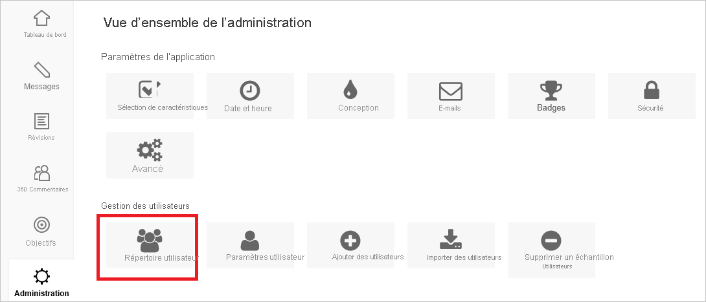
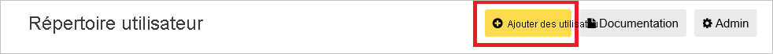

# Tutoriel : Intégration de l’authentification unique Azure AD à Small Improvements

Dans ce tutoriel, vous allez apprendre à intégrer Small Improvements à Azure Active Directory (Azure AD). Quand vous intégrez Small Improvements à Azure AD, vous pouvez :

* Contrôler dans Azure AD qui a accès à Small Improvements.
* Permettre aux utilisateurs de se connecter automatiquement à Small Improvements avec leur compte Azure AD.
* Gérer vos comptes à un emplacement central : le Portail Azure.

## Prérequis

Pour commencer, vous devez disposer de ce qui suit :

* Un abonnement Azure AD Si vous ne disposez d’aucun abonnement, vous pouvez obtenir [un compte gratuit](https://azure.microsoft.com/free/).
* Un abonnement Small Improvements pour lequel l’authentification unique est activée.

## Description du scénario

Dans ce didacticiel, vous configurez et testez l’authentification unique Azure AD dans un environnement de test.

* Small Improvements prend en charge l’authentification unique lancée par le **fournisseur de services**.

## Ajouter Small Improvements à partir de la galerie

Pour configurer l’intégration de Small Improvements avec Azure AD, vous devez ajouter Small Improvements à partir de la galerie à votre liste d’applications SaaS gérées.

1. Connectez-vous au portail Azure avec un compte professionnel ou scolaire ou avec un compte personnel Microsoft.
1. Dans le panneau de navigation gauche, sélectionnez le service **Azure Active Directory**.
1. Accédez à **Applications d’entreprise**, puis sélectionnez **Toutes les applications**.
1. Pour ajouter une nouvelle application, sélectionnez **Nouvelle application**.
1. Dans la section **Ajouter à partir de la galerie**, tapez **Small Improvements** dans la zone de recherche.
1. Sélectionnez **Small Improvements** dans le volet de résultats, puis ajoutez l’application. Patientez quelques secondes pendant que l’application est ajoutée à votre locataire.

## Configurer et tester l’authentification unique Azure AD pour Small Improvements

Configurez et testez l’authentification unique Azure AD avec Small Improvements à l’aide d’un utilisateur test appelé **B.Simon**. Pour que l’authentification unique fonctionne, vous devez établir un lien entre un utilisateur Azure AD et l’utilisateur Small Improvements associé.

Pour configurer et tester l’authentification unique Azure AD avec Small Improvements, effectuez les étapes suivantes :

1. **[Configurer l’authentification unique Azure AD](#configure-azure-ad-sso)** pour permettre à vos utilisateurs d’utiliser cette fonctionnalité.
    1. **[Créer un utilisateur de test Azure AD](#create-an-azure-ad-test-user)** pour tester l’authentification unique Azure AD avec B. Simon.
    1. **[Affecter l’utilisateur de test Azure AD](#assign-the-azure-ad-test-user)** pour permettre à B. Simon d’utiliser l’authentification unique Azure AD.
1. **[Configurer l’authentification unique de Small Improvements](#configure-small-improvements-sso)** pour configurer les paramètres de l’authentification unique côté application.
    1. **[Créer un utilisateur test Small Improvements](#create-small-improvements-test-user)** pour avoir un équivalent de B.Simon dans Small Improvements lié à la représentation Azure AD de l’utilisateur.
1. **[Tester l’authentification unique](#test-sso)** pour vérifier si la configuration fonctionne.

## Configurer l’authentification unique Azure AD

Effectuez les étapes suivantes pour activer l’authentification unique Azure AD dans le Portail Azure.

1. Dans le portail Azure, accédez à la page d’intégration de l’application **Small Improvements**, recherchez la section **Gérer** et sélectionnez **Authentification unique**.
1. Dans la page **Sélectionner une méthode d’authentification unique**, sélectionnez **SAML**.
1. Dans la page **Configurer l’authentification unique avec SAML**, cliquez sur l’icône de crayon de **Configuration SAML de base** afin de modifier les paramètres.

   

4. Dans la section **Configuration SAML de base**, effectuez les étapes suivantes :

    a. Dans la zone de texte **Identificateur (ID d’entité)** , saisissez une URL au format suivant : `https://<subdomain>.small-improvements.com`

    b. Dans la zone de texte **URL de connexion**, saisissez une URL au format suivant : `https://<subdomain>.small-improvements.com`

    > [!NOTE]
    > Il ne s’agit pas de valeurs réelles. Mettez à jour ces valeurs avec l’identificateur et l’URL de connexion réels. Contactez l’[équipe de support client Small Improvements](mailto:support@small-improvements.com) pour obtenir ces valeurs. Vous pouvez également consulter les modèles figurant à la section **Configuration SAML de base** dans le portail Azure.

5. Dans la page **Configurer l’authentification unique avec SAML**, dans la section **Certificat de signature SAML**, cliquez sur **Télécharger** pour télécharger le **Certificat (Base64)** en fonction des options définies par rapport à vos besoins, puis enregistrez-le sur votre ordinateur.

    

6. Dans la section **Configurer Small Improvements**, copiez la ou les URL appropriées en fonction de vos besoins.

    

### Créer un utilisateur de test Azure AD

Dans cette section, vous allez créer un utilisateur de test appelé B. Simon dans le portail Azure.

1. Dans le volet gauche du Portail Azure, sélectionnez **Azure Active Directory**, **Utilisateurs**, puis **Tous les utilisateurs**.
1. Sélectionnez **Nouvel utilisateur** dans la partie supérieure de l’écran.
1. Dans les propriétés **Utilisateur**, effectuez les étapes suivantes :
   1. Dans le champ **Nom**, entrez `B.Simon`.  
   1. Dans le champ **Nom de l’utilisateur**, entrez username@companydomain.extension. Par exemple : `B.Simon@contoso.com`.
   1. Cochez la case **Afficher le mot de passe**, puis notez la valeur affichée dans le champ **Mot de passe**.
   1. Cliquez sur **Créer**.

### Affecter l’utilisateur de test Azure AD

Dans cette section, vous allez autoriser B.Simon à utiliser l’authentification unique Azure en lui accordant l’accès à Small Improvements.

1. Dans le portail Azure, sélectionnez **Applications d’entreprise**, puis **Toutes les applications**.
1. Dans la liste des applications, sélectionnez **Small Improvements**.
1. Dans la page de vue d’ensemble de l’application, recherchez la section **Gérer** et sélectionnez **Utilisateurs et groupes**.
1. Sélectionnez **Ajouter un utilisateur**, puis **Utilisateurs et groupes** dans la boîte de dialogue **Ajouter une attribution**.
1. Dans la boîte de dialogue **Utilisateurs et groupes**, sélectionnez **B. Simon** dans la liste Utilisateurs, puis cliquez sur le bouton **Sélectionner** au bas de l’écran.
1. Si vous attendez qu’un rôle soit attribué aux utilisateurs, vous pouvez le sélectionner dans la liste déroulante **Sélectionner un rôle** . Si aucun rôle n’a été configuré pour cette application, vous voyez le rôle « Accès par défaut » sélectionné.
1. Dans la boîte de dialogue **Ajouter une attribution**, cliquez sur le bouton **Attribuer**.

## Configurer l’authentification unique pour Small Improvements

1. Dans une autre fenêtre de navigateur, connectez-vous à votre site d’entreprise Small Improvements en tant qu’administrateur.

1. Sur la page du tableau de bord principal, cliquez sur le bouton **Administration** situé sur la gauche.

     

1. Cliquez sur le bouton **SAML SSO** de la section **Integrations**.

     

1. Sur la page de configuration de l’authentification unique, procédez comme suit :

      

    a. Dans la zone de texte **HTTP Endpoint** (Point de terminaison HTTP), collez la valeur **URL de connexion** que vous avez copiée à partir du portail Azure.

    b. Ouvrez le certificat que vous avez téléchargé dans le Bloc-notes, copiez son contenu, puis collez-le dans la zone de texte **Certificat x509** . 

    c. Si vous souhaitez que les utilisateurs disposent de l’authentification unique et de l’option d’authentification par formulaire de connexion, activez l’option **Activer l’accès également via une connexion/un mot de passe**.  

    d. Entrez les informations appropriées pour nommer le bouton de connexion d’authentification unique dans la zone de texte **SAML Prompt** .  

    e. Cliquez sur **Enregistrer**.

### Créer un utilisateur de test Small Improvements

Pour se connecter à Small Improvements, les utilisateurs d’Azure AD doivent être approvisionnés dans Small Improvements. Dans le cas de Small Improvements, l’approvisionnement est une tâche manuelle.

**Pour approvisionner un compte d’utilisateur, procédez comme suit :**

1. Connectez-vous à votre site d’entreprise Small Improvements en tant qu’administrateur.

1. À partir de la page d’accueil, accédez au menu de gauche, puis cliquez sur **Administration**.

1. Cliquez sur le bouton **User Directory** dans la section User Management.

     

1. Cliquez sur **Add Users**.

     

1. Dans la boîte de dialogue **Add users** , procédez comme suit : 

    

    a. Entrez le **prénom** de l’utilisateur, à savoir **Britta**.

    b. Entrez le **nom de famille** de l’utilisateur, à savoir **Simon**.

    c. Entrez l’**adresse e-mail** de l’utilisateur, à savoir **brittasimon@contoso.com** .

    d. Vous pouvez également choisir d’entrer le message personnel dans la zone **Envoyer un e-mail de notification** . Décochez cette case si vous ne souhaitez envoyer de notification.

    e. Cliquez sur **Créer des utilisateurs**.

## Tester l’authentification unique (SSO)

Dans cette section, vous allez tester votre configuration de l’authentification unique Azure AD avec les options suivantes. 

* Cliquez sur **Tester cette application** dans le portail Azure. Vous êtes alors redirigé vers l’URL d’authentification Small Improvements, à partir de laquelle vous pouvez lancer le processus de connexion. 

* Accédez directement à l’URL d’authentification Small Improvements pour lancer le processus de connexion.

* Vous pouvez utiliser Mes applications de Microsoft. Le fait de cliquer sur la vignette Small Improvements dans Mes applications vous redirige vers l’URL d’authentification Small Improvements. Pour plus d’informations sur Mes applications, consultez [Présentation de Mes applications](../user-help/my-apps-portal-end-user-access.md).

## Étapes suivantes

Après avoir configuré Small Improvements, vous pouvez appliquer le contrôle de session, qui protège contre l’exfiltration et l’infiltration de données sensibles de votre organisation en temps réel. Le contrôle de session est étendu à partir de l’accès conditionnel. [Découvrez comment appliquer un contrôle de session avec Microsoft Cloud App Security](/cloud-app-security/proxy-deployment-aad).