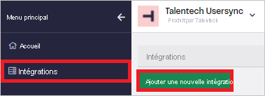
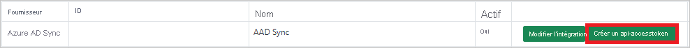
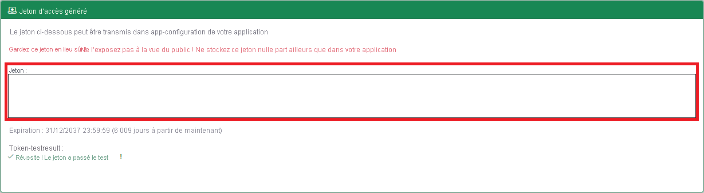

# Tutoriel : Configurer Talentech pour l’approvisionnement automatique d’utilisateurs

Ce tutoriel décrit les étapes à suivre à la fois dans Talentech et Azure Active Directory (Azure AD) pour configurer le provisionnement automatique d’utilisateurs. Une fois configuré, Azure AD attribue des utilisateurs et des groupes à [Talentech](https://www.talentech.com) et supprime leurs privilèges d’accès automatiquement à l’aide du service Approvisionnement d’Azure AD. Pour découvrir les informations importantes sur ce que fait ce service, comment il fonctionne et consulter le forum aux questions, reportez-vous à l’article [Automatiser l’attribution et l’annulation de l’attribution des utilisateurs dans les applications SaaS avec Azure Active Directory](../app-provisioning/user-provisioning.md). 

## Fonctionnalités prises en charge
> [!div class="checklist"]
> * Créer des utilisateurs dans Talentech
> * Supprimer les utilisateurs dans Talentech quand ils n’ont plus besoin d’y accéder
> * Maintenir la synchronisation des attributs utilisateur entre Azure AD et Talentech
> * Provisionner des groupes et des appartenances aux groupes dans Talentech
> * Authentification unique auprès de Talentech (recommandé)

## Prérequis

Le scénario décrit dans ce tutoriel part du principe que vous disposez des prérequis suivants :

* [Un locataire Azure AD](../develop/quickstart-create-new-tenant.md) 
* Un compte d’utilisateur dans Azure AD avec l’[autorisation](../roles/permissions-reference.md) de configurer l’approvisionnement (par exemple, administrateur d’application, administrateur d’application Cloud, propriétaire d’application ou administrateur général). 
* Un compte d’utilisateur dans Talentech.

## Étape 1. Planifier votre déploiement de l’approvisionnement
1. En savoir plus sur le [fonctionnement du service d’approvisionnement](../app-provisioning/user-provisioning.md).
2. Déterminez qui sera dans l’[étendue pour l’approvisionnement](../app-provisioning/define-conditional-rules-for-provisioning-user-accounts.md).
3. Déterminez les données à [mapper entre Azure AD et Talentech](../app-provisioning/customize-application-attributes.md). 

## Étape 2. Configurer Talentech pour la prise en charge du provisionnement avec Azure AD

1. Connectez-vous à [Talentech](https://www.talentech.com).

2. Accédez à **Intégrations** dans le volet gauche, puis cliquez sur **Ajouter une nouvelle intégration**.

    

3. Entrez un **Nom** pour l’intégration et cliquez sur **Ajouter**.

4. Accédez à l’intégration que vous avez créée et cliquez sur **Créer un jeton d’accès API**.

    

5. Un jeton d’accès est généré. Vous devrez entrer cette valeur dans le champ **Jeton secret** dans l’onglet Approvisionnement de votre application Talentech dans le portail Microsoft Azure.

    

6. Contactez le support Talentech pour générer une URL de locataire. Vous devrez entrer cette valeur dans le champ **URL de locataire** dans l’onglet Approvisionnement de votre application Talentech dans le portail Microsoft Azure.

## Étape 3. Ajouter Talentech à partir de la galerie d’applications Azure AD

Ajoutez Talentech à partir de la galerie d’applications Azure AD pour commencer à gérer le provisionnement dans Talentech. Si vous avez déjà configuré Talentech pour l’authentification unique, vous pouvez utiliser la même application. Toutefois, il est recommandé de créer une application distincte lors du test initial de l’intégration. En savoir plus sur l’ajout d’une application à partir de la galerie [ici](../manage-apps/add-application-portal.md). 

## Étape 4. Définir qui sera dans l’étendue pour l’approvisionnement 

Le service d’approvisionnement Azure AD vous permet de définir l’étendue des utilisateurs approvisionnés en fonction de l’affectation à l’application et/ou en fonction des attributs de l’utilisateur/groupe. Si vous choisissez de définir l’étendue de l’approvisionnement pour votre application en fonction de l’attribution, vous pouvez utiliser les étapes de [suivantes](../manage-apps/assign-user-or-group-access-portal.md) pour affecter des utilisateurs et des groupes à l’application. Si vous choisissez de définir l’étendue de l’approvisionnement en fonction uniquement des attributs de l’utilisateur ou du groupe, vous pouvez utiliser un filtre d’étendue comme décrit [ici](../app-provisioning/define-conditional-rules-for-provisioning-user-accounts.md). 

* Lors de l’attribution d’utilisateurs et de groupes à Talentech, vous devez sélectionner un rôle différent du rôle **Accès par défaut**. Les utilisateurs disposant du rôle Accès par défaut sont exclus de l’approvisionnement et sont marqués comme non autorisés dans les journaux de configuration. Si le seul rôle disponible sur l’application est le rôle Accès par défaut, vous pouvez [mettre à jour le manifeste de l’application](../develop/howto-add-app-roles-in-azure-ad-apps.md) pour ajouter des rôles supplémentaires. 

* Commencez progressivement. Testez avec un petit ensemble d’utilisateurs et de groupes avant d’effectuer un déploiement général. Lorsque l’étendue de l’approvisionnement est définie sur les utilisateurs et les groupes attribués, vous pouvez contrôler cela en affectant un ou deux utilisateurs ou groupes à l’application. Lorsque l’étendue est définie sur tous les utilisateurs et groupes, vous pouvez spécifier un [filtre d’étendue basé sur l’attribut](../app-provisioning/define-conditional-rules-for-provisioning-user-accounts.md). 

## Étape 5. Configurer l’approvisionnement automatique d’utilisateurs sur Talentech 

Cette section vous guide tout au long des étapes de configuration du service d’approvisionnement Azure AD pour créer, mettre à jour et désactiver des utilisateurs et des groupes dans TestApp en fonction des affectations d’utilisateurs et de groupes dans Azure AD.

### Pour configurer l’attribution automatique d’utilisateurs pour Talentech dans Azure AD :

1. Connectez-vous au [portail Azure](https://portal.azure.com). Sélectionnez **Applications d’entreprise**, puis **Toutes les applications**.

    

2. Dans la liste des applications, sélectionnez **Talentech**.

    

3. Sélectionnez l’onglet **Approvisionnement**.

    

4. Définissez le **Mode d’approvisionnement** sur **Automatique**.

    

5. Sous la section **Informations d’identification de l’administrateur**, entrez l’URL et le jeton secret de votre locataire Talentech. Cliquez sur **Tester la connexion** pour vérifier qu’Azure AD peut se connecter à Talentech. Si la connexion échoue, vérifiez que votre compte Talentech dispose des autorisations d’administrateur et réessayez.

    

6. Dans le champ **E-mail de notification**, entrez l’adresse e-mail de la personne ou du groupe qui doit recevoir les notifications d’erreur de provisionnement et sélectionnez la case à cocher **Envoyer une notification par e-mail en cas de défaillance**.

    

7. Sélectionnez **Enregistrer**.

8. Dans la section **Mappages**, sélectionnez **Synchroniser les utilisateurs Azure Active Directory sur Talentech**.

9. Dans la section **Mappage des attributs**, passez en revue les attributs utilisateur qui sont synchronisés entre Azure AD et Talentech. Les attributs sélectionnés en tant que propriétés de **Correspondance** sont utilisés pour faire correspondre les comptes d’utilisateur dans Talentech pour les opérations de mise à jour. Si vous choisissez de modifier l’[attribut cible correspondant](../app-provisioning/customize-application-attributes.md), vérifiez que l’API Talentech prend en charge le filtrage des utilisateurs en fonction de cet attribut. Cliquez sur le bouton **Enregistrer** pour valider les modifications.

   |Attribut|Type|Pris en charge pour le filtrage|
   |---|---|---|
   |userName|String|&check;|
   |externalId|String|
   |active|Boolean|
   |name.givenName|String|
   |name.familyName|String|

10. Dans la section **Mappages**, sélectionnez **Synchroniser les groupes Azure Active Directory avec Talentech**.

11. Dans la section **Mappages des attributs**, passez en revue les attributs de groupe qui sont synchronisés entre Azure AD et Talentech. Les attributs sélectionnés comme propriétés de **Correspondance** servent à la mise en correspondance des groupes dans Talentech pour les opérations de mise à jour. Cliquez sur le bouton **Enregistrer** pour valider les modifications.

      |Attribut|Type|Pris en charge pour le filtrage|
      |---|---|---|
      |displayName|String|&check;|
      |externalId|String|
      |membres|Informations de référence|

12. Pour configurer des filtres d’étendue, reportez-vous aux instructions suivantes fournies dans [Approvisionnement d’applications basé sur les attributs avec filtres d’étendue](../app-provisioning/define-conditional-rules-for-provisioning-user-accounts.md).

13. Pour activer le service de provisionnement d’Azure AD pour Talentech, affectez la valeur **Activé** au paramètre **État de l’approvisionnement** dans la section **Paramètres**.

    

14. Définissez les utilisateurs et les groupes que vous voulez approvisionner sur Talentech en choisissant les valeurs souhaitées dans **Étendue** de la section **Paramètres**.

    

15. Lorsque vous êtes prêt à effectuer l’approvisionnement, cliquez sur **Enregistrer**.

    

Cette opération démarre le cycle de synchronisation initiale de tous les utilisateurs et groupes définis dans **Étendue** dans la section **Paramètres**. Le cycle de synchronisation initiale prend plus de temps que les cycles de synchronisation suivants, qui se produisent toutes les 40 minutes environ tant que le service de provisionnement Azure AD est en cours d’exécution. 

## Étape 6. Surveiller votre déploiement
Une fois que vous avez configuré l’approvisionnement, utilisez les ressources suivantes pour surveiller votre déploiement :

1. Utilisez les [journaux d’approvisionnement](../reports-monitoring/concept-provisioning-logs.md) pour déterminer quels utilisateurs ont été configurés avec succès ou échoué.
2. Consultez la [barre de progression](../app-provisioning/application-provisioning-when-will-provisioning-finish-specific-user.md) pour afficher l’état du cycle d’approvisionnement et quand il se termine
3. Si la configuration de l’approvisionnement semble se trouver dans un état non sain, l’application passe en quarantaine. Pour en savoir plus sur les états de quarantaine, cliquez [ici](../app-provisioning/application-provisioning-quarantine-status.md).

## Ressources supplémentaires

* [Gestion de l’approvisionnement de comptes d’utilisateur pour les applications d’entreprise](../app-provisioning/configure-automatic-user-provisioning-portal.md)
* [Qu’est-ce que l’accès aux applications et l’authentification unique avec Azure Active Directory ?](../manage-apps/what-is-single-sign-on.md)

## Étapes suivantes

* [Découvrez comment consulter les journaux d’activité et obtenir des rapports sur l’activité d’approvisionnement](../app-provisioning/check-status-user-account-provisioning.md)