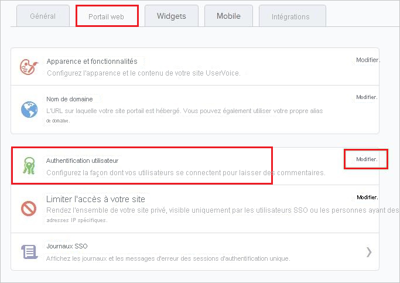
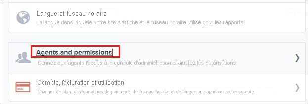
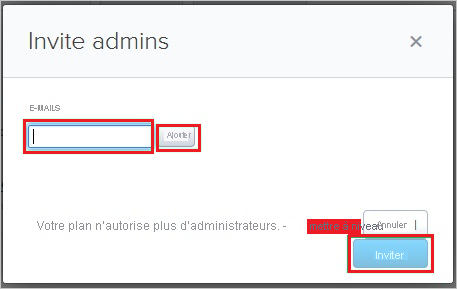

# Didacticiel : Intégration d’Azure Active Directory à UserVoice

Dans ce didacticiel, vous allez apprendre à intégrer UserVoice à Azure Active Directory (Azure AD). Quand vous intégrez UserVoice à Azure AD, vous pouvez :

* Contrôler, dans Azure AD, qui a accès à UserVoice.
* Permettre à vos utilisateurs de se connecter automatiquement à UserVoice avec leurs comptes Azure AD.
* Gérer vos comptes à un emplacement central : le Portail Azure.

## Prérequis

Pour configurer l’intégration d’Azure AD à UserVoice, vous avez besoin des éléments suivants :

* Un abonnement Azure AD Si vous n’avez pas d’environnement Azure AD, vous pouvez obtenir un [compte gratuit](https://azure.microsoft.com/free/).
* Abonnement UserVoice pour lequel l’authentification unique est activée.

## Description du scénario

Dans ce didacticiel, vous configurez et testez l’authentification unique Azure AD dans un environnement de test.

* UserVoice prend en charge l’authentification unique (SSO) lancée par le **fournisseur de services**.

## Ajouter UserVoice depuis la galerie

Pour configurer l’intégration de UserVoice avec Azure AD, vous devez ajouter UserVoice disponible dans la galerie, à votre liste d’applications SaaS gérées.

1. Connectez-vous au portail Azure avec un compte professionnel ou scolaire ou avec un compte personnel Microsoft.
1. Dans le panneau de navigation gauche, sélectionnez le service **Azure Active Directory**.
1. Accédez à **Applications d’entreprise**, puis sélectionnez **Toutes les applications**.
1. Pour ajouter une nouvelle application, sélectionnez **Nouvelle application**.
1. Dans la section **Ajouter à partir de la galerie**, tapez **UserVoice** dans la zone de recherche.
1. Sélectionnez **UserVoice** dans le volet de résultats, puis ajoutez l’application. Patientez quelques secondes pendant que l’application est ajoutée à votre locataire.

## Configurer et tester l’authentification unique Azure AD pour UserVoice

Configurez et testez l’authentification unique Azure AD avec UserVoice à l’aide d’un utilisateur de test appelé **B.Simon**. Pour que l’authentification unique fonctionne, vous devez établir un lien entre un utilisateur Azure AD et l’utilisateur associé dans UserVoice.

Pour configurer et tester l’authentification unique Azure AD avec UserVoice, effectuez les étapes suivantes :

1. **[Configurer l’authentification unique Azure AD](#configure-azure-ad-sso)** pour permettre à vos utilisateurs d’utiliser cette fonctionnalité.
    1. **[Créer un utilisateur de test Azure AD](#create-an-azure-ad-test-user)** pour tester l’authentification unique Azure AD avec B. Simon.
    1. **[Affecter l’utilisateur de test Azure AD](#assign-the-azure-ad-test-user)** pour permettre à B. Simon d’utiliser l’authentification unique Azure AD.
1. **[Configurer l’authentification unique UserVoice](#configure-uservoice-sso)** pour configurer les paramètres de l’authentification unique côté application.
    1. **[Créer un utilisateur de test UserVoice](#create-uservoice-test-user)** pour avoir un équivalent de B.Simon dans UserVoice lié à la représentation Azure AD associée.
1. **[Tester l’authentification unique](#test-sso)** pour vérifier si la configuration fonctionne.

## Configurer l’authentification unique Azure AD

Effectuez les étapes suivantes pour activer l’authentification unique Azure AD dans le Portail Azure.

1. Dans le Portail Azure, accédez à la page d’intégration de l’application **UserVoice**, recherchez la section **Gérer** et sélectionnez **Authentification unique**.
1. Dans la page **Sélectionner une méthode d’authentification unique**, sélectionnez **SAML**.
1. Dans la page **Configurer l’authentification unique avec SAML**, cliquez sur l’icône de crayon de **Configuration SAML de base** afin de modifier les paramètres.

   

4. Dans la section **Configuration SAML de base**, effectuez les étapes suivantes :

    a. Dans la zone de texte **Identificateur (ID d’entité)** , saisissez une URL au format suivant : `https://<TENANT_NAME>.UserVoice.com`

    b. Dans la zone de texte **URL de connexion**, saisissez une URL au format suivant : `https://<TENANT_NAME>.UserVoice.com`

    > [!NOTE]
    > Il ne s’agit pas de valeurs réelles. Mettez à jour ces valeurs avec l’identificateur et l’URL de connexion réels. Pour obtenir ces valeurs, contactez l’[équipe de support technique UserVoice](https://www.uservoice.com/). Vous pouvez également consulter les modèles figurant à la section **Configuration SAML de base** dans le portail Azure.

5. Dans la section **Certificat de signature SAML**, cliquez sur le bouton **Modifier** pour ouvrir la boîte de dialogue **Certificat de signature SAML**.

    

6. Dans la section **Certificat de signature SAML**, copiez l’**empreinte** et enregistrez-la sur votre ordinateur.

    

7. Dans la section **Configurer UserVoice**, copiez la ou les URL appropriées selon vos besoins.

    

### Créer un utilisateur de test Azure AD 

Dans cette section, vous allez créer un utilisateur de test appelé B. Simon dans le portail Azure.

1. Dans le volet gauche du Portail Azure, sélectionnez **Azure Active Directory**, **Utilisateurs**, puis **Tous les utilisateurs**.
1. Sélectionnez **Nouvel utilisateur** dans la partie supérieure de l’écran.
1. Dans les propriétés **Utilisateur**, effectuez les étapes suivantes :
   1. Dans le champ **Nom**, entrez `B.Simon`.  
   1. Dans le champ **Nom de l’utilisateur**, entrez username@companydomain.extension. Par exemple : `B.Simon@contoso.com`.
   1. Cochez la case **Afficher le mot de passe**, puis notez la valeur affichée dans le champ **Mot de passe**.
   1. Cliquez sur **Créer**.

### Affecter l’utilisateur de test Azure AD

Dans cette section, vous allez autoriser B.Simon à utiliser l’authentification unique Azure en lui accordant l’accès à UserVoice.

1. Dans le portail Azure, sélectionnez **Applications d’entreprise**, puis **Toutes les applications**.
1. Dans la liste des applications, sélectionnez **UserVoice**.
1. Dans la page de vue d’ensemble de l’application, recherchez la section **Gérer** et sélectionnez **Utilisateurs et groupes**.
1. Sélectionnez **Ajouter un utilisateur**, puis **Utilisateurs et groupes** dans la boîte de dialogue **Ajouter une attribution**.
1. Dans la boîte de dialogue **Utilisateurs et groupes**, sélectionnez **B. Simon** dans la liste Utilisateurs, puis cliquez sur le bouton **Sélectionner** au bas de l’écran.
1. Si vous attendez qu’un rôle soit attribué aux utilisateurs, vous pouvez le sélectionner dans la liste déroulante **Sélectionner un rôle** . Si aucun rôle n’a été configuré pour cette application, vous voyez le rôle « Accès par défaut » sélectionné.
1. Dans la boîte de dialogue **Ajouter une attribution**, cliquez sur le bouton **Attribuer**.

## Configurer l’authentification unique UserVoice

1. Dans une autre fenêtre de navigateur web, connectez-vous au site de votre entreprise UserVoice en tant qu’administrateur.

2. Dans la barre d’outils en haut, cliquez sur **Paramètres** et sélectionnez **Portail Web** dans le menu.
   
    

3. Dans la section **Authentification utilisateur** de l’onglet **Portail Web**, cliquez sur **Modifier** pour ouvrir la page de la boîte de dialogue **Edit User Authentication** (Modifier l’authentification utilisateur).
   
     (Portail web)

4. Dans la page **Edit User Authentication** , procédez comme suit :
   
     (Modifier l’authentification utilisateur)
   
    a. Cliquez sur **Single Sign-On (SSO)** .
 
    b. Collez la valeur de l’**URL de connexion** copiée à partir du portail Azure dans la zone de texte **SSO Remote Sign-In** (Connexion à distance avec authentification unique).

    c. Collez la valeur de l’**URL de déconnexion** copiée à partir du portail Azure dans la zone de texte **SSO Remote Sign-Out** (Déconnexion à distance avec authentification unique).
 
    d. Collez la valeur **Empreinte** que vous avez copiée à partir du portail Azure dans la zone de texte **Empreinte SHA1 du certificat actuel**.
    
    e. Cliquez sur **Save authentication settings**.

### Créer un utilisateur de test UserVoice

Pour permettre aux utilisateurs Azure AD de se connecter à UserVoice, ils doivent être provisionnés dans UserVoice. Dans le cas d’UserVoice, cet approvisionnement est une tâche manuelle.

### Pour approvisionner un compte d’utilisateur, procédez comme suit :

1. Connectez-vous à votre locataire **UserVoice**.

2. Accédez à **Settings**.
   
    

3. Cliquez sur **Général**.

4. Cliquez sur **Agents and permissions**.
   
     (Agents et autorisations)

5. Cliquez sur **Add admins**.
   
     (Ajouter des administrateurs)

6. Dans la boîte de dialogue **Invite admins** , procédez comme suit :
   
     (Inviter des administrateurs)
   
    a. Dans la zone de texte E-mails, entrez l’adresse de messagerie du compte que vous souhaitez approvisionner, puis cliquez sur **Ajouter**.
   
    b. Cliquez sur **Invite**.

> [!NOTE]
> Vous pouvez utiliser tout autre outil ou n’importe quelle API de création de compte d’utilisateur fournis par UserVoice pour provisionner des comptes d’utilisateurs Azure AD.

## Tester l’authentification unique (SSO) 

Dans cette section, vous allez tester votre configuration de l’authentification unique Azure AD avec les options suivantes. 

* Cliquez sur **Tester cette application** dans le portail Azure. Vous êtes alors redirigé vers l’URL de connexion à UserVoice à partir de laquelle vous pouvez lancer le flux de connexion. 

* Accédez directement à l’URL de connexion UserVoice pour lancer le processus de connexion.

* Vous pouvez utiliser Mes applications de Microsoft. Un clic sur la vignette UserVoice dans Mes applications vous redirige vers l’URL de connexion à UserVoice. Pour plus d’informations sur Mes applications, consultez [Présentation de Mes applications](../user-help/my-apps-portal-end-user-access.md).

## Étapes suivantes

Une fois que vous avez configuré UserVoice, vous pouvez appliquer le contrôle de session, qui protège contre l’exfiltration et l’infiltration des données sensibles de votre organisation en temps réel. Le contrôle de session est étendu à partir de l’accès conditionnel. [Découvrez comment appliquer un contrôle de session avec Microsoft Cloud App Security](/cloud-app-security/proxy-deployment-aad).
