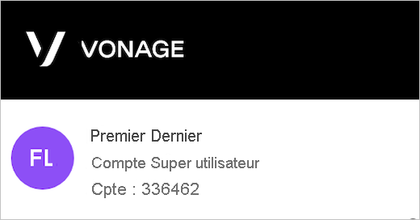
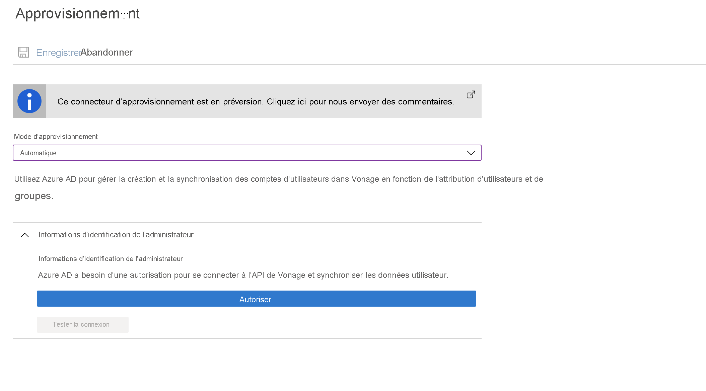

# Tutoriel : Configurer Vonage pour le provisionnement automatique d’utilisateurs

Ce tutoriel décrit les étapes à effectuer dans Vonage et Azure Active Directory (Azure AD) pour configurer le provisionnement automatique d’utilisateurs. Une fois celui-ci configuré, Azure AD provisionne et déprovisionne automatiquement les utilisateurs et les groupes dans [Vonage](https://www.vonage.com/) à l’aide du service Provisionnement Azure AD. Pour découvrir les informations importantes sur ce que fait ce service, comment il fonctionne et consulter le forum aux questions, reportez-vous à l’article [Automatiser l’attribution et l’annulation de l’attribution des utilisateurs dans les applications SaaS avec Azure Active Directory](../app-provisioning/user-provisioning.md). 

## Fonctionnalités prises en charge
> [!div class="checklist"]
> * Créer des utilisateurs dans Vonage.
> * Supprimer des utilisateurs dans Vonage quand ils ne nécessitent plus d’accès.
> * Maintenir la synchronisation des attributs utilisateur entre Azure AD et Vonage.
> * [Authentification unique](vonage-tutorial.md) auprès de Vonage (recommandé).

## Prérequis

Le scénario décrit dans ce tutoriel part du principe que vous disposez des prérequis suivants :

* [Un locataire Azure AD](../develop/quickstart-create-new-tenant.md). 
* Un compte d’utilisateur dans Azure AD avec l’[autorisation](../roles/permissions-reference.md) de configurer l’approvisionnement (par exemple, administrateur d’application, administrateur d’application Cloud, propriétaire d’application ou administrateur général). 
* Un locataire [Vonage](https://www.vonage.com/).
* Un compte d’utilisateur dans Vonage avec l’autorisation d’administrateur (super utilisateur du compte).

## Étape 1. Planifier votre déploiement de l’approvisionnement
1. En savoir plus sur le [fonctionnement du service d’approvisionnement](../app-provisioning/user-provisioning.md).
1. Déterminez qui sera dans l’[étendue pour l’approvisionnement](../app-provisioning/define-conditional-rules-for-provisioning-user-accounts.md).
1. Déterminez les données à [mapper entre Azure AD et Vonage](../app-provisioning/customize-application-attributes.md). 

## Étape 2. Configurer Vonage pour prendre en charge le provisionnement avec Azure AD

1. Connectez-vous au [Portail admin Vonage](http://admin.vonage.com) avec un utilisateur admin.

   

1. Naviguez jusqu’à **Compte > Paramètres d’authentification unique** dans le menu du côté gauche.

   

1. Sélectionnez l’onglet **Paramètres utilisateur**, basculez **Activer l’approvisionnement d’utilisateurs SCIM** sur Activé et cliquez sur **Enregistrer**.

## Étape 3. Ajouter Vonage à partir de la galerie d’applications Azure AD

Ajoutez Vonage à partir de la galerie d’applications Azure AD pour commencer à gérer l’approvisionnement sur Vonage. Si vous avez déjà configuré Vonage pour l’authentification unique, vous pouvez utiliser la même application. Toutefois, il est recommandé de créer une application distincte lors du test initial de l’intégration. En savoir plus sur l’ajout d’une application à partir de la galerie [ici](../manage-apps/add-application-portal.md).

## Étape 4. Définir qui sera dans l’étendue pour l’approvisionnement 

Le service d’approvisionnement Azure AD vous permet de définir l’étendue des utilisateurs approvisionnés en fonction de l’affectation à l’application et/ou en fonction des attributs de l’utilisateur/groupe. Si vous choisissez de définir l’étendue de l’approvisionnement pour votre application en fonction de l’attribution, vous pouvez utiliser les étapes de [suivantes](../manage-apps/assign-user-or-group-access-portal.md) pour affecter des utilisateurs et des groupes à l’application. Si vous choisissez de définir l’étendue de l’approvisionnement en fonction uniquement des attributs de l’utilisateur ou du groupe, vous pouvez utiliser un filtre d’étendue comme décrit [ici](../app-provisioning/define-conditional-rules-for-provisioning-user-accounts.md). 

* Lorsque vous attribuez des utilisateurs et des groupes à Vonage, vous devez sélectionner un rôle autre que **Accès par défaut**. Les utilisateurs disposant du rôle Accès par défaut sont exclus de l’approvisionnement et sont marqués comme non autorisés dans les journaux de configuration. Si le seul rôle disponible dans l’application est le rôle d’accès par défaut, vous pouvez [mettre à jour le manifeste de l’application](../develop/howto-add-app-roles-in-azure-ad-apps.md) pour ajouter des rôles supplémentaires. 

* Commencez progressivement. Testez avec un petit ensemble d’utilisateurs et de groupes avant d’effectuer un déploiement général. Lorsque l’étendue de l’approvisionnement est définie sur les utilisateurs et les groupes attribués, vous pouvez contrôler cela en affectant un ou deux utilisateurs ou groupes à l’application. Lorsque l’étendue est définie sur tous les utilisateurs et groupes, vous pouvez spécifier un [filtre d’étendue basé sur l’attribut](../app-provisioning/define-conditional-rules-for-provisioning-user-accounts.md). 

## Étape 5. Configurer le provisionnement automatique d’utilisateurs sur Vonage 

> [!NOTE]
>  Tout utilisateur ajouté à Vonage doit avoir un prénom, un nom et une adresse e-mail. Sinon, l’intégration échoue.

Cette section vous guide tout au long des étapes de configuration du service d’approvisionnement d’Azure AD pour créer, mettre à jour et désactiver des utilisateurs et/ou des groupes dans Vonage en fonction des attributions d’utilisateurs et/ou de groupes dans Azure AD.

### Pour configurer l’approvisionnement automatique d’utilisateurs pour Vonage dans Azure AD :

1. Connectez-vous au [portail Azure](https://portal.azure.com). Sélectionnez **Applications d’entreprise**, puis **Toutes les applications**.

    

1. Dans la liste des applications, sélectionnez **Vonage**.

    

1. Sélectionnez l’onglet **Approvisionnement**.

    

1. Définissez le **Mode d’approvisionnement** sur **Automatique**.

    

1. Avant l’étape suivante, assurez-vous que vous avez l’autorisation de super utilisateur du compte. Pour vérifier si l’utilisateur est un super utilisateur du compte, connectez-vous sur [le portail d’administration de Vonage](http://admin.vonage.com).
   Vous devriez pouvoir le voir en haut à gauche, comme dans l’image ci-dessous.

   

1. Dans la section **Informations de connexion de l’administrateur**, cliquez sur Autoriser, assurez-vous que vous entrez les informations d’identification de votre super utilisateur de compte. Si vous n’êtes pas invité à entrer les informations d’identification, assurez-vous que vous vous êtes connecté avec le super utilisateur de compte (vous pouvez le vérifier sur http://admin.vonage.com/ en haut à gauche, sous votre nom, vous devriez voir « Super utilisateur du compte »). Cliquez sur **Tester la connexion** pour vérifier qu’Azure AD peut se connecter à Vonage. Si la connexion échoue, vérifiez que votre compte Vonage dispose des autorisations d’administrateur et réessayez.

   
1. Dans le champ **E-mail de notification**, entrez l’adresse e-mail de la personne ou du groupe qui doit recevoir les notifications d’erreur de provisionnement et sélectionnez la case à cocher **Envoyer une notification par e-mail en cas de défaillance**.

    

1. Sélectionnez **Enregistrer**.

1. Dans la section **Mappages**, sélectionnez **Synchroniser les utilisateurs Azure Active Directory avec Vonage**.

1. Dans la section **Mappages des attributs**, passez en revue les attributs d’utilisateurs qui sont synchronisés entre Azure AD et Vonage. Les attributs sélectionnés en tant que propriétés de **Correspondance** sont utilisés pour faire correspondre les comptes d’utilisateur dans Vonage pour les opérations de mise à jour. Si vous choisissez de modifier l’[attribut cible correspondant](../app-provisioning/customize-application-attributes.md), vous devez vérifier que l’API Vonage prend en charge le filtrage des utilisateurs en fonction de cet attribut. Cliquez sur le bouton **Enregistrer** pour valider les modifications.

   |Attribut|Type|Pris en charge pour le filtrage|
   |---|---|---|
   |userName|String|&check;
   |active|Boolean|   
   |emails[type eq "work"].value|String|
   |name.givenName|String|
   |name.familyName|String|

1. Pour configurer des filtres d’étendue, reportez-vous aux instructions suivantes fournies dans [Approvisionnement d’applications basé sur les attributs avec filtres d’étendue](../app-provisioning/define-conditional-rules-for-provisioning-user-accounts.md).

1. Pour activer le service d’approvisionnement Azure AD pour Vonage, modifiez le paramètre **État d’approvisionnement** sur **Activé** dans la section **Paramètres**.

    

1. Définissez les utilisateurs et/ou groupes que vous aimeriez approvisionner sur Vonage en choisissant les valeurs souhaitées dans **Étendue** dans la section **Paramètres**.

    

1. Lorsque vous êtes prêt à effectuer l’approvisionnement, cliquez sur **Enregistrer**.

    

Cette opération démarre le cycle de synchronisation initiale de tous les utilisateurs et groupes définis dans **Étendue** dans la section **Paramètres**. Le cycle de synchronisation initiale prend plus de temps que les cycles de synchronisation suivants, qui se produisent toutes les 40 minutes environ tant que le service de provisionnement Azure AD est en cours d’exécution. 

## Étape 6. Surveiller votre déploiement
Une fois que vous avez configuré l’approvisionnement, utilisez les ressources suivantes pour surveiller votre déploiement :

* Utilisez les [journaux d’approvisionnement](../reports-monitoring/concept-provisioning-logs.md) pour déterminer quels utilisateurs ont été configurés avec succès ou échoué.
* Consultez la [barre de progression](../app-provisioning/application-provisioning-when-will-provisioning-finish-specific-user.md) pour afficher l’état du cycle d’approvisionnement et quand il se termine
* Si la configuration de l’approvisionnement semble se trouver dans un état non sain, l’application passe en quarantaine. Pour en savoir plus sur les états de quarantaine, cliquez [ici](../app-provisioning/application-provisioning-quarantine-status.md).  

## Plus de ressources

* [Gestion de l’approvisionnement de comptes d’utilisateur pour les applications d’entreprise](../app-provisioning/configure-automatic-user-provisioning-portal.md)
* [Qu’est-ce que l’accès aux applications et l’authentification unique avec Azure Active Directory ?](../manage-apps/what-is-single-sign-on.md)

## Étapes suivantes

* [Découvrez comment consulter les journaux d’activité et obtenir des rapports sur l’activité d’approvisionnement](../app-provisioning/check-status-user-account-provisioning.md)