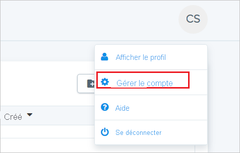
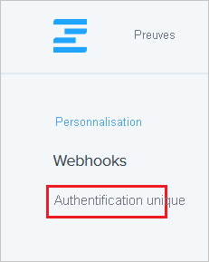
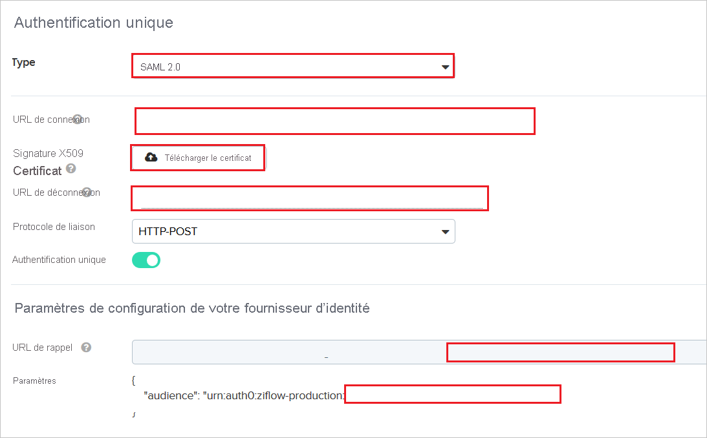
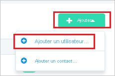
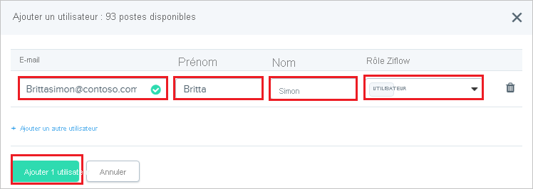

# Didacticiel : Intégration d’Azure Active Directory à Ziflow

Dans ce tutoriel, vous allez voir comment intégrer Ziflow à Azure Active Directory (Azure AD). Quand vous intégrez Ziflow à Azure AD, vous pouvez :

* Contrôler dans Azure AD qui a accès à Ziflow.
* Permettre à vos utilisateurs de se connecter automatiquement à Ziflow avec leurs comptes Azure AD.
* Gérer vos comptes à un emplacement central : le Portail Azure.

## Prérequis

Pour configurer l’intégration d’Azure AD dans Ziflow, vous avez besoin des éléments suivants :

* Un abonnement Azure AD Si vous n’avez pas d’environnement Azure AD, vous pouvez obtenir un [compte gratuit](https://azure.microsoft.com/free/).
* Un abonnement Ziflow pour lequel l’authentification unique est activée.

## Description du scénario

Dans ce didacticiel, vous configurez et testez l’authentification unique Azure AD dans un environnement de test.

* Ziflow prend en charge l’authentification unique initiée par le **fournisseur de services**

## Ajouter Ziflow depuis la galerie

Pour configurer l’intégration de Ziflow dans Azure AD, vous devez ajouter Ziflow depuis la galerie dans votre liste d’applications SaaS gérées.

1. Connectez-vous au portail Azure avec un compte professionnel ou scolaire ou avec un compte personnel Microsoft.
1. Dans le panneau de navigation gauche, sélectionnez le service **Azure Active Directory**.
1. Accédez à **Applications d’entreprise**, puis sélectionnez **Toutes les applications**.
1. Pour ajouter une nouvelle application, sélectionnez **Nouvelle application**.
1. Dans la section **Ajouter à partir de la galerie**, tapez **Ziflow** dans la zone de recherche.
1. Sélectionnez **Ziflow** dans le volet de résultats, puis ajoutez l’application. Patientez quelques secondes pendant que l’application est ajoutée à votre locataire.

## Configurer et tester l’authentification unique Azure AD pour Ziflow

Configurez et testez l’authentification unique Azure AD avec Ziflow pour une utilisatrice de test appelée **B.Simon**. Pour que l’authentification unique fonctionne, vous devez établir un lien entre un utilisateur Azure AD et l’utilisateur associé dans Ziflow.

Pour configurer et tester l’authentification SSO Azure AD avec Ziflow, effectuez les étapes suivantes :

1. **[Configurer l’authentification unique Azure AD](#configure-azure-ad-sso)** pour permettre à vos utilisateurs d’utiliser cette fonctionnalité.
    1. **[Créer un utilisateur de test Azure AD](#create-an-azure-ad-test-user)** pour tester l’authentification unique Azure AD avec B. Simon.
    1. **[Affecter l’utilisateur de test Azure AD](#assign-the-azure-ad-test-user)** pour permettre à B. Simon d’utiliser l’authentification unique Azure AD.
1. **[Configurer l’authentification unique Ziflow](#configure-ziflow-sso)** pour configurer les paramètres de l’authentification unique côté application.
    1. **[Créer un utilisateur de test Ziflow](#create-ziflow-test-user)** pour avoir dans Ziflow un équivalent de B.Simon lié à la représentation Azure AD associée.
1. **[Tester l’authentification unique](#test-sso)** pour vérifier si la configuration fonctionne.

## Configurer l’authentification unique Azure AD

Effectuez les étapes suivantes pour activer l’authentification unique Azure AD dans le Portail Azure.

1. Dans le Portail Azure, accédez à la page d’intégration de l’application **Ziflow**, recherchez la section **Gérer** et sélectionnez **Authentification unique**.
1. Dans la page **Sélectionner une méthode d’authentification unique**, sélectionnez **SAML**.
1. Dans la page **Configurer l’authentification unique avec SAML**, cliquez sur l’icône de crayon de **Configuration SAML de base** afin de modifier les paramètres.

   

4. Dans la section **Configuration SAML de base**, effectuez les étapes suivantes :

    a. Dans la zone de texte **Identificateur (ID d'entité)** , entre une valeur au format suivant : `urn:auth0:ziflow-production:<UNIQUE_ID>`

    b. Dans la zone de texte **URL de connexion**, saisissez une URL au format suivant : `https://ziflow-production.auth0.com/login/callback?connection=<UNIQUE_ID>`

    > [!NOTE]
    > Les valeurs ci-dessus ne sont pas réelles. Vous allez remplacer l'ID unique dans Identificateur et URL de connexion par la valeur réelle. La procédure est expliquée plus loin dans le didacticiel.

5. Dans la page **Configurer l’authentification unique avec SAML**, dans la section **Certificat de signature SAML**, cliquez sur **Télécharger** pour télécharger le **Certificat (Base64)** en fonction des options définies par rapport à vos besoins, puis enregistrez-le sur votre ordinateur.

    

6. Dans la section **Configurer Ziflow**, copiez les URL appropriées, selon vos besoins.

    

### Créer un utilisateur de test Azure AD 

Dans cette section, vous allez créer un utilisateur de test appelé B. Simon dans le portail Azure.

1. Dans le volet gauche du Portail Azure, sélectionnez **Azure Active Directory**, **Utilisateurs**, puis **Tous les utilisateurs**.
1. Sélectionnez **Nouvel utilisateur** dans la partie supérieure de l’écran.
1. Dans les propriétés **Utilisateur**, effectuez les étapes suivantes :
   1. Dans le champ **Nom**, entrez `B.Simon`.  
   1. Dans le champ **Nom de l’utilisateur**, entrez username@companydomain.extension. Par exemple : `B.Simon@contoso.com`.
   1. Cochez la case **Afficher le mot de passe**, puis notez la valeur affichée dans le champ **Mot de passe**.
   1. Cliquez sur **Créer**.

### Affecter l’utilisateur de test Azure AD

Dans cette section, vous allez autoriser B.Simon à utiliser l’authentification unique Azure en lui accordant l’accès à Ziflow.

1. Dans le portail Azure, sélectionnez **Applications d’entreprise**, puis **Toutes les applications**.
1. Dans la liste des applications, sélectionnez **Ziflow**.
1. Dans la page de vue d’ensemble de l’application, recherchez la section **Gérer** et sélectionnez **Utilisateurs et groupes**.
1. Sélectionnez **Ajouter un utilisateur**, puis **Utilisateurs et groupes** dans la boîte de dialogue **Ajouter une attribution**.
1. Dans la boîte de dialogue **Utilisateurs et groupes**, sélectionnez **B. Simon** dans la liste Utilisateurs, puis cliquez sur le bouton **Sélectionner** au bas de l’écran.
1. Si vous attendez qu’un rôle soit attribué aux utilisateurs, vous pouvez le sélectionner dans la liste déroulante **Sélectionner un rôle** . Si aucun rôle n’a été configuré pour cette application, vous voyez le rôle « Accès par défaut » sélectionné.
1. Dans la boîte de dialogue **Ajouter une attribution**, cliquez sur le bouton **Attribuer**.

## Configurer l’authentification unique Ziflow

1. Ouvrez une nouvelle fenêtre dans le navigateur web, puis connectez-vous à Ziflow en tant qu'administrateur de la sécurité.

2. Dans l’angle supérieur droit, cliquez sur Avatar, puis cliquez sur **Gérer le compte**.

    

3. Dans le coin supérieur gauche, cliquez sur **Authentification unique**.

    

4. Sur la page **Authentification unique**, effectuez les opérations suivantes :

    

    a. Sélectionnez **Type** dans **SAML2.0**.

    b. Dans la zone de texte **URL de connexion**, collez la valeur de l'**URL de connexion** que vous avez copiée à partir du portail Azure.

    c. Téléchargez le certificat codé en base 64 que vous avez téléchargé à partir du portail Azure, dans le **Certificat de signature X509**.

    d. Dans la zone de texte **URL de déconnexion**, collez la valeur de l'**URL de déconnexion** que vous avez copiée à partir du portail Azure.

    e. Dans la section **Paramètres de configuration de votre fournisseur d'identificateur**, copiez l'ID unique en surbrillance et ajoutez-le à l'identificateur et à l'URL de connexion dans la section **Configuration SAML de base** du portail Azure.

### Créer un utilisateur de test Ziflow

Pour se connecter à Ziflow, les utilisateurs d'Azure AD doivent être approvisionnés dans Ziflow. Dans Ziflow, l’approvisionnement est une tâche manuelle.

Pour approvisionner un compte d’utilisateur, procédez comme suit :

1. Connectez-vous à Ziflow en tant qu'administrateur de la sécurité.

2. Accédez à **Personnes** en haut.

    

3. Cliquez sur **Ajouter**, puis sur **Continuer**.

    

4. Dans la section **Add a User (Ajouter un utilisateur)** , procédez comme suit :

    

    a. Dans la zone de texte **E-mail**, entrez l’adresse e-mail de l’utilisateur, comme brittasimon@contoso.com.

    b. Dans la zone de texte **Prénom**, saisissez le prénom de l’utilisateur, par exemple Britta.

    c. Dans la zone de texte **Nom**, saisissez le nom de famille de l’utilisateur, par exemple Simon.

    d. Sélectionnez votre rôle Ziflow.

    e. Cliquez sur **Add 1 user (Ajouter un utilisateur)** .

    > [!NOTE]
    > Le titulaire du compte Azure Active Directory reçoit un e-mail contenant un lien à suivre pour confirmer son compte et l’activer.

## Tester l’authentification unique (SSO) 

Dans cette section, vous allez tester votre configuration de l’authentification unique Azure AD avec les options suivantes. 

* Cliquez sur **Tester cette application** dans le portail Azure. Vous êtes alors redirigé vers l’URL de connexion à Ziflow, d’où vous pouvez lancer le flux de connexion. 

* Accédez directement à l’URL de connexion Ziflow pour lancer le processus de connexion.

* Vous pouvez utiliser Mes applications de Microsoft. Le fait de cliquer sur la vignette Ziflow dans Mes applications vous redirige vers l’URL de connexion à Ziflow. Pour plus d’informations sur Mes applications, consultez [Présentation de Mes applications](../user-help/my-apps-portal-end-user-access.md).

## Étapes suivantes

Une fois que vous avez configuré Ziflow, vous pouvez appliquer le contrôle de session, qui protège contre l’exfiltration et l’infiltration des données sensibles de votre organisation en temps réel. Le contrôle de session est étendu à partir de l’accès conditionnel. [Découvrez comment appliquer un contrôle de session avec Microsoft Cloud App Security](/cloud-app-security/proxy-deployment-aad).
