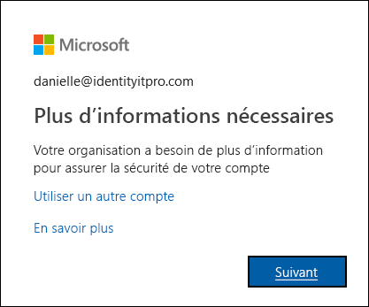

# Qu’est-ce que la page Vérification supplémentaire ?

Votre organisation effectue des étapes supplémentaires pour s’assurer que vous êtes bien celui que vous prétendez être quand vous vous connectez. Cette vérification de sécurité supplémentaire est également connue sous le nom de vérification à deux facteurs. Il s’agit d’une combinaison de votre nom d’utilisateur, de votre mot de passe, et d’un appareil mobile ou d’un téléphone. Si vous voulez seulement désactiver la vérification à deux facteurs pour un compte Microsoft de type alain@outlook.com, utilisez les instructions de [Activation ou désactivation de la vérification à deux facteurs pour votre compte Microsoft](https://support.microsoft.com/help/4028586/microsoft-account-turning-two-step-verification-on-or-off).

La vérification à deux facteurs est plus sécurisée qu’un simple mot de passe, car elle s’appuie sur deux formes d’authentification :

- Quelque chose que vous connaissez, comme votre mot de passe.
- Quelque chose que vous avez, comme un téléphone ou un autre appareil que vous avez avec vous.

La vérification à deux facteurs peut aider à empêcher les pirates malveillants de se faire passer pour vous. Même s’ils ont votre mot de passe, il est probable qu’ils n’aient pas votre appareil.

>[!Important]
>Si vous êtes administrateur et que vous recherchez des informations sur l’activation de la vérification à deux facteurs pour vos employés ou d’autres utilisateurs, consultez la [documentation sur l’authentification Azure Active Directory](../authentication/index.yml). Cet article s’adresse aux utilisateurs qui essaient d’utiliser la vérification à deux facteurs avec un compte professionnel ou scolaire (par exemple, alain@contoso.com).

## Qui décide si vous utilisez cette fonctionnalité ?

La personne qui décide si vous utilisez la vérification à deux facteurs varie selon le type de compte que vous avez :

- **Un compte professionnel ou scolaire.** Si vous utilisez un compte professionnel ou scolaire (par exemple alain@contoso.com), c’est à votre organisation de décider si vous devez utiliser la vérification à deux facteurs, ainsi que les méthodes de vérification spécifiques. Comme votre organisation a décidé que vous devez utiliser cette fonctionnalité, vous n’avez aucun moyen de la désactiver individuellement.

- **Compte Microsoft personnel.** Vous pouvez choisir de configurer la vérification à deux facteurs pour vos comptes Microsoft personnels (par exemple, alain@outlook.com). Vous pouvez l’activer ou la désactiver quand vous voulez, à l’aide des instructions simples de [Activation ou désactivation de la vérification à deux facteurs pour votre compte Microsoft](https://support.microsoft.com/help/4028586/microsoft-account-turning-two-step-verification-on-or-off).

    >[!Note]
    >Si vous rencontrez des problèmes avec la vérification à deux facteurs et l’un de vos comptes Microsoft personnels, d’autres suggestions sont présentées dans [Comment utiliser la vérification en deux étapes avec votre compte Microsoft](https://support.microsoft.com/help/12408/microsoft-account-how-to-use-two-step-verification).

## Ouvrir la page Vérification de sécurité supplémentaire

Une fois que votre organisation a activé et configuré la vérification à deux facteurs, vous être invité à chaque connexion à fournir plus d’informations pour vous aider à protéger votre compte.

### Pour accéder à la page Vérification de sécurité supplémentaire

1. Sélectionnez **Suivant** dans l’invite **Plus d’informations requises**.

    La page **Vérification de sécurité supplémentaire** s’affiche.

2. Dans la page **Vérification de sécurité supplémentaire**, sélectionnez la méthode de vérification à deux facteurs à utiliser pour vérifier que vous êtes bien qui vous prétendez être quand vous vous connectez à votre compte professionnel ou scolaire. Vous pouvez sélectionner :

    | Méthode de contact | Description |
    | --- | --- |
    | Application mobile | <ul><li>**Recevoir des notifications pour la vérification.** Cette option envoie une notification à l’application d’authentification sur votre smartphone ou tablette. Examinez la notification et, si elle est légitime, sélectionnez **Authentifier** dans l’application. Votre entreprise ou établissement scolaire peut vous demander d’entrer un code confidentiel avant de vous authentifier.</li><li>**Utiliser le code de vérification.** Dans ce mode, l’application génère un code de vérification qui se met à jour toutes les 30 secondes. Entrez le code de vérification le plus récent dans l’écran de connexion. L’application Microsoft Authenticator est disponible pour [Android](https://go.microsoft.com/fwlink/?linkid=866594) et [iOS](https://go.microsoft.com/fwlink/?linkid=866594).</li></ul> |
    | Téléphone d’authentification | <ul><li>L’option **Appel téléphonique** passe un appel vocal automatisé au numéro de téléphone indiqué. Répondez à l’appel et appuyez sur la touche # du clavier du téléphone pour vous authentifier.</li><li>L’option **SMS** envoie un SMS contenant un code de vérification. Selon l’invite contenue dans le SMS, répondez au SMS ou entrez le code de vérification fourni dans l’interface de connexion.</li></ul> |
    | Téléphone de bureau | Passe un appel vocal automatisé au numéro de téléphone indiqué. Répondez à l’appel et appuyez sur la touche # du clavier du téléphone pour vous authentifier. |

## Étapes suivantes

Une fois que vous avez sélectionnez la méthode de vérification à deux facteurs dans la page **Vérification de sécurité supplémentaire**, vous devez la configurer :

- [Configurer votre appareil mobile comme méthode de vérification](multi-factor-authentication-setup-phone-number.md)

- [Configurer votre téléphone de bureau comme méthode de vérification](multi-factor-authentication-setup-office-phone.md)

- [Configurer l’application Microsoft Authenticator comme méthode de vérification](multi-factor-authentication-setup-auth-app.md)

## Ressources associées

- [Se connecter à l’aide de la vérification en deux étapes](multi-factor-authentication-end-user-signin.md)

- [Obtenir de l’aide pour la vérification à deux facteurs](multi-factor-authentication-end-user-troubleshoot.md)