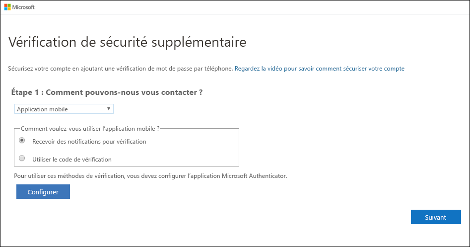
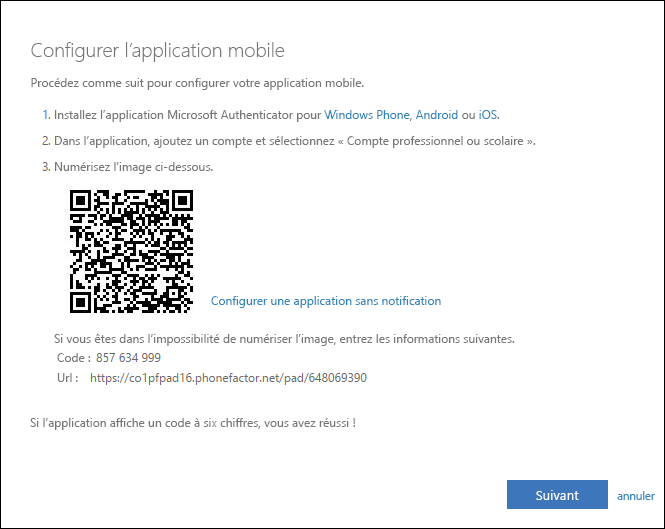
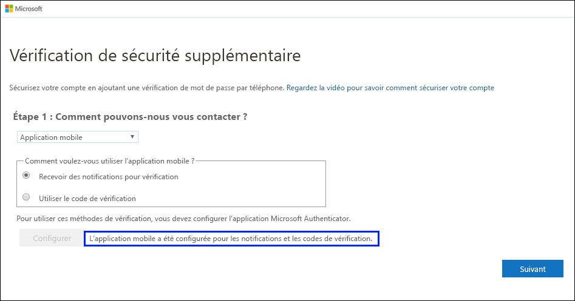
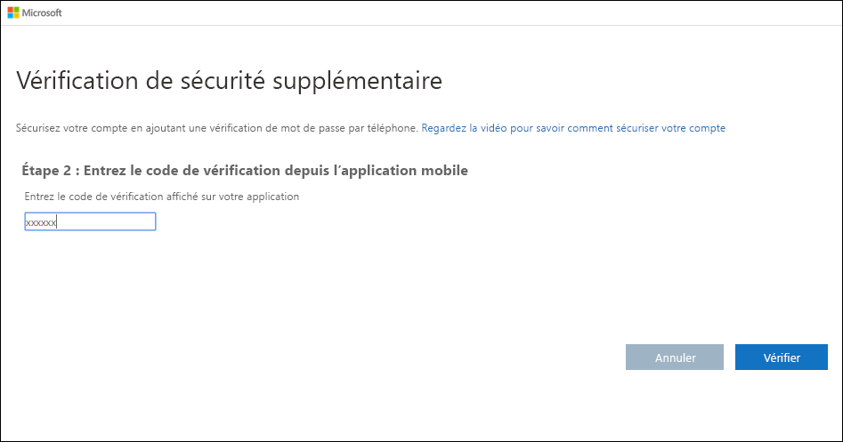

# Configurer une application Authenticator comme méthode de vérification à deux facteurs

Vous pouvez configurer une application Authenticator pour envoyer une notification à votre appareil mobile ou vous envoyer un code de vérification comme méthode de vérification de sécurité. Vous n’êtes pas obligé d’utiliser l’application Microsoft Authenticator et vous pouvez choisir une autre application au cours du processus de configuration. Cet article, cependant, utilise l’application Microsoft Authenticator.

>[!Important]
>Avant de pouvoir ajouter votre compte, vous devez télécharger et installer l’application Microsoft Authenticator. Si ce n’est pas déjà fait, suivez la procédure décrite dans l’article [Télécharger et installer l’application](user-help-auth-app-download-install.md).

>[!Note]
> Si l’option d’application mobile est grisée, il est possible que votre organisation ne vous autorise pas à utiliser une application d’authentification à des fins de vérification. Dans ce cas, vous devez choisir une autre méthode ou contacter votre administrateur pour obtenir de l’aide.

## Configurer l’application Microsoft Authenticator pour envoyer des notifications

1. Dans la page **Vérification de sécurité supplémentaire**, sélectionnez **Application mobile** dans la zone **Étape 1 : Comment devons-nous vous contacter**.

2. Sélectionnez **Recevoir des notifications pour la vérification** à partir de la zone **Comment souhaitez-vous utiliser l’application mobile ?** , puis sélectionnez **Configurer**.

    

    La page **Configurer l’application mobile** s’affiche.

    

3. Ouvrez l’application Microsoft Authenticator, sélectionnez **Ajouter un compte** grâce à l’icône **Personnaliser et contrôler** dans l’angle supérieur droit, puis sélectionnez **Compte professionnel ou scolaire**.

    >[!Note]
    >S’il s’agit de la première fois que vous configurez l’application Microsoft Authenticator, vous pouvez recevoir une invite vous demandant si vous souhaitez autoriser l’application à accéder à votre appareil photo (iOS) ou à prendre des photos et à enregistrer des vidéos (Android). Vous devez sélectionner **Autoriser** pour que l’application Authenticator puisse accéder à votre appareil photo pour prendre une photo du code QR à l’étape suivante. Si vous n’autorisez pas l’accès à l’appareil photo, vous pouvez toujours installer l’application Authenticator, mais vous devrez ajouter les informations de code manuellement. Pour plus d’informations sur l’ajout manuel du code, consultez [Ajouter manuellement un compte à l’application](user-help-auth-app-add-account-manual.md).

4. Utilisez l’appareil photo de votre appareil pour scanner le code QR à partir de l’écran **Configurer l’application mobile** de votre ordinateur, puis sélectionnez **Suivant**.

5. Revenez à votre ordinateur et à la page **Vérification de sécurité supplémentaire**, vérifiez que vous recevez le message indiquant que votre configuration a réussi, puis sélectionnez **Suivant**.

    

    L’application Authenticator envoie une notification test à votre appareil mobile.

6. Sur votre appareil mobile, sélectionnez **Approuver**.

7. Sur votre ordinateur, ajoutez le numéro de téléphone de votre appareil mobile à la zone **Étape 3 : Si vous n’avez plus accès à l’application mobile**, puis sélectionnez **Suivant**.

    Nous vous suggérons vivement d’ajouter le numéro de téléphone de votre appareil mobile pour faire office de sauvegarde si vous ne parvenez pas à accéder à l’application mobile ou à l’utiliser pour une raison quelconque.

8. Dans la zone **Étape 4 : Continuez à utiliser vos applications existantes**, copiez le mot de passe d’application fourni et collez-le à un endroit sûr.

    

    >[!Note]
    >Pour plus d’informations sur l’utilisation du mot de passe d’application avec vos anciennes applications, consultez [Gérer les mots de passe d’application](multi-factor-authentication-end-user-app-passwords.md). Vous devez uniquement utiliser les mots de passe d’application si vous continuez à utiliser des applications plus anciennes qui ne prennent pas en charge la vérification à deux facteurs.

9. Sélectionnez **Terminé**.

## Configurer l’application Microsoft Authenticator pour utiliser des codes de vérification

1. Dans la page **Vérification de sécurité supplémentaire**, sélectionnez **Application mobile** dans la zone **Étape 1 : Comment devons-nous vous contacter**.

2. Sélectionnez **Utiliser le code de vérification** à partir de la zone**Comment souhaitez-vous utiliser l’application mobile ?** , puis sélectionnez **Configurer**.

    

    La page **Configurer l’application mobile** s’affiche.

    

3. Ouvrez l’application Microsoft Authenticator, sélectionnez **Ajouter un compte** grâce à l’icône **Personnaliser et contrôler** dans l’angle supérieur droit, puis sélectionnez **Compte professionnel ou scolaire**.

    >[!Note]
    >S’il s’agit de la première fois que vous configurez l’application Microsoft Authenticator, vous pouvez recevoir une invite vous demandant si vous souhaitez autoriser l’application à accéder à votre appareil photo (iOS) ou à prendre des photos et à enregistrer des vidéos (Android). Vous devez sélectionner **Autoriser** pour que l’application Authenticator puisse accéder à votre appareil photo pour prendre une photo du code QR à l’étape suivante. Si vous n’autorisez pas l’accès à l’appareil photo, vous pouvez toujours installer l’application Authenticator, mais vous devrez ajouter les informations de code manuellement. Pour plus d’informations sur l’ajout manuel du code, consultez [Ajouter manuellement un compte à l’application](user-help-auth-app-add-account-manual.md).

4. Utilisez l’appareil photo de votre appareil pour scanner le code QR à partir de l’écran **Configurer l’application mobile** de votre ordinateur, puis sélectionnez **Suivant**.

5. Revenez à votre ordinateur et à la page **Vérification de sécurité supplémentaire**, vérifiez que vous recevez le message indiquant que votre configuration a réussi, puis sélectionnez **Suivant**.

    

    L’application Authenticator demande un code de vérification en tant que test.

6. À partir de l’application Microsoft Authenticator, faites défiler jusqu’à votre compte professionnel ou scolaire, copiez et collez le code à 6 chiffres de l’application dans la zone **Étape 2 : Entrer le code de vérification à partir de l’application mobile** sur votre ordinateur, puis sélectionnez **Vérifier**.

    

7. Sur votre ordinateur, ajoutez le numéro de téléphone de votre appareil mobile à la zone **Étape 3 : Si vous n’avez plus accès à l’application mobile**, puis sélectionnez **Suivant**.

    Nous vous suggérons vivement d’ajouter le numéro de téléphone de votre appareil mobile pour faire office de sauvegarde si vous ne parvenez pas à accéder à l’application mobile ou à l’utiliser pour une raison quelconque.

8. Dans la zone **Étape 4 : Continuez à utiliser vos applications existantes**, copiez le mot de passe d’application fourni et collez-le à un endroit sûr.

    

    >[!Note]
    >Pour plus d’informations sur l’utilisation du mot de passe d’application avec vos anciennes applications, consultez [Gérer les mots de passe d’application](multi-factor-authentication-end-user-app-passwords.md). Vous devez uniquement utiliser les mots de passe d’application si vous continuez à utiliser des applications plus anciennes qui ne prennent pas en charge la vérification à deux facteurs.

9. Sélectionnez **Terminé**.

## Étapes suivantes

Une fois que vous avez configuré votre méthode de vérification à deux facteurs, vous pouvez ajouter des méthodes supplémentaires, gérer vos paramètres et mots de passe d’application, vous connecter ou obtenir de l’aide pour certains problèmes courants liés à la vérification à deux facteurs.

- [Gérer les paramètres de la vérification à deux facteurs](multi-factor-authentication-end-user-manage-settings.md)

- [Manage app passwords](multi-factor-authentication-end-user-app-passwords.md) (Gérer les mots de passe d’application)

- [Se connecter à l’aide de la vérification en deux étapes](multi-factor-authentication-end-user-signin.md)

- [Obtenir de l’aide pour la vérification à deux facteurs](multi-factor-authentication-end-user-troubleshoot.md)
