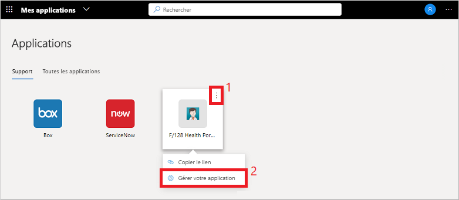
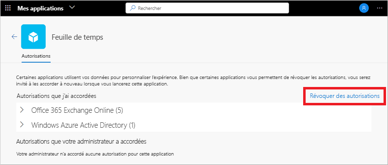

# Modifier ou révoquer des autorisations d’application dans le portail Mes applications

Quand vous utilisez des applications de l’organisation dans le portail **Mes applications**, vous accordez des autorisations et enregistrez des informations de compte fréquemment. Pour sécuriser vos données, vous souhaiterez peut-être examiner et révoquer des autorisations ou effacer les informations d’identification de compte enregistrées. La suppression des autorisations ou comptes peut perturber certaines fonctionnalités de l’application. Si vous avez des problèmes après avoir supprimé des autorisations ou des comptes, contactez le support technique de votre organisation pour obtenir une assistance supplémentaire.

[!INCLUDE [preview-notice](../../../includes/active-directory-end-user-my-apps-and-workspaces.md)]

>[!Important]
>Ce contenu est destiné aux utilisateurs. Si vous êtes administrateur, vous trouverez des informations sur la configuration et la gestion de vos applications cloud dans la [documentation sur la gestion des applications](https://docs.microsoft.com/azure/active-directory/manage-apps/access-panel-workspaces).

## Gérer les autorisations d’une application

Pour afficher les autorisations accordées par vous ou par votre administrateur, sélectionnez **...** quand vous pointez sur une application dans le portail **Mes applications**, puis sélectionnez **Gérer votre application** :

La partie supérieure de la fenêtre Autorisations affiche ce à quoi vous avez consenti personnellement. Des exemples d’autorisations d’applications incluent la possibilité d’accéder à votre calendrier, vos contacts ou votre appareil photo.

Vous pouvez révoquer les autorisations auxquelles vous avez consenti en sélectionnant **Révoquer les autorisations**, mais la suppression d’une autorisation peut perturber certaines des fonctionnalités des applications. Si vous avez des problèmes après avoir supprimé des autorisations ou des comptes, contactez le support technique de votre organisation pour obtenir une assistance supplémentaire.

La partie inférieure de la fenêtre Autorisations indique ce que votre administrateur a consenti en votre nom. Cette section ne s’affiche pas s’il n’y a pas d’autorisations accordées par l’administrateur. Vous ne pouvez pas révoquer ces autorisations, car l’administrateur a donné son consentement, et elles sont souvent requises pour la stratégie de votre organisation.

## Étapes suivantes

Une fois que vous avez géré les autorisations d’application et les comptes enregistrés dans le portail **Mes applications**, vous pouvez :

- Organiser vos applications dans les différentes catégories créées et fournies par votre organisation. Pour plus d’informations, consultez [Accéder aux collections sur le portail Mes applications et les utiliser](my-applications-portal-workspaces.md).

## Articles connexes

- [Mettre à jour vos informations de profil et de compte](my-account-portal-overview.md). Instructions sur la façon de mettre à jour vos informations personnelles qui s’affichent dans la page **Mon profil** du portail.

- [Gérer vos organisations](my-account-portal-organizations-page.md). Instructions sur la façon d’afficher et de gérer les informations relatives à votre organisation dans la page **Organisations** du portail **Mon profil**.

- [Gérer vos appareils connectés](my-account-portal-devices-page.md). Instructions pour gérer les appareils auxquels vous êtes connecté à l’aide de votre compte professionnel ou scolaire à partir de la page **Appareils** du portail **Mon profil**.
