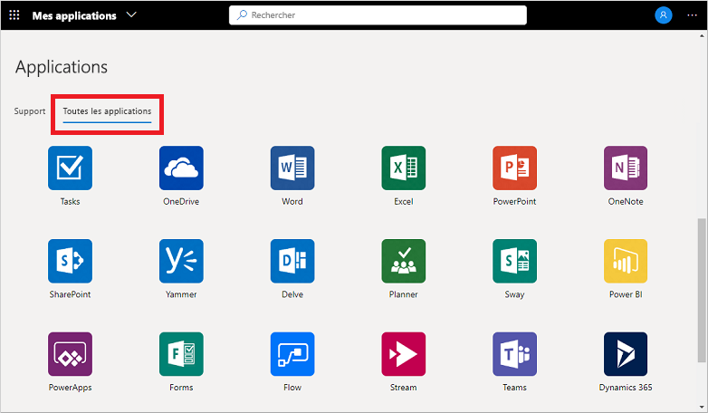

# Utiliser des collections dans le portail Mes applications

Les collections sont les différentes vues d’application que vous pouvez voir sur le portail **Mes applications**. Les applications peuvent être regroupées en collections par département ou rôle d’utilisateur, par exemple. Si vous ne voyez pas de collection ou de catégorie disponible, cela signifie que votre administrateur n’en a pas encore configuré ou partagé avec vous. Contactez le support technique de votre organisation pour obtenir une assistance supplémentaire ou des autorisations pour voir les collections partagées.

[!INCLUDE [preview-notice](../../../includes/active-directory-end-user-my-apps-and-workspaces.md)]

>[!Important]
>Ce contenu est destiné aux utilisateurs de **Mes applications**. Si vous êtes administrateur, vous trouverez des informations sur la configuration et la gestion de vos applications cloud dans la [documentation sur la gestion des applications](../manage-apps/access-panel-collections.md).

## Accéder aux applications en utilisant des collections

La liste des collections du portail **Mes applications** affiche par défaut un espace **Toutes les applications**, avec toutes les applications auxquelles vous avez accès :

Toutes les autres collections que vous voyez dans cette liste ont été créées par votre administrateur et partagées avec vous. Vous pouvez choisir une de ces collections pour voir un ensemble plus délimité d’applications, comme le *Support* dans l’exemple suivant :

Quand vous sélectionnez et affichez une collection, vous voyez uniquement les applications par défaut auxquelles vous avez accès.

## Étapes suivantes

Après avoir organisé vos applications dans les différentes catégories du portail **Mes applications**, vous pouvez :

- Réviser, mettre à jour ou révoquer les autorisations accordées aux applications. Pour plus d’informations, consultez [Modifier ou révoquer des autorisations d’application dans le portail Mes applications](my-applications-portal-permissions-saved-accounts.md).

## Articles connexes

- [Mettre à jour vos informations de profil et de compte](my-account-portal-overview.md). Instructions sur la façon de mettre à jour vos informations personnelles qui s’affichent dans la page **Mon profil** du portail.

- [Gérer vos organisations](my-account-portal-organizations-page.md). Instructions sur la façon d’afficher et de gérer les informations relatives à votre organisation dans la page **Organisations** du portail **Mon profil**.

- [Gérer vos appareils connectés](my-account-portal-devices-page.md). Instructions pour gérer les appareils auxquels vous êtes connecté à l’aide de votre compte professionnel ou scolaire à partir de la page **Appareils** du portail **Mon profil**.