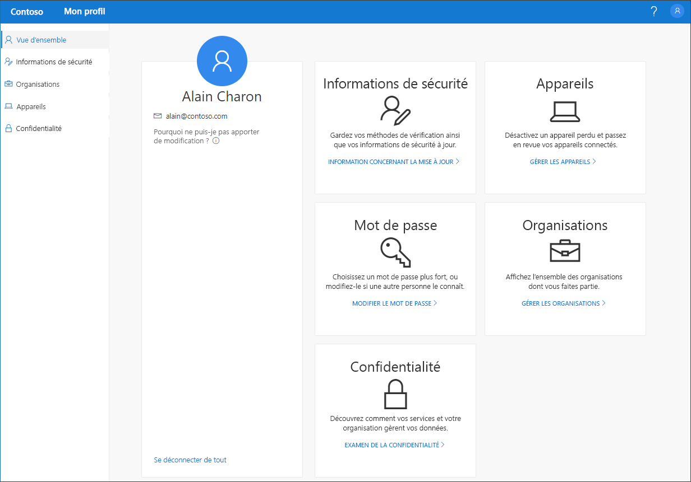

# Vue d’ensemble du portail Mon profil (préversion)

[!INCLUDE [preview-notice](../../../includes/active-directory-end-user-preview-notice-myprofile.md)]

Le portail **Mon profil** (préversion) vous aide à gérer votre compte professionnel ou scolaire en configurant et en gérant vos informations de sécurité, en gérant vos organisations et vos appareils connectés, ainsi qu’en affichant l’utilisation de vos données par votre organisation.

>[!Important]
>Ce contenu est destiné aux utilisateurs. Si vous êtes un administrateur, vous trouverez plus d’informations sur la méthode à suivre pour configurer et gérer votre environnement Azure Active Directory (Azure AD) dans le [documentation relative à Azure Active Directory](https://docs.microsoft.com/azure/active-directory).

## Accéder au portail Mon profil

Vous pouvez accéder au portail **Mon profil** (https://myprofile.microsoft.com) à partir de la version actuelle de l’un des navigateurs suivants :

- Chrome
- Microsoft Edge
- Safari
- Firefox
- Internet Explorer 11

## Articles sur le portail Mon profil

Pour obtenir des informations détaillées et des instructions sur les opérations qu’il est possible d’effectuer à partir du portail **Mon profil**, consultez les articles suivants :

|Article |Description |
|------|------------|
| [Ajouter vos informations de sécurité](user-help-security-info-overview.md) | Plusieurs articles contenant des instructions sur la façon de configurer l’application Microsoft Authenticator, la messagerie texte ou les appels téléphoniques comme méthode de vérification. Inclut également des articles sur l’ajout d’une adresse e-mail ou de questions de sécurité prédéfinies pour que vous puissiez réinitialiser votre mot de passe oublié, si nécessaire.|
| [Afficher ou quitter vos organisations connectées](myprofile-portal-organizations-page.md) | Instructions sur la façon d’afficher ou de quitter des organisations connectées à votre compte professionnel ou scolaire.|
| [Afficher ou désactiver vos appareils connectés](myprofile-portal-devices-page.md) | Instructions sur la façon d’afficher ou de désactiver des appareils que vous avez connectés à votre compte professionnel ou scolaire.|
| [Afficher vos informations de confidentialité](myprofile-portal-privacy-page.md) | Instructions sur la façon d’afficher les services en ligne qui sont connectés à votre compte professionnel ou scolaire, ainsi que la déclaration des conditions d’utilisation de votre organisation.|
