# Configurer vos informations de sécurité (préversion) à partir d’une invite de connexion

Vous pouvez suivre ces étapes si vous êtes invité à définir des informations de sécurité immédiatement après vous être connecté à votre compte professionnel ou scolaire.

Cette invite apparaît uniquement si vous n’avez pas configuré les informations de sécurité demandées par votre organisation. Si vous avez déjà configuré vos informations de sécurité et que vous souhaitez les changer, suivez les étapes décrites dans les différents articles de procédure fondés sur une méthode. Pour plus d’informations, consultez la [vue d’ensemble décrivant comment ajouter ou mettre à jour vos informations de sécurité](security-info-add-update-methods-overview.md).

[!INCLUDE [preview-notice](../../../includes/active-directory-end-user-preview-notice-security-info.md)]

## Vérification de la sécurité ou authentification avec réinitialisation du mot de passe

Les méthodes relatives aux informations de sécurité sont utilisées pour la vérification de la sécurité à deux facteurs et la réinitialisation du mot de passe. Toutefois, ces techniques d’authentification ne prennent pas en charge toutes les méthodes.

| Méthode | Utilisé pour |
| ------ | -------- |
| Application Authenticator | Vérification à deux facteurs et réinitialisation de mot de passe. |
| SMS | Vérification à deux facteurs et réinitialisation de mot de passe. |
| Appels téléphoniques | Vérification à deux facteurs et réinitialisation de mot de passe. |
| Clé de sécurité | Vérification à deux facteurs et réinitialisation de mot de passe. |
| Compte e-mail | Authentification par réinitialisation de mot de passe uniquement. Vous devez choisir une autre méthode pour la vérification à deux facteurs. |
| Questions de sécurité | Authentification par réinitialisation de mot de passe uniquement. Vous devez choisir une autre méthode pour la vérification à deux facteurs. |

## Se connecter à votre compte professionnel ou scolaire

Une fois connecté à votre compte professionnel ou scolaire, vous êtes invité à fournir plus d’informations avant de pouvoir accéder à votre compte.

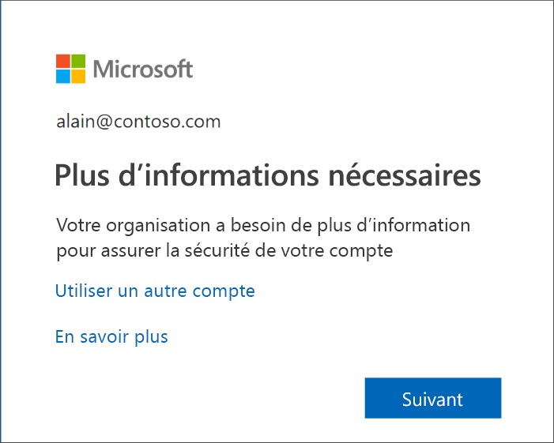

## Configurer des informations de sécurité à l’aide de l’Assistant

Suivez ces étapes pour configurer les informations de sécurité de votre compte professionnel ou scolaire à partir de l’invite.

>[!Important]
>Il s’agit uniquement d’un exemple du processus. En fonction des besoins de votre organisation, votre administrateur peut avoir défini différentes méthodes de vérification que vous devrez configurer au cours de ce processus. Cet exemple fait appel à deux méthodes : l’application Microsoft Authenticator et un numéro de téléphone mobile pour les appels ou SMS de vérification.

1. Quand vous sélectionnez **Suivant** à partir de l’invite, l’Assistant **Protéger votre compte** apparaît et vous montre la première méthode que votre administrateur et votre organisation vous demandent de configurer. Cet exemple utilise l’application Microsoft Authenticator.

   > [!Note]
   > Si vous souhaitez utiliser une autre application d’authentification que Microsoft Authenticator, sélectionnez le lien **Je souhaite utiliser une autre application d’authentification**.
   >
   > Si votre organisation vous permet de choisir une autre méthode en plus de l’application d’authentification, vous pouvez sélectionner le lien **Je veux configurer une autre méthode**.

    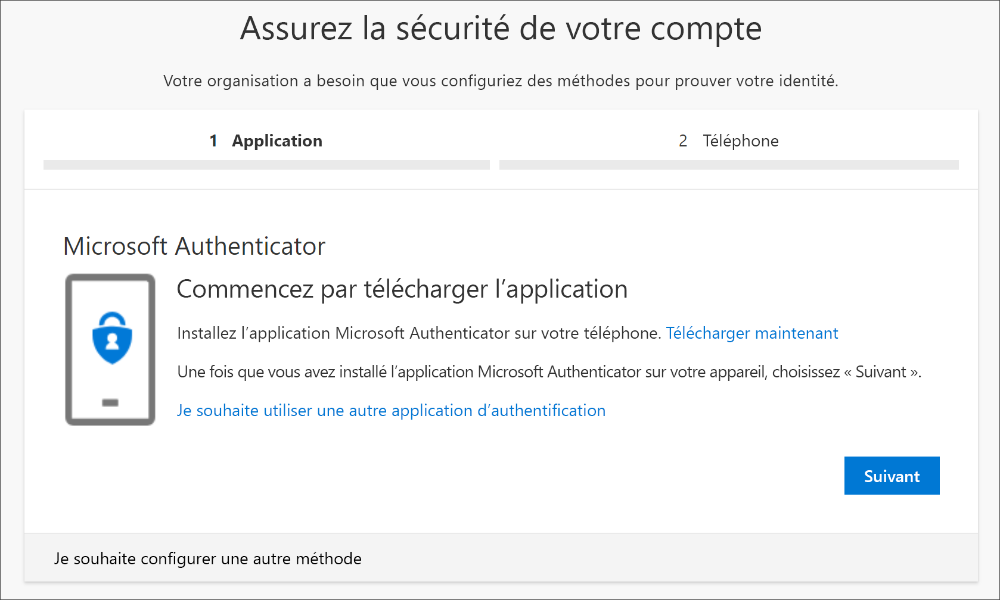

2. Sélectionnez **Télécharger maintenant** pour télécharger et installer l’application Microsoft Authenticator sur votre appareil mobile, puis sélectionnez **Suivant**. Pour plus d’informations sur le téléchargement et l’installation de l’application, consultez [Télécharger et installer l’application Microsoft Authenticator](user-help-auth-app-download-install.md).

    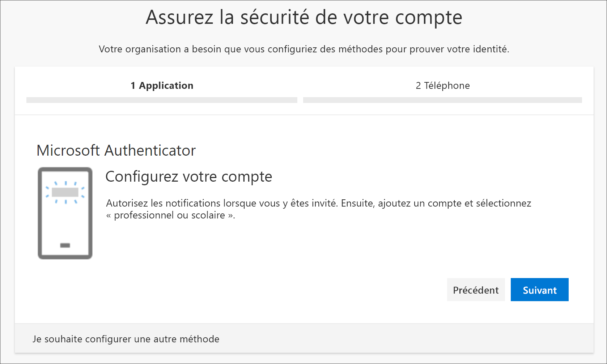

3. Gardez la page **Configurer votre compte** ouverte pendant que vous configurez l’application Microsoft Authenticator sur votre appareil mobile.

4. Ouvrez l’application Microsoft Authenticator, choisissez d’autoriser les notifications (si vous y êtes invité), sélectionnez **Ajouter un compte** grâce à l’icône **Personnaliser et contrôler** dans l’angle supérieur droit, puis sélectionnez **Compte professionnel ou scolaire**.

    >[!Note]
    >S’il s’agit de la première fois que vous configurez l’application Microsoft Authenticator, vous pouvez recevoir une invite vous demandant si vous souhaitez autoriser l’application à accéder à votre appareil photo (iOS) ou à prendre des photos et à enregistrer des vidéos (Android). Vous devez sélectionner **Autoriser** pour que l’application Authenticator puisse accéder à votre appareil photo pour prendre une photo du code QR à l’étape suivante. Si vous n’autorisez pas l’accès à l’appareil photo, vous pouvez toujours installer l’application Authenticator, mais vous devrez ajouter les informations de code manuellement. Pour plus d’informations sur l’ajout manuel du code, consultez [Ajouter manuellement un compte à l’application](user-help-auth-app-add-account-manual.md).

5. Revenez à la page **Configurer votre compte** sur votre ordinateur, puis sélectionnez **Suivant**.

    La page **Scanner le code QR** s’affiche.

    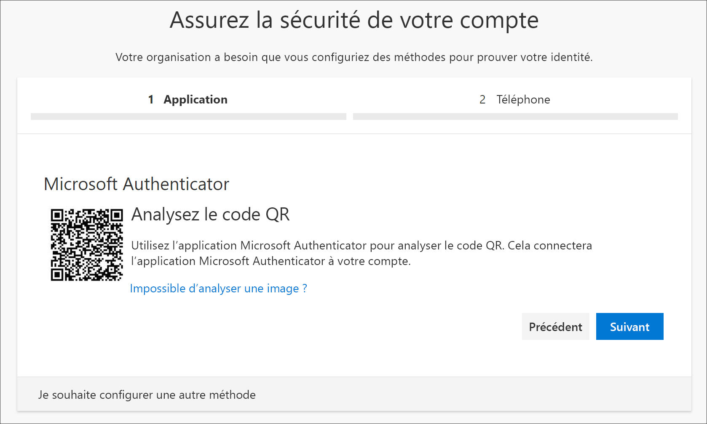

6. Scannez le code fourni à l’aide du lecteur de code QR d’application de Microsoft Authenticator qui apparaît sur votre appareil mobile après la création de votre compte professionnel ou scolaire à l’étape 5.

    L’application d’authentification doit ajouter votre compte professionnel ou scolaire sans exiger d’informations supplémentaires de votre part. Toutefois, si le lecteur de code QR ne parvient pas à lire le code, vous pouvez sélectionner le lien **Impossible de scanner l’image QR** et entrer manuellement le code et l’URL dans l’application Microsoft Authenticator. Pour plus d’informations sur l’ajout manuel d’un code, consultez [Ajouter manuellement un compte à l’application](user-help-auth-app-add-account-manual.md).

7. Sélectionnez **Suivant** dans la page **Scanner le code QR** sur votre ordinateur.

    Une notification est envoyée à l’application Microsoft Authenticator sur votre appareil mobile pour tester votre compte.

    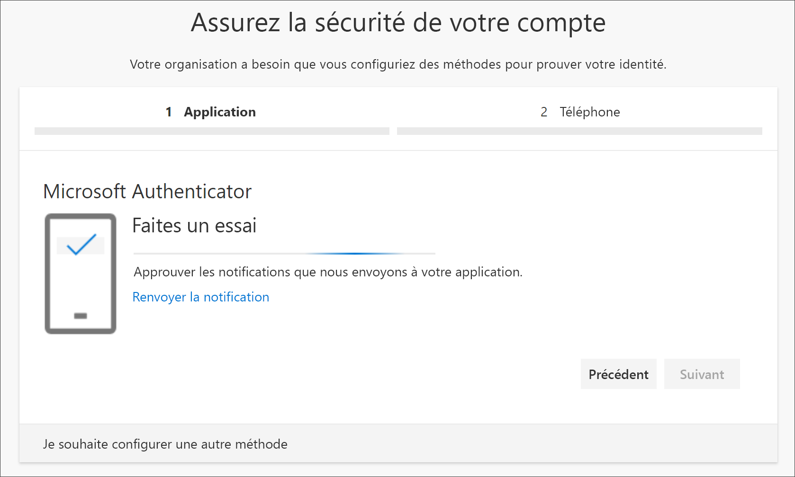

8. Approuvez la notification dans l’application Microsoft Authenticator, puis sélectionnez **Suivant**.

    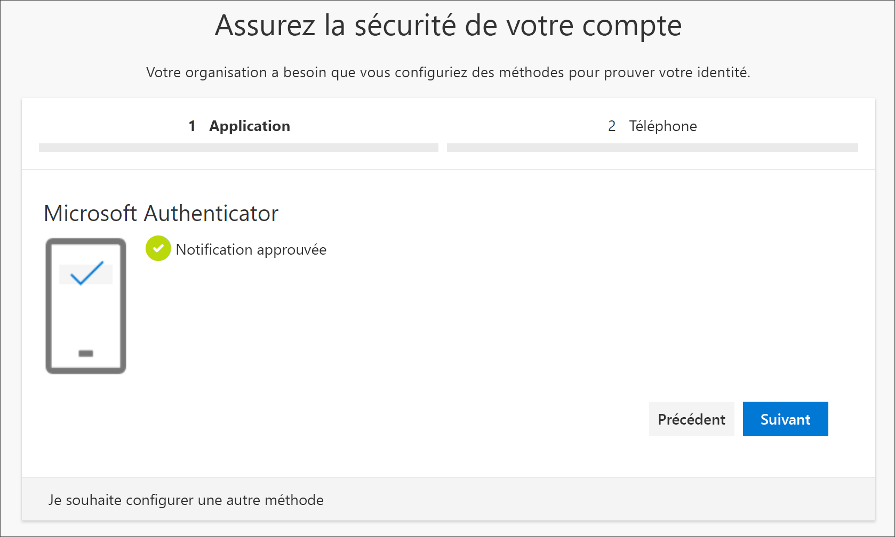

    Vos informations de sécurité sont mises à jour pour utiliser l’application Microsoft Authenticator par défaut et vérifier votre identité quand vous utilisez la vérification en deux étapes ou la réinitialisation de mot de passe.

9. Dans la page de configuration **Téléphone**, indiquez si vous voulez recevoir un SMS ou un appel téléphonique, puis sélectionnez **Suivant**. Dans cet exemple, nous utilisons des SMS. Vous devez donc indiquer le numéro de téléphone d’un appareil qui accepte les SMS.

    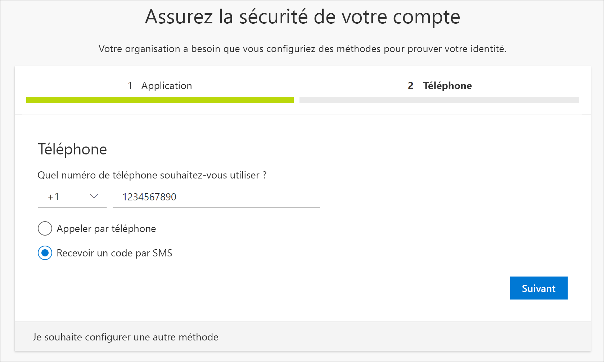

    Un SMS est envoyé à votre numéro de téléphone. Si vous préférez recevoir un appel téléphonique, le processus est le même. Par contre, vous recevrez un appel téléphonique avec des instructions au lieu d’un SMS.

10. Entrez le code fourni par le SMS envoyé à votre appareil mobile, puis sélectionnez **Suivant**.

    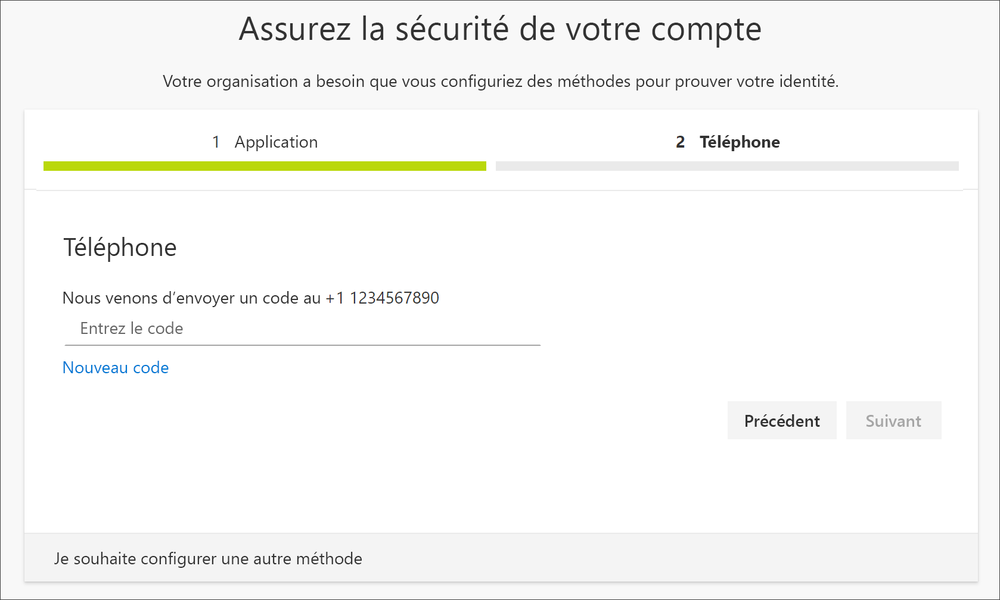

11. Passez en revue la notification de réussite, puis sélectionnez **Terminé**.

    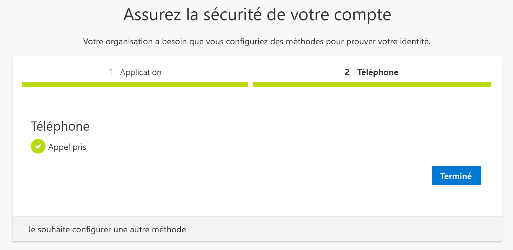

    Vos informations de sécurité sont mises à jour pour utiliser les SMS comme méthode de secours afin de vérifier votre identité quand vous utilisez la vérification en deux étapes ou la réinitialisation de mot de passe.

12. Passez en revue la page **Réussite** pour vérifier que vous avez correctement configuré l’application Microsoft Authenticator et une méthode (SMS ou appel téléphonique) pour vos informations de sécurité, puis sélectionnez **Terminé** .

    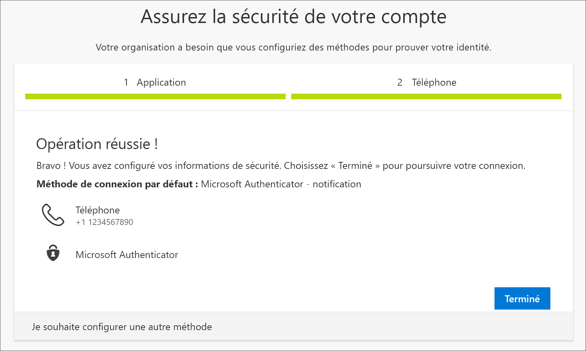

    >[!Note]
    >Si votre organisation vous impose d’utiliser des mots de passe d’application, cet Assistant peut présenter une section supplémentaire vous permettant de les configurer. Si une troisième section intitulée **Mots de passe d’application** s’affiche, vous devez la renseigner pour pouvoir suivre l’Assistant. Pour consulter la procédure d’ajout de mot de passe d’application, reportez-vous à la section [Gérer les mots de passe d’application](#manage-your-app-passwords) de cet article.

### Gérer les mots de passe d’application

Certaines applications, telles qu’Outlook 2010, ne prennent pas en charge la vérification en deux étapes. Cela signifie que si vous utilisez la vérification en deux étapes dans votre organisation, l’application ne fonctionnera pas. Pour contourner ce problème, vous pouvez créer un mot de passe généré automatiquement, distinct de votre mot de passe normal, que vous devrez utiliser avec chaque application sans navigateur.

>[!Note]
>Si vous ne voyez pas cette option dans l’Assistant, cela signifie que votre administrateur ne l’a pas configurée. Dans ce cas, si vous savez que vous devez utiliser des mots de passe d’application, vous pouvez procéder comme indiqué dans [Définir les mots de passe d’application à partir de la page Informations de sécurité (préversion)](security-info-app-passwords.md).

Lorsque vous utilisez des mots de passe d’application, gardez à l’esprit les points suivants :

- Les mots de passe d’application sont générés automatiquement et ne sont entrés qu’une seule fois par application.

- Un utilisateur peut posséder jusqu’à 40 mots de passe. Si vous essayez de créer un mot de passe supplémentaire au-delà de cette limite, vous serez invité à supprimer un mot de passe existant avant d’être autorisé à en créer un autre.

- Utilisez un mot de passe d’application par appareil, et non par application. Par exemple, créez un mot de passe unique pour toutes les applications de votre ordinateur portable, et un autre mot de passe unique pour toutes les applications de votre Bureau.

#### Pour ajouter des mots de passe d’application dans l’Assistant de connexion

1. Après avoir terminé les sections précédentes de l’Assistant, sélectionnez **Suivant** et renseignez la section **Mot de passe d’application**.

2. Tapez le nom de l’application qui nécessite le mot de passe, par exemple `Outlook 2010`, puis sélectionnez **Suivant**.

    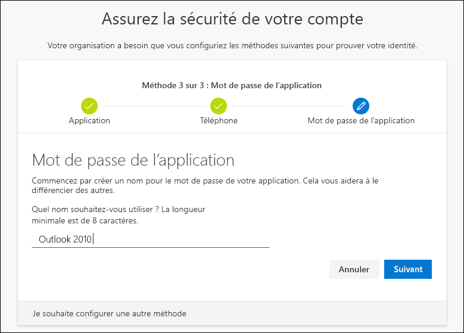

3. Copiez le code de mot de passe à partir de l’écran **Mot de passe d’application** et collez-le dans la zone **Mot de passe** de l’application (dans cet exemple, Outlook 2010).

    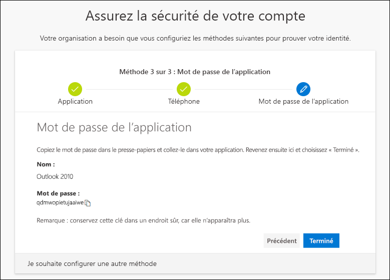

4. Une fois que vous avez copié le mot de passe et que vous l’avez collé dans l’application, revenez à cet Assistant pour vous assurer que toutes les informations de la méthode de connexion sont exactes, puis sélectionnez **Terminé**.

    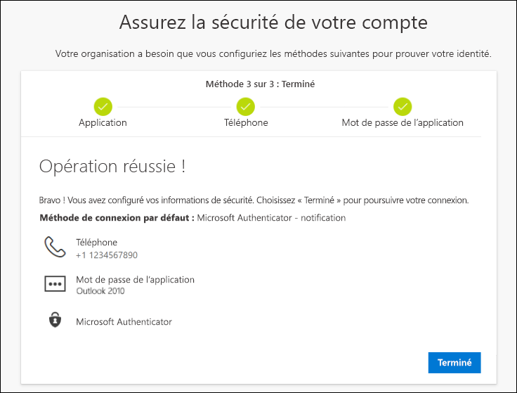

## Étapes suivantes

- Pour changer, supprimer ou mettre à jour les méthodes relatives aux informations de sécurité par défaut, consultez :

    - [Configurer les informations de sécurité pour utiliser une application d’authentification](security-info-setup-auth-app.md).

    - [Configurer les informations de sécurité pour utiliser des SMS](security-info-setup-text-msg.md).

    - [Configurer les informations de sécurité pour utiliser un appel téléphonique](security-info-setup-phone-number.md).

    - [Configurer les informations de sécurité pour utiliser un e-mail](security-info-setup-email.md).

    - [Configurer les informations de sécurité pour utiliser des questions de sécurité prédéfinies](security-info-setup-questions.md).

- Pour plus d’informations sur la façon de vous connecter à l’aide de votre méthode spécifiée, consultez ce [guide pratique](user-help-sign-in.md).

- Si vous avez perdu ou oublié votre mot de passe, réinitialisez-le à partir du [portail de réinitialisation de mot de passe](https://passwordreset.microsoftonline.com/), ou suivez les étapes de l’article [Réinitialiser votre mot de passe professionnel ou scolaire](active-directory-passwords-update-your-own-password.md).

- Obtenez des conseils de dépannage et de l’aide pour les problèmes de connexion en consultant l’article [Quand vous ne pouvez pas vous connecter à votre compte Microsoft](https://support.microsoft.com/help/12429/microsoft-account-sign-in-cant).
