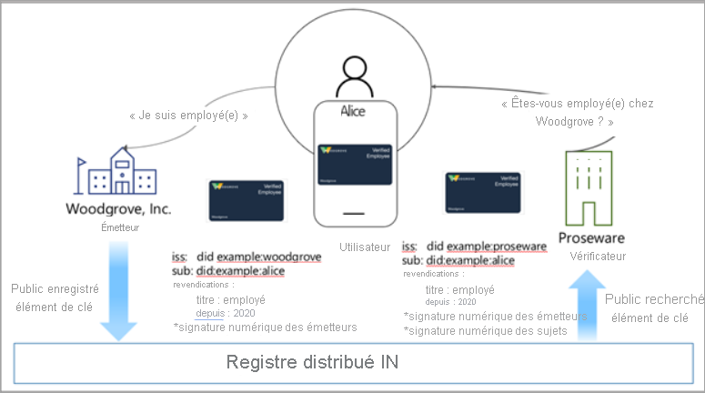
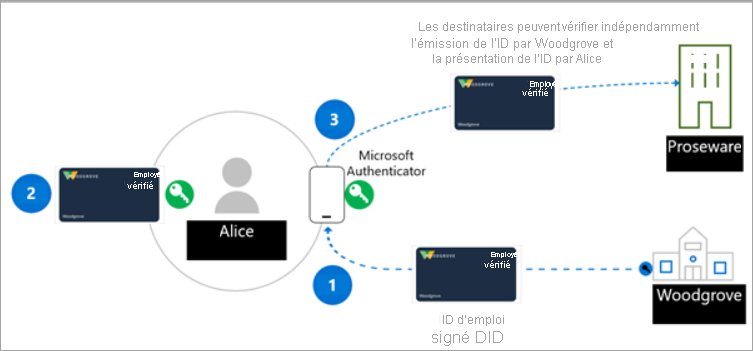

# <a name="introduction-to-azure-active-directory-verifiable-credentials-preview"></a>Présentation des justificatifs vérifiables Azure Active Directory (préversion)

> [!IMPORTANT]
> Les justificatifs vérifiables Azure Active Directory sont actuellement en préversion publique.
> Cette préversion est fournie sans contrat de niveau de service et n’est pas recommandée pour les charges de travail de production. Certaines fonctionnalités peuvent être limitées ou non prises en charge. Pour plus d’informations, consultez [Conditions d’Utilisation Supplémentaires relatives aux Évaluations Microsoft Azure](https://azure.microsoft.com/support/legal/preview-supplemental-terms/).

Les vies numériques et physiques sont de plus en plus liées aux applications, services et appareils que nous utilisons pour accéder à un ensemble complet d’expériences. Cette transformation numérique nous permet d’interagir avec des centaines de sociétés et des milliers utilisateurs de manière autrefois inimaginables.

Cela étant, les données d’identité sont souvent la cible de violations de la sécurité. Ces violations ont un impact sur chacun et affectent notre vie sociale, professionnelle et financière. Microsoft pense qu’il existe un meilleur moyen de faire. Chacun a le droit à une identité qu’il possède et contrôle, une identité qui stocke en toute sécurité les éléments de son identité numérique et préserve sa confidentialité. Ce manuel explique comment nous allons collaborer avec une communauté aussi diverse que variée pour créer une solution d’identité décentralisée, fiable, interopérable et normalisée pour les particuliers et les organisations.

## <a name="why-we-need-decentralized-identity"></a>Pourquoi l’identité décentralisée est-elle nécessaire ?

Aujourd’hui, nous utilisons notre identité numérique au travail, chez nous, et dans chaque application, service et appareil dont nous nous servons. Elle est constituée de tout ce que nous disons, faisons et expérimentons, de l’achat de billets pour un événement, à l’enregistrement dans un hôtel, en passant par la commande d’un déjeuner. Actuellement, notre identité et toutes nos interactions numériques sont détenues et contrôlées par d'autres parties, dont nous n’avons pas toute connaissance.

En règle générale, les utilisateurs donnent leur consentement à plusieurs applications et appareils. Une telle approche implique un degré élevé de vigilance de la part de l’utilisateur pour savoir qui a accès à quelles informations. Au niveau de l’entreprise, la collaboration avec les consommateurs et les partenaires requiert une orchestration poussée pour échanger des données en toute sécurité de manière à préserver la confidentialité et la sécurité de toutes les parties impliquées.

Nous pensons qu'un système d'identité décentralisée basé sur des normes peut ouvrir la voie à de nouvelles expériences permettant aux utilisateurs et aux organisations de mieux contrôler leurs données, et offrir un degré plus élevé de confiance et de sécurité pour les applications, les appareils et les fournisseurs de services.

## <a name="lead-with-open-standards"></a>Prospect avec normes ouvertes

Nous nous engageons à travailler en étroite collaboration avec les clients, les partenaires et la communauté pour ouvrir la voie à la prochaine génération d'expériences basées sur l'identité décentralisée, et nous sommes ravis de nous associer aux personnes et aux organisations qui y contribuent de manière incroyable. Pour permettre à l’écosystème d’identité décentralisée de se développer, les normes, composants techniques et codes livrables doivent être open source et accessibles à tous.

Microsoft collabore activement avec les membres de la DIF (Decentralized Identity Foundation), du W3C Credentials Community Group et de la communauté plus étendue en lien avec l’identité. Nous avons travaillé avec ces groupes pour identifier et développer des normes critiques, et les normes suivantes ont été implémentées dans nos services.

* [Identificateurs décentralisés W3C](https://www.w3.org/TR/did-core/)
* [Justificatifs vérifiables W3C](https://www.w3.org/TR/vc-data-model/)
* [DIF Sidetree](https://identity.foundation/sidetree/spec/)
* [DIF Well Known DID Configuration](https://identity.foundation/specs/did-configuration/)
* [DIF DID-SIOP](https://identity.foundation/did-siop/)
* [DIF Presentation Exchange](https://identity.foundation/presentation-exchange/)


## <a name="what-are-dids"></a>Que sont les DID ?

Avant de comprendre ce que sont les DID, il apparaît utile de les comparer aux systèmes d’identité actuels. Les adresses de messagerie et les ID de réseau social sont des alias conviviaux pour la collaboration, mais apparaissent désormais bien trop sollicités pour faire office de points de contrôle à des fins d’accès aux données dans de nombreux scénarios au-delà de la collaboration. Cela crée un problème potentiel, car des tiers externes peuvent à tout moment supprimer l’accès à ces ID.

Les identificateurs décentralisés (DID) sont différents. Les DID sont des identificateurs globaux uniques générés par l’utilisateur et associés à une racine dans des systèmes décentralisés comme ION. Ils possèdent des caractéristiques uniques, telles qu’une meilleure garantie d’immuabilité, de résistance à la censure et d'inviolabilité. Ces attributs sont essentiels pour tout système d'identification destiné à offrir indépendance et contrôle utilisateur. 

La solution de justificatifs vérifiables de Microsoft utilise des informations d’identification décentralisées (DID) pour signer par chiffrement et prouver qu’une partie de confiance (vérificateur) atteste d’informations témoignant du fait qu’elle est propriétaire de justificatifs vérifiables. Dès lors, il est recommandé de comprendre les bases des identificateurs décentralisés pour créer une solution de justificatifs vérifiables reposant sur l’offre Microsoft.
## <a name="what-are-verifiable-credentials"></a>Que sont les justificatifs vérifiables ?

 Nous utilisons des ID dans notre vie quotidienne. Nous avons des permis de conduire pour prouver que nous sommes capables de conduire une voiture. Les universités nous décernent des diplômes pour prouver que nous avons atteint un certain niveau d’étude. Nous utilisons des passeports pour prouver qui nous sommes lorsque nous franchissons des frontières. Le modèle de données décrit la manière dont nous pourrions gérer ces types de scénarios lorsque nous utilisons Internet, mais de façon sécurisée tout en respectant la confidentialité de l’utilisateur. Pour plus d’informations, consultez [Modèle de données des justificatifs vérifiables 1.0](https://www.w3.org/TR/vc-data-model/).

En résumé, les justificatifs vérifiables sont des objets de données constitués de revendications formulées par l’émetteur attestant des informations sur un sujet. Ces revendications sont identifiées par un schéma et incluent le DID, l’émetteur et le sujet. Le DID de l’émetteur créé une signature numérique en guise de preuve attestant de ces informations.


## <a name="how-does-decentralized-identity-work"></a>Comment fonctionne l’identité décentralisée ?

Nous avons besoin d’une nouvelle forme d’identité. Nous avons besoin d’une identité capable de réunir des technologies et des normes pour fournir des attributs d’identité clés tels que l’indépendance et la résistance à la censure. Ces fonctionnalités sont difficiles à obtenir à l’aide des systèmes existants.

Pour y parvenir, il nous faut nous appuyer sur une base technique composée de sept innovations clés. Les identificateurs détenus par l’utilisateur constituent l’une de ces innovations clés, un agent utilisateur pour gérer les clés associées à ces identificateurs et les magasins de données chiffrés et contrôlés par l’utilisateur.


**1. Identificateurs décentralisés (DID) W3C** : ID créés, détenus et contrôlés par les utilisateurs indépendamment de toute organisation ou de tout gouvernement. Les DID sont des identificateurs globaux uniques liés à des métadonnées DPKI (Decentralized Public Key Infrastructure) composés de documents JSON contenant des éléments de clé publique, des descripteurs d’authentification et des points de terminaison de service.

**2. Système décentralisé : ION (Identity Overlay Network)** est un réseau ouvert de couche 2, sans autorisation, basé sur le protocole Sidetree purement déterministe, qui ne requiert pas de jetons spécifiques, de validateurs approuvés ou d’autres mécanismes de consensus ; la progression linéaire de la chaîne temporelle de Bitcoin suffit à son fonctionnement. Nous disposons d’un [package npm open source](https://www.npmjs.com/package/@decentralized-identity/ion-tools) pour faciliter l’intégration du réseau ION à vos applications et services. Les bibliothèques incluent la création d’un nouveau DID, la génération de clés et l’ancrage dans la blockchain Bitcoin. 

**3. Agent utilisateur/Portefeuille DID : Application Microsoft Authenticator** Permet aux personnes réelles d’utiliser des identités décentralisées et des justificatifs vérifiables. Authenticator crée des DID, facilite les demandes d’émission et de présentation de justificatifs vérifiables, et gère la sauvegarde de la valeur initiale de la requête dans un fichier portefeuille chiffré.

**4. Microsoft Resolver** : API qui se connecte à notre nœud ION pour rechercher et résoudre les DID à l’aide de la méthode ```did:ion``` et renvoyer le DDO (DID Document Object). Le DDO comprend les métadonnées DPKI associées au DID telles que les clés publiques et les points de terminaison de service. 

**5. Service de justificatifs vérifiés Azure Active Directory** : API d’émission et de vérification et kit de développement logiciel (SDK) open source pour les [justificatifs vérifiables W3C](https://www.w3.org/TR/vc-data-model/) signés avec la méthode ```did:ion```. Ils permettent aux propriétaires d’identité de générer, présenter et vérifier les revendications. Ils constituent la base de confiance entre les utilisateurs des systèmes.

## <a name="a-sample-scenario"></a>Exemple de scénario

Le scénario que nous utilisons pour expliquer le fonctionnement des justificatifs vérifiables est le suivant :

- Woodgrove Inc., une société.
- Proseware, une société qui offre des remises aux employés de Woodgrove.
- Alice, une employée de Woodgrove Inc., souhaite obtenir une remise de la part de Proseware


Actuellement, Alice fournit un nom d’utilisateur et un mot de passe pour se connecter à l’environnement réseau de Woodgrove. Woodgrove déploie une solution de justificatifs vérifiables pour permettre à Alice de prouver plus facilement qu’elle est une employée de Woodgrove. Proseware utilise une solution de justificatifs vérifiables compatible avec la solution de justificatifs vérifiables de Woodgrove et accepte les justificatifs émis par Woodgrove en guise de preuve d’emploi.

L’émetteur des justificatifs, Woodgrove Inc., crée une clé publique et une clé privée. La clé publique est stockée sur ION. Lorsque la clé est ajoutée à l’infrastructure, l’entrée est enregistrée dans un registre décentralisé basé sur la blockchain. L’émetteur fournit à Alice la clé privée qui est stockée dans une application de portefeuille. Chaque fois qu’Alice utilise avec succès la clé privée, la transaction est consignée dans l’application de portefeuille.



## <a name="roles-in-a-verifiable-credential-solution"></a>Rôles au sein d’une solution de justificatifs vérifiables 

La solution de justificatifs vérifiables compte trois acteurs principaux. Dans le schéma suivant :

- **Étape 1** : l'**utilisateur** demande de justificatif vérifiable auprès d’un émetteur.
- **Étape 2** : l'**émetteur** du justificatif atteste du fait que la preuve fournie par l’utilisateur est exacte et crée un justificatif vérifiable signé à l’aide de son DID, et le DID de l’utilisateur est le sujet.
- **Étape 3** : l’utilisateur signe une présentation vérifiable à l’aide de son DID et l’envoie au **vérificateur**. Le vérificateur valide ensuite les justificatifs à l’aide de la mise en correspondance de la clé publique stockée dans l’infrastructure DPKI.

Dans ce scénario, les rôles sont les suivants :



**Émetteur** : l’émetteur est une organisation qui crée une solution d’émission demandant des informations à un utilisateur. Ces informations sont utilisées pour vérifier l’identité de l’utilisateur. Par exemple, Woodgrove Inc. dispose d’une solution d’émission qui lui permet de créer et de distribuer des justificatifs vérifiables à l’ensemble de ses employés. L’employé utilise l’application Authenticator pour se connecter avec son nom d’utilisateur et son mot de passe, qui transmet un jeton d’ID au service émetteur. Une fois que Woodgrove Inc. valide le jeton d’ID soumis, la solution d’émission crée un justificatif vérifiable comprenant les revendications relatives à l’employé et signé à l’aide du DID Woodgrove Inc. L’employé dispose maintenant d’un justificatif vérifiable signé par son employeur, ce qui inclut le DID de l’employé en tant que DID de sujet.  

**Utilisateur** : l’utilisateur est la personne ou l’entité qui demande un justificatif vérifiable. Par exemple, Alice est une nouvelle employée de Woodgrove Inc. à qui un justificatif vérifiable d’emploi a déjà été émis. Si Alice doit fournir une preuve d’emploi pour bénéficier d’une remise auprès de Proseware, elle peut accorder l’accès au justificatif vérifiable dans son application Authenticator en signant une présentation vérifiable qui prouve qu’elle est propriétaire du DID. Proseware peut alors s’assurer que le justificatif a été émis par Woodgrove Inc. et qu’Alice en est la propriétaire. 

**Vérificateur** : le vérificateur est une société ou une entité chargée de vérifier les revendications d’un ou plusieurs émetteurs de confiance. Par exemple, Proseware fait confiance à Woodgrove Inc. pour vérifier l’identité de ses employés et émettre des justificatifs vérifiables authentiques et valides. Si Alice tente de commander le matériel dont elle a besoin pour son travail, Proseware utilise des normes ouvertes telles que SIOP et Presentation Exchange pour demander à l’utilisateur des justificatifs attestant de son statut d’employé au sein de Woodgrove Inc. Par exemple, Proseware peut fournir à Alice un lien vers un site web avec un code QR qu’elle peut scanner à l’aide de l’appareil photo de son téléphone. Cela initie une demande de justificatif vérifiable spécifique. Authenticator procède ensuite à l’analyse et permet à Alice d’approuver la demande prouvant son statut d’employé à Proseware. Proseware peut utiliser le kit de développement logiciel (SDK) ou l’API du service des justificatifs vérifiables pour s’assurer de l’authenticité de la présentation vérifiable. En fonction des informations fournies par Alice, elle se voit accorder une remise. Si d’autres sociétés et organisations savent que Woodgrove Inc. émet des justificatifs vérifiables à ses employés, ils peuvent également créer une solution de vérification et utiliser les justificatifs vérifiables de Woodgrove Inc. pour proposer des offres spéciales réservées à ces mêmes employés de Woodgrove Inc.

## <a name="next-steps"></a>Étapes suivantes

Maintenant que vous en savez plus sur les DID et les justificatifs vérifiables, expérimentez-les en suivant notre article de prise en main ou l’un des articles expliquant plus en détail les concepts liés aux justificatifs vérifiables.

- [Prise en main des justificatifs vérifiables](get-started-verifiable-credentials.md)
- [Personnaliser vos justificatifs](credential-design.md)
- [FAQ sur les justificatifs vérifiables](verifiable-credentials-faq.md)