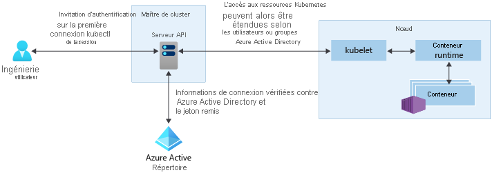

# Options d’accès et d’identité pour Azure Kubernetes Service (AKS)

Il existe plusieurs façons de s’authentifier auprès des clusters Kubernetes et de les sécuriser. Avec les contrôles d’accès en fonction du rôle (RBAC), vous pouvez accorder aux utilisateurs ou aux groupes l’accès aux seules ressources dont ils ont besoin. À l’aide d’Azure Kubernetes Service (AKS), vous pouvez améliorer la structure de sécurité et des autorisations en utilisant Azure Active Directory. Ces approches vous permettent de sécuriser vos charges de travail d’application et vos données client.

Cet article présente les principaux concepts vous permettant de vous authentifier et d’affecter des autorisations dans AKS :

- [Comptes de service Kubernetes](#kubernetes-service-accounts)
- [Intégration d’Azure Active Directory](#azure-active-directory-integration)
- [Contrôles d’accès en fonction du rôle (RBAC)](#role-based-access-controls-rbac)
- [Rôles et ClusterRoles](#roles-and-clusterroles)
- [RoleBindings et ClusterRoleBindings](#rolebindings-and-clusterrolebindings)

## Comptes de service Kubernetes

Un des principaux types d’utilisateur dans Kubernetes est le *compte de service*. Un compte de service existe dans l’API Kubernetes et est géré par cette API. Les informations d’identification des comptes de service sont stockées en tant que secrets Kubernetes, ce qui leur permet d’être utilisées par les pods autorisés à communiquer avec le serveur d’API. La plupart des requêtes d’API fournissent un jeton d’authentification pour un compte de service ou un compte d’utilisateur normal.

Ces comptes d’utilisateur autorisent un accès plus classique pour les développeurs et les administrateurs humains, ils se ne limitent pas seulement aux services et aux processus. Kubernetes ne fournit pas de solution de gestion des identités dans laquelle les comptes et les mots de passe d'utilisateurs standard sont stockés. Par contre, il est possible d’intégrer des solutions d’identité externes à Kubernetes. Pour les clusters AKS, cette solution d’identité intégrée est Azure Active Directory.

Pour plus d’informations sur les options d’identité dans Kubernetes, consultez [Authentification Kubernetes][kubernetes-authentication].

## Intégration d’Azure Active Directory

La sécurité des clusters AKS peut être améliorée avec l’intégration d’Azure Active Directory (AD). S’appuyant sur des décennies de gestion des identités d’entreprise, Azure AD est un service multilocataire, basé sur le cloud pour la gestion des identités et des annuaires, qui combine les principaux services d’annuaire, la gestion des accès aux applications et la protection des identités. Avec Azure AD, vous pouvez intégrer des identités locales dans les clusters AKS pour fournir une source unique de sécurité et de gestion des comptes.

Avec les clusters AKS intégrés Azure AD, vous pouvez accorder aux utilisateurs ou aux groupes l’accès aux ressources Kubernetes dans un espace de noms ou au sein du cluster. Pour obtenir un contexte de configuration `kubectl`, un utilisateur peut exécuter la commande [az aks get-credentials][az-aks-get-credentials]. Lorsqu’un utilisateur interagit ensuite avec le cluster AKS par le biais de `kubectl`, il est invité à se connecter avec ses informations d’identification Azure AD. Cette solution fournit une source unique pour les informations d’identification de mots de passe et de gestion des comptes utilisateur. L’utilisateur peut uniquement accéder aux ressources, tel que défini par l’administrateur du cluster.

L’authentification Azure AD dans les clusters AKS utilise OpenID Connect, une couche d’identité basée sur le protocole OAuth 2.0. OAuth 2.0 définit des mécanismes pour obtenir et utiliser des jetons d’accès en vue d’accéder aux ressources protégées, tandis qu’OpenID Connect implémente l’authentification en tant qu’extension sur le processus d’autorisation OAuth 2.0. Pour plus d’informations sur OpenID Connect, consultez la [documentation sur Open ID Connect][openid-connect]. Pour vérifier les jetons d’authentification obtenus à partir d’Azure AD via OpenID Connect, les clusters AKS utilisent l’authentification par jeton du Webhook Kubernetes. Pour plus d’informations, consultez la [documentation sur l’authentification par jeton de webhook][webhook-token-docs].

## Contrôles d’accès en fonction du rôle (RBAC)

Afin de fournir un filtrage granulaire des actions que les utilisateurs peuvent effectuer, Kubernetes recourt aux contrôles d’accès en fonction du rôle (RBAC). Ce mécanisme de contrôle vous permet d’affecter à des utilisateurs ou à des groupes d’utilisateurs, l’autorisation d’accomplir des opérations, telles que la création ou la modification de ressources, ou encore l’affichage de journaux d’activité à partir de charges de travail d’applications en cours d’exécution. La portée de ces autorisations peut être limitée à un seul espace de noms, ou accordée à l’ensemble du cluster AKS. Avec le contrôle RBAC de Kubernetes, vous créez des *rôles* pour définir des autorisations, puis affectez ces rôles aux utilisateurs avec les *liaisons de rôle*.

Pour plus d’informations, consultez [Utilisation de l’autorisation RBAC][kubernetes-rbac].

### Contrôles d’accès en fonction du rôle (RBAC) Azure
Le contrôle d’accès en fonction du rôle (RBAC) Azure est un mécanisme supplémentaire pour contrôler l’accès aux ressources. Le contrôle RBAC Kubernetes est conçu pour fonctionner sur les ressources de votre cluster AKS, tandis que la conception de RBAC Azure le destine aux ressources de votre abonnement Azure. Avec le contrôle RBAC Azure, vous créez une *définition de rôle* qui décrit les autorisations à appliquer. Cette définition de rôle est ensuite affectée à un utilisateur ou à un groupe sur une *étendue* particulière, qui peut être une ressource individuelle, un groupe de ressources ou l’abonnement.

Pour plus d’informations, consultez [Présentation de RBAC Azure][azure-rbac]

## Rôles et ClusterRoles

Avant d’attribuer des autorisations aux utilisateurs avec RBAC Kubernetes, vous devez tout d’abord définir ces autorisations en tant que *rôle*. Les rôles Kubernetes *accordent* des autorisations. Le concept d’autorisation *refusée* n’existe pas.

Les rôles sont utilisés pour accorder des autorisations dans un espace de noms. Si vous devez accorder des autorisations sur l’ensemble du cluster ou sur des ressources de cluster en dehors d’un espace de noms donné, vous pouvez utiliser *ClusterRoles* à la place.

Un ClusterRole fonctionne de la même façon pour accorder des autorisations aux ressources, mais il peut être appliqué aux ressources dans l’ensemble du cluster, et non dans un espace de noms spécifique.

## RoleBindings et ClusterRoleBindings

Une fois les rôles définis pour accorder des autorisations aux ressources, vous affectez ces autorisations RBAC Kubernetes au moyen d’un *RoleBinding*. Si votre cluster AKS s’intègre à Azure Active Directory, les liaisons représentent la façon dont les autorisations sont accordées à ces utilisateurs Azure AD pour effectuer des actions au sein du cluster.

Les liaisons de rôle servent à assigner des rôles pour un espace de noms donné. Cette approche vous permet de séparer logiquement un cluster AKS unique, avec des utilisateurs uniquement capable d’accéder aux ressources d’application dans leur espace de noms attribué. Si vous avez besoin de lier des rôles sur l’ensemble du cluster, ou sur des ressources de cluster en dehors d’un espace de noms donné, vous pouvez utiliser *ClusterRoleBindings* à la place.

Un ClusterRoleBinding fonctionne de la même façon pour lier des rôles aux utilisateurs, mais il peut être appliqué aux ressources sur l’ensemble du cluster, et non à un espace de noms spécifique. Ce moyen vous permet d’accorder aux administrateurs ou aux techniciens du support technique l’accès à toutes les ressources dans le cluster AKS.

## Étapes suivantes

Pour vous familiariser avec RBAC Azure AD et Kubernetes, consultez [Intégrer Azure Active Directory à AKS][aks-aad].

Pour plus d'informations sur les bonnes pratiques, consultez [Bonnes pratiques relatives à l'authentification et à l'autorisation dans AKS][operator-best-practices-identity].

Pour plus d’informations sur les concepts fondamentaux de Kubernetes et d’AKS, consultez les articles suivants :

- [Clusters et charges de travail Kubernetes/AKS][aks-concepts-clusters-workloads]
- [Sécurité Kubernetes/AKS][aks-concepts-security]
- [Réseaux virtuels Kubernetes/AKS][aks-concepts-network]
- [Stockage Kubernetes/AKS][aks-concepts-storage]
- [Mise à l’échelle Kubernetes/AKS][aks-concepts-scale]

<!-- LINKS - External -->
[kubernetes-authentication]: https://kubernetes.io/docs/reference/access-authn-authz/authentication
[webhook-token-docs]: https://kubernetes.io/docs/reference/access-authn-authz/authentication/#webhook-token-authentication
[kubernetes-rbac]: https://kubernetes.io/docs/reference/access-authn-authz/rbac/

<!-- LINKS - Internal -->
[openid-connect]: ../active-directory/develop/v2-protocols-oidc.md
[az-aks-get-credentials]: /cli/azure/aks#az-aks-get-credentials
[azure-rbac]: ../role-based-access-control/overview.md
[aks-aad]: azure-ad-integration-cli.md
[aks-concepts-clusters-workloads]: concepts-clusters-workloads.md
[aks-concepts-security]: concepts-security.md
[aks-concepts-scale]: concepts-scale.md
[aks-concepts-storage]: concepts-storage.md
[aks-concepts-network]: concepts-network.md
[operator-best-practices-identity]: operator-best-practices-identity.md
