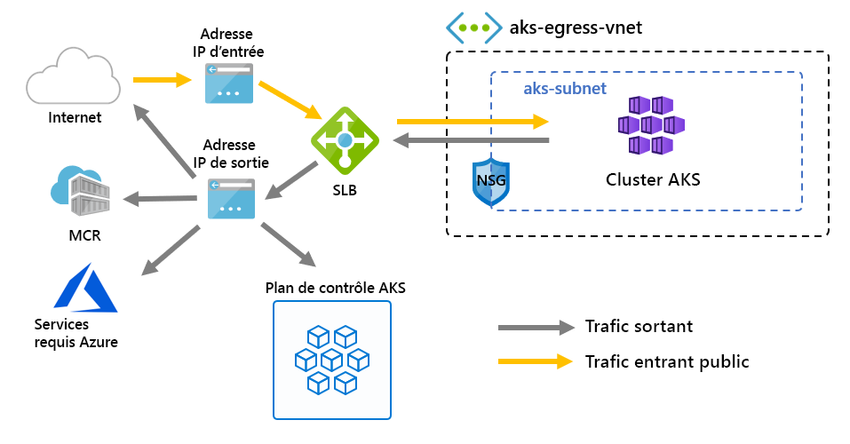

# <a name="customize-cluster-egress-with-a-user-defined-route-preview"></a>Personnaliser la sortie du cluster avec une route définie par l’utilisateur (préversion)

La sortie d’un cluster AKS peut être personnalisée pour l’adapter à des scénarios spécifiques. Par défaut, AKS provisionne un équilibreur de charge de référence SKU standard à configurer et utiliser pour la sortie. Cependant, la configuration par défaut peut ne pas répondre aux exigences de tous les scénarios si les adresses IP publiques ne sont pas autorisées ou si des tronçons supplémentaires sont nécessaires pour la sortie.

Cet article explique comment personnaliser une route de sortie d’un cluster pour prendre en charge des scénarios réseau personnalisés, comme ceux qui n’autorisent pas les adresses IP publiques et qui nécessitent que le cluster se trouve derrière une appliance virtuelle réseau ().

> [!IMPORTANT]
> Les fonctionnalités d’évaluation AKS sont en libre-service et sont proposées sur la base d’un abonnement. Les préversions sont fournies *en l’état* et *en fonction des disponibilités*. De plus, elles sont exclues du contrat de niveau de service (SLA) et de la garantie limitée. Les préversions AKS sont, *dans la mesure du possible*, partiellement couvertes par le service clientèle. Par conséquent, ces fonctionnalités ne sont pas destinées à une utilisation en production. Pour plus d’informations, consultez les articles de support suivants :
>
> * [Stratégies de support AKS](support-policies.md)
> * [FAQ du support Azure](faq.md)

## <a name="prerequisites"></a>Prérequis
* Azure CLI version 2.0.81 ou ultérieure
* Extension d’Azure CLI Preview version 0.4.28 ou ultérieure
* Version de l’API `2020-01-01` ou ultérieure

## <a name="install-the-latest-azure-cli-aks-preview-extension"></a>Installer la dernière extension Azure CLI AKS en préversion
Pour définir le type de sortie d’un cluster, vous devez disposer de l’extension Azure CLI AKS Preview version 0.4.18 ou ultérieure. Installez l’extension Azure CLI AKS Preview avec la commande az extension add, puis recherchez toutes les mises à jour disponibles avec la commande az extension update suivante :

```azure-cli
# Install the aks-preview extension
az extension add --name aks-preview

# Update the extension to make sure you have the latest version installed
az extension update --name aks-preview
```

## <a name="limitations"></a>Limites
* Pendant le période de préversion, `outboundType` peut être défini seulement lors de la création du cluster et ne peut pas être mis à jour après cela.
* Pendant la période de préversion, `outboundType` les clusters AKS doivent utiliser Azure CNI. Kubenet est configurable : son utilisation nécessite des associations manuelles de la table de routage vers le sous-réseau AKS.
* La définition de `outboundType` nécessite des clusters AKS avec un `vm-set-type` `VirtualMachineScaleSets` et une `load-balancer-sku` `Standard`.
* La définition de `outboundType` sur une valeur `UDR` nécessite une route définie par l’utilisateur avec une connectivité de sortie valide pour le cluster.
* La définition de `outboundType` sur la valeur `UDR` implique que l’adresse IP source en entrée routée vers l’équilibreur de charge puisse **ne pas correspondre** à l’adresse de destination en sortie de la sortie du cluster.

## <a name="overview-of-outbound-types-in-aks"></a>Vue d’ensemble des types de sortie dans AKS

Un cluster AKS peut être personnalisé avec un `outboundType` unique de type équilibreur de charge ou routage défini par l’utilisateur.

> [!IMPORTANT]
> Le type de sortie impacte seulement le trafic sortant de votre cluster. Pour plus d’informations, consultez [Configuration des contrôleurs d’entrée](ingress-basic.md).

### <a name="outbound-type-of-loadbalancer"></a>Type de sortie loadBalancer

Si `loadBalancer` est défini, AKS effectue automatiquement la configuration suivante. L’équilibreur de charge est utilisé pour la sortie via une adresse IP publique affectée à AKS. Un type de sortie `loadBalancer` prend en charge les services Kubernetes de type `loadBalancer`, qui attendent une sortie de l’équilibreur de charge créé par le fournisseur de ressources AKS.

La configuration suivante est effectuée par AKS.
   * Une adresse IP publique est provisionnée pour la sortie du cluster.
   * L’adresse IP publique est affectée à la ressource d’équilibreur de charge.
   * Les pools de back-ends pour l’équilibreur de charge sont configurés pour les nœuds d’agent dans le cluster.

Vous trouverez ci-dessous une topologie de réseau déployée dans des clusters AKS par défaut, qui utilise un `outboundType` `loadBalancer`.



### <a name="outbound-type-of-userdefinedrouting"></a>Type de sortie userDefinedRouting

> [!NOTE]
> L’utilisation d’un type de sortie est un scénario réseau avancé et nécessite une configuration réseau appropriée.

Si `userDefinedRouting` est défini, AKS ne configure pas automatiquement les chemins de sortie. Voici ce qui doit être fait par **l’utilisateur**.

Le cluster AKS doit être déployé dans un réseau virtuel existant dans lequel un sous-réseau est configuré. Lorsque vous utilisez une architecture Standard Load Balancer, vous devez établir une sortie explicite. Cela nécessite l’envoi de requêtes de sortie vers une appliance locale, telle qu’un pare-feu ou une passerelle. Vous pouvez également autoriser la sortie via une adresse IP publique attribuée à l’équilibreur de charge standard ou à un nœud donné.

Le fournisseur de ressources AKS déploie un équilibreur de charge standard. L’équilibreur de charge n’est configuré avec aucune règle et [n’entraîne pas de frais tant qu’une règle n’a pas été mise en place](https://azure.microsoft.com/pricing/details/load-balancer/). AKS ne provisionne **pas** automatiquement une adresse IP publique pour le front-end de l’équilibreur de charge standard. AKS ne configure **pas** automatiquement le pool de back-ends de l’équilibreur de charge.

## <a name="deploy-a-cluster-with-outbound-type-of-udr-and-azure-firewall"></a>Déployer un cluster avec le type de sortie UDR et le pare-feu Azure

Pour illustrer l’application d’un cluster avec un type de sortie avec une route définie par l’utilisateur, un cluster peut être configuré sur un réseau virtuel appairé à un pare-feu Azure.


* L’entrée est forcée à circuler à travers des filtres du pare-feu
   * Un sous-réseau isolé contient un équilibreur de charge interne pour le routage dans les nœuds d’agent
   * Les nœuds d’agent sont isolés dans un sous-réseau dédié
* Les demandes sortantes partent des nœuds d’agent vers l’adresse IP interne du pare-feu Azure en utilisant une route définie par l’utilisateur
   * Les demandes des nœuds d’agent AKS suivent une route définie par l’utilisateur qui a été mise en place sur le sous-réseau où le cluster AKS a été déployé.
   * Le pare-feu Azure sort du réseau virtuel depuis un front-end d’adresses IP publiques
   * L’accès au plan de contrôle AKS est protégé par un groupe de sécurité réseau, qui a activé l’adresse IP du front-end du pare-feu
   * L’accès à l’Internet public ou à d’autres services Azure circule vers et depuis l’adresse IP du front-end du pare-feu

### <a name="set-configuration-via-environment-variables"></a>Définir la configuration via des variables d’environnement

Définissez un ensemble de variables d’environnement à utiliser dans les créations de ressources.

```bash
PREFIX="contosofin"
RG="${PREFIX}-rg"
LOC="eastus"
NAME="${PREFIX}outboundudr"
AKS_NAME="${PREFIX}aks"
VNET_NAME="${PREFIX}vnet"
AKSSUBNET_NAME="${PREFIX}akssubnet"
SVCSUBNET_NAME="${PREFIX}svcsubnet"
# DO NOT CHANGE FWSUBNET_NAME - This is currently a requirement for Azure Firewall.
FWSUBNET_NAME="AzureFirewallSubnet"
FWNAME="${PREFIX}fw"
FWPUBLICIP_NAME="${PREFIX}fwpublicip"
FWIPCONFIG_NAME="${PREFIX}fwconfig"
FWROUTE_TABLE_NAME="${PREFIX}fwrt"
FWROUTE_NAME="${PREFIX}fwrn"
FWROUTE_NAME_INTERNET="${PREFIX}fwinternet"
DEVSUBNET_NAME="${PREFIX}dev"
```

Ensuite, définissez des ID d’abonnement.

```azure-cli
# Get ARM Access Token and Subscription ID - This will be used for AuthN later.

ACCESS_TOKEN=$(az account get-access-token -o tsv --query 'accessToken')

# NOTE: Update Subscription Name
# Set Default Azure Subscription to be Used via Subscription ID

az account set -s <SUBSCRIPTION_ID_GOES_HERE>

# NOTE: Update Subscription Name for setting SUBID

SUBID=$(az account show -s '<SUBSCRIPTION_NAME_GOES_HERE>' -o tsv --query 'id')
```

## <a name="create-a-virtual-network-with-multiple-subnets"></a>Créer un réseau virtuel comprenant plusieurs sous-réseaux

Provisionnez un réseau virtuel avec trois sous-réseaux distincts : un pour le cluster, un pour le pare-feu et un pour l’entrée du service.


Créez un groupe de ressources pour héberger toutes les ressources.

```azure-cli
# Create Resource Group

az group create --name $RG --location $LOC
```

Créez deux réseaux virtuels pour héberger le cluster AKS et le pare-feu Azure. Chacun aura son propre sous-réseau. Commençons par le réseau AKS.

```
# Dedicated virtual network with AKS subnet

az network vnet create \
    --resource-group $RG \
    --name $VNET_NAME \
    --address-prefixes 100.64.0.0/16 \
    --subnet-name $AKSSUBNET_NAME \
    --subnet-prefix 100.64.1.0/24

# Dedicated subnet for K8s services

az network vnet subnet create \
    --resource-group $RG \
    --vnet-name $VNET_NAME \
    --name $SVCSUBNET_NAME \
    --address-prefix 100.64.2.0/24

# Dedicated subnet for Azure Firewall (Firewall name cannot be changed)

az network vnet subnet create \
    --resource-group $RG \
    --vnet-name $VNET_NAME \
    --name $FWSUBNET_NAME \
    --address-prefix 100.64.3.0/24
```

## <a name="create-and-setup-an-azure-firewall-with-a-udr"></a>Créer et configurer un pare-feu Azure avec une route définie par l’utilisateur

Les règles de trafic entrant et sortant du pare-feu Azure doivent être configurées. L’objectif principal du pare-feu est de permettre aux organisations de configurer des règles de trafic entrant et sortant précises à l’intérieur et à l’extérieur du cluster AKS.


Créez une ressource d’adresse IP publique de référence SKU standard, qui sera utilisée comme adresse de front-end du pare-feu Azure.

```azure-cli
az network public-ip create -g $RG -n $FWPUBLICIP_NAME -l $LOC --sku "Standard"
```

Inscrivez l’extension CLI en préversion pour créer un pare-feu Azure.
```azure-cli
# Install Azure Firewall preview CLI extension

az extension add --name azure-firewall

# Deploy Azure Firewall

az network firewall create -g $RG -n $FWNAME -l $LOC
```

L’adresse IP créée précédemment peut maintenant être affectée au front-end du pare-feu.
> [!NOTE]
> La configuration de l’adresse IP publique sur le pare-feu Azure peut prendre quelques minutes.
> 
> Si des erreurs sont reçues à plusieurs reprises sur la commande ci-dessous, supprimez le pare-feu et l’adresse IP publique existants, et provisionnez en même temps l’adresse IP publique et le pare-feu Azure via le portail.

```azure-cli
# Configure Firewall IP Config

az network firewall ip-config create -g $RG -f $FWNAME -n $FWIPCONFIG_NAME --public-ip-address $FWPUBLICIP_NAME --vnet-name $VNET_NAME
```

Une fois que la commande précédente a réussi, enregistrez l’adresse IP du front-end du pare-feu pour la configurer ultérieurement.

```bash
# Capture Firewall IP Address for Later Use

FWPUBLIC_IP=$(az network public-ip show -g $RG -n $FWPUBLICIP_NAME --query "ipAddress" -o tsv)
FWPRIVATE_IP=$(az network firewall show -g $RG -n $FWNAME --query "ipConfigurations[0].privateIpAddress" -o tsv)
```

### <a name="create-a-udr-with-a-hop-to-azure-firewall"></a>Créer une route définie par l’utilisateur avec un tronçon vers le pare-feu Azure

Azure achemine automatiquement le trafic entre les sous-réseaux, les réseaux virtuels et les réseaux locaux Azure. Si vous souhaitez modifier un routage par défaut d’Azure, vous pouvez le faire en créant une table de routage.

Créez une table de routage à associer à un sous-réseau donné. La table de routage définit le tronçon suivant comme étant le pare-feu Azure créé plus haut. Chaque sous-réseau peut avoir zéro ou une table de routage associée.

```azure-cli
# Create UDR and add a route for Azure Firewall

az network route-table create -g $RG --name $FWROUTE_TABLE_NAME
az network route-table route create -g $RG --name $FWROUTE_NAME --route-table-name $FWROUTE_TABLE_NAME --address-prefix 0.0.0.0/0 --next-hop-type VirtualAppliance --next-hop-ip-address $FWPRIVATE_IP --subscription $SUBID
az network route-table route create -g $RG --name $FWROUTE_NAME_INTERNET --route-table-name $FWROUTE_TABLE_NAME --address-prefix $FWPUBLIC_IP/32 --next-hop-type Internet
```

Pour savoir comment vous pouvez remplacer les routes système par défaut d’Azure ou ajouter des routes supplémentaires à la table de routage d’un sous-réseau, consultez la [documentation des tables de routage de réseau virtuel](../virtual-network/virtual-networks-udr-overview.md#user-defined).

## <a name="adding-network-firewall-rules"></a>Ajout de règles de pare-feu de réseau virtuel

> [!WARNING]
> Voici un exemple d’ajout d’une règle de pare-feu. Tous les points de terminaison de sortie définis dans les [points de terminaison de sortie nécessaires](egress.md) doivent être activés par des règles de pare-feu d’application pour que les clusters AKS fonctionnent. Sans ces points de terminaison activés, votre cluster ne peut pas fonctionner.

Voici un exemple d’une règle de réseau et d’application. Nous ajoutons une règle de réseau qui autorise tous les protocoles, toutes les adresses sources, toutes les adresses de destination et tous les ports de destination. Nous ajoutons aussi une règle d’application pour **certains** des points de terminaison nécessaires pour AKS.

Dans un scénario de production, vous devez activer l’accès seulement aux points de terminaison nécessaires pour votre application et à ceux qui sont définis dans la [sortie nécessaire à AKS](egress.md).

```
# Add Network FW Rules

az network firewall network-rule create -g $RG -f $FWNAME --collection-name 'aksfwnr' -n 'netrules' --protocols 'Any' --source-addresses '*' --destination-addresses '*' --destination-ports '*' --action allow --priority 100

# Add Application FW Rules
# IMPORTANT: Add AKS required egress endpoints

az network firewall application-rule create -g $RG -f $FWNAME \
    --collection-name 'AKS_Global_Required' \
    --action allow \
    --priority 100 \
    -n 'required' \
    --source-addresses '*' \
    --protocols 'http=80' 'https=443' \
    --target-fqdns \
        'aksrepos.azurecr.io' \
        '*blob.core.windows.net' \
        'mcr.microsoft.com' \
        '*cdn.mscr.io' \
        '*.data.mcr.microsoft.com' \
        'management.azure.com' \
        'login.microsoftonline.com' \
        'ntp.ubuntu.com' \
        'packages.microsoft.com' \
        'acs-mirror.azureedge.net'
```

Pour plus d’informations sur le service Pare-feu Azure, consultez la [documentation de Pare-feu Azure](https://docs.microsoft.com/azure/firewall/overview).

## <a name="associate-the-route-table-to-aks"></a>Associer la table de routage à AKS

Pour associer le cluster au pare-feu, le sous-réseau dédié pour le sous-réseau du cluster doit référencer la table de routage créée ci-dessus. L’association peut être effectuée en émettant une commande vers le réseau virtuel contenant à la fois le cluster et le pare-feu pour mettre à jour la table de routage du sous-réseau du cluster.

```azure-cli
# Associate route table with next hop to Firewall to the AKS subnet

az network vnet subnet update -g $RG --vnet-name $VNET_NAME --name $AKSSUBNET_NAME --route-table $FWROUTE_TABLE_NAME
```

## <a name="deploy-aks-with-outbound-type-of-udr-to-the-existing-network"></a>Déployer AKS avec le type de sortie UDR sur le réseau existant

Un cluster AKS peut maintenant être déployé dans la configuration du réseau virtuel existant. Pour pouvoir définir un type de sortie de cluster sur un routage défini par l’utilisateur, un sous-réseau existant doit être fourni à AKS.


### <a name="create-a-service-principal-with-access-to-provision-inside-the-existing-virtual-network"></a>Créer un principal de service avec un accès pour provisionner à l’intérieur du réseau virtuel existant

Un principal de service est utilisé par AKS pour créer des ressources de cluster. Le principal de service passé au moment de la création est utilisé pour créer des ressources AKS sous-jacentes, comme des machines virtuelles, le stockage et les équilibreurs de charge utilisés par AKS. Si vous accordez trop peu d’autorisations, il ne sera pas en mesure de provisionner un cluster AKS.

```azure-cli
# Create SP and Assign Permission to Virtual Network

az ad sp create-for-rbac -n "${PREFIX}sp" --skip-assignment
```

À présent, remplacez `APPID` et `PASSWORD` ci-dessous par l’ID d’application et le mot de passe du principal de service générés automatiquement par le résultat de la commande précédente. Nous allons référencer l’ID de ressource du réseau virtuel pour accorder les autorisations au principal de service pour que AKS puisse y déployer des ressources.

```azure-cli
APPID="<SERVICE_PRINCIPAL_APPID_GOES_HERE>"
PASSWORD="<SERVICEPRINCIPAL_PASSWORD_GOES_HERE>"
VNETID=$(az network vnet show -g $RG --name $VNET_NAME --query id -o tsv)

# Assign SP Permission to VNET

az role assignment create --assignee $APPID --scope $VNETID --role Contributor

# View Role Assignment
az role assignment list --assignee $APPID --all -o table
```

### <a name="deploy-aks"></a>Déployer AKS

Enfin, le cluster AKS peut être déployé dans le sous-réseau existant que nous avons dédié au cluster. Le sous-réseau cible où effectuer le déploiement est défini avec la variable d’environnement `$SUBNETID`. Nous n’avons pas défini la variable `$SUBNETID` dans les étapes précédentes. Pour définir la valeur de l’ID de sous-réseau, vous pouvez utiliser la commande suivante :

```azurecli
SUBNETID="/subscriptions/$SUBID/resourceGroups/$RG/providers/Microsoft.Network/virtualNetworks/$VNET_NAME/subnets/$AKSSUBNET_NAME"
```

Nous allons définir le type de sortie de façon à ce qu’il suive la route définie par l’utilisateur qui existe sur le sous-réseau, ce qui permet à AKS d’ignorer l’installation et le provisionnement d’une adresse IP pour l’équilibreur de charge, qui peut désormais être strictement interne.

La fonctionnalité AKS pour les [plages d’adresses IP autorisées du serveur d’API](api-server-authorized-ip-ranges.md) peut être ajoutée pour limiter l’accès du serveur d’API au point de terminaison public du pare-feu. La fonctionnalité des plages d’adresses IP autorisées est indiquée dans le diagramme comme étant le groupe de sécurité réseau qui doit être passé pour accéder au plan de contrôle. Quand vous activez la fonctionnalité de plage d’adresses IP autorisées pour limiter l’accès au serveur d’API, vos outils de développement doivent utiliser une jumpbox à partir du réseau virtuel du pare-feu, ou vous devez ajouter tous les points de terminaison de développeur à la plage d’adresses IP autorisées.

> [!TIP]
> Des fonctionnalités supplémentaires peuvent être ajoutées au déploiement du cluster, comme (Cluster privé)[]. Quand vous utilisez des plages d’adresses IP autorisées, une jumpbox est nécessaire à l’intérieur réseau du cluster pour accéder au serveur d’API.

```azure-cli
az aks create -g $RG -n $AKS_NAME -l $LOC \
  --node-count 3 \
  --network-plugin azure --generate-ssh-keys \
  --service-cidr 192.168.0.0/16 \
  --dns-service-ip 192.168.0.10 \
  --docker-bridge-address 172.22.0.1/29 \
  --vnet-subnet-id $SUBNETID \
  --service-principal $APPID \
  --client-secret $PASSWORD \
  --load-balancer-sku standard \
  --outbound-type userDefinedRouting \
  --api-server-authorized-ip-ranges $FWPUBLIC_IP
  ```

### <a name="enable-developer-access-to-the-api-server"></a>Activer l’accès des développeurs au serveur d’API

En raison de la configuration des plages d’adresses IP autorisées pour le cluster, vous devez ajouter les adresses IP des outils de vos développeurs à la liste de clusters AKS des plages d’adresses IP approuvées pour accéder au serveur d’API. Une autre option est de configurer une jumpbox avec les outils nécessaires à l’intérieur d’un sous-réseau distinct dans le réseau virtuel du pare-feu.

Ajoutez une autre adresse IP aux plages approuvées avec la commande suivante

```bash
# Retrieve your IP address
CURRENT_IP=$(dig @resolver1.opendns.com ANY myip.opendns.com +short)

# Add to AKS approved list
az aks update -g $RG -n $AKS_NAME --api-server-authorized-ip-ranges $CURRENT_IP/32

```

 Exécutez la commande [az aks get-credentials][az-aks-get-credentials] pour configurer `kubectl` afin de vous connecter à votre cluster Kubernetes nouvellement créé. 

 ```azure-cli
 az aks get-credentials -g $RG -n $AKS_NAME
 ```

### <a name="setup-the-internal-load-balancer"></a>Configurer l’équilibreur de charge interne

AKS a déployé un équilibreur de charge avec le cluster qui peut être configuré comme [équilibreur de charge interne](internal-lb.md).

Pour créer un équilibreur de charge interne, créez un manifeste de service nommé internal-lb.yaml avec le type de service LoadBalancer et l’annotation azure-load-balancer-internal, comme illustré dans l’exemple suivant :

```yaml
apiVersion: v1
kind: Service
metadata:
  name: internal-app
  annotations:
    service.beta.kubernetes.io/azure-load-balancer-internal: "true"
    service.beta.kubernetes.io/azure-load-balancer-internal-subnet: "contosofinsvcsubnet"
spec:
  type: LoadBalancer
  ports:
  - port: 80
  selector:
    app: internal-app
```

Déployez l’équilibreur de charge interne avec la commande « kubectl apply » et spécifiez le nom de votre manifeste YAML :

```bash
kubectl apply -f internal-lb.yaml
```

## <a name="deploy-a-kubernetes-service"></a>Déployer un service Kubernetes

Étant donné que le type de sortie du cluster est défini sur UDR, l’association des nœuds d’agent au pool de back-ends pour l’équilibreur de charge n’est pas effectuée automatiquement par AKS au moment de la création du cluster. L’association du pool de back-ends est cependant gérée par le fournisseur cloud d’Azure Kubernetes quand le service Kubernetes est déployé.

Déployez l’application de vote Azure en copiant le code YAML ci-dessous dans un fichier nommé `example.yaml`.

```yaml
apiVersion: apps/v1
kind: Deployment
metadata:
  name: azure-vote-back
spec:
  replicas: 1
  selector:
    matchLabels:
      app: azure-vote-back
  template:
    metadata:
      labels:
        app: azure-vote-back
    spec:
      nodeSelector:
        "beta.kubernetes.io/os": linux
      containers:
      - name: azure-vote-back
        image: redis
        resources:
          requests:
            cpu: 100m
            memory: 128Mi
          limits:
            cpu: 250m
            memory: 256Mi
        ports:
        - containerPort: 6379
          name: redis
---
apiVersion: v1
kind: Service
metadata:
  name: azure-vote-back
spec:
  ports:
  - port: 6379
  selector:
    app: azure-vote-back
---
apiVersion: apps/v1
kind: Deployment
metadata:
  name: azure-vote-front
spec:
  replicas: 1
  selector:
    matchLabels:
      app: azure-vote-front
  template:
    metadata:
      labels:
        app: azure-vote-front
    spec:
      nodeSelector:
        "beta.kubernetes.io/os": linux
      containers:
      - name: azure-vote-front
        image: microsoft/azure-vote-front:v1
        resources:
          requests:
            cpu: 100m
            memory: 128Mi
          limits:
            cpu: 250m
            memory: 256Mi
        ports:
        - containerPort: 80
        env:
        - name: REDIS
          value: "azure-vote-back"
---
apiVersion: v1
kind: Service
metadata:
  name: azure-vote-front
  annotations:
    service.beta.kubernetes.io/azure-load-balancer-internal: "true"
    service.beta.kubernetes.io/azure-load-balancer-internal-subnet: "contosofinsvcsubnet"
spec:
  type: LoadBalancer
  ports:
  - port: 80
  selector:
    app: azure-vote-front
```

Déployez le service en exécutant :

```bash
kubectl apply -f example.yaml
```

## <a name="add-a-dnat-rule-to-azure-firewall"></a>Ajouter une règle DNAT au pare-feu Azure

Pour configurer la connectivité entrante, une règle DNAT doit être écrite sur le pare-feu Azure. Pour tester la connectivité à notre cluster, une règle est définie pour l’adresse IP publique du serveur front-end du pare-feu pour router vers l’adresse IP interne exposée par le service interne.

L’adresse de destination peut être personnalisée, car il s’agit du port auquel accéder sur le pare-feu. L’adresse traduite doit être l’adresse IP de l’équilibreur de charge interne. Le port traduit doit être le port exposé pour votre service Kubernetes.

Vous devrez spécifier l’adresse IP interne affectée à l’équilibreur de charge créé par le service Kubernetes. Récupérez l’adresse en exécutant :

```bash
kubectl get services
```

L’adresse IP nécessaire est listée dans la colonne EXTERNAL-IP, comme ci-dessous.

```bash
NAME               TYPE           CLUSTER-IP       EXTERNAL-IP   PORT(S)        AGE
azure-vote-back    ClusterIP      192.168.92.209   <none>        6379/TCP       23m
azure-vote-front   LoadBalancer   192.168.19.183   100.64.2.5    80:32106/TCP   23m
kubernetes         ClusterIP      192.168.0.1      <none>        443/TCP        4d3h
```

```azure-cli
az network firewall nat-rule create --collection-name exampleset --destination-addresses $FWPUBLIC_IP --destination-ports 80 --firewall-name $FWNAME --name inboundrule --protocols Any --resource-group $RG --source-addresses '*' --translated-port 80 --action Dnat --priority 100 --translated-address <INSERT IP OF K8s SERVICE>
```

## <a name="clean-up-resources"></a>Nettoyer les ressources

> [!NOTE]
> Quand vous supprimez le service interne Kubernetes, si l’équilibreur de charge interne n’est plus utilisé par aucun service, le fournisseur de cloud Azure supprime l’équilibreur de charge interne. Lors du déploiement suivant du service, un équilibreur de charge est déployé si aucun n’est trouvé avec la configuration demandée.

Pour nettoyer les ressources Azure, supprimez le groupe de ressources AKS.

```azure-cli
az group delete -g $RG
```

## <a name="validate-connectivity"></a>Valider la connectivité

Accédez à l’adresse IP du front-end du pare-feu Azure dans un navigateur pour valider la connectivité.

Vous devez voir une image de l’application de vote Azure.

## <a name="next-steps"></a>Étapes suivantes

Consultez [Vue d’ensemble des routes définies par l’utilisateur des réseaux Azure](https://docs.microsoft.com/azure/virtual-network/virtual-networks-udr-overview).

Consultez [Guide pratique pour créer, modifier ou supprimer une table de routage](https://docs.microsoft.com/azure/virtual-network/manage-route-table).

<!-- LINKS - internal -->
[az-aks-get-credentials]: /cli/azure/aks?view=azure-cli-latest#az-aks-get-credentials
