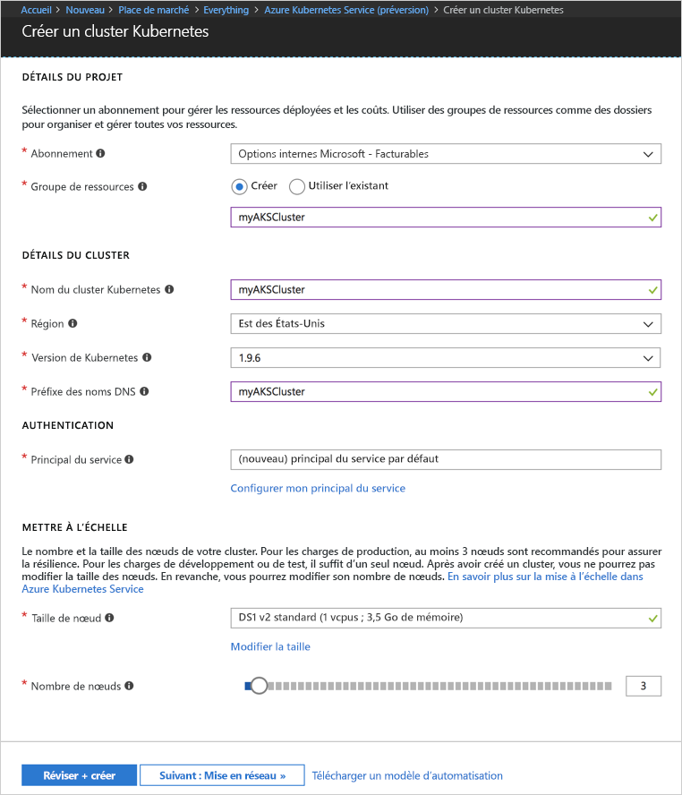
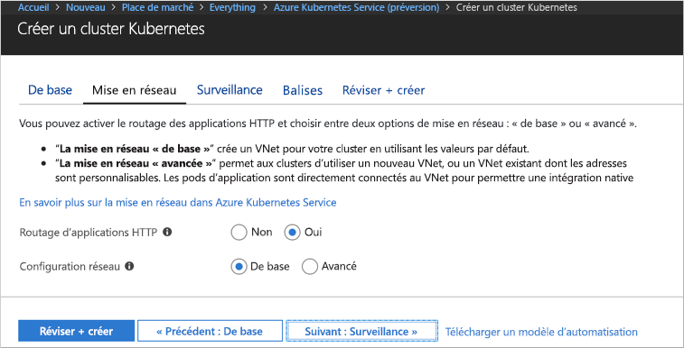
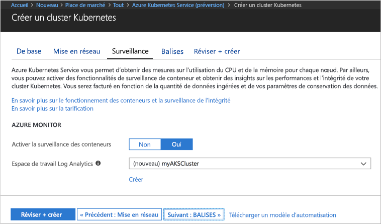
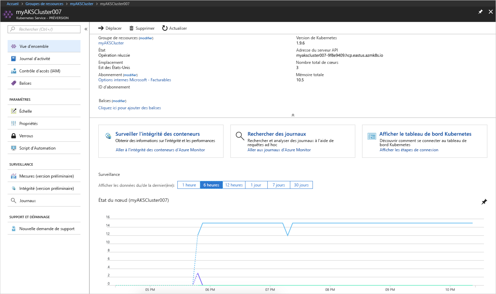
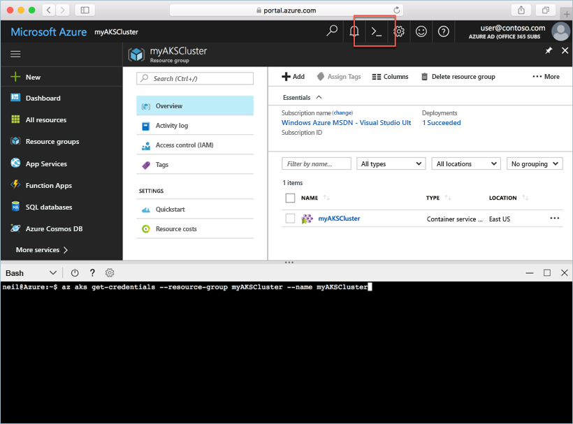
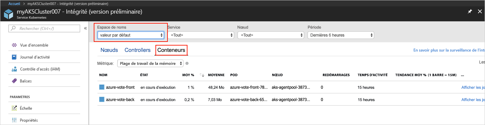
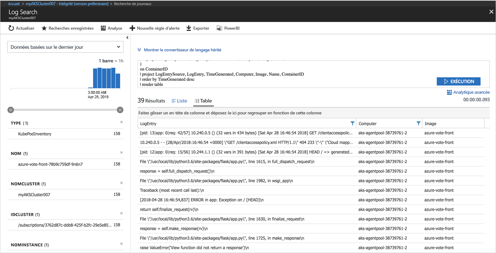

# <a name="quickstart-deploy-an-azure-kubernetes-service-aks-cluster"></a>Guide de démarrage rapide : déployer un cluster Azure Kubernetes Service (AKS)

Dans ce guide de démarrage rapide, vous allez déployer un cluster AKS à l’aide du portail Azure. Une application de plusieurs conteneurs composée d’un serveur web frontal et d’une instance Redis est alors exécutée sur le cluster. Ceci fait, l’application est accessible via internet.


Ce guide de démarrage rapide suppose une compréhension élémentaire des concepts liés à Kubernetes. Pour plus d’informations sur Kubernetes, consultez la [documentation de Kubernetes][kubernetes-documentation].

## <a name="sign-in-to-azure"></a>Connexion à Azure

Connectez-vous au portail Azure sur http://portal.azure.com.


## <a name="create-aks-cluster"></a>Créer un cluster ACS

Choisissez **Créer une ressource** > sélectionnez **Kubernetes Service** > **Créer**.

Suivez les étapes sous chaque en-tête du formulaire Créer un cluster AKS.

- **DÉTAILS DU PROJET** : sélectionnez un abonnement Azure et un groupe de ressources Azure (nouveau ou existant).
- **DÉTAILS DU CLUSTER** : entrez le nom, la région, la version et le préfixe de nom DNS du cluster AKS.
- **AUTHENTIFICATION** : utilisez un principal du service existant ou créez-en un nouveau. Si vous utilisez un nom de principal du service existant, indiquez l’ID client et la clé secrète associés.
- **ÉCHELLE** : sélectionnez une taille de machine virtuelle pour les nœuds AKS. Elle ne sera **pas modifiable** une fois le cluster AKS déployé. Sélectionnez également le nombre de nœuds à déployer dans le cluster. Le nombre de nœuds est **modifiable** après le déploiement du cluster.

Sélectionnez **Suivant : Mise en réseau** lorsque vous avez terminé.



Configurez les options de mise en réseau suivantes :

- **Routage des applications HTTP** : configure un contrôleur d’entrée intégré en activant la création automatique de noms DNS publics. Pour plus d’informations sur le routage HTTP, voir [DNS et routage HTTP AKS][http-routing].
- **Configuration réseau** : choisissez entre la configuration réseau de base, à l’aide du plug-in [kubenet][kubenet] de Kubernetes, ou la configuration réseau avancée, avec [Azure CNI][azure-cni]. Pour plus d’informations sur les options de mise en réseau, voir [Vue d’ensemble de la mise en réseau AKS][aks-network].

Sélectionnez **Suivant : Monitoring** lorsque vous avez terminé.



Lorsque vous déployez un cluster AKS, vous pouvez configurer Azure Container Insights de façon qu’il surveille l’intégrité du cluster AKS et des pods en cours d’exécution sur le cluster. Pour plus d’informations sur l’analyse du fonctionnement des conteneurs, voir [Analyser le fonctionnement d’Azure Kubernetes Service][aks-monitor].

Sélectionnez **Oui** pour activer le monitoring du conteneur ; ensuite, sélectionnez un espace de travail Log Analytics existant ou créez-en un.

Sélectionnez **Vérifier + créer**, puis **Créer** lorsque vous avez terminé.



Après un court délai, le cluster AKS est déployé et prêt à être utilisé. Accédez au groupe de ressources de cluster AKS et sélectionnez la ressource AKS : le tableau de bord du cluster AKS s’affiche.



## <a name="connect-to-the-cluster"></a>Connexion au cluster

Pour gérer un cluster Kubernetes, utilisez [kubectl][kubectl], le client de ligne de commande Kubernetes. Le client kubectl est préinstallé dans Azure Cloud Shell.

Ouvrez Cloud Shell à l’aide du bouton situé dans le coin supérieur droit du portail Azure.



Exécutez la commande [az aks get-credentials][az-aks-get-credentials] pour configurer kubectl afin qu’il se connecte à votre cluster Kubernetes.

Copiez et collez la commande suivante dans Cloud Shell. Modifiez le nom du cluster et du groupe de ressources si nécessaire.

```azurecli-interactive
az aks get-credentials --resource-group myAKSCluster --name myAKSCluster
```

Pour vérifier la connexion à votre cluster, utilisez la commande [kubectl get][kubectl-get] pour retourner une liste des nœuds du cluster.

```azurecli-interactive
kubectl get nodes
```

Output:

```
NAME                       STATUS    ROLES     AGE       VERSION
aks-agentpool-11482510-0   Ready     agent     9m        v1.9.6
aks-agentpool-11482510-1   Ready     agent     8m        v1.9.6
aks-agentpool-11482510-2   Ready     agent     9m        v1.9.6
```

## <a name="run-the-application"></a>Exécution de l'application

Les fichiers manifestes Kubernetes définissent un état souhaité pour un cluster, et en particulier les images conteneur à exécuter. Dans cet exemple, un manifeste est utilisé afin de créer tous les objets nécessaires pour l’exécution de l’application Azure Vote. Parmi eux figurent deux [déploiements Kubernetes][kubernetes-deployment] : un pour la composante frontale d’Azure Vote, l’autre pour une instance Redis. En outre, deux [services Kubernetes][kubernetes-service] sont créés, un service interne pour l’instance Redis et un service externe pour l’accès à l’application Azure Vote à partir d’Internet.

Créez un fichier nommé `azure-vote.yaml` et copiez-y le code YAML suivant. Si vous travaillez dans Azure Cloud Shell, créez ce fichier à l’aide de vi ou de Nano, comme si vous travailliez sur un système virtuel ou physique.

```yaml
apiVersion: apps/v1beta1
kind: Deployment
metadata:
  name: azure-vote-back
spec:
  replicas: 1
  template:
    metadata:
      labels:
        app: azure-vote-back
    spec:
      containers:
      - name: azure-vote-back
        image: redis
        ports:
        - containerPort: 6379
          name: redis
---
apiVersion: v1
kind: Service
metadata:
  name: azure-vote-back
spec:
  ports:
  - port: 6379
  selector:
    app: azure-vote-back
---
apiVersion: apps/v1beta1
kind: Deployment
metadata:
  name: azure-vote-front
spec:
  replicas: 1
  template:
    metadata:
      labels:
        app: azure-vote-front
    spec:
      containers:
      - name: azure-vote-front
        image: microsoft/azure-vote-front:v1
        ports:
        - containerPort: 80
        env:
        - name: REDIS
          value: "azure-vote-back"
---
apiVersion: v1
kind: Service
metadata:
  name: azure-vote-front
spec:
  type: LoadBalancer
  ports:
  - port: 80
  selector:
    app: azure-vote-front
```

Utilisez la commande [kubectl apply][kubectl-apply] pour exécuter l’application.

```azurecli-interactive
kubectl apply -f azure-vote.yaml
```

Output:

```
deployment "azure-vote-back" created
service "azure-vote-back" created
deployment "azure-vote-front" created
service "azure-vote-front" created
```

## <a name="test-the-application"></a>Test de l'application

Lorsque l’application s’exécute, un [service Kubernetes][kubernetes-service] est créé pour exposer l’application à Internet. L’exécution de ce processus peut prendre plusieurs minutes.

Pour surveiller la progression, utilisez la commande [kubectl get service][kubectl-get] avec l’argument `--watch`.

```azurecli-interactive
kubectl get service azure-vote-front --watch
```

Au début, *EXTERNAL-IP* apparaît comme étant *en attente* pour le service *azure-vote-front*.

```
NAME               TYPE           CLUSTER-IP   EXTERNAL-IP   PORT(S)        AGE
azure-vote-front   LoadBalancer   10.0.37.27   <pending>     80:30572/TCP   6s
```

Une fois que l’adresse *EXTERNAL-IP* est passée du statut *En attente* à *Adresse IP*, utilisez `CTRL-C` pour arrêter le processus de surveillance kubectl.

```
azure-vote-front   LoadBalancer   10.0.37.27   52.179.23.131   80:30572/TCP   2m
```

Accédez maintenant à l’adresse IP externe pour voir l’application Azure Vote.


## <a name="monitor-health-and-logs"></a>Analyser le fonctionnement et les journaux

Si le monitoring Container Insights a été activé, le tableau de bord du cluster AKS comporte des mesures d’intégrité sur le cluster AKS et sur les pods en cours d’exécution sur le cluster. Pour plus d’informations sur l’analyse du fonctionnement des conteneurs, voir [Analyser le fonctionnement d’Azure Kubernetes Service][aks-monitor].

Pour afficher l’état actuel, la durée de fonctionnement et l’utilisation des ressources des blocs Azure Vote, revenez à la ressource AKS, sélectionnez **Analyser le fonctionnement du conteneur** > sélectionnez l’espace de noms **par défaut** > et sélectionnez **Conteneurs**. Ces données s’afficheront sur le Portail Azure au bout de quelques minutes.



Pour afficher les journaux du pod `azure-vote-front`, sélectionnez le lien **Afficher les journaux**. Vous pourrez voir les flux stdout et stderr du conteneur.



## <a name="delete-cluster"></a>Supprimer un cluster

Dès vous n’avez plus besoin du cluster, supprimez la ressource de cluster : toutes les ressources associées seront ainsi supprimées. Vous pouvez effectuer cette opération sur le Portail Azure en cliquant sur le bouton Supprimer sur le tableau de bord du cluster AKS. Vous pouvez aussi exécuter la commande [az aks delete][az-aks-delete] dans Cloud Shell.

```azurecli-interactive
az aks delete --resource-group myAKSCluster --name myAKSCluster --no-wait
```

## <a name="get-the-code"></a>Obtenir le code

Dans ce guide de démarrage rapide, les images de conteneur, créées au préalable, ont été utilisées pour créer un déploiement Kubernetes. Le code de l’application associé, Dockerfile, et le fichier manifeste Kubernetes sont disponibles sur GitHub.

[https://github.com/Azure-Samples/azure-voting-app-redis][azure-vote-app]

## <a name="next-steps"></a>Étapes suivantes

Dans ce Démarrage rapide, vous avez déployé un cluster Kubernetes dans lequel vous avez déployé une application de plusieurs conteneurs.

Pour en savoir plus sur ACS et parcourir le code complet de l’exemple de déploiement, passez au didacticiel sur le cluster Kubernetes.

> [!div class="nextstepaction"]
> [Didacticiel ACS][aks-tutorial]

<!-- LINKS - external -->
[azure-vote-app]: https://github.com/Azure-Samples/azure-voting-app-redis.git
[azure-cni]: https://github.com/Azure/azure-container-networking/blob/master/docs/cni.md
[kubectl]: https://kubernetes.io/docs/user-guide/kubectl/
[kubectl-apply]: https://kubernetes.io/docs/reference/generated/kubectl/kubectl-commands#apply
[kubectl-get]: https://kubernetes.io/docs/reference/generated/kubectl/kubectl-commands#get
[kubenet]: https://kubernetes.io/docs/concepts/cluster-administration/network-plugins/#kubenet
[kubernetes-deployment]: https://kubernetes.io/docs/concepts/workloads/controllers/deployment/
[kubernetes-documentation]: https://kubernetes.io/docs/home/
[kubernetes-service]: https://kubernetes.io/docs/concepts/services-networking/service/

<!-- LINKS - internal -->
[az-aks-get-credentials]: /cli/azure/aks?view=azure-cli-latest#az_aks_get_credentials
[az-aks-delete]: /cli/azure/aks#az-aks-delete
[aks-monitor]: ../monitoring/monitoring-container-health.md
[aks-network]: ./networking-overview.md
[aks-tutorial]: ./tutorial-kubernetes-prepare-app.md
[http-routing]: ./http-application-routing.md
