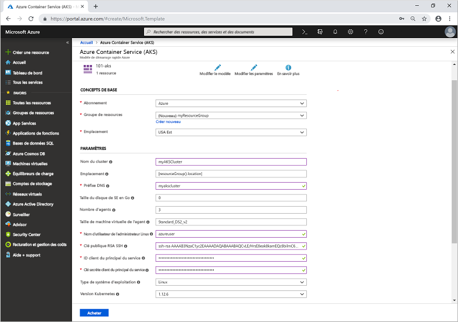

# <a name="quickstart-deploy-an-azure-kubernetes-service-aks-cluster-using-an-arm-template"></a>Démarrage rapide : Déployer un cluster AKS (Azure Kubernetes Service) à l’aide d’un modèle ARM

AKS (Azure Kubernetes Service) est un service Kubernetes managé qui vous permet de déployer et de gérer rapidement des clusters. Dans ce guide de démarrage rapide, vous allez déployer un cluster AKS à l’aide d’un modèle ARM (Azure Resource Manager). Une application multiconteneur composée d’un front-end web et d’une instance Redis est exécutée dans le cluster.


[!INCLUDE [About Azure Resource Manager](../../includes/resource-manager-quickstart-introduction.md)]

Ce guide de démarrage rapide suppose une compréhension élémentaire des concepts liés à Kubernetes. Pour plus d’informations, consultez [Concepts de base de Kubernetes pour AKS (Azure Kubernetes Service)][kubernetes-concepts].

Si votre environnement remplit les prérequis et que vous êtes déjà familiarisé avec l’utilisation des modèles ARM, sélectionnez le bouton **Déployer sur Azure**. Le modèle s’ouvre dans le portail Azure.

[](https://portal.azure.com/#create/Microsoft.Template/uri/https%3A%2F%2Fraw.githubusercontent.com%2FAzure%2Fazure-quickstart-templates%2Fmaster%2F101-aks%2Fazuredeploy.json)

[!INCLUDE [quickstarts-free-trial-note](../../includes/quickstarts-free-trial-note.md)]

[!INCLUDE [azure-cli-prepare-your-environment.md](../../includes/azure-cli-prepare-your-environment.md)]

- Cet article nécessite la version 2.0.61 ou ultérieure de l’interface Azure CLI. Si vous utilisez Azure Cloud Shell, la version la plus récente est déjà installée.

- Pour créer un cluster AKS à l’aide d’un modèle Resource Manager, vous fournissez une clé publique SSH et un principal de service Azure Active Directory. Vous pouvez également utiliser une [identité managée](use-managed-identity.md) au lieu d’un principal de service pour les autorisations. Si vous avez besoin de l’une de ces ressources, consultez la section suivante ; sinon, passez à la section [Vérifier le modèle](#review-the-template).

### <a name="create-an-ssh-key-pair"></a>Création d’une paire de clés SSH

Pour accéder aux nœuds AKS, vous vous connectez à l’aide d’une paire de clés SSH. Utilisez la commande `ssh-keygen` pour générer des fichiers de clés SSH publiques et privées. Par défaut, ces fichiers sont créés dans le répertoire *~/.ssh*. Si une paire de clés SSH portant le même nom existe dans l’emplacement choisi, les fichiers sont remplacés.

Accédez à [https://shell.azure.com](https://shell.azure.com) pour ouvrir Cloud Shell dans votre navigateur.

La commande suivante crée une paire de clés SSH à l’aide du chiffrement RSA avec une longueur de 2 048 bits :

```console
ssh-keygen -t rsa -b 2048
```

Pour plus d’informations sur la création de clés SSH, consultez [Créer et gérer les clés SSH pour l’authentification dans Azure][ssh-keys].

### <a name="create-a-service-principal"></a>Créer un principal du service

Pour permettre à un cluster AKS d’interagir avec d’autres ressources Azure, un principal du service Azure Active Directory est utilisé. Créez un principal du service à l’aide de la commande [az ad sp create-for-rbac][az-ad-sp-create-for-rbac]. Le paramètre `--skip-assignment` limite l’affectation d’autorisations supplémentaires. Par défaut, ce principal de service est valide pendant un an. Notez que vous pouvez utiliser une identité managée au lieu d’un principal de service. Pour plus d’informations, consultez [Utiliser des identités managées](use-managed-identity.md).

```azurecli-interactive
az ad sp create-for-rbac --skip-assignment
```

Le résultat ressemble à l’exemple suivant :

```json
{
  "appId": "8b1ede42-d407-46c2-a1bc-6b213b04295f",
  "displayName": "azure-cli-2019-04-19-21-42-11",
  "name": "http://azure-cli-2019-04-19-21-42-11",
  "password": "27e5ac58-81b0-46c1-bd87-85b4ef622682",
  "tenant": "73f978cf-87f2-41bf-92ab-2e7ce012db57"
}
```

Prenez note des valeurs de *appId* et de *password*. Ces valeurs sont utilisées dans les étapes suivantes.

## <a name="review-the-template"></a>Vérifier le modèle

Le modèle utilisé dans ce guide de démarrage rapide est tiré des [modèles de démarrage rapide Azure](https://azure.microsoft.com/resources/templates/101-aks/).

:::code language="json" source="~/quickstart-templates/101-aks/azuredeploy.json":::

Pour plus d’exemples AKS, consultez le site [Modèles de démarrage rapide AKS][aks-quickstart-templates].

## <a name="deploy-the-template"></a>Déployer le modèle

1. Cliquez sur l’image ci-après pour vous connecter à Azure et ouvrir un modèle.

    [](https://portal.azure.com/#create/Microsoft.Template/uri/https%3A%2F%2Fraw.githubusercontent.com%2FAzure%2Fazure-quickstart-templates%2Fmaster%2F101-aks%2Fazuredeploy.json)

2. Sélectionnez ou entrez les valeurs suivantes.

    Pour ce guide de démarrage rapide, conservez les valeurs par défaut pour *Taille du disque du système d’exploitation en Go*, *Nombre d’agents*, *Taille de machine virtuelle de l’agent*, *Type de système d’exploitation* et *Version de Kubernetes*. Fournissez vos propres valeurs pour les paramètres de modèle suivants :

    * **Abonnement**: Sélectionnez un abonnement Azure.
    * **Groupe de ressources** : Sélectionnez **Créer nouveau**. Entrez un nom unique pour le groupe de ressources, tel que *myResourceGroup*, puis choisissez **OK**.
    * **Emplacement** : sélectionnez un emplacement, comme **USA Est**.
    * **Nom de cluster** : entrez un nom unique pour le cluster AKS, tel que *myAKSCluster*.
    * **Préfixe DNS** : entrez un préfixe DNS unique pour votre cluster, tel que *myakscluster*.
    * **Nom de l’utilisateur administrateur Linux** : entrez un nom d’utilisateur pour se connecter à l’aide de SSH, tel qu’*azureuser*.
    * **Clé publique RSA SSH** : copiez et collez la partie *publique* de votre paire de clés SSH (par défaut, le contenu de *~/.ssh/id_rsa.pub*).
    * **ID de client du principal du service** : copiez et collez l’*ID d’application* de votre principal de service à partir de la commande `az ad sp create-for-rbac`.
    * **Secret client du principal du service** : copiez et collez le *mot de passe* de votre principal de service à partir de la commande `az ad sp create-for-rbac`.
    * **J’accepte les termes et conditions mentionnés ci-dessus** : Cochez cette case pour accepter.

    

3. Sélectionnez **Achat**.

La création du cluster AKS ne prend que quelques minutes. Attendez que le cluster soit correctement déployé pour passer à l’étape suivante.

## <a name="validate-the-deployment"></a>Valider le déploiement

### <a name="connect-to-the-cluster"></a>Se connecter au cluster

Pour gérer un cluster Kubernetes, vous utilisez [kubectl][kubectl], le client de ligne de commande Kubernetes. Si vous utilisez Azure Cloud Shell, `kubectl` est déjà installé. Pour installer `kubectl` en local, utilisez la commande [az aks install-cli][az-aks-install-cli] :

```azurecli
az aks install-cli
```

Pour configurer `kubectl` afin de vous connecter à votre cluster Kubernetes, exécutez la commande [az aks get-credentials][az-aks-get-credentials]. Cette commande télécharge les informations d’identification et configure l’interface CLI Kubernetes pour les utiliser.

```azurecli-interactive
az aks get-credentials --resource-group myResourceGroup --name myAKSCluster
```

Pour vérifier la connexion à votre cluster, utilisez la commande [kubectl get][kubectl-get] pour retourner une liste des nœuds du cluster.

```console
kubectl get nodes
```

L’exemple de sortie suivant montre les nœuds créés au cours des étapes précédentes. Vérifiez que l’état de tous les nœuds est *Ready* :

```output
NAME                       STATUS   ROLES   AGE     VERSION
aks-agentpool-41324942-0   Ready    agent   6m44s   v1.12.6
aks-agentpool-41324942-1   Ready    agent   6m46s   v1.12.6
aks-agentpool-41324942-2   Ready    agent   6m45s   v1.12.6
```

### <a name="run-the-application"></a>Exécution de l'application

Un fichier manifeste Kubernetes définit un état souhaité pour le cluster, notamment les images conteneur à exécuter. Dans ce guide de démarrage rapide, un manifeste est utilisé afin de créer tous les objets nécessaires pour l’exécution de l’application Azure Vote. Ce manifeste inclut deux [déploiements Kubernetes][kubernetes-deployment] : un pour les exemples d’applications Azure Vote Python et l’autre pour une instance Redis. Deux [services Kubernetes][kubernetes-service] sont également créés : un service interne pour l’instance Redis et un service externe pour accéder à l’application Azure Vote à partir d’Internet.

Créez un fichier nommé `azure-vote.yaml`, et copiez-y la définition YAML suivante. Si vous utilisez Azure Cloud Shell, vous pouvez créer ce fichier à l’aide de `vi` ou de `nano` comme si vous travailliez sur un système virtuel ou physique :

```yaml
apiVersion: apps/v1
kind: Deployment
metadata:
  name: azure-vote-back
spec:
  replicas: 1
  selector:
    matchLabels:
      app: azure-vote-back
  template:
    metadata:
      labels:
        app: azure-vote-back
    spec:
      nodeSelector:
        "beta.kubernetes.io/os": linux
      containers:
      - name: azure-vote-back
        image: mcr.microsoft.com/oss/bitnami/redis:6.0.8
        env:
        - name: ALLOW_EMPTY_PASSWORD
          value: "yes"
        resources:
          requests:
            cpu: 100m
            memory: 128Mi
          limits:
            cpu: 250m
            memory: 256Mi
        ports:
        - containerPort: 6379
          name: redis
---
apiVersion: v1
kind: Service
metadata:
  name: azure-vote-back
spec:
  ports:
  - port: 6379
  selector:
    app: azure-vote-back
---
apiVersion: apps/v1
kind: Deployment
metadata:
  name: azure-vote-front
spec:
  replicas: 1
  selector:
    matchLabels:
      app: azure-vote-front
  template:
    metadata:
      labels:
        app: azure-vote-front
    spec:
      nodeSelector:
        "beta.kubernetes.io/os": linux
      containers:
      - name: azure-vote-front
        image: mcr.microsoft.com/azuredocs/azure-vote-front:v1
        resources:
          requests:
            cpu: 100m
            memory: 128Mi
          limits:
            cpu: 250m
            memory: 256Mi
        ports:
        - containerPort: 80
        env:
        - name: REDIS
          value: "azure-vote-back"
---
apiVersion: v1
kind: Service
metadata:
  name: azure-vote-front
spec:
  type: LoadBalancer
  ports:
  - port: 80
  selector:
    app: azure-vote-front
```

Déployez l’application à l’aide de la commande [kubectl apply][kubectl-apply] et spécifiez le nom de votre manifeste YAML :

```console
kubectl apply -f azure-vote.yaml
```

L’exemple de sortie suivant montre que les déploiements et les ressources ont été créés correctement :

```output
deployment "azure-vote-back" created
service "azure-vote-back" created
deployment "azure-vote-front" created
service "azure-vote-front" created
```

### <a name="test-the-application"></a>Test de l’application

Quand l’application s’exécute, un service Kubernetes expose le front-end de l’application sur Internet. L’exécution de ce processus peut prendre plusieurs minutes.

Pour surveiller la progression, utilisez la commande [kubectl get service][kubectl-get] avec l’argument `--watch`.

```console
kubectl get service azure-vote-front --watch
```

Dans un premier temps, la valeur *EXTERNAL-IP* du service *azure-vote-front* apparaît comme étant en attente (*pending*).

```output
NAME               TYPE           CLUSTER-IP   EXTERNAL-IP   PORT(S)        AGE
azure-vote-front   LoadBalancer   10.0.37.27   <pending>     80:30572/TCP   6s
```

Quand l’adresse *EXTERNAL-IP* passe de l’état *pending* à une adresse IP publique réelle, utilisez `CTRL-C` pour arrêter le processus de surveillance `kubectl`. L’exemple de sortie suivant montre une adresse IP publique valide affectée au service :

```output
azure-vote-front   LoadBalancer   10.0.37.27   52.179.23.131   80:30572/TCP   2m
```

Pour voir l’application Azure Vote en action, ouvrez un navigateur web en utilisant l’adresse IP externe de votre service.


## <a name="clean-up-resources"></a>Nettoyer les ressources

Lorsque vous n’avez plus besoin du cluster, utilisez la commande [az group delete][az-group-delete] pour supprimer le groupe de ressources, le service conteneur et toutes les ressources associées.

```azurecli-interactive
az group delete --name myResourceGroup --yes --no-wait
```

> [!NOTE]
> Lorsque vous supprimez le cluster, le principal de service Azure Active Directory utilisé par le cluster AKS n’est pas supprimé. Pour obtenir des instructions sur la façon de supprimer le principal de service, consultez [Considérations et suppression du principal de service AKS][sp-delete]. Si vous avez utilisé une identité managée, l’identité est managée par la plateforme et n’a pas besoin d’être supprimée.

## <a name="get-the-code"></a>Obtenir le code

Dans ce guide de démarrage rapide, des images conteneur créées au préalable ont été utilisées pour créer un déploiement Kubernetes. Le code de l’application associé, Dockerfile, et le fichier manifeste Kubernetes sont disponibles sur GitHub.

[https://github.com/Azure-Samples/azure-voting-app-redis][azure-vote-app]

## <a name="next-steps"></a>Étapes suivantes

Dans ce Démarrage rapide, vous avez déployé un cluster Kubernetes dans lequel vous avez déployé une application de plusieurs conteneurs. [Accédez au tableau de bord web de Kubernetes][kubernetes-dashboard] pour le cluster que vous avez créé.

Pour en savoir plus sur AKS et parcourir le code complet de l’exemple de déploiement, passez au tutoriel sur le cluster Kubernetes.

> [!div class="nextstepaction"]
> [Didacticiel AKS][aks-tutorial]

<!-- LINKS - external -->
[azure-vote-app]: https://github.com/Azure-Samples/azure-voting-app-redis.git
[kubectl]: https://kubernetes.io/docs/user-guide/kubectl/
[kubectl-apply]: https://kubernetes.io/docs/reference/generated/kubectl/kubectl-commands#apply
[kubectl-get]: https://kubernetes.io/docs/reference/generated/kubectl/kubectl-commands#get
[azure-dev-spaces]: ../dev-spaces/index.yml
[aks-quickstart-templates]: https://azure.microsoft.com/resources/templates/?term=Azure+Kubernetes+Service

<!-- LINKS - internal -->
[kubernetes-concepts]: concepts-clusters-workloads.md
[aks-monitor]: ../azure-monitor/insights/container-insights-onboard.md
[aks-tutorial]: ./tutorial-kubernetes-prepare-app.md
[az-aks-browse]: /cli/azure/aks?view=azure-cli-latest#az-aks-browse
[az-aks-create]: /cli/azure/aks?view=azure-cli-latest#az-aks-create
[az-aks-get-credentials]: /cli/azure/aks?view=azure-cli-latest#az-aks-get-credentials
[az-aks-install-cli]: /cli/azure/aks?view=azure-cli-latest#az-aks-install-cli
[az-group-create]: /cli/azure/group#az-group-create
[az-group-delete]: /cli/azure/group#az-group-delete
[azure-cli-install]: /cli/azure/install-azure-cli
[sp-delete]: kubernetes-service-principal.md#additional-considerations
[azure-portal]: https://portal.azure.com
[kubernetes-deployment]: concepts-clusters-workloads.md#deployments-and-yaml-manifests
[kubernetes-service]: concepts-network.md#services
[kubernetes-dashboard]: kubernetes-dashboard.md
[ssh-keys]: ../virtual-machines/linux/create-ssh-keys-detailed.md
[az-ad-sp-create-for-rbac]: /cli/azure/ad/sp#az-ad-sp-create-for-rbac
