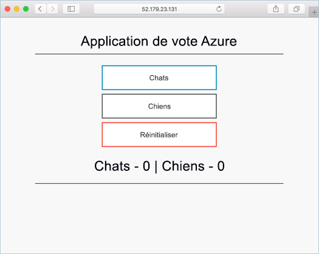
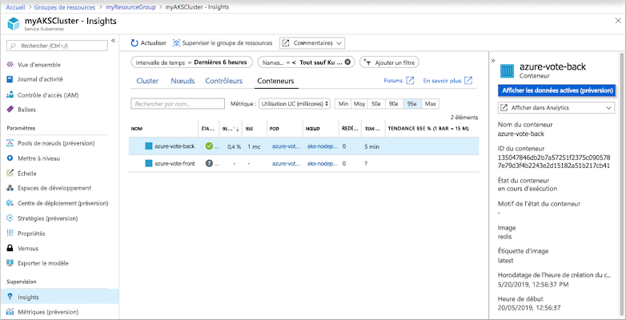
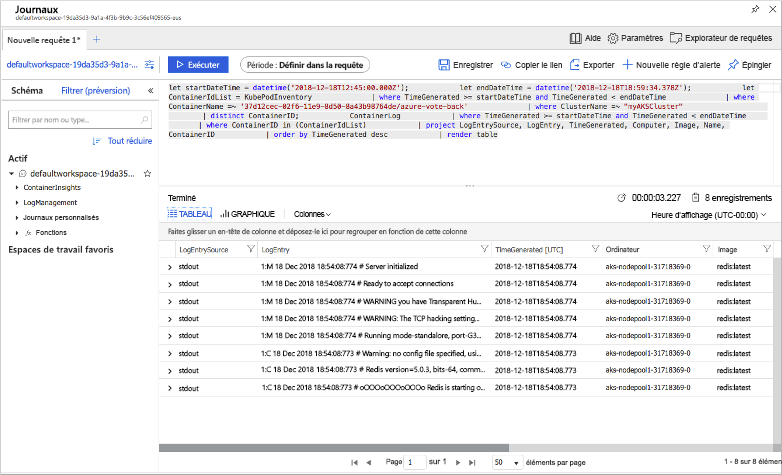

# <a name="quickstart-deploy-an-azure-kubernetes-service-aks-cluster-using-the-azure-cli"></a>Démarrage rapide : déployer un cluster AKS (Azure Kubernetes Service) à l’aide d’Azure CLI

AKS (Azure Kubernetes Service) est un service Kubernetes managé qui vous permet de déployer et de gérer rapidement des clusters. Dans ce guide de démarrage rapide, vous déployez un cluster AKS à l’aide d’Azure CLI. Une application multiconteneur composée d’un front-end web et d’une instance Redis est exécutée dans le cluster. Vous pouvez ainsi voir comment superviser l’intégrité du cluster et des pods qui exécutent votre application.

Si vous souhaitez utiliser des conteneurs Windows Server (actuellement en préversion dans AKS), consultez [Créer un cluster AKS prenant en charge les conteneurs Windows Server][windows-container-cli].



Ce guide de démarrage rapide suppose une compréhension élémentaire des concepts liés à Kubernetes. Pour plus d’informations, consultez [Concepts de base de Kubernetes pour AKS (Azure Kubernetes Service)][kubernetes-concepts].

Si vous n’avez pas d’abonnement Azure, créez un [compte gratuit](https://azure.microsoft.com/free/?WT.mc_id=A261C142F) avant de commencer.

[!INCLUDE [cloud-shell-try-it.md](../../includes/cloud-shell-try-it.md)]

Si vous choisissez d'installer et d'utiliser l'interface CLI localement, ce guide de démarrage rapide exige au minimum Azure CLI version 2.0.64. Exécutez `az --version` pour trouver la version. Si vous devez installer ou mettre à niveau, consultez [Installer Azure CLI 2.0][azure-cli-install].

## <a name="create-a-resource-group"></a>Créer un groupe de ressources

Un groupe de ressources Azure est un groupe logique dans lequel des ressources Azure sont déployées et gérées. Lorsque vous créez un groupe de ressources, vous devez spécifier un emplacement. Il s’agit de l’emplacement de stockage des métadonnées de groupe de ressources. C’est également là que vos ressources s’exécutent dans Azure si vous ne spécifiez pas une autre région lors de la création de ressources. Créez un groupe de ressources à l’aide de la commande [az group create][az-group-create].

L’exemple suivant crée un groupe de ressources nommé *myResourceGroup* à l’emplacement *eastus*.

```azurecli-interactive
az group create --name myResourceGroup --location eastus
```

L’exemple de sortie suivant montre que le groupe de ressources a été créé correctement :

```json
{
  "id": "/subscriptions/<guid>/resourceGroups/myResourceGroup",
  "location": "eastus",
  "managedBy": null,
  "name": "myResourceGroup",
  "properties": {
    "provisioningState": "Succeeded"
  },
  "tags": null
}
```

## <a name="create-aks-cluster"></a>Créer un cluster ACS

Utilisez la commande [az aks create][az-aks-create] pour créer un cluster AKS. L’exemple suivant crée un cluster à un nœud nommé *myAKSCluster*. Il est également possible d’activer Azure Monitor pour conteneurs à l’aide du paramètre *--enable-addons monitoring*.

```azurecli-interactive
az aks create \
    --resource-group myResourceGroup \
    --name myAKSCluster \
    --node-count 1 \
    --enable-addons monitoring \
    --generate-ssh-keys
```

Au bout de quelques minutes, la commande se termine et retourne des informations au format JSON sur le cluster.

## <a name="connect-to-the-cluster"></a>Connexion au cluster

Pour gérer un cluster Kubernetes, vous utilisez [kubectl][kubectl], le client de ligne de commande Kubernetes. Si vous utilisez Azure Cloud Shell, `kubectl` est déjà installé. Pour installer `kubectl` en local, utilisez la commande [az aks install-cli][az-aks-install-cli] :

```azurecli
az aks install-cli
```

Exécutez la commande [az aks get-credentials][az-aks-get-credentials] pour configurer `kubectl` afin de vous connecter à votre cluster Kubernetes. Cette commande télécharge les informations d’identification et configure l’interface CLI Kubernetes pour les utiliser.

```azurecli-interactive
az aks get-credentials --resource-group myResourceGroup --name myAKSCluster
```

Pour vérifier la connexion à votre cluster, utilisez la commande [kubectl get][kubectl-get] pour retourner une liste des nœuds du cluster.

```azurecli-interactive
kubectl get nodes
```

L’exemple de sortie suivant montre le nœud unique créé au cours des étapes précédentes. Vérifiez que l’état du nœud est *Ready* :

```
NAME                       STATUS   ROLES   AGE     VERSION
aks-nodepool1-31718369-0   Ready    agent   6m44s   v1.12.8
```

## <a name="run-the-application"></a>Exécution de l'application

Un fichier manifeste Kubernetes définit un état souhaité pour le cluster, notamment les images conteneur à exécuter. Dans ce guide de démarrage rapide, un manifeste est utilisé afin de créer tous les objets nécessaires pour l’exécution de l’application Azure Vote. Ce manifeste inclut deux [déploiements Kubernetes][kubernetes-deployment] : un pour les exemples d’applications Azure Vote Python et l’autre pour une instance Redis. Deux [services Kubernetes][kubernetes-service] sont également créés : un service interne pour l’instance Redis et un service externe pour accéder à l’application Azure Vote à partir d’Internet.

> [!TIP]
> Dans ce guide de démarrage rapide, vous créez et déployez manuellement vos manifestes d’application sur le cluster AKS. Dans des scénarios plus probables, vous pouvez utiliser [Azure Dev Spaces][azure-dev-spaces] pour itérer et déboguer votre code rapidement, directement dans le cluster AKS. Vous pouvez utiliser les espaces Dev Spaces sur des plateformes de système d’exploitation ainsi que des environnements de développement et collaborer avec les autres personnes de votre équipe.

Créez un fichier nommé `azure-vote.yaml`, et copiez-y la définition YAML suivante. Si vous utilisez Azure Cloud Shell, vous pouvez créer ce fichier à l’aide de `vi` ou de `nano` comme si vous travailliez sur un système virtuel ou physique :

```yaml
apiVersion: apps/v1
kind: Deployment
metadata:
  name: azure-vote-back
spec:
  replicas: 1
  selector:
    matchLabels:
      app: azure-vote-back
  template:
    metadata:
      labels:
        app: azure-vote-back
    spec:
      nodeSelector:
        "beta.kubernetes.io/os": linux
      containers:
      - name: azure-vote-back
        image: redis
        resources:
          requests:
            cpu: 100m
            memory: 128Mi
          limits:
            cpu: 250m
            memory: 256Mi
        ports:
        - containerPort: 6379
          name: redis
---
apiVersion: v1
kind: Service
metadata:
  name: azure-vote-back
spec:
  ports:
  - port: 6379
  selector:
    app: azure-vote-back
---
apiVersion: apps/v1
kind: Deployment
metadata:
  name: azure-vote-front
spec:
  replicas: 1
  selector:
    matchLabels:
      app: azure-vote-front
  template:
    metadata:
      labels:
        app: azure-vote-front
    spec:
      nodeSelector:
        "beta.kubernetes.io/os": linux
      containers:
      - name: azure-vote-front
        image: microsoft/azure-vote-front:v1
        resources:
          requests:
            cpu: 100m
            memory: 128Mi
          limits:
            cpu: 250m
            memory: 256Mi
        ports:
        - containerPort: 80
        env:
        - name: REDIS
          value: "azure-vote-back"
---
apiVersion: v1
kind: Service
metadata:
  name: azure-vote-front
spec:
  type: LoadBalancer
  ports:
  - port: 80
  selector:
    app: azure-vote-front
```

Déployez l’application à l’aide de la commande [kubectl apply][kubectl-apply] et spécifiez le nom de votre manifeste YAML :

```azurecli-interactive
kubectl apply -f azure-vote.yaml
```

L’exemple de sortie suivant montre que les déploiements et les ressources ont été créés correctement :

```
deployment "azure-vote-back" created
service "azure-vote-back" created
deployment "azure-vote-front" created
service "azure-vote-front" created
```

## <a name="test-the-application"></a>Test de l’application

Quand l’application s’exécute, un service Kubernetes expose le front-end de l’application sur Internet. L’exécution de ce processus peut prendre plusieurs minutes.

Pour surveiller la progression, utilisez la commande [kubectl get service][kubectl-get] avec l’argument `--watch`.

```azurecli-interactive
kubectl get service azure-vote-front --watch
```

Dans un premier temps, la valeur *EXTERNAL-IP* du service *azure-vote-front* apparaît comme étant en attente (*pending*).

```
NAME               TYPE           CLUSTER-IP   EXTERNAL-IP   PORT(S)        AGE
azure-vote-front   LoadBalancer   10.0.37.27   <pending>     80:30572/TCP   6s
```

Quand l’adresse *EXTERNAL-IP* passe de l’état *pending* à une adresse IP publique réelle, utilisez `CTRL-C` pour arrêter le processus de surveillance `kubectl`. L’exemple de sortie suivant montre une adresse IP publique valide affectée au service :

```
azure-vote-front   LoadBalancer   10.0.37.27   52.179.23.131   80:30572/TCP   2m
```

Pour voir l’application Azure Vote en action, ouvrez un navigateur web en utilisant l’adresse IP externe de votre service.


## <a name="monitor-health-and-logs"></a>Analyser le fonctionnement et les journaux d’activité

Au moment de la création du cluster AKS, Azure Monitor pour conteneurs a été activé afin de capturer les métriques d’intégrité pour les nœuds de cluster et les pods. Ces mesures sont disponibles dans le portail Azure.

Pour afficher l’état, la durée de fonctionnement et l’utilisation des ressources actuels pour les pods Azure Vote, procédez comme suit :

1. Ouvrez le portail Azure avec un navigateur web [https://portal.azure.com][azure-portal].
1. Sélectionnez votre groupe de ressources, par exemple *myResourceGroup*, puis sélectionnez votre cluster AKS, tel que *myAKSCluster*.
1. Sous **Supervision** à gauche, choisissez **Insights**.
1. Dans la partie supérieure, choisissez **+ Ajouter un filtre**.
1. Sélectionnez *Espace de noms* en guise de propriété, puis choisissez *\<Tout sauf kube-system\>* .
1. Choisissez de visualiser les **Conteneurs**.

Les conteneurs *azure-vote-back* et *azure-vote-front* s’affichent, comme illustré dans l’exemple suivant :



Pour consulter les journaux du pod `azure-vote-front`, choisissez l'option **Afficher dans Analyses**, puis sélectionnez le lien **Afficher les journaux du conteneur** à droite de la liste des conteneurs. Vous pourrez voir les flux *stdout* et *stderr* du conteneur.



## <a name="delete-cluster"></a>Supprimer un cluster

Lorsque vous n’avez plus besoin du cluster, utilisez la commande [az group delete][az-group-delete] pour supprimer le groupe de ressources, le service conteneur et toutes les ressources associées.

```azurecli-interactive
az group delete --name myResourceGroup --yes --no-wait
```

> [!NOTE]
> Lorsque vous supprimez le cluster, le principal de service Azure Active Directory utilisé par le cluster AKS n’est pas supprimé. Pour obtenir des instructions sur la façon de supprimer le principal de service, consultez [Considérations principales et suppression du principal de service AKS][sp-delete].

## <a name="get-the-code"></a>Obtenir le code

Dans ce guide de démarrage rapide, des images conteneur créées au préalable ont été utilisées pour créer un déploiement Kubernetes. Le code de l’application associé, Dockerfile, et le fichier manifeste Kubernetes sont disponibles sur GitHub.

[https://github.com/Azure-Samples/azure-voting-app-redis][azure-vote-app]

## <a name="next-steps"></a>Étapes suivantes

Dans ce Démarrage rapide, vous avez déployé un cluster Kubernetes dans lequel vous avez déployé une application de plusieurs conteneurs. Vous pouvez également [accéder au tableau de bord web Kubernetes][kubernetes-dashboard] pour votre cluster AKS.

Pour en savoir plus sur ACS et parcourir le code complet de l’exemple de déploiement, passez au tutoriel sur le cluster Kubernetes.

> [!div class="nextstepaction"]
> [Tutoriel ACS][aks-tutorial]

<!-- LINKS - external -->
[azure-vote-app]: https://github.com/Azure-Samples/azure-voting-app-redis.git
[kubectl]: https://kubernetes.io/docs/user-guide/kubectl/
[kubectl-apply]: https://kubernetes.io/docs/reference/generated/kubectl/kubectl-commands#apply
[kubectl-get]: https://kubernetes.io/docs/reference/generated/kubectl/kubectl-commands#get
[azure-dev-spaces]: https://docs.microsoft.com/azure/dev-spaces/

<!-- LINKS - internal -->
[kubernetes-concepts]: concepts-clusters-workloads.md
[aks-monitor]: https://aka.ms/coingfonboarding
[aks-tutorial]: ./tutorial-kubernetes-prepare-app.md
[az-aks-browse]: /cli/azure/aks?view=azure-cli-latest#az-aks-browse
[az-aks-create]: /cli/azure/aks?view=azure-cli-latest#az-aks-create
[az-aks-get-credentials]: /cli/azure/aks?view=azure-cli-latest#az-aks-get-credentials
[az-aks-install-cli]: /cli/azure/aks?view=azure-cli-latest#az-aks-install-cli
[az-group-create]: /cli/azure/group#az-group-create
[az-group-delete]: /cli/azure/group#az-group-delete
[azure-cli-install]: /cli/azure/install-azure-cli
[sp-delete]: kubernetes-service-principal.md#additional-considerations
[azure-portal]: https://portal.azure.com
[kubernetes-deployment]: concepts-clusters-workloads.md#deployments-and-yaml-manifests
[kubernetes-service]: concepts-network.md#services
[kubernetes-dashboard]: kubernetes-dashboard.md
[windows-container-cli]: windows-container-cli.md