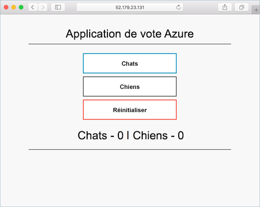

# <a name="quickstart-deploy-an-azure-kubernetes-service-cluster-using-the-azure-cli"></a>Démarrage rapide : Déployer un cluster Azure Kubernetes Service à l’aide d’Azure CLI

AKS (Azure Kubernetes Service) est un service Kubernetes managé qui vous permet de déployer et de gérer rapidement des clusters. Dans ce guide de démarrage rapide, vous allez :
* Déployer un cluster AKS dans le portail Azure. 
* Exécutez une application à plusieurs conteneurs avec un serveur web frontal et une instance Redis dans le cluster. 
* Supervisez l’intégrité du cluster et des pods qui exécutent votre application.

  

Ce guide de démarrage rapide suppose une compréhension élémentaire des concepts liés à Kubernetes. Pour plus d’informations, consultez [Concepts de base de Kubernetes pour AKS (Azure Kubernetes Service)][kubernetes-concepts].

[!INCLUDE [quickstarts-free-trial-note](../../includes/quickstarts-free-trial-note.md)]

Pour en savoir plus sur la création d’un pool de nœuds Windows Server, consultez [Créer un cluster AKS qui prend en charge les conteneurs Windows Server][windows-container-cli].

[!INCLUDE [azure-cli-prepare-your-environment.md](../../includes/azure-cli-prepare-your-environment.md)]

- Cet article nécessite la version 2.0.64 ou ultérieure de l’interface Azure CLI. Si vous utilisez Azure Cloud Shell, la version la plus récente est déjà installée.
- L’identité que vous utilisez pour créer votre cluster dispose des autorisations minimales appropriées. Pour plus d’informations sur l’accès et l’identité pour AKS, consultez [Options d’accès et d’identité pour Kubernetes Azure Service (AKS)](concepts-identity.md).

> [!NOTE]
> Si vous exécutez les commandes mentionnées dans ce guide de démarrage rapide localement plutôt que dans Azure Cloud Shell, veillez à le faire en tant qu’administrateur.

## <a name="create-a-resource-group"></a>Créer un groupe de ressources

Un [groupe de ressources Azure](../azure-resource-manager/management/overview.md) est un groupe logique dans lequel des ressources Azure sont déployées et gérées. Lorsque vous créez un groupe de ressources, il vous est demandé de spécifier un emplacement. Cet emplacement est : 
* L’emplacement de stockage des métadonnées de votre groupe de ressources.
* Là où vos ressources s’exécutent dans Azure si vous ne spécifiez pas une autre région lors de la création des ressources. 

L’exemple suivant crée un groupe de ressources nommé *myResourceGroup* à l’emplacement *eastus*.

Créez un groupe de ressources avec la commande [az group create][az-group-create].


```azurecli-interactive
az group create --name myResourceGroup --location eastus
```

Sortie pour un groupe de ressources créé avec succès :

```json
{
  "id": "/subscriptions/<guid>/resourceGroups/myResourceGroup",
  "location": "eastus",
  "managedBy": null,
  "name": "myResourceGroup",
  "properties": {
    "provisioningState": "Succeeded"
  },
  "tags": null
}
```

## <a name="enable-cluster-monitoring"></a>Activer l’analyse du cluster

1. Vérifiez que *Microsoft.OperationsManagement* et *Microsoft.OperationalInsights* sont inscrits dans votre abonnement. Pour vérifier l’état de l’inscription :

    ```azurecli
    az provider show -n Microsoft.OperationsManagement -o table
    az provider show -n Microsoft.OperationalInsights -o table
    ```
 
    Si ce n’est pas le cas, inscrivez *Microsoft.OperationsManagement* et *Microsoft.OperationalInsights* avec :
 
    ```azurecli
    az provider register --namespace Microsoft.OperationsManagement
    az provider register --namespace Microsoft.OperationalInsights
    ```

2. Activez [Azure Monitor pour conteneurs][azure-monitor-containers] à l’aide du paramètre *--enable-addons monitoring*. 

## <a name="create-aks-cluster"></a>Créer un cluster AKS

Créez un cluster AKS avec la commande [az aks create][az-aks-create]. L’exemple suivant crée un cluster à un nœud nommé *myAKSCluster* : 

```azurecli-interactive
az aks create --resource-group myResourceGroup --name myAKSCluster --node-count 1 --enable-addons monitoring --generate-ssh-keys
```

Au bout de quelques minutes, la commande se termine et retourne des informations au format JSON sur le cluster.

> [!NOTE]
> Lors de la création d’un cluster AKS, un deuxième groupe de ressources est automatiquement créé pour stocker les ressources AKS. Pour plus d’informations, consultez [Pourquoi deux groupes de ressources sont-ils créés avec AKS ?](./faq.md#why-are-two-resource-groups-created-with-aks)

## <a name="connect-to-the-cluster"></a>Se connecter au cluster

Pour gérer un cluster Kubernetes, utilisez [kubectl][kubectl], le client de ligne de commande Kubernetes. Si vous utilisez Azure Cloud Shell, `kubectl` est déjà installé. 

1. Installez `kubectl` en local avec la commande [az aks install-cli][az-aks-install-cli] :

    ```azurecli
    az aks install-cli
    ```

2. Configurez `kubectl` afin de vous connecter à votre cluster Kubernetes avec la commande [az aks get-credentials][az-aks-get-credentials]. La commande ci-après effectue les opérations suivantes :  
      * Cette étape télécharge les informations d’identification et configure l’interface de ligne de commande Kubernetes pour leur utilisation.
      * `~/.kube/config`, l’emplacement par défaut du [fichier de configuration Kubernetes][kubeconfig-file]. Spécifiez un autre emplacement pour votre fichier de configuration Kubernetes à l’aide de *--file*.


    ```azurecli-interactive
    az aks get-credentials --resource-group myResourceGroup --name myAKSCluster
    ```

3. Pour vérifier la connexion à votre cluster, exécutez la commande [kubectl get][kubectl-get]. Cette commande renvoie la liste des nœuds de cluster.

    ```azurecli-interactive
    kubectl get nodes
    ```

    La sortie montre le nœud unique créé au cours des étapes précédentes. Assurez-vous que l’état du nœud est *Prêt* :

    ```output
    NAME                       STATUS   ROLES   AGE     VERSION
    aks-nodepool1-31718369-0   Ready    agent   6m44s   v1.12.8
    ```

## <a name="run-the-application"></a>Exécution de l'application

Un [fichier manifeste Kubernetes][kubernetes-deployment] définit un état souhaité d’un cluster, notamment les images conteneur à exécuter. 

Dans ce guide de démarrage rapide, un manifeste est utilisé afin de créer tous les objets nécessaires pour l’exécution de l’[application Azure Vote][azure-vote-app]. Ce manifeste comprend deux [déploiements Kubernetes][kubernetes-deployment] :
* Exemples d’applications Python pour Azure Vote.
* Une instance Redis. 

Deux [services Kubernetes][kubernetes-service] sont également créés :
* Un service interne pour l’instance Redis.
* Un service externe pour accéder à l’application Azure vote à partir d’Internet.

1. Créez un fichier appelé `azure-vote.yaml`.
    * Si vous utilisez Azure Cloud Shell, vous pouvez créer ce fichier à l’aide de `code`, `vi` ou `nano` comme si vous travailliez sur un système virtuel ou physique
1. Copiez-y la définition YAML suivante :

    ```yaml
    apiVersion: apps/v1
    kind: Deployment
    metadata:
      name: azure-vote-back
    spec:
      replicas: 1
      selector:
        matchLabels:
          app: azure-vote-back
      template:
        metadata:
          labels:
            app: azure-vote-back
        spec:
          nodeSelector:
            "beta.kubernetes.io/os": linux
          containers:
          - name: azure-vote-back
            image: mcr.microsoft.com/oss/bitnami/redis:6.0.8
            env:
            - name: ALLOW_EMPTY_PASSWORD
              value: "yes"
            resources:
              requests:
                cpu: 100m
                memory: 128Mi
              limits:
                cpu: 250m
                memory: 256Mi
            ports:
            - containerPort: 6379
              name: redis
    ---
    apiVersion: v1
    kind: Service
    metadata:
      name: azure-vote-back
    spec:
      ports:
      - port: 6379
      selector:
        app: azure-vote-back
    ---
    apiVersion: apps/v1
    kind: Deployment
    metadata:
      name: azure-vote-front
    spec:
      replicas: 1
      selector:
        matchLabels:
          app: azure-vote-front
      template:
        metadata:
          labels:
            app: azure-vote-front
        spec:
          nodeSelector:
            "beta.kubernetes.io/os": linux
          containers:
          - name: azure-vote-front
            image: mcr.microsoft.com/azuredocs/azure-vote-front:v1
            resources:
              requests:
                cpu: 100m
                memory: 128Mi
              limits:
                cpu: 250m
                memory: 256Mi
            ports:
            - containerPort: 80
            env:
            - name: REDIS
              value: "azure-vote-back"
    ---
    apiVersion: v1
    kind: Service
    metadata:
      name: azure-vote-front
    spec:
      type: LoadBalancer
      ports:
      - port: 80
      selector:
        app: azure-vote-front
    ```

1. Déployez l’application à l’aide de la commande [kubectl apply][kubectl-apply] et spécifiez le nom de votre manifeste YAML :

    ```console
    kubectl apply -f azure-vote.yaml
    ```

    La sortie affiche les déploiements et services créés avec succès :

    ```output
    deployment "azure-vote-back" created
    service "azure-vote-back" created
    deployment "azure-vote-front" created
    service "azure-vote-front" created
    ```

## <a name="test-the-application"></a>Test de l’application

Quand l’application s’exécute, un service Kubernetes expose le front-end de l’application sur Internet. L’exécution de ce processus peut prendre plusieurs minutes.

Surveillez la progression avec la commande [kubectl get service][kubectl-get] et l’argument `--watch`.

```azurecli-interactive
kubectl get service azure-vote-front --watch
```

La sortie **EXTERNAL-IP** pour le service `azure-vote-front` affiche initialement *En attente*.

```output
NAME               TYPE           CLUSTER-IP   EXTERNAL-IP   PORT(S)        AGE
azure-vote-front   LoadBalancer   10.0.37.27   <pending>     80:30572/TCP   6s
```

Quand l’adresse **EXTERNAL-IP** passe de l’état *pending* à une adresse IP publique réelle, utilisez `CTRL-C` pour arrêter le processus de surveillance `kubectl`. L’exemple de sortie suivant montre une adresse IP publique valide affectée au service :

```output
azure-vote-front   LoadBalancer   10.0.37.27   52.179.23.131   80:30572/TCP   2m
```

Pour voir l’application Azure Vote en action, ouvrez un navigateur web en utilisant l’adresse IP externe de votre service.


Affichez les métriques d’intégrité des nœuds de cluster et des blocs capturées par [Azure Monitor pour conteneurs][azure-monitor-containers] du portail Azure. 

## <a name="delete-the-cluster"></a>Supprimer le cluster

Pour éviter les frais Azure, vous devez nettoyer les ressources non nécessaires. Utilisez la commande [az group delete][az-group-delete] pour supprimer le groupe de ressources, le service conteneur ainsi que toutes les ressources associées.

```azurecli-interactive
az group delete --name myResourceGroup --yes --no-wait
```

> [!NOTE]
> Lorsque vous supprimez le cluster, le principal de service Azure Active Directory utilisé par le cluster AKS n’est pas supprimé. Pour obtenir des instructions sur la façon de supprimer le principal de service, consultez [Considérations et suppression du principal de service AKS][sp-delete].
> 
> Si vous avez utilisé une identité managée, l’identité est managée par la plateforme et n’a pas besoin d’être supprimée.

## <a name="get-the-code"></a>Obtenir le code

Dans ce guide de démarrage rapide, des images conteneur existant au préalable ont été utilisées pour créer un déploiement Kubernetes. Le code de l’application associé, Dockerfile, et le fichier manifeste Kubernetes sont [disponibles sur GitHub][azure-vote-app].

## <a name="next-steps"></a>Étapes suivantes

Dans ce Démarrage rapide, vous avez déployé un cluster Kubernetes dans lequel vous avez ensuite déployé une application de plusieurs conteneurs. [Accédez au tableau de bord web Kubernetes][kubernetes-dashboard] pour votre cluster AKS.

Pour en savoir plus sur AKS et parcourir le code complet de l’exemple de déploiement, passez au tutoriel sur le cluster Kubernetes.

> [!div class="nextstepaction"]
> [Didacticiel AKS][aks-tutorial]

<!-- LINKS - external -->
[azure-vote-app]: https://github.com/Azure-Samples/azure-voting-app-redis.git
[kubectl]: https://kubernetes.io/docs/user-guide/kubectl/
[kubectl-apply]: https://kubernetes.io/docs/reference/generated/kubectl/kubectl-commands#apply
[kubectl-get]: https://kubernetes.io/docs/reference/generated/kubectl/kubectl-commands#get
[kubeconfig-file]: https://kubernetes.io/docs/concepts/configuration/organize-cluster-access-kubeconfig/

<!-- LINKS - internal -->
[kubernetes-concepts]: concepts-clusters-workloads.md
[aks-monitor]: ../azure-monitor/containers/container-insights-onboard.md
[aks-tutorial]: ./tutorial-kubernetes-prepare-app.md
[az-aks-browse]: /cli/azure/aks#az_aks_browse
[az-aks-create]: /cli/azure/aks#az_aks_create
[az-aks-get-credentials]: /cli/azure/aks#az_aks_get_credentials
[az-aks-install-cli]: /cli/azure/aks#az_aks_install_cli
[az-group-create]: /cli/azure/group#az_group_create
[az-group-delete]: /cli/azure/group#az_group_delete
[azure-cli-install]: /cli/azure/install_azure_cli
[azure-monitor-containers]: ../azure-monitor/containers/container-insights-overview.md
[sp-delete]: kubernetes-service-principal.md#additional-considerations
[azure-portal]: https://portal.azure.com
[kubernetes-deployment]: concepts-clusters-workloads.md#deployments-and-yaml-manifests
[kubernetes-service]: concepts-network.md#services
[kubernetes-dashboard]: kubernetes-dashboard.md
[windows-container-cli]: windows-container-cli.md
