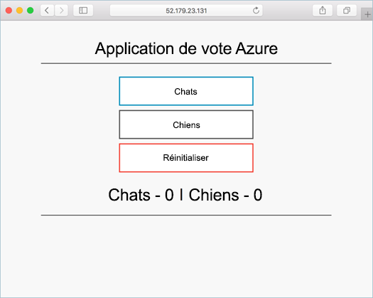

# <a name="tutorial-prepare-an-application-for-azure-kubernetes-service-aks"></a>Didacticiel : préparer une application pour Azure Kubernetes Service (AKS)

Dans ce didacticiel (le premier d’une série de sept), vous allez préparer une application à plusieurs conteneurs à son utilisation dans Kubernetes. Les outils de développement existants tels que Docker Compose servent à créer et tester en local une application. Vous allez apprendre à effectuer les actions suivantes :

> [!div class="checklist"]
> * Cloner un exemple de source de l’application à partir de GitHub
> * Créer une image conteneur à partir de l’exemple de source de l’application
> * Test l’application à plusieurs conteneurs dans un environnement Docker local

Une fois ces étapes effectuées, l’application suivante s’exécute dans votre environnement de développement local :



Dans d’autres tutoriels, l’image conteneur est chargée dans un registre Azure Container Registry, puis déployée dans un cluster AKS.

## <a name="before-you-begin"></a>Avant de commencer

Ce didacticiel présuppose une compréhension de base des concepts Docker essentiels, tels que les conteneurs, les images de conteneur et les commandes `docker`. Pour apprendre les principes de base des conteneurs, consultez [Bien démarrer avec Docker][docker-get-started].

Pour suivre ce tutoriel, vous avez besoin d’un environnement de développement Docker local exécutant des conteneurs Linux. Docker fournit des packages qui le configurent sur un système [Mac][docker-for-mac], [Windows][docker-for-windows] ou [Linux][docker-for-linux].

Azure Cloud Shell n’inclut pas les composants Docker requis pour effectuer chaque étape de ces didacticiels. Par conséquent, nous recommandons d’utiliser un environnement de développement Docker complet.

## <a name="get-application-code"></a>Obtenir le code d’application

L’exemple d’application utilisé dans ce didacticiel est une application de votes de base. L’application est constituée d’un composant web frontal et d’une instance Redis principale. Le composant web est empaqueté dans une image conteneur personnalisée. L’instance Redis utilise une image non modifiée de Docker Hub.

Utilisez [git][] pour cloner l’exemple d’application dans votre environnement de développement :

```console
git clone https://github.com/Azure-Samples/azure-voting-app-redis.git
```

Passez au répertoire cloné.

```console
cd azure-voting-app-redis
```

Dans le répertoire se trouvent le code source de l’application, un fichier Docker Compose précréé et un fichier manifeste Kubernetes. Ces fichiers sont utilisés tout au long de ce didacticiel.

## <a name="create-container-images"></a>Créer des images de conteneur

Vous pouvez utiliser [Docker Compose][docker-compose] pour automatiser la création d’images conteneur et le déploiement d’applications multiconteneurs.

Utilisez l’exemple de fichier `docker-compose.yaml` pour créer l’image conteneur, téléchargez l’image Redis, puis démarrez l’application :

```console
docker-compose up -d
```

Une fois terminé, utilisez la commande [docker images][docker-images] pour afficher les images créées. Trois images ont été téléchargées ou créées. L’image *azure-vote-front* contient l’application front-end et utilise l’image *nginx-flask* comme base. L’image *redis* est utilisée pour démarrer une instance Redis.

```
$ docker images

REPOSITORY                                     TAG                 IMAGE ID            CREATED             SIZE
mcr.microsoft.com/azuredocs/azure-vote-front   v1                  84b41c268ad9        9 seconds ago       944MB
mcr.microsoft.com/oss/bitnami/redis            6.0.8               3a54a920bb6c        2 days ago          103MB
tiangolo/uwsgi-nginx-flask                     python3.6           a16ce562e863        6 weeks ago         944MB
```

Exécutez la commande [docker ps][docker-ps] pour voir les conteneurs en cours d’exécution :

```
$ docker ps

CONTAINER ID        IMAGE                                             COMMAND                  CREATED             STATUS              PORTS                           NAMES
d10e5244f237        mcr.microsoft.com/azuredocs/azure-vote-front:v1   "/entrypoint.sh /sta…"   3 minutes ago       Up 3 minutes        443/tcp, 0.0.0.0:8080->80/tcp   azure-vote-front
21574cb38c1f        mcr.microsoft.com/oss/bitnami/redis:6.0.8         "/opt/bitnami/script…"   3 minutes ago       Up 3 minutes        0.0.0.0:6379->6379/tcp          azure-vote-back
```

## <a name="test-application-locally"></a>Tester l’application localement

Pour voir l’application en cours d’exécution, entrez `http://localhost:8080` dans un navigateur web local. L’exemple d’application est chargée, comme indiqué dans l’exemple suivant :


## <a name="clean-up-resources"></a>Nettoyer les ressources

Maintenant que la fonctionnalité de l’application a été validée, les conteneurs en cours d’exécution peuvent être arrêtés et supprimés. Ne supprimez pas les images de conteneur. Dans le didacticiel suivant, l’image *azure-vote-front* est chargée dans une instance Azure Container Registry.

Arrêtez et supprimez les instances et ressources de conteneur avec la commande [docker-compose down][docker-compose-down] :

```console
docker-compose down
```

Lorsque l’application locale a été supprimée, vous disposez d’une image Docker qui contient l’application Azure Vote, *azure-vote-front*, à utiliser avec le tutoriel suivant.

## <a name="next-steps"></a>Étapes suivantes

Dans ce didacticiel, une application a été testée et les images de conteneur créées pour l’application. Vous avez appris à :

> [!div class="checklist"]
> * Cloner un exemple de source de l’application à partir de GitHub
> * Créer une image conteneur à partir de l’exemple de source de l’application
> * Test l’application à plusieurs conteneurs dans un environnement Docker local

Passez au didacticiel suivant pour savoir comment stocker des images de conteneur dans Azure Container Registry.

> [!div class="nextstepaction"]
> [Envoyer des images à Azure Container Registry][aks-tutorial-prepare-acr]

<!-- LINKS - external -->
[docker-compose]: https://docs.docker.com/compose/
[docker-for-linux]: https://docs.docker.com/engine/installation/#supported-platforms
[docker-for-mac]: https://docs.docker.com/docker-for-mac/
[docker-for-windows]: https://docs.docker.com/docker-for-windows/
[docker-get-started]: https://docs.docker.com/get-started/
[docker-images]: https://docs.docker.com/engine/reference/commandline/images/
[docker-ps]: https://docs.docker.com/engine/reference/commandline/ps/
[docker-compose-down]: https://docs.docker.com/compose/reference/down
[git]: https://git-scm.com/downloads

<!-- LINKS - internal -->
[aks-tutorial-prepare-acr]: ./tutorial-kubernetes-prepare-acr.md
