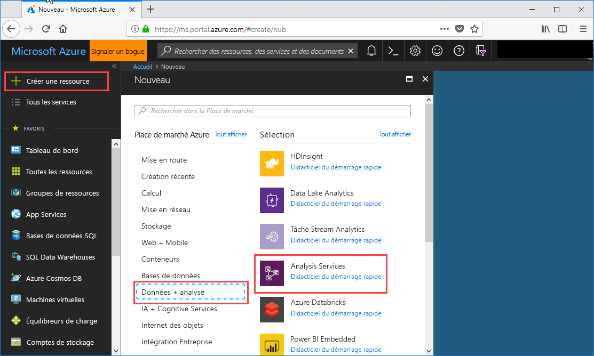
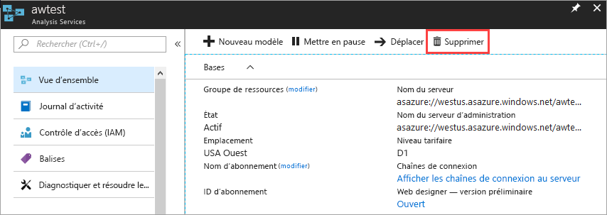

# Démarrage rapide : créer un serveur - Portail

Ce démarrage rapide explique comment créer une ressource de serveur Analysis Services dans votre abonnement Azure à l’aide du portail.

## Conditions préalables requises 

* **Abonnement Azure** : visitez [version d’évaluation gratuite d’Azure](https://azure.microsoft.com/offers/ms-azr-0044p/) pour créer un compte.
* **Azure Active Directory** : votre abonnement doit être associé à un locataire Azure Active Directory. Vous devez également être connecté à Azure avec un compte dans cette instance d’Azure Active Directory. Pour en savoir plus, consultez [Authentification et autorisations utilisateur](analysis-services-manage-users.md).

## Connectez-vous au portail Azure. 

[Connectez-vous au portail](https://portal.azure.com)

## Créer un serveur

1. Cliquez sur **+ Créer une ressource** > **Analytique** > **Analysis Services**.

    

2. Dans **Analysis Services**, renseignez les champs requis, puis cliquez sur **Créer**.
   
   * **Nom du serveur** : tapez un nom unique utilisé pour se référencer au serveur. Le nom du serveur doit commencer par un caractère minuscule et contenir entre 3 et 128 caractères minuscules et chiffres. Les espaces et caractères spéciaux ne sont pas autorisés.
   * **Abonnement** : sélectionnez l’abonnement à associer à ce serveur.
   * **Groupe de ressources** : créez un groupe de ressources ou sélectionnez un groupe existant. Ces groupes de ressources sont conçus pour vous aider à gérer une collection de ressources Azure. Pour en savoir plus, consultez les [groupes de ressources](../azure-resource-manager/management/overview.md).
   * **Emplacement** : cet emplacement du centre de données Azure héberge le serveur. Choisissez l’emplacement le plus proche de votre plus grande base d’utilisateurs.
   * **Niveau de tarification**: sélectionnez un niveau de tarification. Si vous effectuez des tests et envisagez d’installer l’exemple de base de données model, sélectionnez le niveau gratuit **D1**. Pour en savoir plus, voir [Tarification d’Analysis Services](https://azure.microsoft.com/pricing/details/analysis-services/). 
   * **Administrateur** : par défaut, il s’agit du compte avec lequel vous êtes connecté. Vous pouvez choisir un autre compte de votre annuaire Azure Active Directory.
   * **Paramètres du stockage de sauvegarde** : facultatif. Si vous possédez déjà un [compte de stockage](../storage/common/storage-introduction.md), vous pouvez le spécifier en tant que compte par défaut pour la sauvegarde de la base de données model. Vous pouvez également spécifier les paramètres de [sauvegarde et restauration](analysis-services-backup.md) ultérieurement.
   * **Date d’expiration de la clé de stockage** : facultatif. Spécifiez une période d’expiration pour la clé de stockage.

La création du serveur prend généralement moins d’une minute. Si vous avez sélectionné **Add to Portal** (Ajouter au portail), accédez au portail pour voir votre nouveau serveur. Ou, accédez à **Tous les services** > **Analysis Services** pour voir si votre serveur est prêt. Les serveurs prennent en charge les modèles tabulaires aux niveaux de compatibilité 1200 et ultérieurs. Le niveau de compatibilité des modèles est spécifié dans Visual Studio ou SSMS.

## Nettoyer les ressources

Quand vous n’en avez plus besoin, supprimez votre serveur. Dans la page **Vue d’ensemble** de votre serveur, cliquez sur **Supprimer**. 

 

## Étapes suivantes
Dans ce démarrage rapide, vous avez appris à créer un serveur dans votre abonnement Azure. Maintenant que vous avez serveur, vous pouvez le sécuriser en configurant un pare-feu de serveur (facultatif). Vous pouvez également ajouter un modèle de données d’exemple de base à votre serveur directement à partir du portail. Un exemple de modèle permet d’en savoir plus sur la configuration des rôles de base de données de modèle et le test des connexions client. Pour en savoir plus, passez au tutoriel sur l’ajout d’un exemple de modèle.

> [!div class="nextstepaction"]
> [Démarrage rapide : configurer un pare-feu de serveur - Portail](analysis-services-qs-firewall.md)   
> [!div class="nextstepaction"]
> [Tutoriel : ajouter un exemple de modèle à votre serveur](analysis-services-create-sample-model.md)
