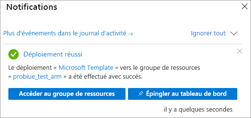

# <a name="quickstart-create-a-server---azure-resource-manager-template"></a>Démarrage rapide : Créer un serveur - Modèle Azure Resource Manager

Ce guide de démarrage rapide explique comment créer une ressource de serveur Analysis Services dans votre abonnement Azure avec un modèle Resource Manager.

[!INCLUDE [About Azure Resource Manager](../../includes/resource-manager-quickstart-introduction.md)]

## <a name="prerequisites"></a>Prérequis

* **Abonnement Azure** : Visitez [Version d’évaluation gratuite d’Azure](https://azure.microsoft.com/offers/ms-azr-0044p/) pour créer un compte.
* **Azure Active Directory** : Votre abonnement doit être associé à un locataire Azure Active Directory. Vous devez également être connecté à Azure avec un compte dans cette instance d’Azure Active Directory. Pour en savoir plus, consultez [Authentification et autorisations utilisateur](analysis-services-manage-users.md).

## <a name="create-a-server"></a>Créer un serveur

### <a name="review-the-template"></a>Vérifier le modèle

Le modèle utilisé dans ce guide de démarrage rapide est tiré des [modèles de démarrage rapide Azure](https://azure.microsoft.com/resources/templates/101-analysis-services-create/).

:::code language="json" source="~/quickstart-templates/101-analysis-services-create/azuredeploy.json":::

Une seule ressource [Microsoft.AnalysisServices/servers](https://docs.microsoft.com/azure/templates/microsoft.analysisservices/2017-08-01/servers) avec une règle de pare-feu est définie dans le modèle. 

### <a name="deploy-the-template"></a>Déployer le modèle

1. Sélectionnez le lien Déployer sur Azure suivant pour vous connecter à Azure et ouvrir un modèle. Le modèle sert à créer une ressource de serveur Analysis Services et à spécifier les propriétés obligatoires et facultatives.

   <a href="https://portal.azure.com/#create/Microsoft.Template/uri/https%3A%2F%2Fraw.githubusercontent.com%2FAzure%2Fazure-quickstart-templates%2Fmaster%2F101-analysis-services-create%2Fazuredeploy.json"></a>

2. Sélectionnez ou entrez les valeurs suivantes.

    Sauf indication contraire, utilisez les valeurs par défaut.

    * **Abonnement**: Sélectionnez un abonnement Azure.
    * **Groupe de ressources** : cliquez sur **Créer**, puis entrez un nom unique pour le nouveau groupe de ressources.
    * **Emplacement** : sélectionnez un emplacement par défaut pour les ressources créées dans le groupe de ressources.
    * **Nom du serveur** : entrez un nom pour la ressource de serveur. 
    * **Emplacement** : ignorez pour Analysis Services. L’emplacement est spécifié dans Emplacement du serveur.
    * **Emplacement du serveur** : entrez l’emplacement du serveur Analysis Services. Il s’agit souvent de la même région que l’emplacement par défaut spécifié pour le groupe de ressources, mais ce n’est pas obligatoire. Par exemple, **USA Centre Nord**. Pour connaître les régions prises en charge, consultez [Disponibilité d’Analysis Services par région](analysis-services-overview.md#availability-by-region).
    * **Nom de la référence SKU** : entrez le nom de la référence SKU pour le serveur Analysis Services à créer. Choisissez parmi : B1, B2, D1, S0, S1, S2, S3, S4, S8v2, S9v2. La disponibilité de la référence SKU de la région. La référence S0 ou D1 est recommandée pour l’évaluation et le test.
    * **Capacity** : entrez le nombre total d’instances de scale-out du réplica de requête. Le scale-out de plus d’une instance n’est pris en charge que dans certaines régions.
    * **Paramètres de pare-feu** : entrez les règles de pare-feu entrantes à définir pour le serveur. Si elles ne sont pas spécifiées, le pare-feu est désactivé.
    * **URI de conteneur Blob de sauvegarde** : entrez l’URI SAS d’un conteneur de Stockage Blob Azure privé avec les autorisations de lecture, d’écriture et de liste. Obligatoire uniquement si vous envisagez d’utiliser la [sauvegarde/restauration](analysis-services-backup.md).
    * **J’accepte les termes et conditions mentionnés ci-dessus** : cochez la case.

3. Sélectionnez **Achat**. Une fois que le serveur a été déployé avec succès, vous recevez une notification :

   

## <a name="validate-the-deployment"></a>Valider le déploiement

Utilisez le portail Azure ou Azure PowerShell pour vérifier que le groupe de ressources et la ressource de serveur ont été créés.

#### <a name="powershell"></a>PowerShell

```azurepowershell-interactive
$resourceGroupName = Read-Host -Prompt "Enter the Resource Group name"
(Get-AzResource -ResourceType "Microsoft.AnalysisServices/servers" -ResourceGroupName $resourceGroupName).Name
 Write-Host "Press [ENTER] to continue..."
```

---

## <a name="clean-up-resources"></a>Nettoyer les ressources

Quand vous n’avez plus besoin du groupe de ressources et de la ressource de serveur, utilisez le portail Azure, Azure CLI ou Azure PowerShell pour les supprimer.

# <a name="cli"></a>[INTERFACE DE LIGNE DE COMMANDE](#tab/CLI)

```azurecli-interactive
echo "Enter the Resource Group name:" &&
read resourceGroupName &&
az group delete --name $resourceGroupName &&
echo "Press [ENTER] to continue ..."
```

# <a name="powershell"></a>[PowerShell](#tab/PowerShell)

```azurepowershell-interactive
$resourceGroupName = Read-Host -Prompt "Enter the Resource Group name"
Remove-AzResourceGroup -Name $resourceGroupName
Write-Host "Press [ENTER] to continue..."
```

## <a name="next-steps"></a>Étapes suivantes

Dans ce guide de démarrage rapide, vous avez utilisé un modèle Azure Resource Manager pour créer un groupe de ressources et une ressource de serveur Azure Analysis Services. Une fois que vous avez créé une ressource de serveur à l’aide du modèle, envisagez les opérations suivantes :
- [Démarrage rapide : Créer un serveur - PowerShell](analysis-services-create-powershell.md)
- [Ajouter un exemple de modèle à partir du portail](analysis-services-create-sample-model.md)
- [Configurer les rôles d’utilisateur et d’administrateur de serveur](tutorials/analysis-services-tutorial-roles.md)