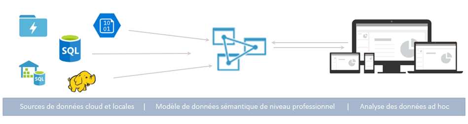
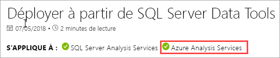

# Qu’est-ce qu’Azure Analysis Services ?

Azure Analysis Services est une plateforme entièrement gérée en tant que service (PaaS) qui fournit des modèles de données de qualité professionnelle dans le cloud. Utilisez des fonctionnalités de regroupement et de modélisation avancées pour combiner des données provenant de plusieurs sources de données, définir des mesures et sécuriser vos données dans un seul modèle de données sémantique tabulaire approuvé. Le modèle de données permet aux utilisateurs d’effectuer plus facilement et rapidement l’analyse de données ad hoc au moyen d’outils tels que Power BI et Excel.

**Vidéo :** consultez [Vue d'ensemble d'Azure Analysis Services](https://sec.ch9.ms/ch9/d6dd/a1cda46b-ef03-4cea-8f11-68da23c5d6dd/AzureASoverview_high.mp4) pour savoir comment Azure Analysis Services s'intègre aux fonctionnalités BI globales de Microsoft.

## Opérationnel rapidement

Dans le portail Azure, vous pouvez [créer un serveur](analysis-services-create-server.md) en quelques minutes. Et, avec les [modèles](../azure-resource-manager/resource-manager-create-first-template.md) Azure Resource Manager et PowerShell, vous pouvez créer des serveurs à l’aide d’un modèle déclaratif. Un même modèle vous permet de déployer plusieurs ressources de serveur, ainsi que d’autres composants Azure tels que des comptes de stockage et Azure Functions. 

**Vidéo :** consultez [Automatisation du déploiement](https://channel9.msdn.com/series/Azure-Analysis-Services/AzureAnalysisServicesAutomation) afin d'en savoir plus sur la façon dont vous pouvez utiliser Azure Automation pour accélérer la création du serveur.

Azure Analysis Services s’intègre à de nombreux services Azure qui vous permettent de créer des solutions d’analyse élaborées. Son intégration à [Azure Active Directory](../active-directory/fundamentals/active-directory-whatis.md) assure un accès sécurisé en fonction du rôle à vos données critiques. L’intégration aux pipelines [Azure Data Factory](../data-factory/introduction.md) est possible grâce à l’inclusion d’une activité qui charge des données dans le modèle. [Azure Automation](../automation/automation-intro.md) et [Azure Functions](../azure-functions/functions-overview.md) sont utilisables pour une orchestration légère de modèles à l’aide d’un code personnalisé. 

## Le niveau approprié, quand vous en avez besoin

Azure Analysis Services est disponible pour les niveaux **Développeur**, **De base** et **Standard**. Dans chaque niveau, les coûts de plan varient en fonction de la puissance de traitement, des QPU (Query Processing Units) et de la taille de la mémoire. Lorsque vous créez un serveur, vous sélectionnez un plan au sein d’un niveau. Vous pouvez modifier les plans vers le haut ou vers le bas au sein du même niveau, ou le passer à un niveau supérieur, mais vous ne pouvez pas le rétrograder d’un niveau supérieur à un niveau inférieur.

### Niveau Développeur

Ce niveau est recommandé pour les scénarios d’évaluation, de développement et de test. Un plan inclut les mêmes fonctionnalités que le niveau Standard, mais est limité en termes de puissance de traitement, de nombre d’unités de traitement des requêtes (QPU) et de taille de mémoire. L'évolutivité du réplica de requête *n'est pas disponible* pour ce niveau. Ce niveau ne propose pas de contrat SLA.

|Plan  |QPU (unités de traitement des requêtes)  |Mémoire (Go)  |
|---------|---------|---------|
|D1    |    20     |    3     |

### Niveau de base

Ce niveau est recommandé pour les solutions de production présentant de petits modèles tabulaires, une concurrence limitée entre les utilisateurs et des besoins simples en matière d’actualisation des données. L'évolutivité du réplica de requête *n'est pas disponible* pour ce niveau. Les fonctionnalités de perspectives, de partitions multiples et de modèle tabulaire DirectQuery *ne sont pas prises en charge* dans ce niveau.  

|Plan  |QPU (unités de traitement des requêtes)  |Mémoire (Go)  |
|---------|---------|---------|
|B1    |    40     |    10     |
|B2    |    80     |    16     |

### Niveau standard

Ce niveau est destiné aux applications de production stratégiques qui nécessitent une simultanéité élastique des utilisateurs et ont des modèles de données à la croissance rapide. Il prend en charge l’actualisation des données avancée pour des mises à jour du modèle de données quasiment en temps réel, et prend en charge toutes les fonctionnalités de modélisation tabulaire.

|Plan  |QPU (unités de traitement des requêtes)  |Mémoire (Go)  |
|---------|---------|---------|
|S0    |    40     |    10     |
|S1    |    100     |    25     |
|S2    |    200     |    50     |
|S4    |    400     |    100     |
|S8 [1](#depr), [2](#rec)    |    320    |    200     |
|S9 [1](#depr), [2](#rec)    |    640    |    400     |
|S8v2 [1](#depr)   |    640     |    200     |
|S9v2 [1](#depr)    |    1 280    |    400     |

<a name="depr">1</a> - Non disponible dans toutes les régions.   
<a name="rec">2</a> - Ce plan est déprécié. v2 est recommandé.

## Disponibilité par région

Azure Analysis Services est pris en charge dans les régions du monde entier. Les plans pris en charge et la disponibilité des réplicas de requête dépendent de la région que vous choisissez. La disponibilité des plans et des réplicas de requête peut varier en fonction des besoins et des ressources disponibles pour chaque région. 

### Amérique

|Région  | Plans pris en charge | Réplicas de requête (plans Standard uniquement) |
|---------|---------|:---------:|
|Brésil Sud     |    B1, B2, S0, S1, S2, S4, D1     |     1    |
|Centre du Canada    |     B1, B2, S0, S1, S2, S4, D1    |     1    |
|USA Est     |     B1, B2, S0, S1, S2, S4, D1    |    1     |
|USA Est 2     |     B1, B2, S0, S1, S2, S4, D1   |    7    |
|USA Est 2     |     S8[2](#rec), S9[2](#rec), S8v2, S9v2   |    1    |
|Centre-Nord des États-Unis     |     B1, B2, S0, S1, S2, S4, D1     |    1     |
|USA Centre     |    B1, B2, S0, S1, S2, S4, D1     |    1     |
|États-Unis - partie centrale méridionale     |    B1, B2, S0, S1, S2, S4, D1     |    1     |
|Centre-USA Ouest   |     B1, B2, S0, S1, S2, S4, D1    |    3     |
|USA Ouest     |    B1, B2, S0, S1, S2, S4, D1    |    7   |
|USA Ouest     |    S8[2](#rec), S9[2](#rec), S8v2, S9v2   |    2  |
|USA Ouest 2    |    B1, B2, S0, S1, S2, S4, D1    |    3   |
|USA Ouest 2    |    S8[2](#rec), S9[2](#rec), S8v2, S9v2  |    1     |

### Europe

|Région  | Plans pris en charge | Réplicas de requête (plans Standard uniquement) |
|---------|---------|:---------:|
|Europe Nord     |    B1, B2, S0, S1, S2, S4, D1      |    7     |
|Europe Nord     |    S8v2, S9v2      |    3     |
|Sud du Royaume-Uni     |    B1, B2, S0, S1, S2, S4, D1      |     1    |
|Europe Ouest     |    B1, B2, S0, S1, S2, S4, D1   |    7    |
|Europe Ouest    |   S8[2](#rec), S9[2](#rec), S8v2, S9v2  |  1  |

### Asie-Pacifique 

|Région  | Plans pris en charge | Réplicas de requête (plans Standard uniquement) |
|---------|---------|:---------:|
|Australie Est     |    B1, B2, S0, S1, S2, S4     |    3     |
|Australie Est     |    S8[2](#rec), S9[2](#rec), S8v2, S9v2    |    1     |
|Sud-Australie Est     | B1, B2, S0, S1, S2, S4, D1       |    1     |
|Japon Est     |   B1, B2, S0, S1, S2, S4, D1       |    1     |
|Asie Sud-Est     |     B1, B2, S0, S1, S2, S4, S8[2](#rec), S9[2](#rec), S8v2, S9v2, D1     |   1      |
|Inde Ouest     |    B1, B2, S0, S1, S2, S4, D1     |    1     |

## Évolutif selon vos besoins

### Monter en puissance\réduire la puissance, suspendre et reprendre

Augmentez la puissance, réduisez la puissance ou suspendez votre serveur. Utilisez le portail Azure ou obtenez le contrôle total à la volée à l’aide de PowerShell. Vous paierez uniquement pour ce que vous utiliserez.  

### Ressources de scale-out pour des réponses aux requêtes rapides

Grâce au scale-out, les requêtes des clients sont distribuées entre plusieurs *réplicas de requête* dans un pool de requêtes. Les réplicas de requête contiennent des copies synchronisées de vos modèles tabulaires. Grâce à la répartition de la charge de travail de requête, les temps de réponse lors de charges de travail de requête élevées peuvent être réduits. Les opérations de traitement du modèle peuvent être séparées du pool de requêtes, garantissant ainsi que les requêtes des clients ne soient pas affectées par les opérations de traitement. 

Vous pouvez créer un pool de requêtes comportant jusqu’à sept réplicas de requête supplémentaires (pour un total de huit, votre serveur compris). Le nombre de réplicas de requête que vous pouvez avoir dans votre pool dépend du plan et de la région que vous avez choisis. Les réplicas de requête ne peuvent pas être propagés en dehors de la région de votre serveur. Les réplicas de requête sont facturés au même prix que votre serveur.

Comme pour la modification des niveaux, vous pouvez effectuer un scale-out des réplicas de requête selon vos besoins. Configurez le scale-out dans le portail ou à l’aide des API REST. Pour en savoir plus, consultez [Scale-out d’Azure Analysis Services](analysis-services-scale-out.md).

## Tarifs

Le coût total dépend de plusieurs facteurs. Par exemple, la région que vous avez choisie, le niveau, les réplicas de requête et suspendre/reprendre. Utilisez la calculatrice [Azure Analysis Services Pricing](https://azure.microsoft.com/pricing/details/analysis-services/) (Tarification d’Azure Analysis Services) pour déterminer la tarification standard pour votre région. Cet outil calcule la tarification pour une instance de serveur unique pour une seule région. N’oubliez pas que les réplicas de requête sont facturés au même prix que le serveur. 

## Basé sur SQL Server Analysis Services

Azure Analysis Services est compatible avec de nombreuses fonctionnalités d’exception déjà intégrées à SQL Server Analysis Services Enterprise Edition. Azure Analysis Services prend en charge les modèles tabulaires aux [niveaux de compatibilité](analysis-services-compat-level.md) 1200 et ultérieurs. Les modèles tabulaires sont des constructions de modélisation relationnelle (modèle, tables, colonnes), articulés dans des définitions d’objets de métadonnées tabulaires dans le code de langage de script de modèle tabulaire (TMSL, Tabular Model Scripting Language) et de modèle d’objet tabulaire (TOM, Tabular Object Model). Les partitions, les perspectives, la sécurité au niveau des lignes, les relations bidirectionnelles et les traductions sont toutes prises en charge\*. Les modèles multidimensionnels et PowerPivot pour SharePoint *ne sont pas* pris en charge dans Azure Analysis Services.

Les modèles tabulaires dans les modes En mémoire et DirectQuery sont pris en charge. En mode En mémoire (par défaut), les modèles tabulaires prennent en charge plusieurs sources de données. Étant donné que les données de modèle sont fortement compressées et mises en mémoire cache, ce mode offre la réponse de requête la plus rapide pour les quantités importantes de données. Il offre également la plus grande flexibilité pour les jeux de données et les requêtes complexes. Le partitionnement permet des charges incrémentielles, augmente la parallélisation et réduit la consommation de mémoire. D’autres fonctionnalités de modélisation de données avancées incluent les tables calculées, et toutes les fonctions DAX sont prises en charge. Les modèles en mémoire doivent être actualisés (traités) pour mettre à jour les données en cache à partir de sources de données. Grâce à la prise en charge de principaux de service Azure, les opérations d’actualisation imprévues à l’aide de PowerShell, TOM, TMSL et REST offrent une flexibilité permettant de garantir que vos données de modèle sont toujours à jour. 

Le mode DirectQuery* tire profit de la base de données relationnelle principale pour le stockage et l’exécution de la requête. Les jeux de données extrêmement volumineux de sources de données SQL Server, SQL Server Data Warehouse, Azure SQL Database, Azure Synapse Analytics (SQL Data Warehouse), Oracle et Teradata sont pris en charge. Les jeux de données de serveur principal peuvent dépasser la mémoire de ressource serveur disponible. Des scénarios d’actualisation de modèle de données complexes ne sont pas nécessaires. Il existe également certaines restrictions, telles que des limitations des types de sources de données, des limitations liées aux formules DAX, et certaines fonctionnalités de modélisation de données avancées qui ne sont pas prises en charge. Avant de déterminer le mode vous convenant le mieux, consultez [Mode DirectQuery](https://docs.microsoft.com/analysis-services/tabular-models/directquery-mode-ssas-tabular).

\* La disponibilité des fonctionnalités dépend du niveau.

## Sources de données prises en charge

Les modèles tabulaires dans Azure Analysis Services prennent en charge une grande variété de sources de données allant des fichiers texte simples à Big Data dans Azure Data Lake Store. Pour plus d’informations, consultez les [Sources de données prises en charge par Azure Analysis Services](analysis-services-datasource.md).

## Niveau de compatibilité

Le niveau de compatibilité fait référence aux comportements spécifiques de chaque version dans le moteur Analysis Services. Azure Analysis Services prend en charge les modèles tabulaires aux niveaux de compatibilité 1200 et ultérieurs. Pour plus d’informations, consultez [Niveau de compatibilité pour les modèles tabulaires](https://docs.microsoft.com/analysis-services/tabular-models/compatibility-level-for-tabular-models-in-analysis-services).

## Sécuriser vos données

Azure Analysis Services protège vos données sensibles à plusieurs niveaux. Comme tout service Azure, Analysis Services fournit automatiquement le niveau de protection DDoS **De base** qui est intégré à la plateforme Azure. Pour en savoir plus, consultez [Vue d’ensemble du service Protection DDos Standard Azure](../virtual-network/ddos-protection-overview.md). 

Au niveau du serveur, Analysis Services fournit un pare-feu, l’authentification Azure, les rôles administrateur de serveur et le chiffrement côté serveur. Au niveau du modèle de données, les rôles utilisateur ainsi que la sécurité au niveau des lignes et des objets garantissent que vos données sont protégées et qu’elles ne sont visibles que par les utilisateurs ayant les autorisations appropriées.

### Pare-feu

Le pare-feu Azure Analysis Services bloque toutes les connexions clients autres que les adresses IP spécifiées dans les règles. Par défaut, la protection par pare-feu n’est pas activée sur les nouveaux serveurs. Il est recommandé d’activer la protection par pare-feu et de configurer les règles dans un script de provisionnement du serveur, ou dans le portail juste après avoir créé le serveur. Configurez des règles spécifiant des adresses IP autorisées par adresses IP clients individuelles ou par plage. Les connexions Power BI (service) peuvent également être autorisées ou bloquées. Configurez le pare-feu et les règles dans le portail ou à l’aide de PowerShell. Pour en savoir plus, consultez [Configuration d’un pare-feu de serveur](analysis-services-qs-firewall.md).

### Authentification

L’authentification utilisateur est gérée par [Azure Active Directory (AAD)](../active-directory/fundamentals/active-directory-whatis.md). Lors de la connexion, les utilisateurs utilisent une identité de compte d’organisation avec accès en fonction du rôle à la base de données. Les identités utilisateur doivent être des membres de l’Azure Active Directory par défaut pour l’abonnement dans lequel se trouve le serveur. Pour en savoir plus, consultez [Authentification et autorisations utilisateur](analysis-services-manage-users.md).

### Sécurité des données

Azure Analysis Services utilise le stockage Blob Azure pour conserver le stockage et les métadonnées des bases de données Analysis Services. Les fichiers de données Blob sont chiffrés à l’aide du [chiffrement côté serveur (SSE) Azure Blob](../storage/common/storage-service-encryption.md). Si vous utilisez le mode Requête directe, seules les métadonnées sont stockées. Les données réelles sont accessibles via un protocole chiffré à partir de la source de données au moment de la requête.

Vous sécurisez l’accès aux sources de données locales dans votre organisation en installant et en configurant une [Passerelle de données locale](analysis-services-gateway.md). Les passerelles fournissent un accès aux données pour les modes DirectQuery et En mémoire.

### Rôles

Analysis Services utilise l’[autorisation en fonction du rôle](https://docs.microsoft.com/analysis-services/tabular-models/roles-ssas-tabular) qui accorde l’accès au serveur et aux opérations, objets et données de base de données de modèle. Tous les utilisateurs qui accèdent à un serveur ou une base de données le font avec leur compte d’utilisateur Azure AD au sein d’un rôle assigné. Le rôle administrateur du serveur se trouve au niveau de la ressource serveur. Par défaut, le compte utilisé lors de la création d’un serveur est automatiquement inclus dans le rôle Administrateur de serveur. D’autres comptes d’utilisateur et de groupe sont ajoutés à l’aide du portail, SSMS ou PowerShell.
  
Les utilisateurs finaux non administrateurs qui interrogent les données se voient accorder un accès via des rôles de base de données. Un rôle de bases de données est créé en tant qu’objet distinct dans la base de données et s’applique uniquement à la base de données dans laquelle il est créé. Les rôles de base de données sont définis par les autorisations Administrateur, Lecture et Lecture et traitement (base de données). Les comptes d’utilisateur et de groupe sont ajoutés à l’aide de SSMS ou PowerShell.

### Sécurité au niveau des lignes

Les modèles tabulaires à tous les niveaux de compatibilité prennent en charge la sécurité au niveau des lignes. La sécurité au niveau des lignes est configurée dans le modèle en utilisant des expressions DAX qui définissent les lignes dans une table, et toutes les lignes dans la direction « plusieurs » d’une table liée qu’un utilisateur peut interroger. Des filtres de lignes utilisant des expressions DAX sont définis pour les autorisations Lecture et Lecture et traitement. 

### Sécurité au niveau des objets 

Les modèles tabulaires au niveau de compatibilité 1400 prennent en charge la sécurité au niveau des objets qui inclut la sécurité au niveau des tables et la sécurité au niveau des colonnes. La sécurité au niveau des objets est définie dans les métadonnées basées sur JSON dans le fichier Model.bim à l’aide de TMSL ou TOM. Pour en savoir plus, consultez [Sécurité au niveau des objets](https://docs.microsoft.com/analysis-services/tabular-models/object-level-security).

### Automatisation à l’aide de principaux de service

Les principaux de service sont des ressources d’application Azure Active Directory que vous créez à l’intérieur de votre locataire pour effectuer des opérations sans assistance au niveau du service et des ressources. Les principaux du service sont utilisés avec Azure Automation, avec le mode sans assistance de PowerShell, avec des applications clientes personnalisées et avec des applications web, dans le but d’automatiser les tâches courantes telles que actualiser, monter en puissance/réduire la puissance et suspendre/reprendre. Les autorisations sont attribuées aux principaux du service via l’appartenance au rôle. Pour en savoir plus, consultez [Automatisation à l’aide de principaux de service](analysis-services-service-principal.md).

### Gouvernance Azure

Azure Analysis Services est régi par les [Termes du contrat Microsoft Online Services](https://www.microsoftvolumelicensing.com/DocumentSearch.aspx?Mode=3&DocumentTypeId=31) et la [Déclaration de confidentialité Microsoft](https://privacy.microsoft.com/privacystatement).
Pour plus d’informations sur la sécurité Azure, consultez [Microsoft Trust Center](https://www.microsoft.com/trustcenter).

## Utiliser les outils que vous connaissez déjà

### Visual Studio

Développez et déployez des modèles à l’aide de Visual Studio avec des projets Analysis Services. L’extension de projets Analysis Services inclut des modèles et des Assistants qui permettent d’être rapidement opérationnel. L’environnement de création de modèles dans Visual Studio comprend maintenant la fonctionnalité moderne de mashup et de requête de source de données Get Data pour les modèles tabulaires 1400 et versions ultérieures. Si connaissez déjà Get Data dans Power BI Desktop et Excel 2016, vous devriez déjà savoir à quel point il est aisé de créer des requêtes de source de données hautement personnalisables. 

Les projets Microsoft Analysis Services sont disponibles sous la forme d’un package VSIX installable gratuitement. [Téléchargez à partir de la Place de marché](https://marketplace.visualstudio.com/items?itemName=ProBITools.MicrosoftAnalysisServicesModelingProjects). L’extension fonctionne avec n’importe quelle version de Visual Studio 2017 (et versions ultérieures), y compris l’édition Community gratuite.

### SQL Server Management Studio

Gérez vos serveurs et bases de données model à l’aide de [SQL Server Management Studio (SSMS)](https://docs.microsoft.com/sql/ssms/download-sql-server-management-studio-ssms). Connectez-vous à vos serveurs dans le cloud. Exécutez les scripts TMSL directement à partir de la fenêtre de requête XMLA et automatisez des tâches à l’aide des scripts TMSL et PowerShell. De nouvelles fonctionnalités sont régulièrement implémentées : SSMS est mis à jour tous les mois.

### Outils open source

Analysis Services compte une communauté active de développeurs créateurs d’outils. Prenez soin de consulter [Tabular Editor](https://tabulareditor.github.io/), un outil open source qui permet de créer, d’entretenir et de gérer des modèles tabulaires en utilisant un éditeur léger et intuitif. [DAX Studio](https://daxstudio.org/) est un excellent outil open source pour la création, le diagnostic, le réglage des performances et l’analyse DAX.

### PowerShell

Les tâches de gestion des ressources du serveur telles que la création de ressources du serveur, l’interruption ou la reprise des opérations du serveur ou la modification du niveau de service utilisent des cmdlets Azure PowerShell. D’autres tâches de gestion des bases de données telles que l’ajout ou la suppression de membres de rôle, le traitement, ou l’exécution de scripts TMSL utilisent l’applet de commande dans le module Sqlserver. Pour en savoir plus, consultez [Gérer Azure Analysis Services avec PowerShell](analysis-services-powershell.md).

### Modèle d’objet et scripts

Les modèles tabulaires offrent un développement rapide et sont hautement personnalisables. Les modèles tabulaires incluent le [modèle d’objet tabulaire](https://docs.microsoft.com/analysis-services/tom/introduction-to-the-tabular-object-model-tom-in-analysis-services-amo) (TOM) pour décrire les modèles d’objet. Le modèle d’objet tabulaire est affiché au format JSON via le langage [TMSL (Tabular Model Scripting Language)](https://docs.microsoft.com/analysis-services/tmsl/tabular-model-scripting-language-tmsl-reference) et le langage de définition de données AMO via l’espace de noms [Microsoft.AnalysisServices.Tabular](/dotnet/api/microsoft.analysisservices.tabular). 

## Prise en charge des derniers outils clients

Les outils modernes d’exploration et de visualisation de données comme Power BI, Excel, Reporting Services et d’autres outils tiers sont tous pris en charge, fournissant aux utilisateurs des informations hautement interactives et visuellement riches sur vos données de modèles. 

## Surveillance et diagnostics

Azure Analysis Services est intégré aux métriques Azure Monitor, fournissant ainsi un nombre important de métriques spécifiques de ressources pour vous aider à superviser le niveau de performance et l’intégrité de vos serveurs. Pour plus d’informations, consultez [Surveiller les métriques du serveur](analysis-services-monitor.md). Enregistrez des métriques avec les [journaux de plateforme de ressources](../azure-monitor/platform/platform-logs-overview.md). Surpervisez et envoyez les journaux d’activité à [Stockage Azure](https://azure.microsoft.com/services/storage/), transmettez-les à [Azure Event Hubs](https://azure.microsoft.com/services/event-hubs/) et exportez-les vers des [journaux d’activité Azure Monitor](https://azure.microsoft.com/services/log-analytics/), un service d’[Azure](https://www.microsoft.com/cloud-platform/operations-management-suite). Pour en savoir plus, consultez [Configurer la journalisation des diagnostics](analysis-services-logging.md).

Azure Analysis Services prend également en charge l’utilisation de [vues de gestion dynamique (DMV)](https://docs.microsoft.com/analysis-services/instances/use-dynamic-management-views-dmvs-to-monitor-analysis-services). Basées sur la syntaxe SQL, les vues de gestion dynamique font l’interface avec les lignes de schéma qui retournent des métadonnées et des informations d’analyse sur l’instance de serveur.

## Documentation

La documentation relative à Azure Analysis Services est incluse ici. Utilisez la table des matières à gauche de l’écran de votre navigateur pour rechercher des articles. 

Les modèles tabulaires Azure Analysis Services étant quasiment identiques à ceux des jeux de données SQL Server Analysis Services et Power BI Premium, il existe une bibliothèque étendue partagée de tutoriels sur la modélisation de données, accompagnés d’articles traitant des concepts, procédures, développements et références, dans la [documentation d’Analysis Services](https://docs.microsoft.com/analysis-services/?view=azure-analysis-services-current). Les articles dans la documentation partagée Analysis Services indiquent s’ils s’appliquent également à Azure Analysis Services par une bannière APPLIES TO (S’APPLIQUE À) placée sous le titre. Vous pouvez également utiliser le sélecteur de version au-dessus de la table des matières pour afficher uniquement les articles qui s’appliquent à la plateforme que vous utilisez.

### Participez !

La documentation d’Analysis Services, comme cet article, est open source. Pour en savoir plus sur la façon dont vous pouvez contribuer, consultez le [Guide du contributeur de documents](https://docs.microsoft.com/contribute/). 

La documentation d’Analysis Services Azure utilise également les [Problèmes GitHub](https://docs.microsoft.com/teamblog/a-new-feedback-system-is-coming-to-docs). Vous pouvez fournir des commentaires sur le produit ou la documentation. Utilisez **Commentaires** au bas d’un article. Les problèmes GitHub ne sont pas activés pour la documentation partagée d’Analysis Services. 

## Blogs

Les choses évoluent rapidement. Tenez-vous au courant des dernières actualités en consultant le [blog de l’équipe Power BI](https://powerbi.microsoft.com/blog/category/analysis-services/) et le [blog Azure](https://azure.microsoft.com/blog/).

## Communauté

Analysis Services a une communauté active d’utilisateurs. Rejoignez la conversation sur le [forum Azure Analysis Services](https://aka.ms/azureanalysisservicesforum).

## Étapes suivantes

> [!div class="nextstepaction"]
> [S’inscrire pour un essai gratuit d’Azure](https://azure.microsoft.com/offers/ms-azr-0044p/)   

> [!div class="nextstepaction"]
> [Démarrage rapide : Créer un serveur - Portail](analysis-services-create-server.md)   

> [!div class="nextstepaction"]
> [Démarrage rapide : Créer un serveur - PowerShell](analysis-services-create-powershell.md)  
