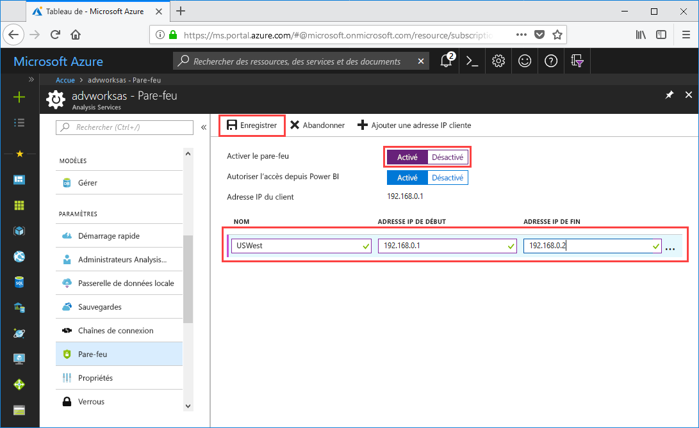

# Démarrage rapide : Configurer un pare-feu de serveur - Portail

Ce démarrage rapide vous aide à configurer un pare-feu pour votre serveur Azure Analysis Services. L’activation d’un pare-feu et la configuration de plages d’adresses PI pour les ordinateurs accédant à votre serveur uniquement constituent une partie importante de la protection de votre serveur et de vos données.

## Prérequis

- Un serveur Analysis Services dans votre abonnement. Pour en savoir plus, consultez [Démarrage rapide : Créer un serveur - Portail](analysis-services-create-server.md) ou [Démarrage rapide : Créer un serveur - PowerShell](analysis-services-create-powershell.md)
- Une ou plusieurs plages d’adresses IP pour les ordinateurs clients (si nécessaire).

> [!NOTE]
> L'importation de données (actualisation) et les connexions de rapports paginés à partir de Power BI Premium ne sont actuellement pas prises en charge dans Microsoft Cloud Germany lorsqu'un pare-feu est activé, même lorsque le paramètre Autoriser l'accès à partir de Power BI est activé.

## Connectez-vous au portail Azure. 

[Connectez-vous au portail](https://portal.azure.com)

## Configurer un pare-feu

1. Cliquez sur votre serveur pour ouvrir la page Vue d’ensemble. 
2. Dans **PARAMÈTRES** > **Pare-feu** > **Activer le pare-feu**, sélectionnez **Activé**.
3. Pour activer les connexions à partir de Power BI et de Power BI Premium, sélectionnez **Activé** dans **Autoriser l'accès à partir de Power BI**.  
4. (Facultatif) Spécifiez une ou plusieurs plages d’adresses IP. Entrez un nom et une adresse IP de début et de fin pour chaque plage. Le nom de la règle de pare-feu doit être limité à 128 caractères et peut uniquement contenir des caractères majuscules, des minuscules, des chiffres, le trait de soulignement et le trait d’union. Les espaces vides et autres caractères spéciaux ne sont pas autorisés.
5. Cliquez sur **Enregistrer**.

     

## Nettoyer les ressources

Lorsque vous n’en avez plus besoin, supprimez les plages d’adresses IP ou désactivez le pare-feu.

## Étapes suivantes
Dans ce démarrage rapide, vous avez appris comment configurer un pare-feu pour votre serveur. Maintenant que vous disposez d’un serveur et que vous l’avez protégé avec un pare-feu, vous pouvez ajouter un exemple de modèle de données de base à celui-ci à partir du portail. Un exemple de modèle permet d’en savoir plus sur la configuration des rôles de base de données de modèle et le test des connexions client. Pour en savoir plus, passez au tutoriel sur l’ajout d’un exemple de modèle.

> [!div class="nextstepaction"]
> [Tutoriel : ajouter un exemple de modèle à votre serveur](analysis-services-create-sample-model.md)
