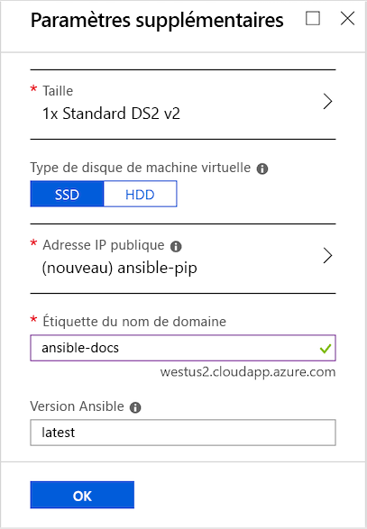
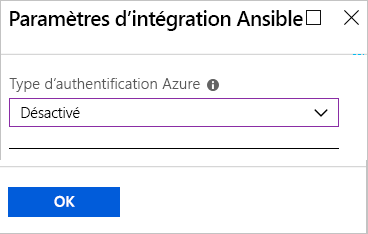
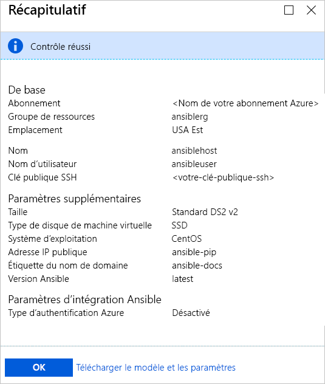
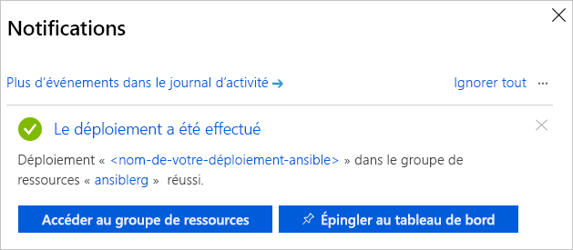

# Démarrage rapide : Déployer le modèle de solution Ansible pour Azure sur CentOS

Le modèle de solution Ansible pour Azure est conçu pour la configuration d’une instance Ansible sur une machine virtuelle CentOS et d’une suite d’outils configurés pour fonctionner avec Azure. Ces outils sont les suivants :

- **Modules Ansible pour Azure** : les [modules Ansible pour Azure](./ansible-matrix.md) sont une suite de modules qui vous permettent de créer et de gérer votre infrastructure dans Azure. La dernière version de ces modules est déployée par défaut. Toutefois, pendant le processus de déploiement de modèle de solution, vous pouvez spécifier le numéro de version qui convient le mieux à votre environnement.
- **Interface de ligne de commande Azure (CLI) 2.0** : [Azure CLI 2.0](/cli/azure/?view=azure-cli-latest) est l’interface de ligne de commande multiplateforme de Microsoft pour la gestion des ressources Azure. 
- **Identités managées pour ressources Azure** : la fonctionnalité [Identités managées pour ressources Azure](/azure/active-directory/managed-identities-azure-resources/overview) permet de sécuriser les informations d’identification des applications cloud.

## Prérequis

[!INCLUDE [open-source-devops-prereqs-azure-subscription.md](../../includes/open-source-devops-prereqs-azure-subscription.md)]

## Déployer le modèle de solution Ansible

1. Accédez au [modèle de solution Ansible dans la Place de marché Azure](https://azuremarketplace.microsoft.com/en-%20%20us/marketplace/apps/azure-oss.ansible?tab=Overview).

1. Sélectionnez **OBTENIR MAINTENANT**.

1. Une fenêtre s’affiche avec les conditions d’utilisation, la politique de confidentialité ainsi que les conditions d’utilisation de la Place de marché Azure. Sélectionnez **Continuer**.

1. Le portail Azure s’ouvre et affiche la page Ansible qui décrit le modèle de solution. Sélectionnez **Create** (Créer).

1. Dans la page **Créer**, vous voyez plusieurs onglets. Sous l’onglet **De base**, entrez les informations nécessaires :

   - **Nom** : spécifiez le nom de votre instance Ansible. À des fins de démonstration, le nom `ansiblehost` est utilisé.
   - **Nom d’utilisateur** : spécifiez le nom de l’utilisateur qui aura accès à l’instance Ansible. À des fins de démonstration, le nom `ansibleuser` est utilisé.
   - **Type d’authentification** : sélectionnez **Mot de passe** ou **Clé publique SSH**. À des fins de démonstration, le type **Clé publique SSH** est sélectionné.
   - **Mot de passe** et **Confirmer le mot de passe** : si vous sélectionnez **Mot de passe** pour le **Type d’authentification**, entrez votre mot de passe.
   - **Clé publique SSH** : si vous sélectionnez **Clé publique SSH** pour le **Type d’authentification**, entrez votre clé publique RSA sur une seule ligne, en tapant d’abord `ssh-rsa`.
   - **Abonnement** : sélectionnez votre abonnement Azure dans la liste déroulante.
   - **Groupe de ressources** : sélectionnez un groupe de ressources existant dans la liste déroulante, ou sélectionnez l’option **Créer** puis spécifiez un nom pour le groupe de ressources. À des fins de démonstration, le nouveau groupe de ressources nommé `ansiblerg` est utilisé.
   - **Emplacement** : dans la liste déroulante, sélectionnez l’emplacement qui convient à votre scénario.

     

1. Sélectionnez **OK**.

1. Sous l’onglet **Paramètres supplémentaires**, entrez les informations nécessaires :

   - **Taille** : la taille standard du portail Azure est utilisée par défaut. Pour spécifier une autre taille convenant mieux à votre scénario, sélectionnez la flèche pour afficher la liste des tailles.
   - **Type du disque de la machine virtuelle** : sélectionnez **SSD** (SSD Premium) ou **HDD** (lecteur de disque dur). À des fins de démonstration, l’option **SSD** a été choisie pour les performances qu’elle fournit. Pour plus d’informations sur les types de stockage sur disque, consultez les articles suivants :
       - [Stockage Premium hautes performances et disques managés pour machines virtuelles](/azure/virtual-machines/windows/premium-storage)
       - [Disques managés SSD Standard pour les charges de travail des machines virtuelles Azure](/azure/virtual-machines/windows/disks-standard-ssd)
   - **Adresse IP publique** : spécifiez ce paramètre si vous souhaitez communiquer avec la machine virtuelle depuis l’extérieur. La valeur par défaut est une nouvelle adresse IP publique qui porte le nom `ansible-pip`. Pour spécifier une autre adresse IP, sélectionnez la flèche permettant de spécifier les attributs (nom, référence SKU, affectation) de l’adresse IP. 
   - **Étiquette du nom de domaine** : entrez le nom de domaine public de la machine virtuelle. Le nom doit être unique et respecter les exigences de nommage. Pour plus d’informations sur la spécification d’un nom pour la machine virtuelle, consultez [Conventions d’affectation de noms pour les ressources Azure](/azure/architecture/best-practices/resource-naming).
   - **Version Ansible** : spécifiez un numéro de version ou la valeur `latest` pour déployer la dernière version. Sélectionnez l’icône d’information située à côté de **Version Ansible** pour voir plus d’informations sur les versions disponibles.

     

1. Sélectionnez **OK**.

1. Sous l’onglet **Paramètres d’intégration Ansible**, spécifiez le type d’authentification. Pour plus d’informations sur la sécurisation des ressources Azure, consultez [Que sont les identités managées pour les ressources Azure ?](/azure/active-directory/managed-identities-azure-resources/overview).

    

1. Sélectionnez **OK**.

1. La page **Récapitulatif** montre le processus de validation et les critères spécifiés pour le déploiement Ansible. Au bas de l’onglet, un lien vous permet de **télécharger le modèle et les paramètres** à utiliser avec les plateformes et les langues Azure prises en charge. 

     

1. Sélectionnez **OK**.

1. Lorsque l’onglet **Créer** s’affiche, sélectionnez **OK** pour déployer Ansible.

1. Sélectionnez l’icône **Notifications** en haut de la page du portail pour suivre la progression du déploiement Ansible. Une fois le déploiement terminé, sélectionnez **Accéder au groupe de ressources**. 

     

1. Dans la page du groupe de ressources, obtenez l’adresse IP de votre hôte Ansible, puis connectez-vous pour gérer vos ressources Azure à l’aide d’Ansible.

## Étapes suivantes

> [!div class="nextstepaction"] 
> [Démarrage rapide : Configurer une machine virtuelle Linux dans Azure avec Ansible](./ansible-create-vm.md)