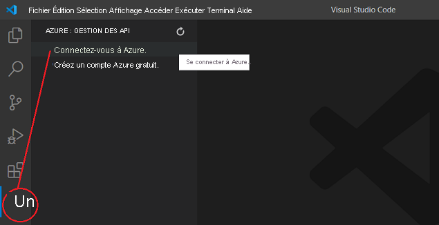
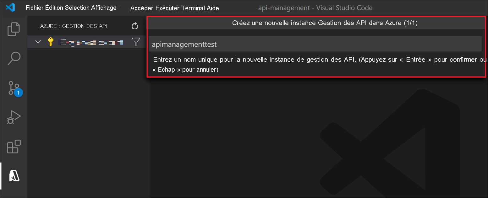

# Démarrage rapide : Créer une instance Gestion des API Azure avec Visual Studio Code

Le service Gestion des API Azure (API Management, APIM) permet aux organisations de publier des API pour des développeurs externes, partenaires et internes afin de libérer le potentiel de leurs données et de leurs services. Il offre les compétences essentielles qui garantissent un programme d’API réussi au travers de l’engagement des développeurs, des perspectives commerciales, de l’analytique, de la sécurité et de la protection. APIM vous permet de créer et de gérer des passerelles d’API modernes pour des services backend existants, où qu’ils soient hébergés. Pour plus d’informations, consultez la rubrique [Vue d’ensemble](api-management-key-concepts.md).

Ce guide de démarrage rapide décrit les étapes de création d’une instance de Gestion des API à l’aide de l’*extension Gestion des API Azure* pour Visual Studio Code. Vous pouvez également utiliser l’extension pour effectuer des opérations de gestion courantes sur votre instance Gestion des API.

## Prérequis

[!INCLUDE [quickstarts-free-trial-note](../../includes/quickstarts-free-trial-note.md)]

Vérifiez aussi que vous avez installé les éléments suivants :

- [Visual Studio Code](https://code.visualstudio.com/)

- [Extension Gestion des API Azure pour Visual Studio Code](https://marketplace.visualstudio.com/items?itemName=ms-azuretools.vscode-apimanagement&ssr=false#overview)

## Connexion à Azure

Lancez Visual Studio Code et ouvrez l’extension Azure. (Si vous ne voyez pas l’icône Azure dans la barre d’activités, assurez-vous que l’extension *Azure API Management* est activée.)

Sélectionnez **Connectez-vous à Azure...** pour lancer une fenêtre de navigateur et vous connecter à votre compte Microsoft.

## Créer un service Gestion des API

Une fois que vous êtes connecté à votre compte Microsoft, le volet de l’explorateur *Azure : API Management* liste vos abonnements Azure.

Cliquez avec le bouton droit sur l’abonnement que vous souhaitez utiliser, puis sélectionnez **Créer une instance Gestion des API dans Azure**.

Dans le volet qui s’ouvre, fournissez un nom pour la nouvelle instance Gestion des API. Il doit être globalement unique dans Azure, comporter de 1 à 50 caractères alphanumériques et/ou traits d’union, commencer par une lettre et se terminer par un caractère alphanumérique.

Une instance Gestion des API et le groupe de ressources parent seront créés avec le nom spécifié. Par défaut, l’instance est créée dans la région *USA Ouest* avec la référence SKU *Consommation*.

> [!TIP]
> Si vous activez **Création avancée** dans les *paramètres de l’extension Azure API Management*, vous pouvez également spécifier une [référence SKU Gestion des API](https://azure.microsoft.com/pricing/details/api-management/), une [région Azure](https://status.azure.com/en-us/status) et un [groupe de ressources](../azure-resource-manager/management/overview.md) pour déployer votre instance Gestion des API.
>
> Alors que le provisionnement de la référence SKU *Consommation* prend moins d’une minute, la création des autres références SKU prend généralement de 30 à 40 minutes.

À ce stade, vous êtes prêt à importer et à publier votre première API. Vous pouvez également effectuer des opérations courantes de gestion des API dans l’extension de Visual Studio Code. Consultez le [tutoriel](visual-studio-code-tutorial.md) pour plus d’informations.

## Nettoyer les ressources

Quand vous n’en avez plus besoin, enlevez l’instance Gestion des API en cliquant avec le bouton droit et en sélectionnant **Ouvrir dans le portail** pour [supprimer le service Gestion des API](get-started-create-service-instance.md#clean-up-resources) et son groupe de ressources.

Vous pouvez également sélectionner **Supprimer Gestion des API** pour supprimer uniquement l’instance Gestion des API (cette opération ne supprime pas son groupe de ressources).

## Étapes suivantes

> [!div class="nextstepaction"]
> [Importer et gérer des API avec l’extension Gestion des API](visual-studio-code-tutorial.md)
