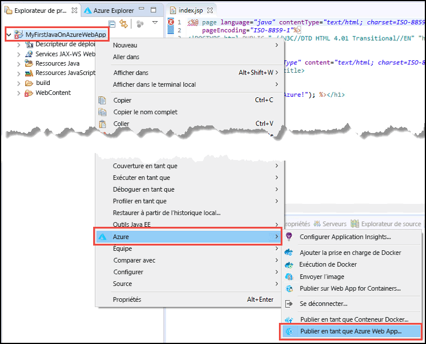
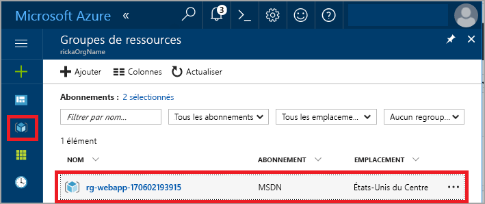
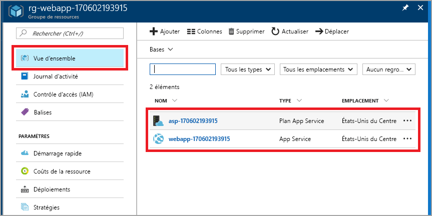

# <a name="create-your-first-java-web-app-in-azure"></a>Créer votre première application web Java dans Azure

[Azure App Service](overview.md) offre un service d’hébergement web hautement évolutif appliquant des mises à jour correctives automatiques. Ce guide de démarrage rapide indique comment déployer une application web Java dans App Service à l’aide de [l’environnement de développement intégré (IDE) Eclipse pour développeurs Java EE](https://www.eclipse.org/).

> [!IMPORTANT]
> Azure App Service sur Linux est également une option permettant d’héberger des applications web Java en mode natif sur Linux à l’aide d’offres Tomcat, Java SE et WildFly managées. Si vous souhaitez démarrer avec App Service sur Linux, consultez [Démarrage rapide : Créer une application Java dans App Service sur Linux](containers/quickstart-java.md).

À la fin de ce guide de démarrage rapide, votre application ressemble à l’illustration suivante quand vous l’affichez dans un navigateur web :


[!INCLUDE [quickstarts-free-trial-note](../../includes/quickstarts-free-trial-note.md)]

> [!NOTE]
>
> Les étapes décrites dans ce démarrage rapide illustrent l’utilisation de l’IDE Eclipse pour publier une application web Java dans App Service. Vous pouvez néanmoins utiliser les versions IntelliJ IDEA Ultimate Edition ou Community Edition. Pour plus d’informations, consultez [Créer une application web Hello World pour Azure à l’aide d’IntelliJ](/java/azure/intellij/azure-toolkit-for-intellij-create-hello-world-web-app).
>

## <a name="prerequisites"></a>Prérequis

Pour effectuer ce démarrage rapide, installez les éléments suivants :

* <a href="https://www.eclipse.org/downloads/" target="_blank">L’Environnement de développement intégré Eclipse pour développeurs Java EE</a>. Ce démarrage rapide utilise Eclipse Neon.
* Le <a href="/java/azure/eclipse/azure-toolkit-for-eclipse-installation" target="_blank">kit de ressources Azure pour Eclipse</a>.

> [!NOTE]
>
> Vous devez vous connecter à votre compte Azure à l’aide du kit de ressources Azure pour Eclipse, afin de réaliser les étapes décrites dans ce démarrage rapide. Pour ce faire, consultez [Instructions de connexion à Azure pour le kit de ressources Azure pour Eclipse](/java/azure/eclipse/azure-toolkit-for-eclipse-sign-in-instructions).
>

## <a name="create-a-dynamic-web-project-in-eclipse"></a>Créer un projet web dynamique dans Eclipse

Dans Eclipse, sélectionnez **File (Fichier)** > **New (Nouveau)** > **Dynamic Web Project (Projet web dynamique)**.

Dans la boîte de dialogue **New Dynamic Web Project (Nouveau projet web dynamique)**, nommez le projet **MyFirstJavaOnAzureWebApp**, puis sélectionnez **Finish (Terminer)**.
   


### <a name="add-a-jsp-page"></a>Ajouter une page JSP

Si l’Explorateur de projets n’est pas affiché, restaurez-le.


Dans l’Explorateur de projets, développez le projet **MyFirstJavaOnAzureWebApp**.
Cliquez avec le bouton droit sur **WebContent**, puis sélectionnez **New (Nouveau)** > **JSP File (Fichier JSP)**.


Dans la boîte de dialogue **New JSP File (Nouveau fichier JSP)** :

* Nommez le fichier **index.jsp**.
* Sélectionnez **Terminer**.

  

Dans le fichier index.jsp, remplacez l’élément `<body></body>` par le balisage suivant :

```jsp
<body>
<h1><% out.println("Hello Azure!"); %></h1>
</body>
```

Enregistrez les modifications.

> [!NOTE]
>
> Si vous voyez une erreur sur la ligne 1 qui fait référence à une classe Servlet Java manquante, vous pouvez l’ignorer.
> 
> 
>

## <a name="publish-the-web-app-to-azure"></a>Publier l’application web dans Azure

Dans l’Explorateur de projets, cliquez avec le bouton droit sur votre projet, puis sélectionnez **Azure** > **Publish as Azure Web App** (Publier en tant qu’application web Azure).



Si la boîte de dialogue **Azure Sign In** (Connexion à Azure) s’affiche, suivez les étapes décrites dans l’article [Instructions de connexion à Azure pour le kit de ressources Azure pour Eclipse](/java/azure/eclipse/azure-toolkit-for-eclipse-sign-in-instructions) pour saisir vos informations d’identification.

### <a name="deploy-web-app-dialog-box"></a>Boîte de dialogue Déployer une application web

Une fois que vous vous êtes connecté à votre compte Azure, la boîte de dialogue **Déployer une application web** s’affiche.

Sélectionnez **Créer**.


### <a name="create-app-service-dialog-box"></a>Boîte de dialogue Créer App Service

La boîte de dialogue **Créer App Service** apparaît avec les valeurs par défaut. La valeur **170602185241** illustrée dans la figure précédente diffère de celle indiquée dans votre boîte de dialogue.


Dans la boîte de dialogue **Créer App Service** :

* Entrez un nom unique pour votre application web, ou conservez le nom généré. Ce nom doit être unique au sein d’Azure. Le nom fait partie intégrante de l’adresse URL de l’application web. Par exemple : si l’application web porte le nom **MyJavaWebApp**, l’URL correspond à *myjavawebapp.azurewebsites.net*.
* Pour ce démarrage rapide, conservez le conteneur web par défaut.
* Sélectionnez un abonnement Azure.
* Dans l’onglet **Plan App Service** :

  * **Créer** : conservez la valeur par défaut, qui correspond au nom du plan App Service.
  * **Emplacement** : sélectionnez **Europe Ouest** ou un emplacement près de chez vous.
  * **Niveau tarifaire** : sélectionnez l’option Gratuit. Pour plus d’informations sur les fonctionnalités, consultez la page [Tarification de App Service](https://azure.microsoft.com/pricing/details/app-service/?ref=microsoft.com&utm_source=microsoft.com&utm_medium=docs&utm_campaign=visualstudio).

    

[!INCLUDE [app-service-plan](../../includes/app-service-plan.md)]

### <a name="resource-group-tab"></a>Onglet Groupe de ressources

Sélectionnez l’onglet **Groupe de ressources**. Conservez la valeur générée par défaut pour le groupe de ressources.


[!INCLUDE [resource-group](../../includes/resource-group.md)]

Sélectionnez **Créer**.

<!--
### The JDK tab

Select the **JDK** tab. Keep the default, and then select **Create**.


-->

Le kit de ressources Azure crée l’application web et affiche une boîte de dialogue indiquant la progression de l’opération.


### <a name="deploy-web-app-dialog-box"></a>Boîte de dialogue Déployer une application web

Dans la boîte de dialogue **Déployer une application web**, sélectionnez **Deploy to root (Déployer à la racine)**. Si vous disposez d’un App Service à l’emplacement *wingtiptoys.azurewebsites.net* et que vous ne choisissez pas le déploiement à la racine, l’application web nommée **MyFirstJavaOnAzureWebApp** est déployée dans *wingtiptoys.azurewebsites.net/MyFirstJavaOnAzureWebApp*.


La boîte de dialogue affiche les valeurs sélectionnées pour Azure, JDK et le conteneur web.

Sélectionnez **Déployer** pour publier l’application web dans Azure.

Une fois la publication terminée, sélectionnez le lien **Publié** dans la boîte de dialogue **Journal d’activité Azure**.


Félicitations ! Vous avez correctement déployé votre application web dans Azure. 


## <a name="update-the-web-app"></a>Mettre à jour l’application web

Remplacez l’exemple de code JSP par un autre message.

```jsp
<body>
<h1><% out.println("Hello again Azure!"); %></h1>
</body>
```

Enregistrez les modifications.

Dans l’Explorateur de projets, cliquez avec le bouton droit sur le projet, puis sélectionnez **Azure** > **Publish as Azure Web App (Publier en tant qu’application web Azure)**.

La boîte de dialogue **Déployer une application web** s’affiche en vous présentant le service App Service que vous avez créé précédemment. 

> [!NOTE] 
> Sélectionnez **Deploy to root (Déployer à la racine)** chaque fois que vous effectuez une publication. 
> 

Sélectionnez l’application web, puis sélectionnez **Déployer**, ce qui publie les modifications.

Lorsque le lien **Publication** apparaît, sélectionnez-le pour accéder à l’application web et voir les modifications.

## <a name="manage-the-web-app"></a>Gérer l’application web

Accédez au <a href="https://portal.azure.com" target="_blank">Portail Azure</a> pour visualiser l’application web que vous avez créée.

Dans le menu de gauche, sélectionnez **Groupes de ressources**.



Sélectionnez le groupe de ressources. La page affiche les ressources que vous avez créées dans ce guide de démarrage rapide.



Sélectionnez l’application web (**webapp-170602193915** dans la figure précédente).

La page **Vue d’ensemble** s’affiche. Cette page présente un aperçu de l’application. Elle vous permet d’exécuter des tâches de gestion de base, telles que parcourir, arrêter, démarrer, redémarrer et supprimer. Les onglets figurant sur le côté gauche de la page affichent les différentes configurations que vous pouvez ouvrir. 


[!INCLUDE [clean-up-section-portal-web-app](../../includes/clean-up-section-portal-web-app.md)]

## <a name="next-steps"></a>Étapes suivantes

> [!div class="nextstepaction"]
> [Mapper un domaine personnalisé](app-service-web-tutorial-custom-domain.md)
