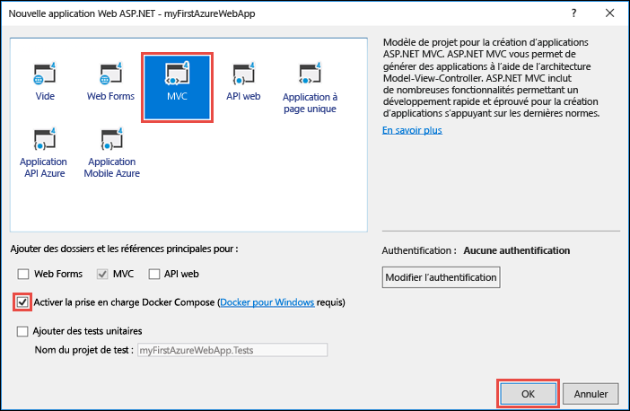
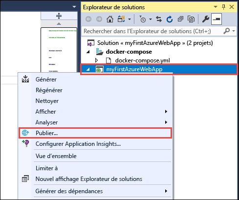
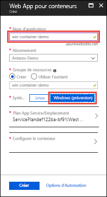
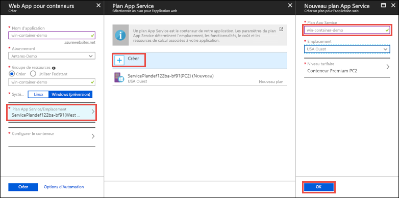
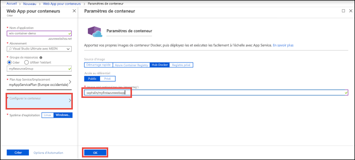

# <a name="run-a-custom-windows-container-in-azure-preview"></a>Exécuter un conteneur Windows personnalisé dans Azure (préversion)

[Azure App Service](overview.md) fournit des piles d’applications prédéfinies sur Windows, par exemple ASP.NET ou Node.js, exécuté sur IIS. L’environnement Windows préconfiguré verrouille l’accès administrateur du système d’exploitation, de même que l’installation des logiciels, les modifications du Global Assembly Cache et ainsi de suite (voir [Fonctionnalités du système d’exploitation sur Azure App Service](operating-system-functionality.md)). Si votre application nécessite un accès plus important que celui permis par l’environnement préconfiguré, vous pouvez déployer un conteneur Windows personnalisé à la place. Ce guide de démarrage rapide montre comment déployer une application ASP.NET incluse dans une image Windows sur [Docker Hub](https://hub.docker.com/) à partir de Visual Studio et comment l’exécuter dans un conteneur personnalisé dans Azure App Service.


## <a name="prerequisites"></a>Prérequis

Pour suivre ce tutoriel :

- <a href="https://hub.docker.com/" target="_blank">Créez un compte Docker Hub</a>
- <a href="https://docs.docker.com/docker-for-windows/install/" target="_blank">Installez Docker pour Windows</a>.
- <a href="https://docs.microsoft.com/virtualization/windowscontainers/quick-start/quick-start-windows-10" target="_blank">Basculez Docker pour exécuter des conteneurs Windows</a>.
- <a href="https://www.visualstudio.com/downloads/" target="_blank">Installez Visual Studio 2017</a> avec les charges de travail **Développement web et ASP.NET** et **Développement Azure**. Si vous avez déjà installé Visual Studio 2017 :
    - Installez les dernières mises à jour dans Visual Studio en cliquant sur **Aide** > **Rechercher les mises à jour**.
    - Ajoutez les charges de travail dans Visual Studio en cliquant sur **Outils** > **Obtenir des outils et des fonctionnalités**.

## <a name="create-an-aspnet-web-app"></a>Créez une application web ASP.NET

Dans Visual Studio, créez un projet en sélectionnant **Fichier > Nouveau > Projet**. 

Dans la boîte de dialogue **Nouveau projet**, sélectionnez **Visual C# > Web > Application web ASP.NET (.NET Framework)**.

Nommez l’application _myFirstAzureWebApp_, puis sélectionnez **OK**.
   


Vous pouvez déployer n’importe quel type d’application web ASP.NET dans Azure. Pour ce guide de démarrage rapide, sélectionnez le modèle **MVC** et assurez-vous que l’authentification est définie sur **Aucune authentification**.

Sélectionnez **Activer la prise en charge de Docker Compose**.

Sélectionnez **OK**.



Si le fichier _Dockerfile_ ne s’ouvre pas automatiquement, ouvrez-le dans **l’Explorateur de solutions**.

Vous devez utiliser une [image parente prise en charge](#use-a-different-parent-image). Changez l’image parente en remplaçant la ligne `FROM` par le code suivant et enregistrez le fichier :

```Dockerfile
FROM mcr.microsoft.com/dotnet/framework/aspnet:4.7.2-windowsservercore-ltsc2019
```

Dans le menu, sélectionnez **Déboguer > Exécuter sans débogage** pour exécuter l’application web localement.


## <a name="publish-to-docker-hub"></a>Publier sur Docker Hub

Dans **l’Explorateur de solutions**, cliquez avec le bouton droit sur le projet **myFirstAzureWebApp**, puis sélectionnez **Publier**.



L’Assistant Publication est lancé automatiquement. Sélectionnez **Registre de conteneurs** > **Docker Hub** > **Publier**.


Indiquez vos informations d’identification de compte Docker Hub et cliquez sur **Enregistrer**. 

Attendez la fin du déploiement. La page **Publier** affiche maintenant le nom du dépôt que vous utilisez par la suite dans App Service.


Copiez ce nom de dépôt pour une utilisation ultérieure.

## <a name="sign-in-to-azure"></a>Connexion à Azure

Connectez-vous au portail Azure sur https://portal.azure.com.

## <a name="create-a-windows-container-app"></a>Créer une application de conteneur Windows

1. Sélectionnez **Créer une ressource** dans le coin supérieur gauche du Portail Azure.

2. Dans la zone de recherche au-dessus de la liste des ressources de la Place de marché Azure, recherchez et sélectionnez **Web App pour conteneurs**.

3. Fournissez un nom d’application, comme *win-container-demo*, acceptez les valeurs par défaut pour créer un groupe de ressources, puis cliquez sur **Windows (préversion)** dans la case **Système d’exploitation**.

    

4. Créez un plan App Service en cliquant sur **plan/emplacement App Service** > **Créer un nouveau**. Nommez le nouveau plan, acceptez les valeurs par défaut et cliquez sur **OK**.

    

5. Cliquez sur **Configurer le conteneur**. Dans **Image et étiquette facultative**, utilisez le nom de dépôt que vous avez copié dans [Publier sur Docker Hub](#publish-to-docker-hub), puis cliquez sur **OK**.

    

    Si vous avez une image personnalisée ailleurs pour votre application web, comme dans [Azure Container Registry](/azure/container-registry/) ou dans un autre référentiel privé, vous pouvez le configurer ici.

6. Cliquez sur **Créer** et attendez que Azure créer les ressources requises.

## <a name="browse-to-the-container-app"></a>Accédez à l’application de conteneur

Lorsque l’opération Azure est terminée, une zone de notification s’affiche.


1. Cliquez sur **Accéder à la ressource**.

2. Dans la page d’application, cliquez sur le lien situé sous **URL**.

Une nouvelle page de navigateur s’ouvre à la page suivante :


Attendez quelques minutes et réessayez, jusqu'à accéder à la page d’accueil ASP.NET par défaut :


**Félicitations !** Vous exécutez votre premier conteneur Windows personnalisé dans Azure App Service.

## <a name="see-container-start-up-logs"></a>Consulter les journaux d’activité de démarrage du conteneur

Le chargement du conteneur Windows peut prendre un certain temps. Pour afficher la progression, accédez à l’URL suivante en remplaçant *\<app_name >* par le nom de votre application.
```
https://<app_name>.scm.azurewebsites.net/api/logstream
```

Les journaux d’activité en continu ressemblent à ceci :

```
2018-07-27T12:03:11  Welcome, you are now connected to log-streaming service.
27/07/2018 12:04:10.978 INFO - Site: win-container-demo - Start container succeeded. Container: facbf6cb214de86e58557a6d073396f640bbe2fdec88f8368695c8d1331fc94b
27/07/2018 12:04:16.767 INFO - Site: win-container-demo - Container start complete
27/07/2018 12:05:05.017 INFO - Site: win-container-demo - Container start complete
27/07/2018 12:05:05.020 INFO - Site: win-container-demo - Container started successfully
```

## <a name="update-locally-and-redeploy"></a>Mise à jour locale et redéploiement

À partir de **l’Explorateur de solutions**, ouvrez _Views\Home\Index.cshtml_.

Recherchez la balise HTML `<div class="jumbotron">` vers le début, puis remplacez la totalité de l’élément par le code suivant :

```HTML
<div class="jumbotron">
    <h1>ASP.NET in Azure!</h1>
    <p class="lead">This is a simple app that we’ve built that demonstrates how to deploy a .NET app to Azure App Service.</p>
</div>
```

Pour effectuer un redéploiement dans Azure, cliquez avec le bouton droit sur le projet **myFirstAzureWebApp** dans **l’Explorateur de solutions**, puis sélectionnez **Publier**.

Dans la page de publication, sélectionnez **Publier** et attendez la fin de la publication.

Pour indiquer à App Service qu’il faut tirer la nouvelle image de Docker Hub, redémarrez l’application. De retour dans la page d’application du portail, cliquez sur **Redémarrer** > **Oui**.


[Accédez de nouveau à l’application de conteneur](#browse-to-the-container-app). Quand vous actualisez la page web, l’application doit d’abord revenir à la page « Démarrage », puis afficher quelques minutes après la page web mise à jour.


## <a name="use-a-different-parent-image"></a>Utiliser une autre image parente

Vous êtes libre d’utiliser une autre image Docker personnalisée pour exécuter votre application. Toutefois, vous devez choisir l’[image parente](https://docs.docker.com/develop/develop-images/baseimages/) correcte pour l’infrastructure que vous souhaitez : 

- Pour déployer des applications .NET Framework, utilisez une image parente basée sur la version Windows Server Core 2019 [Long-Term Servicing Channel (LTSC)](https://docs.microsoft.com/windows-server/get-started/semi-annual-channel-overview#long-term-servicing-channel-ltsc). 
- Pour déployer des applications .NET Core, utilisez une image parente basée sur la version Windows Server Nano 1809 [Semi-Annual Servicing Channel (SAC)](https://docs.microsoft.com/windows-server/get-started-19/servicing-channels-19#semi-annual-channel). 

Le téléchargement d’une image parente lors du démarrage de l’application peut prendre un certain temps. Toutefois, vous pouvez réduire le temps de démarrage en utilisant l’une des images parentes suivantes déjà mises en cache dans Azure App Service :

- [mcr.microsoft.com/dotnet/framework/aspnet](https://hub.docker.com/_/microsoft-dotnet-framework-aspnet/):4.7.2-windowsservercore-ltsc2019
- [mcr.microsoft.com/windows/nanoserver](https://hub.docker.com/_/microsoft-windows-nanoserver/):1809 : il s’agit du conteneur de base utilisé au sein des images Microsoft Windows Nano Server Microsoft [ASP.NET Core](https://hub.docker.com/_microsoft-dotnet-cores-aspnet).

## <a name="next-steps"></a>Étapes suivantes

> [!div class="nextstepaction"]
> [Migrer vers un conteneur Windows dans Azure](app-service-web-tutorial-windows-containers-custom-fonts.md)
