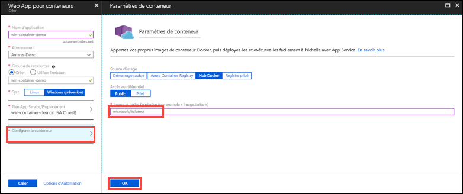

# <a name="run-a-custom-windows-container-in-azure-preview"></a>Exécuter un conteneur Windows personnalisé dans Azure (préversion)

[Azure App Service](app-service-web-overview.md) fournit des piles d’applications prédéfinies sur Windows, par exemple ASP.NET ou Node.js, exécuté sur IIS. L’environnement Windows préconfiguré verrouille l’accès administrateur du système d’exploitation, de même que l’installation des logiciels, les modifications du Global Assembly Cache et ainsi de suite (voir [Fonctionnalités du système d’exploitation sur Azure App Service](web-sites-available-operating-system-functionality.md)). Si votre application nécessite un accès plus important que celui permis par l’environnement préconfiguré, vous pouvez déployer un conteneur Windows personnalisé à la place. Ce démarrage rapide montre comment déployer une image IIS personnalisée dans Azure App Service à partir de [Docker Hub](https://hub.docker.com/).


## <a name="sign-in-to-azure"></a>Connexion à Azure

Connectez-vous au portail Azure sur https://portal.azure.com.

## <a name="create-a-windows-container-app"></a>Créer une application de conteneur Windows

1. Sélectionnez **Créer une ressource** dans le coin supérieur gauche du Portail Azure.

2. Dans la zone de recherche au-dessus de la liste des ressources de la Place de marché Azure, recherchez et sélectionnez **Web App pour conteneurs**.

3. Fournissez un nom d’application, tel que *mywebapp*, acceptez les valeurs par défaut pour créer un nouveau groupe de ressources, puis cliquez sur **Windows (préversion)** dans la case **Système d’exploitation**.

    

4. Créez un plan App Service en cliquant sur **plan/emplacement App Service** > **Créer un nouveau**. Nommez le nouveau plan, acceptez les valeurs par défaut et cliquez sur **OK**.

    

5. Cliquez sur **Configurer le conteneur**, tapez _microsoft / iis:latest_ dans **Image et étiquette facultative**, puis cliquez sur **OK**.

    

    Dans cet article, vous utilisez l’image Docker Hub publique [microsoft / iis:latest](https://hub.docker.com/r/microsoft/iis/). Si vous avez une image personnalisée ailleurs pour votre application web, comme dans [Azure Container Registry](/azure/container-registry/) ou dans un autre référentiel privé, vous pouvez le configurer ici.

6. Cliquez sur **Créer** et attendez que Azure créer les ressources requises.

## <a name="browse-to-the-container-app"></a>Accédez à l’application de conteneur

Lorsque l’opération Azure est terminée, une zone de notification s’affiche.


1. Cliquez sur **Accéder à la ressource**.

2. Dans la page d’application, cliquez sur le lien situé sous **URL**.

Une nouvelle page de navigateur s’ouvre à la page suivante :


Patientez quelques minutes et essayez à nouveau, jusqu'à ce que vous accédiez à la page d’accueil IIS :


**Félicitations !** Vous exécutez votre premier conteneur Windows personnalisé dans Azure App Service.

## <a name="see-container-start-up-logs"></a>Consulter les journaux de démarrage du conteneur

Le chargement du conteneur Windows peut prendre un certain temps. Pour afficher la progression, accédez à l’URL suivante en remplaçant *\<app_name >* par le nom de votre application.
```
https://<app_name>.scm.azurewebsites.net/api/logstream
```

Les journaux en continu ressemblent à ceci :

```
2018-07-27T12:03:11  Welcome, you are now connected to log-streaming service.
27/07/2018 12:04:10.978 INFO - Site: win-container-demo - Start container succeeded. Container: facbf6cb214de86e58557a6d073396f640bbe2fdec88f8368695c8d1331fc94b
27/07/2018 12:04:16.767 INFO - Site: win-container-demo - Container start complete
27/07/2018 12:05:05.017 INFO - Site: win-container-demo - Container start complete
27/07/2018 12:05:05.020 INFO - Site: win-container-demo - Container started successfully
```

## <a name="use-a-different-docker-image"></a>Utiliser une image Docker différente

Vous êtes libre d’utiliser une autre image Docker personnalisée pour exécuter votre application. Toutefois, vous devez choisir l’[image parente](https://docs.docker.com/develop/develop-images/baseimages/) correcte pour l’infrastructure que vous souhaitez : 

- Pour déployer des applications .NET Framework, utilisez une image parente basée sur la version Windows Server Core 2016 [Long-Term Servicing Channel (LTSC)](https://docs.microsoft.com/windows-server/get-started/semi-annual-channel-overview#long-term-servicing-channel-ltsc). 
- Pour déployer des applications .NET Core, utilisez une image parente basée sur la version Windows Server Nano 2016 [Long-Term Servicing Channel (LTSC)](https://docs.microsoft.com/windows-server/get-started/semi-annual-channel-overview#long-term-servicing-channel-ltsc). 

Le téléchargement d’une image parente lors du démarrage de l’application peut prendre un certain temps. Toutefois, vous pouvez réduire le temps de démarrage en utilisant l’une des images parentes suivantes déjà mises en cache dans Azure App Service :

- [microsoft/iis](https://hub.docker.com/r/microsoft/iis/):windowsservercore-ltsc2016, latest
- [microsoft/iis](https://hub.docker.com/r/microsoft/iis/):nanoserver-sac2016
- [microsoft/aspnet](https://hub.docker.com/r/microsoft/aspnet/):4.7.2-windowsservercore-ltsc2016, 4.7.2, latest
- [microsoft/dotnet](https://hub.docker.com/r/microsoft/dotnet/):2.1-aspnetcore-runtime
- [microsoft/dotnet](https://hub.docker.com/r/microsoft/dotnet/):2.1-sdk
