# <a name="run-a-custom-windows-container-in-azure-preview"></a>Exécuter un conteneur Windows personnalisé dans Azure (préversion)

[Azure App Service](overview.md) fournit des piles d’applications prédéfinies sur Windows, par exemple ASP.NET ou Node.js, exécuté sur IIS. L’environnement Windows préconfiguré verrouille le système d’exploitation et empêche l’accès administrateur, les installations logicielles, les changements du Global Assembly Cache, etc. Pour plus d’informations, consultez [Fonctionnalités de système d’exploitation sur Azure App Service](operating-system-functionality.md). Si votre application nécessite un accès plus important que celui permis par l’environnement préconfiguré, vous pouvez déployer un conteneur Windows personnalisé à la place.

Ce guide de démarrage rapide montre comment déployer une application ASP.NET, dans une image Windows, sur [Docker Hub](https://hub.docker.com/) à partir de Visual Studio. Vous exécutez l’application dans un conteneur personnalisé au sein d’Azure App Service.

## <a name="prerequisites"></a>Conditions préalables requises

Pour suivre ce tutoriel :

- <a href="https://hub.docker.com/" target="_blank">Créez un compte Docker Hub</a>
- <a href="https://docs.docker.com/docker-for-windows/install/" target="_blank">Installez Docker pour Windows</a>.
- <a href="https://docs.microsoft.com/virtualization/windowscontainers/quick-start/quick-start-windows-10" target="_blank">Basculez Docker pour exécuter des conteneurs Windows</a>.
- <a href="https://www.visualstudio.com/downloads/" target="_blank">Installez Visual Studio 2019</a> avec les charges de travail **Développement web et ASP.NET** et **Développement Azure**. Si vous avez déjà installé Visual Studio 2019 :

    - Installez les dernières mises à jour dans Visual Studio en sélectionnant **Aide** > **Rechercher les mises à jour**.
    - Ajoutez les charges de travail dans Visual Studio en sélectionnant **Outils** > **Obtenir des outils et des fonctionnalités**.

## <a name="create-an-aspnet-web-app"></a>Créez une application web ASP.NET

Créez une application web ASP.NET en effectuant les étapes suivantes :

1. Ouvrez Visual Studio, puis sélectionnez **Créer un projet**.

1. Dans **Créer un projet**, recherchez et choisissez une **application web ASP.NET (.NET Framework)** pour C#, puis sélectionnez **Suivant**.

1. Dans **Configurer votre nouveau projet**, nommez l’application _myFirstAzureWebApp_, puis sélectionnez **Créer**.

   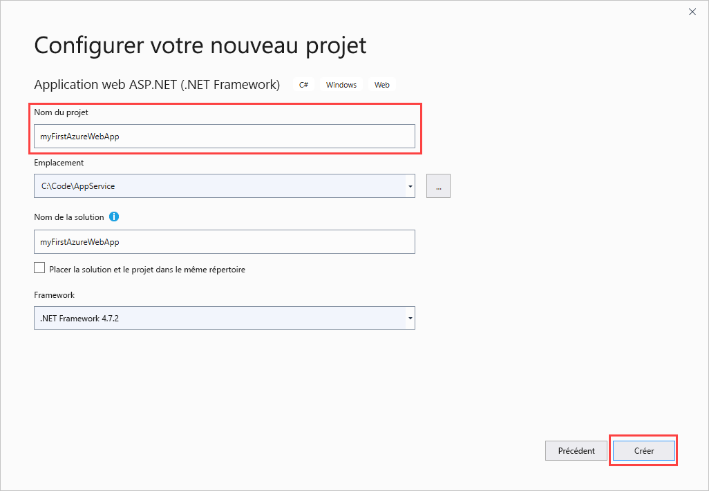

1. Vous pouvez déployer n’importe quel type d’application web ASP.NET dans Azure. Pour ce guide de démarrage rapide, choisissez le modèle **MVC**.

1. Sélectionnez **Prise en charge de Docker**, puis vérifiez que l’option d’authentification a la valeur **Aucune authentification**. Sélectionnez **Create** (Créer).

   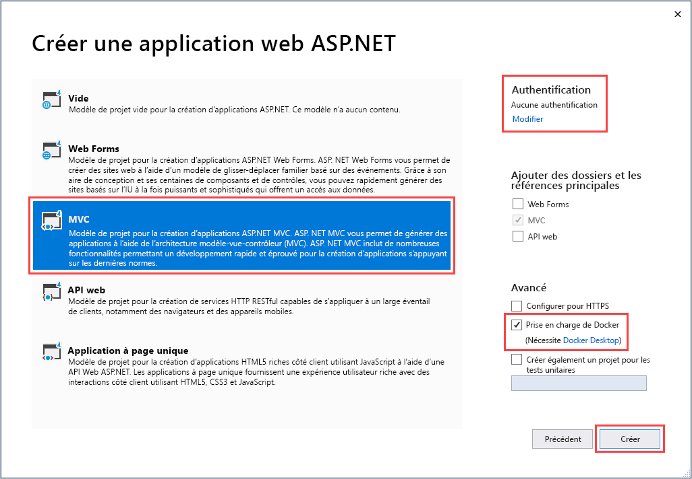

1. Si le fichier _Dockerfile_ ne s’ouvre pas automatiquement, ouvrez-le dans **l’Explorateur de solutions**.

1. Vous avez besoin d’une [image parent prise en charge](#use-a-different-parent-image). Changez l’image parente en remplaçant la ligne `FROM` par le code suivant et enregistrez le fichier :

   ```Dockerfile
   FROM mcr.microsoft.com/dotnet/framework/aspnet:4.7.2-windowsservercore-ltsc2019
   ```

1. Dans le menu Visual Studio, sélectionnez **Déboguer** > **Démarrer sans débogage** pour exécuter l’application web localement.

   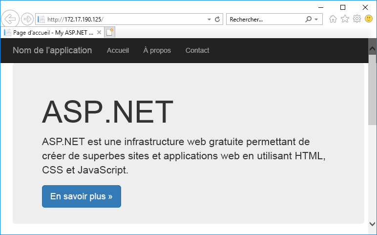

## <a name="publish-to-docker-hub"></a>Publier sur Docker Hub

1. Dans l’**Explorateur de solutions**, cliquez avec le bouton droit sur le projet **myFirstAzureWebApp**, puis sélectionnez **Publier**.

1. Choisissez **App Service**, puis sélectionnez **Publier**.

1. Dans **Choisir une cible de publication**, sélectionnez **Container Registry**, **Docker Hub**, puis cliquez sur **Publier**.

   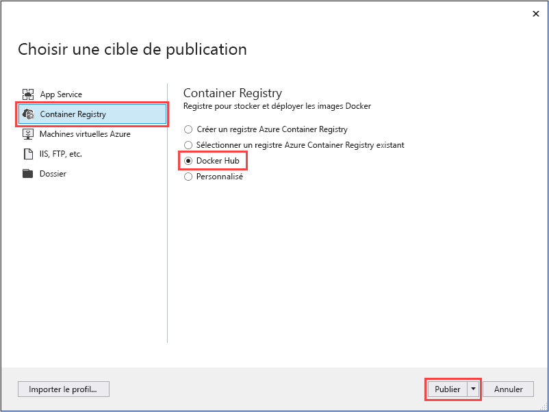

1. Indiquez vos informations d’identification de compte Docker Hub, puis sélectionnez **Enregistrer**.

   Attendez la fin du déploiement. La page **Publier** affiche désormais le nom du dépôt à utiliser plus tard.

   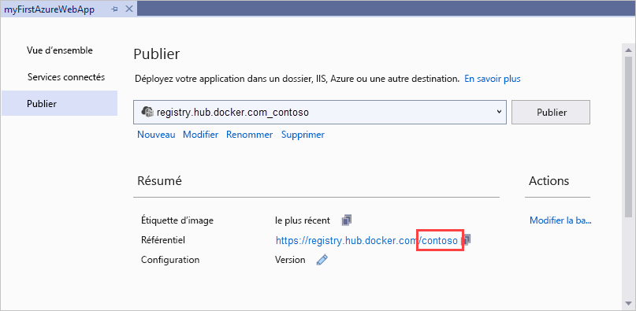

1. Copiez ce nom de dépôt pour une utilisation ultérieure.

## <a name="create-a-windows-container-app"></a>Créer une application de conteneur Windows

1. Connectez-vous au [portail Azure]( https://portal.azure.com).

1. Sélectionnez **Créer une ressource** dans le coin supérieur gauche du Portail Azure.

1. Dans la zone de recherche située au-dessus de la liste des ressources de la Place de marché Azure, recherchez **Web App pour conteneurs**, puis sélectionnez **Créer**.

1. Dans **Application web - Créer**, choisissez votre abonnement et un **groupe de ressources**. Vous pouvez créer un groupe de ressources, le cas échéant.

1. Indiquez un nom d’application, par exemple *win-container-demo*, puis choisissez **Windows** pour **Système d’exploitation**. Sélectionnez **Suivant : Docker** pour continuer.

   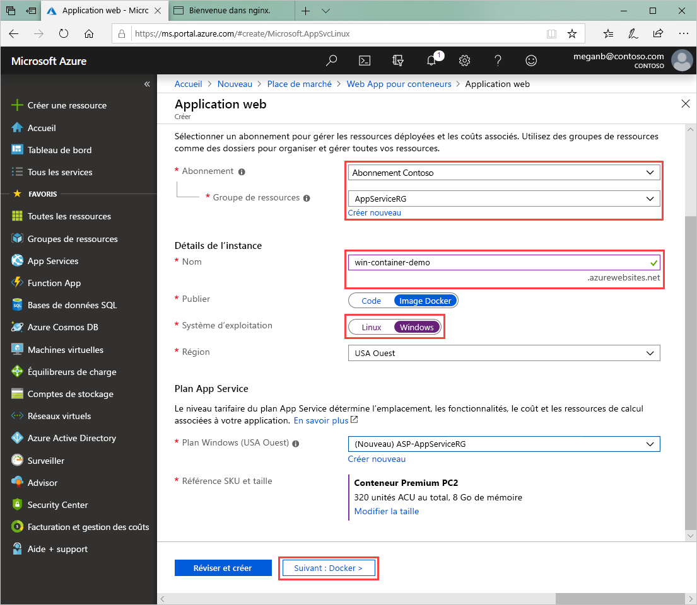

1. Pour **Source d’image**, choisissez **Docker Hub** et pour **Image et étiquette**, entrez le nom de dépôt que vous avez copié dans [Publier sur Docker Hub](#publish-to-docker-hub).

   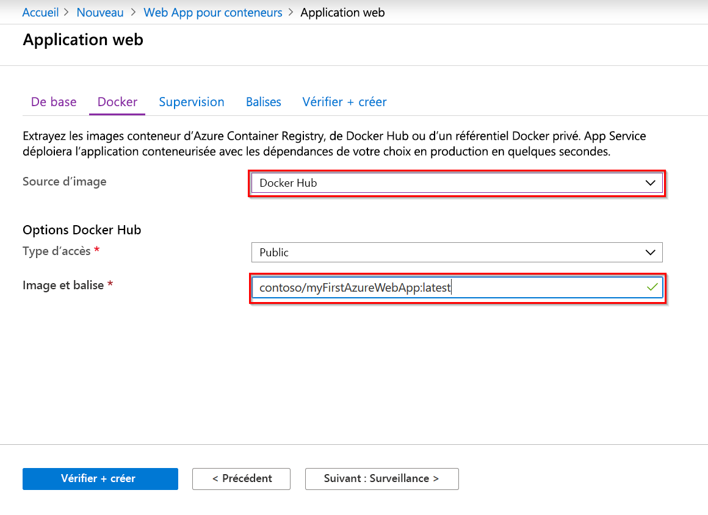

    Si vous avez une image personnalisée ailleurs pour votre application web, comme dans [Azure Container Registry](/azure/container-registry/) ou dans un autre référentiel privé, vous pouvez le configurer ici.

1. Sélectionnez **Vérifier et créer**, **Créer**, puis attendez qu’Azure crée les ressources nécessaires.

## <a name="browse-to-the-container-app"></a>Accédez à l’application de conteneur

Lorsque l’opération Azure est terminée, une zone de notification s’affiche.

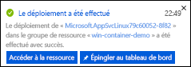

1. Cliquez sur **Accéder à la ressource**.

1. Dans la vue d’ensemble de cette ressource, suivez le lien situé à côté de **URL**.

Une nouvelle page de navigateur s’ouvre à la page suivante :

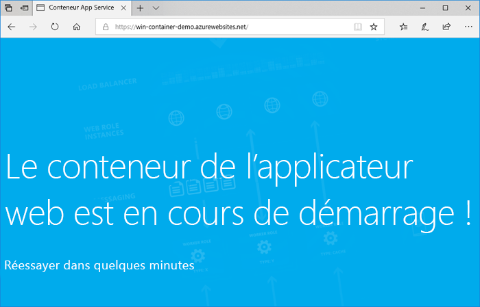

Attendez quelques minutes et réessayez, jusqu'à accéder à la page d’accueil ASP.NET par défaut :

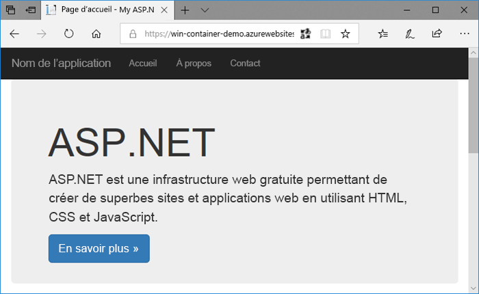

**Félicitations !** Vous exécutez votre premier conteneur Windows personnalisé dans Azure App Service.

## <a name="see-container-start-up-logs"></a>Consulter les journaux d’activité de démarrage du conteneur

Le chargement du conteneur Windows peut prendre un certain temps. Pour afficher la progression, accédez à l’URL suivante en remplaçant *\<app_name >* par le nom de votre application.
```
https://<app_name>.scm.azurewebsites.net/api/logstream
```

Les journaux d’activité en continu ressemblent à ceci :

```
2018-07-27T12:03:11  Welcome, you are now connected to log-streaming service.
27/07/2018 12:04:10.978 INFO - Site: win-container-demo - Start container succeeded. Container: facbf6cb214de86e58557a6d073396f640bbe2fdec88f8368695c8d1331fc94b
27/07/2018 12:04:16.767 INFO - Site: win-container-demo - Container start complete
27/07/2018 12:05:05.017 INFO - Site: win-container-demo - Container start complete
27/07/2018 12:05:05.020 INFO - Site: win-container-demo - Container started successfully
```

## <a name="update-locally-and-redeploy"></a>Mise à jour locale et redéploiement

1. Dans Visual Studio, dans l’**Explorateur de solutions**, ouvrez **Vues** > **Accueil** > **Index.cshtml**.

1. Recherchez la balise HTML `<div class="jumbotron">` vers le début, puis remplacez la totalité de l’élément par le code suivant :

   ```HTML
   <div class="jumbotron">
       <h1>ASP.NET in Azure!</h1>
       <p class="lead">This is a simple app that we’ve built that demonstrates how to deploy a .NET app to Azure App Service.</p>
   </div>
   ```

1. Pour effectuer un redéploiement sur Azure, cliquez avec le bouton droit sur le projet **myFirstAzureWebApp** dans l’**Explorateur de solutions**, puis choisissez **Publier**.

1. Dans la page de publication, sélectionnez **Publier** et attendez la fin de la publication.

1. Pour indiquer à App Service qu’il faut tirer la nouvelle image de Docker Hub, redémarrez l’application. De retour dans la page d’application du portail, cliquez sur **Redémarrer** > **Oui**.

   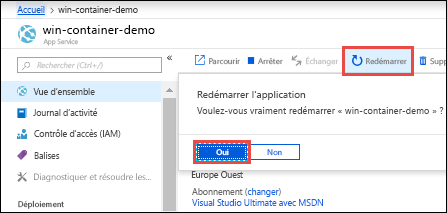

[Accédez de nouveau à l’application de conteneur](#browse-to-the-container-app). Quand vous actualisez la page web, l’application doit d’abord revenir à la page « Démarrage », puis afficher quelques minutes après la page web mise à jour.

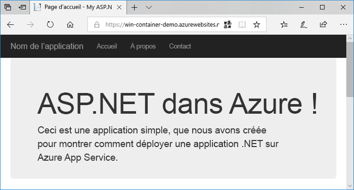

## <a name="use-a-different-parent-image"></a>Utiliser une autre image parente

Vous êtes libre d’utiliser une autre image Docker personnalisée pour exécuter votre application. Toutefois, vous devez choisir l’[image parente (image de base)](https://docs.docker.com/develop/develop-images/baseimages/) appropriée pour l’infrastructure souhaitée :

- Pour déployer des applications .NET Framework, utilisez une image parente basée sur la version Windows Server Core 2019 [Long-Term Servicing Channel (LTSC)](https://docs.microsoft.com/windows-server/get-started-19/servicing-channels-19#long-term-servicing-channel-ltsc). 
- Pour déployer des applications .NET Core, utilisez une image parente basée sur la version Windows Server Nano 1809 [Semi-Annual Servicing Channel (SAC)](https://docs.microsoft.com/windows-server/get-started-19/servicing-channels-19#semi-annual-channel). 

Le téléchargement d’une image parente lors du démarrage de l’application peut prendre un certain temps. Toutefois, vous pouvez réduire le temps de démarrage en utilisant l’une des images parentes suivantes déjà mises en cache dans Azure App Service :

- [mcr.microsoft.com/dotnet/framework/aspnet](https://hub.docker.com/_/microsoft-dotnet-framework-aspnet/):4.7.2-windowsservercore-ltsc2019
- [mcr.microsoft.com/windows/nanoserver](https://hub.docker.com/_/microsoft-windows-nanoserver/):1809 : cette image est le conteneur de base utilisé dans les images Microsoft Windows Nano Server Microsoft [ASP.NET Core](https://hub.docker.com/_/microsoft-dotnet-core-aspnet/).

## <a name="next-steps"></a>Étapes suivantes

> [!div class="nextstepaction"]
> [Migrer vers un conteneur Windows dans Azure](app-service-web-tutorial-windows-containers-custom-fonts.md)
