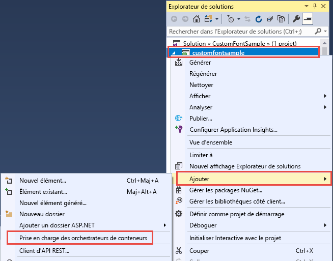
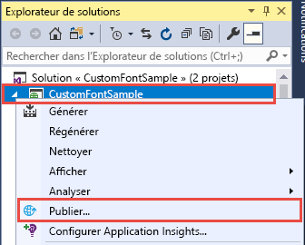
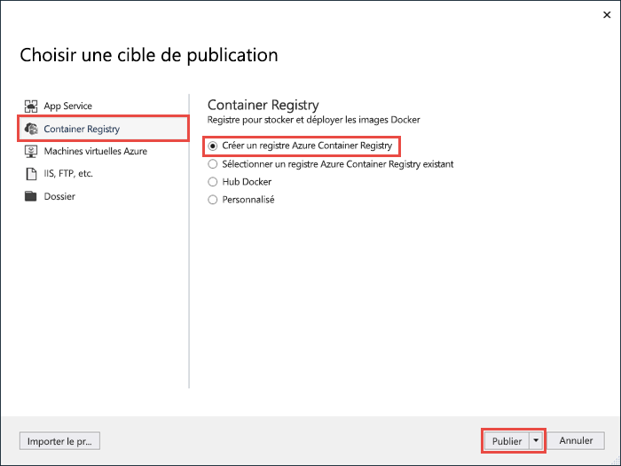
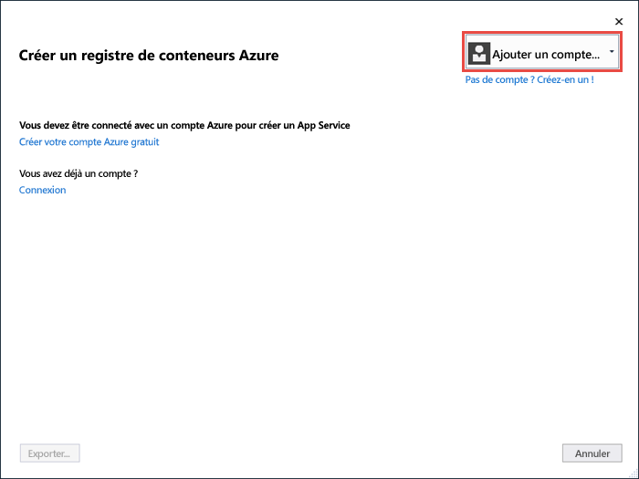
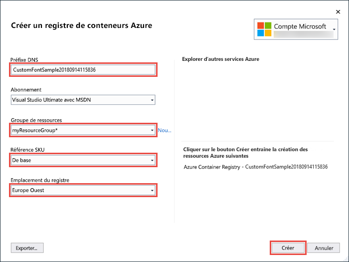
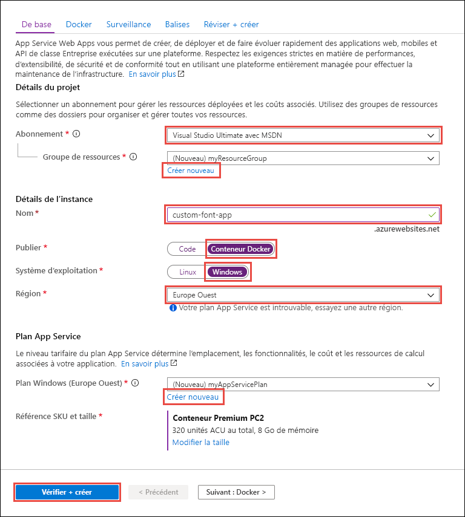
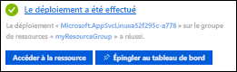

# <a name="migrate-an-aspnet-app-to-azure-app-service-using-a-windows-container-preview"></a>Migrer une application ASP.NET vers Azure App Service à l’aide d’un conteneur Windows (préversion)

[Azure App Service](overview.md) fournit des piles d’applications prédéfinies sur Windows, par exemple ASP.NET ou Node.js, exécuté sur IIS. L’environnement Windows préconfiguré verrouille l’accès administrateur du système d’exploitation, de même que l’installation des logiciels, les modifications du Global Assembly Cache et ainsi de suite (voir [Fonctionnalités du système d’exploitation sur Azure App Service](operating-system-functionality.md)). Toutefois, comme l’utilisation d’un conteneur Windows personnalisé dans App Service vous permet de changer le système d’exploitation selon les besoins de votre application, vous pouvez facilement migrer une application locale qui nécessite une configuration personnalisée de système d’exploitation et de logiciels. Ce tutoriel montre comment migrer vers App Service une application ASP.NET qui utilise des polices personnalisées installées dans la bibliothèque de polices Windows. Vous déployez une image Windows configurée de façon personnalisée à partir de Visual Studio sur [Azure Container Registry](https://docs.microsoft.com/azure/container-registry/), puis vous l’exécutez dans App Service.


## <a name="prerequisites"></a>Prérequis

Pour suivre ce tutoriel :

- <a href="https://hub.docker.com/" target="_blank">Créez un compte Docker Hub</a>
- <a href="https://docs.docker.com/docker-for-windows/install/" target="_blank">Installez Docker pour Windows</a>.
- <a href="https://docs.microsoft.com/virtualization/windowscontainers/quick-start/quick-start-windows-10" target="_blank">Basculez Docker pour exécuter des conteneurs Windows</a>.
- <a href="https://www.visualstudio.com/downloads/" target="_blank">Installez Visual Studio 2019</a> avec les charges de travail **Développement web et ASP.NET** et **Développement Azure**. Si vous avez déjà installé Visual Studio 2019 :
    - Installez les dernières mises à jour dans Visual Studio en cliquant sur **Aide** > **Rechercher les mises à jour**.
    - Ajoutez les charges de travail dans Visual Studio en cliquant sur **Outils** > **Obtenir des outils et des fonctionnalités**.

## <a name="set-up-the-app-locally"></a>Configurer l’application localement

### <a name="download-the-sample"></a>Télécharger l’exemple

Cette étape consiste à configurer le projet .NET local.

- [Téléchargez l’exemple de projet](https://github.com/Azure-Samples/custom-font-win-container/archive/master.zip).
- Extrayez (décompressez) le fichier *custom-font-win-container.zip*.

L’exemple de projet contient une application ASP.NET simple qui utilise une police personnalisée installée dans la bibliothèque de polices Windows. Vous n’avez pas besoin d’installer des polices, mais il s’agit d’un exemple d’application intégrée au système d’exploitation sous-jacent. Pour migrer ce type d’application vers App Service, vous restructurez votre code pour supprimer l’intégration ou vous la migrez telle quelle dans un conteneur Windows personnalisé.

### <a name="install-the-font"></a>Installer la police

Dans l’Explorateur Windows, accédez à _custom-font-win-container-master/CustomFontSample_, cliquez avec le bouton droit sur _FrederickatheGreat-Regular.ttf_, puis sélectionnez **Installer**.

Cette police est publiquement disponible à partir de [Google Fonts](https://fonts.google.com/specimen/Fredericka+the+Great).

### <a name="run-the-app"></a>Exécution de l'application

Ouvrez le fichier *custom-font-win-container/CustomFontSample.sln* dans Visual Studio. 

Entrez `Ctrl+F5` pour exécuter l’application sans débogage. L’application s’affiche dans votre navigateur par défaut. 


Parce qu’elle utilise une police installée, l’application ne peut pas s’exécuter dans le bac à sable App Service. Toutefois, vous pouvez la déployer à l’aide d’un conteneur Windows dans lequel il est possible d’installer la police.

### <a name="configure-windows-container"></a>Configurer un conteneur Windows

Dans l’Explorateur de solutions, cliquez avec le bouton droit sur le projet **CustomFontSample** et sélectionnez **Ajouter** > **Prise en charge de l’orchestration de conteneurs**.



Sélectionnez **Docker Compose** > **OK**.

Votre projet est maintenant configuré pour s’exécuter dans un conteneur Windows. Un fichier _Dockerfile_ est ajouté au projet **CustomFontSample** et un projet **docker-compose** est ajouté à la solution. 

Dans l’Explorateur de solutions, ouvrez **Dockerfile**.

Vous devez utiliser une [image parente prise en charge](app-service-web-get-started-windows-container.md#use-a-different-parent-image). Changez l’image parente en remplaçant la ligne `FROM` par le code suivant :

```Dockerfile
FROM mcr.microsoft.com/dotnet/framework/aspnet:4.7.2-windowsservercore-ltsc2019
```

Ajoutez la ligne suivante à la fin du fichier et enregistrez le fichier :

```Dockerfile
RUN ${source:-obj/Docker/publish/InstallFont.ps1}
```

_InstallFont.ps1_ se trouve dans le projet **CustomFontSample**. Il s’agit d’un script simple qui installe la police. Une version plus complexe du script se trouve dans le [centre de scripts](https://gallery.technet.microsoft.com/scriptcenter/fb742f92-e594-4d0c-8b79-27564c575133).

> [!NOTE]
> Pour tester le conteneur Windows localement, assurez-vous que Docker est démarré sur votre ordinateur local.
>

## <a name="publish-to-azure-container-registry"></a>Publier sur Azure Container Registry

[Azure Container Registry](https://docs.microsoft.com/azure/container-registry/) peut stocker vos images pour les déploiements de conteneur. Vous pouvez configurer App Service pour utiliser des images hébergées dans Azure Container Registry.

### <a name="open-publish-wizard"></a>Ouvrir l’Assistant Publication

Dans l’Explorateur de solutions, cliquez avec le bouton droit sur le projet **CustomFontSample**, puis sélectionnez **Publier**.



### <a name="create-registry-and-publish"></a>Créer un registre et publier

Dans l’Assistant Publication, sélectionnez **Registre de conteneurs** > **Créer un registre de conteneurs Azure** > **Publier**.



### <a name="sign-in-with-azure-account"></a>Se connecter à votre compte Azure

Dans la boîte de dialogue **Créer un registre de conteneurs Azure**, sélectionnez **Ajouter un compte**, puis connectez-vous à votre abonnement Azure. Si vous êtes déjà connecté, sélectionnez le compte qui contient l’abonnement souhaité dans la liste déroulante.



### <a name="configure-the-registry"></a>Configurer le registre

Configurez le nouveau registre de conteneurs en fonction des valeurs suggérées dans le tableau suivant. Lorsque vous avez terminé, cliquez sur **Créer**.

| Paramètre  | Valeur suggérée | Pour plus d’informations |
| ----------------- | ------------ | ----|
|**Préfixe DNS**| Conservez le nom généré du registre ou remplacez-le par un autre nom unique. |  |
|**Groupe de ressources**| Cliquez sur **Nouveau**, tapez **myResourceGroup**, puis cliquez sur **OK**. |  |
|**Référence (SKU)**| De base | [Niveaux de tarification](https://azure.microsoft.com/pricing/details/container-registry/)|
|**Emplacement du registre**| Europe Ouest | |



Une fenêtre de terminal s’ouvre et affiche la progression du déploiement de l’image. Attendez la fin du déploiement.

## <a name="sign-in-to-azure"></a>Connexion à Azure

Connectez-vous au portail Azure sur https://portal.azure.com.

## <a name="create-a-web-app"></a>Créer une application web

Dans le menu de gauche, sélectionnez **Créer une ressource** > **Web** > **Web App pour conteneurs**.

### <a name="configure-app-basics"></a>Configurer les informations de base des applications

Dans l’onglet **Informations de base**, configurez les paramètres selon le tableau suivant, puis cliquez sur **Suivant : Docker**.

| Paramètre  | Valeur suggérée | Pour plus d’informations |
| ----------------- | ------------ | ----|
|**Abonnement**| Vérifiez que l’abonnement approprié est sélectionné. |  |
|**Groupe de ressources**| Sélectionnez **Créer**, tapez **myResourceGroup** et cliquez sur **OK**. |  |
|**Nom**| Tapez un nom unique. | L’URL de l’application web est `http://<app-name>.azurewebsites.net`, où `<app-name>` est le nom de votre application. |
|**Publier**| Conteneur Docker | |
|**Système d’exploitation**| Windows | |
|**Région**| Europe Ouest | |
|**Plan Windows**| Sélectionnez **Créer**, tapez **myAppServicePlan** et cliquez sur **OK**. | |

L’onglet **Informations de base** doit se présenter comme suit :



### <a name="configure-windows-container"></a>Configurer un conteneur Windows

Dans l’onglet **Docker**, configurez votre conteneur Windows personnalisé comme indiqué dans le tableau suivant, puis sélectionnez **Vérifier + créer**.

| Paramètre  | Valeur suggérée |
| ----------------- | ------------ |
|**Source d’image**| Azure Container Registry |
|**Registre**| Sélectionnez [le registre que vous avez créé précédemment](#publish-to-azure-container-registry). |
|**Image**| customfontsample |
|**Tag**| latest |

### <a name="complete-app-creation"></a>Créer l’application

Cliquez sur **Créer** et attendez que Azure créer les ressources requises.

## <a name="browse-to-the-web-app"></a>Accéder à l’application web

Lorsque l’opération Azure est terminée, une zone de notification s’affiche.



1. Cliquez sur **Accéder à la ressource**.

2. Dans la page d’application, cliquez sur le lien situé sous **URL**.

Une nouvelle page de navigateur s’ouvre à la page suivante :


Attendez quelques minutes et réessayez, jusqu’à obtenir la page d’accueil avec la police attendue :


**Félicitations !** Vous avez migré une application ASP.NET vers Azure App Service dans un conteneur Windows.

## <a name="see-container-start-up-logs"></a>Consulter les journaux d’activité de démarrage du conteneur

Le chargement du conteneur Windows peut prendre un certain temps. Pour afficher la progression, accédez à l’URL suivante en remplaçant *\<app-name>* par le nom de votre application.
```
https://<app-name>.scm.azurewebsites.net/api/logstream
```

Les journaux d’activité en continu ressemblent à ceci :

```
14/09/2018 23:16:19.889 INFO - Site: fonts-win-container - Creating container for image: customfontsample20180914115836.azurecr.io/customfontsample:latest.
14/09/2018 23:16:19.928 INFO - Site: fonts-win-container - Create container for image: customfontsample20180914115836.azurecr.io/customfontsample:latest succeeded. Container Id 329ecfedbe370f1d99857da7352a7633366b878607994ff1334461e44e6f5418
14/09/2018 23:17:23.405 INFO - Site: fonts-win-container - Start container succeeded. Container: 329ecfedbe370f1d99857da7352a7633366b878607994ff1334461e44e6f5418
14/09/2018 23:17:28.637 INFO - Site: fonts-win-container - Container ready
14/09/2018 23:17:28.637 INFO - Site: fonts-win-container - Configuring container
14/09/2018 23:18:03.823 INFO - Site: fonts-win-container - Container ready
14/09/2018 23:18:03.823 INFO - Site: fonts-win-container - Container start-up and configuration completed successfully
```

