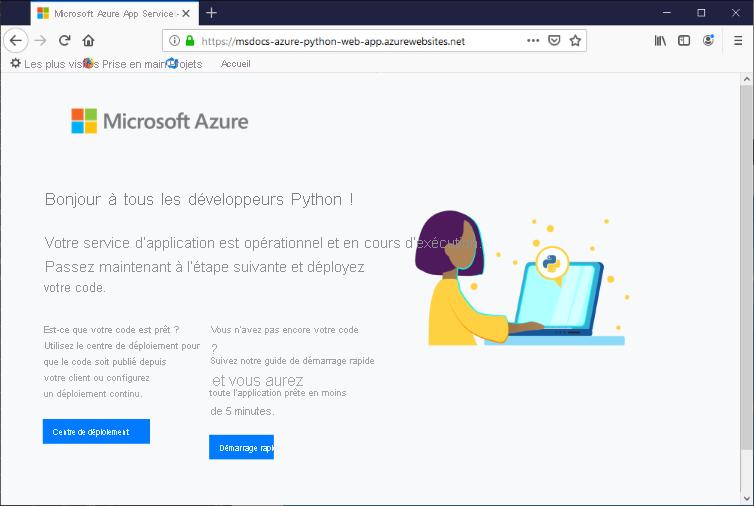

# <a name="configure-a-linux-python-app-for-azure-app-service"></a>Configurer une application Python Linux pour Azure App Service

Cet article explique comment [Azure App Service](overview.md) exécute des applications Python, comment vous pouvez migrer des applications existantes vers Azure et comment vous pouvez personnaliser le comportement d’App Service si nécessaire. Les applications Python doivent être déployées avec tous les modules [pip](https://pypi.org/project/pip/) nécessaires.

Le moteur de déploiement App Service active automatiquement un environnement virtuel et exécute automatiquement `pip install -r requirements.txt` quand vous déployez un [dépôt Git](deploy-local-git.md) ou un [package zip](deploy-zip.md).

Ce guide fournit des concepts et des instructions clés aux développeurs Python qui utilisent un conteneur Linux intégré dans App Service. Si vous n’avez jamais utilisé Azure App Service, commencez par suivre le [démarrage rapide Python](quickstart-python.md) et le [tutoriel sur l’utilisation de Python avec PostgreSQL](tutorial-python-postgresql-app.md).

Vous pouvez utiliser soit le [portail Azure](https://portal.azure.com) soit Azure CLI pour la configuration :

- **Portail Azure** : utilisez la page **Paramètres** > **Configuration** de l’application, comme décrit dans [Configurer une application App Service sur le portail Azure](configure-common.md).

- **Azure CLI** : vous avez deux possibilités.

    - Exécutez des commandes dans [Azure Cloud Shell](../cloud-shell/overview.md).
    - Exécutez des commandes localement en installant la dernière version d’[Azure CLI](/cli/azure/install-azure-cli), puis connectez-vous à Azure avec [az login](/cli/azure/reference-index#az-login).
    
> [!NOTE]
> Linux est le système recommandé pour l’exécution des applications Python dans App Service. Pour plus d’informations sur l’option Windows, consultez [Python sur la version Windows d’App Service](/visualstudio/python/managing-python-on-azure-app-service).

## <a name="configure-python-version"></a>Configurer la version de Python

- **Portail Azure** : utilisez l’onglet **Paramètres généraux** de la page **Configuration**, comme décrit dans [Configurer les paramètres généraux](configure-common.md#configure-general-settings) pour les conteneurs Linux.

- **Azure CLI** :

    -  Affichez la version actuelle de Python avec [az webapp config show](/cli/azure/webapp/config#az_webapp_config_show) :
    
        ```azurecli
        az webapp config show --resource-group <resource-group-name> --name <app-name> --query linuxFxVersion
        ```
        
        Remplacez `<resource-group-name>` et `<app-name>` par les noms appropriés pour votre application web.
    
    - Définissez la version de Python avec [az webapp config set](/cli/azure/webapp/config#az_webapp_config_set) :
        
        ```azurecli
        az webapp config set --resource-group <resource-group-name> --name <app-name> --linux-fx-version "PYTHON|3.7"
        ```
    
    - Affichez toutes les versions de Python prises en charge dans Azure App Service avec [az webapp list-runtimes](/cli/azure/webapp#az_webapp_list_runtimes) :
    
        ```azurecli
        az webapp list-runtimes --linux | grep PYTHON
        ```
    
Vous pouvez exécuter une version non prise en charge de Python en générant votre propre image conteneur à la place. Pour plus d’informations, consultez [Utiliser une image Docker personnalisée](tutorial-custom-container.md?pivots=container-linux).

<!-- <a> element here to preserve external links-->
<a name="access-environment-variables"></a>

## <a name="customize-build-automation"></a>Personnaliser l’automatisation de la génération

Le système de génération d’App Service, appelé Oryx, effectue les étapes suivantes au moment où vous déployez votre application à l’aide de packages Git ou zip :

1. Exécutez un script de prégénération personnalisé s’il est spécifié par le paramètre `PRE_BUILD_COMMAND`. (Le script peut lui-même exécuter d’autres scripts Python et Node.js, des commandes pip et npm ainsi que des outils Node tels que yarn, par exemple `yarn install` et `yarn build`.)

1. Exécutez `pip install -r requirements.txt`. Le fichier *requirements.txt* doit être présent dans le dossier racine du projet. Dans le cas contraire, le processus de génération signale l’erreur : « setup.py ou requirements.txt est introuvable. Installation de pip non exécutée ».

1. Si *manage.py* se trouve à la racine du dépôt (indiquant une application Django), exécutez *manage.py collectstatic*. En revanche, si le paramètre `DISABLE_COLLECTSTATIC` a la valeur `true`, cette étape est ignorée.

1. Exécutez un script de post-génération personnalisé s’il est spécifié par le paramètre `POST_BUILD_COMMAND`. (Là encore, le script peut exécuter d’autres scripts Python et Node.js, des commandes pip et npm ainsi que des outils Node.)

Par défaut, les paramètres `PRE_BUILD_COMMAND`, `POST_BUILD_COMMAND` et `DISABLE_COLLECTSTATIC` sont vides. 

- Pour désactiver l’exécution de collectstatic pendant la génération d’applications Django, définissez le paramètre `DISABLE_COLLECTSTATIC` sur true.

- Pour exécuter des commandes de prégénération, définissez le paramètre `PRE_BUILD_COMMAND` pour qu’il contienne soit une commande, comme `echo Pre-build command`, soit un chemin de fichier de script par rapport à la racine de votre projet, comme `scripts/prebuild.sh`. Toutes les commandes doivent utiliser des chemins relatifs du dossier racine du projet.

- Pour exécuter des commandes de post-génération, définissez le paramètre `POST_BUILD_COMMAND` pour qu’il contienne soit une commande, comme `echo Post-build command`, soit un chemin de fichier de script par rapport à la racine de votre projet, comme `scripts/postbuild.sh`. Toutes les commandes doivent utiliser des chemins relatifs du dossier racine du projet.

Pour connaître les autres paramètres permettant de personnaliser l’automatisation de la génération, consultez [Configuration d’Oryx](https://github.com/microsoft/Oryx/blob/master/doc/configuration.md). 

Pour accéder aux journaux de génération et de déploiement, consultez [Accéder aux journaux de déploiement](#access-deployment-logs).

Pour plus d’informations sur la façon dont App Service exécute et génère les applications Python dans Linux, consultez [Comment Oryx détecte et génère les applications Python](https://github.com/microsoft/Oryx/blob/master/doc/runtimes/python.md).

> [!NOTE]
> Les paramètres `PRE_BUILD_SCRIPT_PATH` et `POST_BUILD_SCRIPT_PATH` sont identiques à `PRE_BUILD_COMMAND` et `POST_BUILD_COMMAND` et sont pris en charge pour des raisons d’héritage.
> 
> Un paramètre nommé `SCM_DO_BUILD_DURING_DEPLOYMENT`, s’il contient `true` ou 1, déclenche une génération Oryx pendant le déploiement. Le paramètre a la valeur true quand vous déployez avec git, la commande Azure CLI `az webapp up` et Visual Studio Code.

> [!NOTE]
> Utilisez toujours des chemins relatifs dans tous les scripts de pré et post-génération, car le conteneur de génération dans lequel Oryx s’exécute est différent du conteneur de runtime dans lequel l’application s’exécute. Ne vous fiez jamais à l’emplacement exact du dossier de votre projet d’application dans le conteneur (qui est placé, par exemple, sous *site/wwwroot*).

## <a name="migrate-existing-applications-to-azure"></a>Migrer des applications existantes vers Azure

Les applications web existantes peuvent être redéployées dans Azure comme suit :

1. **Dépôt source** : Conservez votre code source dans un dépôt approprié comme GitHub, qui vous permettra de configurer ultérieurement un déploiement continu dans ce processus.
    1. Votre fichier *requirements.txt* doit se trouver à la racine de votre dépôt pour qu’App Service installe automatiquement les packages nécessaires.    

1. **Base de données** : Si votre application dépend d’une base de données, provisionnez également les ressources nécessaires dans Azure. Voir le [tutoriel : Déployer une application web Django avec PostgreSQL – Créer une base de données](tutorial-python-postgresql-app.md#3-create-postgres-database-in-azure) pour obtenir un exemple.

1. **Ressources App Service** : Créez un groupe de ressources, un plan App Service et une application web App Service pour héberger votre application. La manière la plus simple de procéder consiste à effectuer un déploiement initial de votre code via la commande Azure CLI `az webapp up`, comme indiqué dans [Tutoriel : Déployer une application web Django avec PostgreSQL – Déployer le code](tutorial-python-postgresql-app.md#4-deploy-the-code-to-azure-app-service). Remplacez les noms du groupe de ressources, du plan App Service et de l’application web pour qu’ils conviennent mieux à votre application.

1. **Variables d’environnement** : Si votre application nécessite des variables d’environnement, créez des [paramètres d’application App Service](configure-common.md#configure-app-settings) équivalents. Ces paramètres App Service apparaissent pour votre code comme des variables d’environnement, comme cela est décrit dans [Accéder aux variables d’environnement](#access-app-settings-as-environment-variables).
    - Par exemple, les connexions de base de données sont souvent gérées via ces paramètres, comme indiqué dans [Tutoriel : Déployer une application web Django avec PostgreSQL – Configurer des variables pour connecter la base de données](tutorial-python-postgresql-app.md#42-configure-environment-variables-to-connect-the-database).
    - Consultez [Paramètres de production pour les applications Django](#production-settings-for-django-apps) pour découvrir les paramètres spécifiques pour les applications Django standard.

1. **Démarrage d’application** : Passez en revue la section [Processus de démarrage du conteneur](#container-startup-process), plus loin dans cet article, pour comprendre comment App Service tente d’exécuter votre application. App Service utilise par défaut le serveur web Gunicorn, qui doit être en mesure de trouver votre objet d’application ou le dossier *wsgi.py*. Si nécessaire, vous pouvez [personnaliser la commande de démarrage](#customize-startup-command).

1. **Déploiement continu** : Configurez le déploiement continu, comme cela est décrit dans [Déploiement continu vers Azure App Service](deploy-continuous-deployment.md) si vous utilisez un déploiement Azure Pipelines ou Kudu, ou dans [Déployer sur App Service à l’aide de GitHub Actions](deploy-github-actions.md) si vous utilisez des actions GitHub.

1. **Actions personnalisées** : Pour effectuer des actions dans le conteneur App Service qui héberge votre application, telles que les migrations de base de données Django, vous pouvez [vous connecter au conteneur via SSH](configure-linux-open-ssh-session.md). Pour obtenir un exemple d’exécution des migrations de base de données Django, consultez [Tutoriel : Déployer une application web Django avec PostgreSQL – Exécuter des migrations de base de données](tutorial-python-postgresql-app.md#43-run-django-database-migrations).
    - Lorsque vous utilisez le déploiement continu, vous pouvez effectuer ces actions à l’aide de commandes post-génération, comme cela est décrit précédemment sous [Personnaliser l’automatisation de la génération](#customize-build-automation).

Une fois ces étapes terminées, vous devez être en mesure de valider les modifications apportées à votre dépôt source et de faire en sorte que ces mises à jour soient déployées automatiquement dans App Service.

### <a name="production-settings-for-django-apps"></a>Paramètres de production pour les applications Django

Pour un environnement de production comme Azure App Service, les applications Django doivent respecter la [liste de vérification de déploiement](https://docs.djangoproject.com/en/3.1/howto/deployment/checklist/) de Django (djangoproject.com).

Le tableau suivant décrit les paramètres de production qui s’appliquent à Azure. Ces paramètres sont définis dans le fichier *setting.py* de l’application.

| Paramètre Django | Instructions pour Azure |
| --- | --- |
| `SECRET_KEY` | Stockez la valeur dans un paramètre App Service comme décrit dans [Accéder aux paramètres d’application en tant que variables d’environnement](#access-app-settings-as-environment-variables). Vous pouvez également [stocker la valeur en tant que « secret » dans Azure Key Vault](../key-vault/secrets/quick-create-python.md). |
| `DEBUG` | Créez un paramètre `DEBUG` dans App Service avec la valeur 0 (false), puis chargez la valeur en tant que variable d’environnement. Dans votre environnement de développement, créez une variable d’environnement `DEBUG` avec la valeur 1 (true). |
| `ALLOWED_HOSTS` | En production, Django vous impose d’inclure l’URL de l’application dans le tableau `ALLOWED_HOSTS` de *settings.py*. Vous pouvez récupérer cette URL au moment de l’exécution avec le code `os.environ['WEBSITE_HOSTNAME']`. App Service définit automatiquement la variable d’environnement `WEBSITE_HOSTNAME` sur l’URL de l’application. |
| `DATABASES` | Définissez les paramètres dans App Service pour la connexion de base de données et chargez-les en tant que variables d’environnement pour remplir le dictionnaire [`DATABASES`](https://docs.djangoproject.com/en/3.1/ref/settings/#std:setting-DATABASES). Vous pouvez également stocker les valeurs (notamment le nom d’utilisateur et le mot de passe) en tant que [secrets Azure Key Vault](../key-vault/secrets/quick-create-python.md). |

## <a name="serve-static-files-for-django-apps"></a>Distribuer des fichiers statiques pour les applications Django

Si votre application web Django comprend des fichiers front-end statiques, suivez d’abord les instructions relatives à la [gestion des fichiers statiques](https://docs.djangoproject.com/en/3.1/howto/static-files/) dans la documentation de Django.

Pour App Service, vous devez apporter ensuite les modifications suivantes :

1. Pensez à utiliser des variables d’environnement (pour le développement local) et des paramètres d’application (au moment du déploiement sur le cloud) afin de définir dynamiquement les variables Django `STATIC_URL` et `STATIC_ROOT`. Par exemple :    

    ```python
    STATIC_URL = os.environ.get("DJANGO_STATIC_URL", "/static/")
    STATIC_ROOT = os.environ.get("DJANGO_STATIC_ROOT", "./static/")    
    ```

    Vous pouvez changer `DJANGO_STATIC_URL` et `DJANGO_STATIC_ROOT` si nécessaire pour vos environnements locaux et cloud. Par exemple, si le processus de génération de vos fichiers statiques les place dans un dossier nommé `django-static`, vous pouvez affecter à `DJANGO_STATIC_URL` la valeur `/django-static/` pour éviter d’utiliser la valeur par défaut.

1. Si vous avez un script prébuild qui génère des fichiers statiques dans un autre dossier, incluez ce dossier dans la variable Django `STATICFILES_DIRS` pour que le processus `collectstatic` de Django les trouve. Par exemple, si vous exécutez `yarn build` dans votre dossier front-end et si yarn génère un dossier `build/static` contenant des fichiers statiques, incluez ce dossier de la façon suivante :

    ```python
    FRONTEND_DIR = "path-to-frontend-folder" 
    STATICFILES_DIRS = [os.path.join(FRONTEND_DIR, 'build', 'static')]    
    ```

    Ici, `FRONTEND_DIR` permet de créer un chemin vers l’emplacement d’exécution d’un outil de build tel que yarn. Vous pouvez réutiliser une variable d’environnement et un paramètre d’application, si nécessaire.

1. Ajoutez `whitenoise` à votre fichier *requirements.txt*. [Whitenoise](http://whitenoise.evans.io/en/stable/) (whitenoise.evans.io) est un package Python qui permet à une application de production Django de distribuer ses propres fichiers statiques. Whitenoise cible en particulier les fichiers qui se trouvent dans le dossier spécifié par la variable Django `STATIC_ROOT`.

1. Dans votre fichier *settings.py*, ajoutez la ligne suivante pour Whitenoise :

    ```python
    STATICFILES_STORAGE = ('whitenoise.storage.CompressedManifestStaticFilesStorage')
    ```

1. Modifiez également les listes `MIDDLEWARE` et `INSTALLED_APPS` pour inclure Whitenoise :

    ```python
    MIDDLEWARE = [
        "whitenoise.middleware.WhiteNoiseMiddleware",
        # Other values follow
    ]

    INSTALLED_APPS = [
        "whitenoise.runserver_nostatic",
        # Other values follow
    ]
    ```

## <a name="container-characteristics"></a>Caractéristiques du conteneur

Quand elles sont déployées dans App Service, les applications Python s’exécutent dans un conteneur Linux Docker qui est défini dans le [dépôt GitHub Python d’App Service](https://github.com/Azure-App-Service/python). Les configurations d’images se trouvent dans les répertoires spécifiques des versions.

Ce conteneur présente les caractéristiques suivantes :

- Les applications sont exécutées à l’aide de [Gunicorn WSGI HTTP Server](https://gunicorn.org/), en utilisant les arguments supplémentaires `--bind=0.0.0.0 --timeout 600`.
    - Vous pouvez fournir des paramètres de configuration pour Gunicorn via un fichier *gunicorn.conf.py* à la racine du projet, comme décrit dans le document [Configuration overview](https://docs.gunicorn.org/en/stable/configure.html#configuration-file) (docs.gunicorn.org). Vous pouvez également [personnaliser la commande de démarrage](#customize-startup-command).

    - Pour protéger votre application web contre les attaques DDOS accidentelles ou délibérées, Gunicorn s’exécute derrière un proxy inverse Nginx, comme décrit dans le document [Deploying Gunicorn](https://docs.gunicorn.org/en/latest/deploy.html) (docs.gunicorn.org).

- Par défaut, l’image conteneur de base inclut uniquement l’infrastructure web Flask, mais le conteneur prend en charge les autres infrastructures compatibles WSGI et Python 3.6+, telles que Django.

- Pour installer des packages supplémentaires, tels que Django, créez un fichier [*requirements.txt*](https://pip.pypa.io/en/stable/user_guide/#requirements-files) à la racine de votre projet qui spécifie vos dépendances directes. App Service installe alors automatiquement ces dépendances pendant le déploiement de votre projet.

    Le fichier *requirements.txt* *doit* se trouver à la racine du projet pour les dépendances à installer. Dans le cas contraire, le processus de génération signale l’erreur : « setup.py ou requirements.txt est introuvable. Installation de pip non exécutée ». Si vous rencontrez cette erreur, vérifiez l’emplacement de votre fichier requirements.

- App Service définit automatiquement une variable d’environnement nommée `WEBSITE_HOSTNAME` avec l’URL de l’application web, par exemple `msdocs-hello-world.azurewebsites.net`. Il définit également `WEBSITE_SITE_NAME` avec le nom de votre application, par exemple `msdocs-hello-world`. 
   
- npm et Node.js sont installés dans le conteneur pour que vous puissiez exécuter des outils de build Node, par exemple yarn.

## <a name="container-startup-process"></a>Processus de démarrage du conteneur

Lors du démarrage, App Service sur un conteneur Linux exécute les étapes suivantes :

1. Si elle est fournie, utilisez une [commande de démarrage personnalisée](#customize-startup-command).
2. Vérifiez l’existence d’une [application Django](#django-app) et, si elle existe, lancez Gunicorn.
3. Vérifiez l’existence d’une [application Flask](#flask-app) et, si elle existe, lancez Gunicorn.
4. Si aucune autre application n’est trouvée, démarrer une application par défaut qui est créée dans le conteneur.

Les sections suivantes fournissent des détails supplémentaires sur chaque option.

### <a name="django-app"></a>Application Django

Pour les applications Django, App Service recherche un fichier nommé `wsgi.py` dans le code de votre application et exécute Gunicorn à l’aide de la commande suivante :

```bash
# <module> is the name of the folder that contains wsgi.py
gunicorn --bind=0.0.0.0 --timeout 600 <module>.wsgi
```

Si vous souhaitez un contrôle plus précis sur la commande de démarrage, utilisez une [commande de démarrage personnalisée](#customize-startup-command), remplacez `<module>` par le nom du dossier qui contient *wsgi.py*, puis ajoutez un argument `--chdir` si ce module ne se trouve pas à la racine du projet. Par exemple, si votre fichier *wsgi.py* se trouve sous *knboard/backend/config* à la racine de votre projet, utilisez les arguments `--chdir knboard/backend config.wsgi`.

Pour activer la journalisation de production, ajoutez les paramètres `--access-logfile` et `--error-logfile` comme indiqué dans les exemples de [commandes de démarrage personnalisées](#customize-startup-command).

### <a name="flask-app"></a>Application Flask

Pour Flask, App Service recherche un fichier nommé *application.py* ou *app.py* et démarre Gunicorn comme ceci :

```bash
# If application.py
gunicorn --bind=0.0.0.0 --timeout 600 application:app

# If app.py
gunicorn --bind=0.0.0.0 --timeout 600 app:app
```

Si votre module d’application principal est contenu dans un autre fichier, utilisez un nom différent pour l’objet d’application. Si vous souhaitez fournir des arguments supplémentaires à Gunicorn, utilisez une [commande de démarrage personnalisée](#customize-startup-command).

### <a name="default-behavior"></a>Comportement par défaut

Si App Service ne trouve pas de commande personnalisée, d’application Django ou d’application Flask, une application par défaut en lecture seule, située dans le dossier _opt/defaultsite_ (comme illustré dans l’image suivante), est exécutée.

Si vous avez déployé du code et que vous voyez toujours l’application par défaut, consultez [Résolution des problèmes – L’application n’apparaît pas](#app-doesnt-appear).

[](#app-doesnt-appear)

Là encore, si vous vous attendez à voir une application déployée à la place de l’application par défaut, consultez [Résolution des problèmes – L’application n’apparaît pas](#app-doesnt-appear).

## <a name="customize-startup-command"></a>Commande de démarrage personnalisée

Comme nous l’avons vu plus haut dans cet article, vous pouvez fournir des paramètres de configuration pour Gunicorn via un fichier *gunicorn.conf.py* à la racine du projet, comme décrit dans le document Gunicorn [Configuration overview](https://docs.gunicorn.org/en/stable/configure.html#configuration-file).

Si une telle configuration ne suffit pas, vous pouvez contrôler le comportement de démarrage du conteneur en fournissant soit une commande de démarrage personnalisée, soit plusieurs commandes dans un fichier de commandes de démarrage. Vous pouvez attribuer le nom de votre choix à un fichier de commandes de démarrage, par exemple *startup.sh*, *startup.cmd*, *Startup.txt*, etc.

Toutes les commandes doivent utiliser des chemins relatifs du dossier racine du projet.

Pour spécifier une commande de démarrage ou un fichier de commandes :

- **Portail Azure** : sélectionnez la page **Configuration** de l’application, puis sélectionnez **Paramètres généraux**. Dans le champ **Commande de démarrage**, placez soit le texte complet de votre commande de démarrage, soit le nom de votre fichier de commandes de démarrage. Sélectionnez ensuite **Enregistrer** pour appliquer les modifications. Consultez [Configurer les paramètres généraux](configure-common.md#configure-general-settings) pour les conteneurs Linux.

- **Azure CLI** : utilisez la commande [az webapp config set](/cli/azure/webapp/config#az_webapp_config_set) avec le paramètre `--startup-file` pour définir la commande de démarrage ou le fichier :

    ```azurecli
    az webapp config set --resource-group <resource-group-name> --name <app-name> --startup-file "<custom-command>"
    ```
        
    Remplacez `<custom-command>` par le texte complet de votre commande de démarrage ou par le nom de votre fichier de commandes de démarrage.
        
App Service ignore les erreurs qui surviennent lors du traitement d’une commande de démarrage personnalisée ou d’un fichier, puis continue son processus de démarrage en recherchant des applications Django et Flask. Si vous constatez un comportement différent de celui attendu, vérifiez que votre commande de démarrage ou votre fichier est exempt d’erreurs et qu’un fichier de commandes de démarrage est déployé dans App Service avec le code de votre application. Vous pouvez aussi consulter les [journaux de diagnostic](#access-diagnostic-logs) pour plus d’informations. Consultez également la page **Diagnostiquer et résoudre les problèmes** de l’application sur le [portail Azure](https://portal.azure.com).

### <a name="example-startup-commands"></a>Exemples de commandes de démarrage

- **Arguments Gunicorn ajoutés** : l’exemple suivant ajoute `--workers=4` à une ligne de commande Gunicorn pour démarrer une application Django : 

    ```bash
    # <module-path> is the relative path to the folder that contains the module
    # that contains wsgi.py; <module> is the name of the folder containing wsgi.py.
    gunicorn --bind=0.0.0.0 --timeout 600 --workers=4 --chdir <module_path> <module>.wsgi
    ```    

    Pour plus d’informations, consultez [Running Gunicorn](https://docs.gunicorn.org/en/stable/run.html) (Exécuter Gunicorn - docs.gunicorn.org).

- **Activez la journalisation de production pour Django** : ajoutez les arguments `--access-logfile '-'` et `--error-logfile '-'` à la ligne de commande :

    ```bash    
    # '-' for the log files means stdout for --access-logfile and stderr for --error-logfile.
    gunicorn --bind=0.0.0.0 --timeout 600 --workers=4 --chdir <module_path> <module>.wsgi --access-logfile '-' --error-logfile '-'
    ```    

    Ces journaux s’affichent dans le [flux de journaux App Service](#access-diagnostic-logs).

    Pour plus d’informations, consultez le document [Gunicorn logging](https://docs.gunicorn.org/en/stable/settings.html#logging) (docs.gunicorn.org).
    
- **Module principal Flask personnalisé** : par défaut, App Service considère que le module principal d’une application Flask est *application.py* ou *app.py*. Si votre module principal se nomme différemment, vous devez personnaliser la commande de démarrage. Par exemple, si le module principal de votre application Flask se nomme *hello.py* et que l’objet d’application Flask dans ce fichier se nomme `myapp`, la commande doit se présenter comme suit :

    ```bash
    gunicorn --bind=0.0.0.0 --timeout 600 hello:myapp
    ```
    
    Si votre module principal est dans un sous-dossier, tel que `website`, précisez ce dossier grâce à l’argument `--chdir` :
    
    ```bash
    gunicorn --bind=0.0.0.0 --timeout 600 --chdir website hello:myapp
    ```
    
- **Utilisez un serveur non Gunicorn** : pour utiliser un autre serveur web, tel que [aiohttp](https://aiohttp.readthedocs.io/en/stable/web_quickstart.html), utilisez la commande appropriée en tant que commande de démarrage ou dans le fichier de commandes de démarrage :

    ```bash
    python3.7 -m aiohttp.web -H localhost -P 8080 package.module:init_func
    ```

## <a name="access-app-settings-as-environment-variables"></a>Accéder aux paramètres d’application en tant que variables d’environnement

Les paramètres d’application sont des valeurs stockées dans le cloud spécifiquement pour votre application, comme décrit dans [Configurer des paramètres d’application](configure-common.md#configure-app-settings). Ces paramètres sont accessibles au code de votre application en tant que variables d’environnement à l’aide du modèle [os.environ](https://docs.python.org/3/library/os.html#os.environ) standard.

Par exemple, si vous avez créé un paramètre d’application appelé `DATABASE_SERVER`, le code suivant récupère la valeur de ce paramètre :

```python
db_server = os.environ['DATABASE_SERVER']
```

## <a name="detect-https-session"></a>Détecter une session HTTPS

Dans App Service, une [terminaison SSL](https://wikipedia.org/wiki/TLS_termination_proxy) (wikipedia.org) se produit au niveau des équilibreurs de charge réseau. Toutes les requêtes HTTPS accèdent donc à votre application en tant que requêtes HTTP non chiffrées. Si votre logique d’application doit vérifier si les requêtes utilisateur sont chiffrées ou non, inspectez l’en-tête `X-Forwarded-Proto`.

```python
if 'X-Forwarded-Proto' in request.headers and request.headers['X-Forwarded-Proto'] == 'https':
# Do something when HTTPS is used
```

Les frameworks web populaires vous permettent d’accéder aux informations `X-Forwarded-*` dans votre modèle d’application standard. Dans [CodeIgniter](https://codeigniter.com/), [is_https()](https://github.com/bcit-ci/CodeIgniter/blob/master/system/core/Common.php#L338-L365) vérifie la valeur de `X_FORWARDED_PROTO` par défaut.

## <a name="access-diagnostic-logs"></a>Accéder aux journaux de diagnostic

[!INCLUDE [Access diagnostic logs](../../includes/app-service-web-logs-access-linux-no-h.md)]

Pour accéder aux journaux via le portail Azure, sélectionnez **Supervision** > **Flux de journaux** dans le menu de gauche de votre application.

## <a name="access-deployment-logs"></a>Accéder aux journaux de déploiement

Lorsque vous déployez votre code, App Service effectue le processus de génération décrit précédemment dans la section [Personnaliser l’automatisation de la génération](#customize-build-automation). Comme la build s’exécute dans son propre conteneur, les journaux de génération sont stockés séparément des journaux de diagnostic de l’application.

Utilisez les étapes suivantes pour accéder aux journaux de déploiement :

1. Sur le portail Azure de votre application web, sélectionnez **Déploiement** > **Centre de déploiement (préversion)** dans le menu de gauche.
1. Sous l’onglet **Journaux**, sélectionnez l’**ID de validation** pour la validation la plus récente.
1. Dans la page **Détails des journaux** qui s’affiche, sélectionnez le lien **Afficher les journaux..** qui apparaît en regard de « Exécution de la génération Oryx... ».

Les problèmes de génération, tels que des dépendances incorrectes dans *requirements.txt* et des erreurs dans les scripts pré- ou post-build, s’affichent dans ces journaux. Des erreurs s’affichent également si votre fichier de spécifications n’est pas exactement nommé *requirements.txt*, ou s’il n’apparaît pas dans le dossier racine de votre projet.

## <a name="open-ssh-session-in-browser"></a>Ouvrir une session SSH dans un navigateur

[!INCLUDE [Open SSH session in browser](../../includes/app-service-web-ssh-connect-builtin-no-h.md)]

Lorsque vous êtes correctement connecté à la session SSH, vous devez voir le message « CONNEXION SSH ÉTABLIE » en bas de la fenêtre. Si vous voyez des erreurs, telles que « SSH_CONNECTION_CLOSED » (CONNEXION_SSH_FERMÉE) ou un message indiquant que le conteneur est en cours de redémarrage, il est possible qu’une erreur empêche le démarrage du conteneur d’application. Consultez [Résolution des problèmes](#troubleshooting) pour connaître les étapes permettant de rechercher la source des problèmes éventuels.

## <a name="troubleshooting"></a>Dépannage

En général, la première étape de dépannage consiste à utiliser Diagnostics App Service :

1. Dans le portail Azure de votre application web, sélectionnez **Diagnostiquer et résoudre les problèmes** dans le menu de gauche.
1. Sélectionnez **Disponibilité et performances**.
1. Examinez les informations contenues dans les options **Journaux des applications**, **Incidents de conteneur** et **Problèmes de conteneur**, dans lesquelles les problèmes les plus courants s’affichent.

Consultez ensuite les [journaux de déploiement](#access-deployment-logs) et les [journaux des applications](#access-diagnostic-logs) à la recherche de messages d’erreur. Ces journaux identifient souvent des problèmes particuliers pouvant empêcher le déploiement ou le démarrage de l’application. Par exemple, la génération peut échouer si votre fichier *requirements.txt* a un nom de fichier incorrect, ou s’il n’est pas présent dans le dossier racine de votre projet.

Les sections suivantes fournissent des conseils supplémentaires par rapport à des problèmes spécifiques.

- [L’application n’apparaît pas – L’application par défaut s’affiche](#app-doesnt-appear)
- [L’application n’apparaît pas – Message « service indisponible »](#service-unavailable)
- [setup.py ou requirements.txt est introuvable](#could-not-find-setuppy-or-requirementstxt)
- [ModuleNotFoundError au démarrage](#modulenotfounderror-when-app-starts)
- [Les mots de passe ne s’affichent pas dans une session SSH lorsqu’ils sont tapés](#other-issues)
- [Les commandes de la session SSH semblent être coupées](#other-issues)
- [Les ressources statiques n’apparaissent pas dans une application Django](#other-issues)
- [Irrécupérable : Connexion SSL obligatoire](#other-issues)

#### <a name="app-doesnt-appear"></a>L’application n’apparaît pas

- **Vous voyez l’application par défaut après le déploiement du code de votre propre application.** L’[application par défaut](#default-behavior) s’affiche, soit parce que vous n’avez pas déployé le code de votre application sur App Service, soit parce qu’App Service n’a pas trouvé le code de votre application et a exécuté l’application par défaut à la place.

    - Redémarrez App Service, patientez 15 à 20 secondes et vérifiez de nouveau l’application.
    
    - Vérifiez que vous utilisez bien App Service pour Linux, et non une instance basée sur Windows. À partir de l’interface CLI, exécutez la commande `az webapp show --resource-group <resource-group-name> --name <app-name> --query kind`, en remplaçant `<resource-group-name>` et `<app-name>` en conséquence. `app,linux` doit être la sortie ; si ce n’est pas le cas, recréez l’App Service et choisissez Linux.
    
    - Utilisez [SSH](#open-ssh-session-in-browser) pour vous connecter directement au conteneur App Service et vérifier que vos fichiers existent sous *site/wwwroot*. Si vos fichiers n’existent pas, effectuez les étapes suivantes :
      1. Créez un paramètre d’application nommé `SCM_DO_BUILD_DURING_DEPLOYMENT` avec la valeur 1, redéployez votre code, patientez quelques minutes, puis essayez d’accéder de nouveau à l’application. Pour plus d’informations sur la création de paramètres d’application, consultez [Configurer une application App Service dans le portail Azure](configure-common.md).
      1. Passez en revue votre processus de déploiement, [vérifiez les journaux de déploiement](#access-deployment-logs), corrigez les erreurs et redéployez l’application.
    
    - Si vos fichiers existent, cela signifie qu’App Service n’a pas été en mesure d’identifier votre fichier de démarrage. Vérifiez que votre application est structurée selon ce qu’App Service attend pour [Django](#django-app) ou [Flask](#flask-app), ou bien utilisez une [commande de démarrage personnalisée](#customize-startup-command).

- <a name="service-unavailable"></a>**Le message « Service indisponible » s’affiche dans le navigateur.** Le délai d’attente du navigateur a expiré en l’absence d’une réponse d’App Service, ce qui indique qu’App Service a démarré le serveur Gunicorn, mais que l’application elle-même n’a pas démarré. Cette condition peut révéler que les arguments Gunicorn sont incorrects, ou qu’il y a une erreur dans le code de l’application.

    - Actualisez le navigateur, en particulier si vous utilisez les niveaux tarifaires les plus bas pour votre Plan App Service. Par exemple, l’application peut prendre plus de temps à démarrer si vous utilisez des niveaux gratuits et répondre une fois que vous avez actualisé le navigateur.

    - Vérifiez que votre application est structurée selon ce qu’App Service attend pour [Django](#django-app) ou [Flask](#flask-app), ou bien utilisez une [commande de démarrage personnalisée](#customize-startup-command).

    - Examinez le [flux des journaux de l’application](#access-diagnostic-logs) à la recherche de messages d’erreur. Les journaux affichent toutes les erreurs figurant dans le code de l’application.

#### <a name="could-not-find-setuppy-or-requirementstxt"></a>setup.py ou requirements.txt est introuvable

- **Le flux de journaux affiche « setup.py ou requirements.txt est introuvable. Installation de pip non exécutée »**  : Le processus de génération Oryx n’a pas pu trouver votre fichier *requirements.txt*.

    - Connectez-vous au conteneur de l’application web via [SSH](#open-ssh-session-in-browser) et vérifiez que le fichier *requirements.txt* est nommé correctement et qu’il existe directement sous *site/wwwroot*. S’il n’existe pas, faites en sorte que le fichier se trouve dans votre référentiel et qu’il soit inclus dans votre déploiement. S’il existe dans un dossier distinct, déplacez-le à la racine.

#### <a name="modulenotfounderror-when-app-starts"></a>ModuleNotFoundError au démarrage de l’application

Si vous voyez une erreur telle que `ModuleNotFoundError: No module named 'example'`, cela signifie que Python n’a pas pu trouver un ou plusieurs de vos modules au démarrage de l’application. Cela se produit le plus souvent si vous déployez votre environnement virtuel avec votre code. Les environnements virtuels n’étant pas portables, un environnement virtuel ne doit pas être déployé avec votre code d’application. Laissez plutôt Oryx créer un environnement virtuel et installer vos packages sur l’application web en créant un paramètre d’application, `SCM_DO_BUILD_DURING_DEPLOYMENT`, et en lui attribuant la valeur `1`. Cela force Oryx à installer vos paquets chaque fois que vous déployez sur App Service. Pour plus d’informations, consultez [cet article sur la portabilité de l’environnement virtuel](https://azure.github.io/AppService/2020/12/11/cicd-for-python-apps.html).

#### <a name="other-issues"></a>Autres problèmes

- **Les mots de passe ne s’affichent pas dans la session SSH lorsqu’ils sont tapés** : pour des raisons de sécurité, la session SSH maintient le mot de passe masqué en cours de frappe. Les caractères sont néanmoins enregistrés, par conséquent, tapez votre mot de passe comme d’habitude et appuyez sur **Entrée** quand vous avez terminé.

- **Les commandes de la session SSH semblent être coupées** : il est possible que l’éditeur n’utilise pas le retour automatique à la ligne pour les commandes, mais celles-ci devraient malgré tout s’exécuter correctement.

- **Les ressources statiques n’apparaissent pas dans une application Django** : vérifiez que vous avez activé le [module Whitenoise](http://whitenoise.evans.io/en/stable/django.html).

- **Le message « Irrécupérable : Connexion SSL obligatoire » s’affiche** : Vérifiez les noms d’utilisateur et les mots de passe utilisés pour accéder aux ressources (telles que les bases de données) à partir de l’application.

## <a name="next-steps"></a>Étapes suivantes

> [!div class="nextstepaction"]
> [Tutoriel : Application Python avec PostgreSQL](tutorial-python-postgresql-app.md)

> [!div class="nextstepaction"]
> [Tutoriel : Déployer à partir du référentiel de conteneurs privé](tutorial-custom-container.md?pivots=container-linux)

> [!div class="nextstepaction"]
> [Questions fréquentes (FAQ) sur App Service sur Linux](faq-app-service-linux.md)
