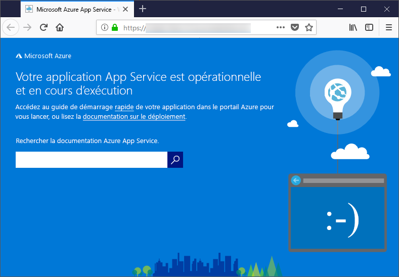

# <a name="configure-a-linux-python-app-for-azure-app-service"></a>Configurer une application Python Linux pour Azure App Service

Cet article explique la façon dont [Azure App Service](app-service-linux-intro.md) exécute des applications Python, et comment vous pouvez personnaliser le comportement d’App Service si nécessaire. Les applications Python doivent être déployées avec tous les modules [pip](https://pypi.org/project/pip/) nécessaires.

Le moteur de déploiement App Service active automatiquement un environnement virtuel et exécute automatiquement `pip install -r requirements.txt` quand vous déployez un [dépôt Git](../deploy-local-git.md?toc=%2fazure%2fapp-service%2fcontainers%2ftoc.json) ou un [package Zip](../deploy-zip.md?toc=%2fazure%2fapp-service%2fcontainers%2ftoc.json) avec les processus de génération activés.

Ce guide fournit des concepts et des instructions clés aux développeurs Python qui utilisent un conteneur Linux intégré dans App Service. Si vous n’avez jamais utilisé Azure App Service, vous devez d’abord suivre le [guide de démarrage rapide Python](quickstart-python.md) et le [tutoriel sur l’utilisation de Python avec PostgreSQL](tutorial-python-postgresql-app.md).

> [!NOTE]
> Linux est le système recommandé pour l’exécution des applications Python dans App Service. Pour plus d’informations sur l’option Windows, consultez [Python sur la version Windows d’App Service](https://docs.microsoft.com/visualstudio/python/managing-python-on-azure-app-service).
>

## <a name="show-python-version"></a>Afficher la version de Python

Pour afficher la version actuelle de Python, exécutez la commande suivante dans le [Cloud Shell](https://shell.azure.com) :

```azurecli-interactive
az webapp config show --resource-group <resource-group-name> --name <app-name> --query linuxFxVersion
```

Pour afficher toutes les versions de Python prises en charge, exécutez la commande suivante dans le [Cloud Shell](https://shell.azure.com) :

```azurecli-interactive
az webapp list-runtimes --linux | grep PYTHON
```

Vous pouvez exécuter une version non prise en charge de Python en générant votre propre image conteneur à la place. Pour plus d’informations, consultez [Utiliser une image Docker personnalisée](tutorial-custom-docker-image.md).

## <a name="set-python-version"></a>Définir la version de Python

Exécutez la commande suivante dans le [Cloud Shell](https://shell.azure.com) pour définir la version 3.7 de Python :

```azurecli-interactive
az webapp config set --resource-group <resource-group-name> --name <app-name> --linux-fx-version "PYTHON|3.7"
```

## <a name="customize-build-automation"></a>Personnaliser l’automatisation de la génération

Si vous déployez votre application à l’aide de packages Git ou zip quand l’automatisation de la génération est activée, ce processus d’automatisation d’App Service exécute pas à pas la séquence suivante :

1. Exécution du script personnalisé s’il est spécifié par `PRE_BUILD_SCRIPT_PATH`.
1. Exécutez `pip install -r requirements.txt`.
1. Si *manage.py* se trouve à la racine du dépôt, exécute *manage.py collectstatic*. Toutefois, si `DISABLE_COLLECTSTATIC` est défini sur `true`, cette étape est ignorée.
1. Exécute le script personnalisé s’il est spécifié par `POST_BUILD_SCRIPT_PATH`.

`PRE_BUILD_COMMAND`, `POST_BUILD_COMMAND` et `DISABLE_COLLECTSTATIC` sont des variables d’environnement qui sont vides par défaut. Pour exécuter des commandes pré-build, définissez `PRE_BUILD_COMMAND`. Pour exécuter des commandes post-build, définissez `POST_BUILD_COMMAND`. Pour désactiver l’exécution de collectstatic lors de la création d’applications Django, définissez `DISABLE_COLLECTSTATIC=true`.

L’exemple suivant définit les deux variables à une série de commandes, séparées par des virgules.

```azurecli-interactive
az webapp config appsettings set --name <app-name> --resource-group <resource-group-name> --settings PRE_BUILD_COMMAND="echo foo, scripts/prebuild.sh"
az webapp config appsettings set --name <app-name> --resource-group <resource-group-name> --settings POST_BUILD_COMMAND="echo foo, scripts/postbuild.sh"
```

Pour connaître les autres variables d’environnement permettant de personnaliser l’automatisation de la génération, consultez [Configuration d’Oryx](https://github.com/microsoft/Oryx/blob/master/doc/configuration.md).

Pour plus d’informations sur la façon dont App Service exécute et génère des applications Python dans Linux, consultez [Documentation Oryx : Comment les applications Python sont détectées et générées](https://github.com/microsoft/Oryx/blob/master/doc/runtimes/python.md).

## <a name="container-characteristics"></a>Caractéristiques du conteneur

Les applications Python déployées sur App Service pour Linux s’exécutent dans un conteneur Docker qui est défini dans le [dépôt GitHub Python d’App Service](https://github.com/Azure-App-Service/python). Les configurations d’images se trouvent dans les répertoires spécifiques des versions.

Ce conteneur présente les caractéristiques suivantes :

- Les applications sont exécutées à l’aide de [Gunicorn WSGI HTTP Server](https://gunicorn.org/), en utilisant les arguments supplémentaires `--bind=0.0.0.0 --timeout 600`.

- Par défaut, l’image de base inclut l’infrastructure web Flask, mais le conteneur prend en charge les autres infrastructures compatibles WSGI et Python 3.7, telles que Django.

- Pour installer des packages supplémentaires, tels que Django, créez un fichier [*requirements.txt*](https://pip.pypa.io/en/stable/user_guide/#requirements-files) à la racine de votre projet en utilisant `pip freeze > requirements.txt`. Ensuite, publiez votre projet sur App Service à l’aide du déploiement Git, qui exécute automatiquement `pip install -r requirements.txt` dans le conteneur pour installer les dépendances de votre application.

## <a name="container-startup-process"></a>Processus de démarrage du conteneur

Lors du démarrage, App Service sur un conteneur Linux exécute les étapes suivantes :

1. Si elle est fournie, utilisez une [commande de démarrage personnalisée](#customize-startup-command).
2. Vérifiez l’existence d’une [application Django](#django-app) et, si elle existe, lancez Gunicorn.
3. Vérifiez l’existence d’une [application Flask](#flask-app) et, si elle existe, lancez Gunicorn.
4. Si aucune autre application n’est trouvée, démarrer une application par défaut qui est créée dans le conteneur.

Les sections suivantes fournissent des détails supplémentaires sur chaque option.

### <a name="django-app"></a>Application Django

Pour les applications Django, App Service recherche un fichier nommé `wsgi.py` dans le code de votre application et exécute Gunicorn à l’aide de la commande suivante :

```bash
# <module> is the path to the folder that contains wsgi.py
gunicorn --bind=0.0.0.0 --timeout 600 <module>.wsgi
```

Si vous recherchez un contrôle plus spécifique de la commande de démarrage, utilisez une [commande de démarrage personnalisée](#customize-startup-command) et remplacez `<module>` par le nom du module qui contient *wsgi.py*.

### <a name="flask-app"></a>Application Flask

Pour Flask, App Service recherche un fichier nommé *application.py* ou *app.py* et démarre Gunicorn comme ceci :

```bash
# If application.py
gunicorn --bind=0.0.0.0 --timeout 600 application:app
# If app.py
gunicorn --bind=0.0.0.0 --timeout 600 app:app
```

Si votre module d’application principal est contenu dans un autre fichier, utilisez un nom différent pour l’objet d’application. Si vous souhaitez fournir des arguments supplémentaires à Gunicorn, utilisez une [commande de démarrage personnalisée](#customize-startup-command).

### <a name="default-behavior"></a>Comportement par défaut

Si App Service ne trouve pas de commande personnalisée, d’application Django ou d’application Flask, une application par défaut en lecture seule, située dans le dossier _defaultsite/opt_, est exécutée. L’application par défaut se présente comme suit :



## <a name="customize-startup-command"></a>Commande de démarrage personnalisée

Vous pouvez contrôler le comportement de démarrage du conteneur en fournissant une commande de démarrage Gunicorn personnalisée. Pour cela, entrez la commande suivante dans [Cloud Shell](https://shell.azure.com) :

```azurecli-interactive
az webapp config set --resource-group <resource-group-name> --name <app-name> --startup-file "<custom-command>"
```

Par exemple, si vous disposez d’une application Flask dont le module principal est *hello.py* et que l’objet d’application Flask dans le fichier est nommé `myapp`, *\<custom-command>* est spécifié comme suit :

```bash
gunicorn --bind=0.0.0.0 --timeout 600 hello:myapp
```

Si votre module principal est dans un sous-dossier, tel que `website`, précisez ce dossier grâce à l’argument `--chdir` :

```bash
gunicorn --bind=0.0.0.0 --timeout 600 --chdir website hello:myapp
```

Vous pouvez également ajouter à la commande tout argument supplémentaire pour Gunicorn à *\<custom-command>* , tel que `--workers=4`. Pour plus d’informations, consultez [Running Gunicorn](https://docs.gunicorn.org/en/stable/run.html) (Exécuter Gunicorn - docs.gunicorn.org).

Pour utiliser un serveur autre que Gunicorn, tel que [aiohttp](https://aiohttp.readthedocs.io/en/stable/web_quickstart.html), vous pouvez remplacer *\<custom-command>* par quelque chose de ce genre :

```bash
python3.7 -m aiohttp.web -H localhost -P 8080 package.module:init_func
```

> [!Note]
> App Service ignore les erreurs qui surviennent lors du traitement d’un fichier de commande personnalisé, puis continue son processus de démarrage en recherchant des applications Django et Flask. Si vous ne voyez pas le comportement attendu, vérifiez que votre fichier de démarrage est déployé sur App Service et qu’il ne contient pas d’erreurs.

## <a name="access-environment-variables"></a>Accéder aux variables d’environnement

Dans App Service, vous pouvez [définir les paramètres de l’application](../configure-common.md?toc=%2fazure%2fapp-service%2fcontainers%2ftoc.json#configure-app-settings) en dehors de votre code d’application. Vous pouvez ensuite y accéder à l’aide du modèle standard [os.environ](https://docs.python.org/3/library/os.html#os.environ). Par exemple, pour accéder à un paramètre d’application nommé `WEBSITE_SITE_NAME`, utilisez le code suivant :

```python
os.environ['WEBSITE_SITE_NAME']
```

## <a name="detect-https-session"></a>Détecter une session HTTPS

Dans App Service, une [terminaison SSL](https://wikipedia.org/wiki/TLS_termination_proxy) se produit au niveau des équilibreurs de charge réseau. Toutes les requêtes HTTPS accèdent donc à votre application en tant que requêtes HTTP non chiffrées. Si votre logique d’application doit vérifier si les requêtes utilisateur sont chiffrées ou non, inspectez l’en-tête `X-Forwarded-Proto`.

```python
if 'X-Forwarded-Proto' in request.headers and request.headers['X-Forwarded-Proto'] == 'https':
# Do something when HTTPS is used
```

Les frameworks web populaires vous permettent d’accéder aux informations `X-Forwarded-*` dans votre modèle d’application standard. Dans [CodeIgniter](https://codeigniter.com/), [is_https()](https://github.com/bcit-ci/CodeIgniter/blob/master/system/core/Common.php#L338-L365) vérifie la valeur de `X_FORWARDED_PROTO` par défaut.

## <a name="access-diagnostic-logs"></a>Accéder aux journaux de diagnostic

[!INCLUDE [Access diagnostic logs](../../../includes/app-service-web-logs-access-linux-no-h.md)]

## <a name="open-ssh-session-in-browser"></a>Ouvrir une session SSH dans un navigateur

[!INCLUDE [Open SSH session in browser](../../../includes/app-service-web-ssh-connect-builtin-no-h.md)]

## <a name="troubleshooting"></a>Dépannage

- **Vous voyez l’application par défaut après le déploiement du code de votre propre application.** L’application par défaut s’affiche, soit parce que vous n’avez pas déployé le code de votre application sur App Service, soit parce qu’App Service n’a pas trouvé le code de votre application et a exécuté l’application par défaut à la place.
- Redémarrez App Service, patientez 15 à 20 secondes et vérifiez de nouveau l’application.
- Vérifiez que vous utilisez bien App Service pour Linux, et non une instance basée sur Windows. À partir de l’interface CLI, exécutez la commande `az webapp show --resource-group <resource_group_name> --name <app_service_name> --query kind`, en remplaçant `<resource_group_name>` et `<app_service_name>` en conséquence. `app,linux` doit être la sortie ; si ce n’est pas le cas, recréez l’App Service et choisissez Linux.
- Utilisez SSH ou la console Kudu pour vous connecter directement à App Service et vérifiez que vos fichiers existent dans *site/wwwroot*. Si vos fichiers n’existent pas, reconsidérez votre processus de déploiement et redéployez l’application.
- Si vos fichiers existent, cela signifie qu’App Service n’a pas été en mesure d’identifier votre fichier de démarrage. Vérifiez que votre application est structurée selon ce qu’App Service attend pour [Django](#django-app) ou [Flask](#flask-app), ou bien utilisez une [commande de démarrage personnalisée](#customize-startup-command).
- **Le message « Service indisponible » s’affiche dans le navigateur.** Le délai d’attente du navigateur a expiré en l’absence d’une réponse d’App Service. Cela indique qu’App Service a démarré le serveur Gunicorn, mais que les arguments qui spécifient le code d’application sont incorrects.
- Actualisez le navigateur, en particulier si vous utilisez les niveaux tarifaires les plus bas pour votre Plan App Service. Par exemple, l’application peut prendre plus de temps à démarrer si vous utilisez des niveaux gratuits et répondre une fois que vous avez actualisé le navigateur.
- Vérifiez que votre application est structurée selon ce qu’App Service attend pour [Django](#django-app) ou [Flask](#flask-app), ou bien utilisez une [commande de démarrage personnalisée](#customize-startup-command).
- [Accéder au flux de journaux](#access-diagnostic-logs).

## <a name="next-steps"></a>Étapes suivantes

> [!div class="nextstepaction"]
> [Tutoriel : Application Python avec PostgreSQL](tutorial-python-postgresql-app.md)

> [!div class="nextstepaction"]
> [Tutoriel : Déployer à partir du référentiel de conteneurs privé](tutorial-custom-docker-image.md)

> [!div class="nextstepaction"]
> [Questions fréquentes (FAQ) sur App Service sur Linux](app-service-linux-faq.md)
