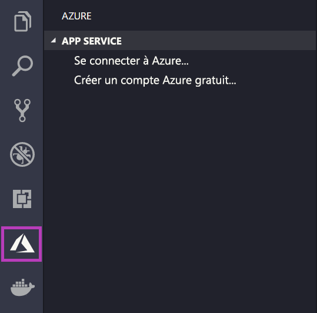
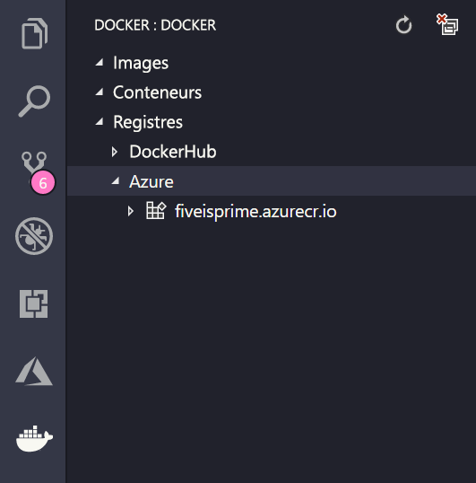

# <a name="deploy-a-custom-linux-container-to-azure-app-service"></a>Déployer un conteneur Linux personnalisé dans Azure App Service

App Service sur Linux fournit des piles d’applications prédéfinies sur Linux avec la prise en charge de langages comme .NET, PHP, Node.js, etc. Vous pouvez également utiliser une image Docker personnalisée pour exécuter votre application web sur une pile d’applications qui n’est pas encore définie dans Azure. Ce guide de démarrage rapide vous montre comment déployer une image à partir d’un [ACR (Azure Container Registry)](/azure/container-registry) vers App Service.

## <a name="prerequisites"></a>Prérequis

* un [compte Azure](https://azure.microsoft.com/free/?utm_source=campaign&utm_campaign=vscode-tutorial-docker-extension&mktingSource=vscode-tutorial-docker-extension) ;
* [Docker](https://www.docker.com/community-edition)
* [Visual Studio Code](https://code.visualstudio.com/)
* L’[extension Azure App Service pour VS Code](vscode:extension/ms-azuretools.vscode-azureappservice). Vous pouvez utiliser cette extension pour créer, gérer et déployer des applications web Linux sur la plateforme PaaS (Platform as a Service) Azure.
* L’[extension Docker pour VS Code](vscode:extension/ms-azuretools.vscode-docker). Vous pouvez utiliser cette extension pour simplifier la gestion des images et commandes Docker locales, ainsi que pour déployer des images d’application générées sur Azure.

## <a name="create-an-image"></a>Créer une image

Pour suivre ce guide de démarrage rapide, vous avez besoin d’une image d’application web appropriée stockée dans un registre [Azure Container Registry](/azure/container-registry). Suivez les instructions données dans [Démarrage rapide : Créer un registre de conteneurs privé à l’aide du portail Azure](/azure/container-registry/container-registry-get-started-portal), mais utilisez l’image `mcr.microsoft.com/azuredocs/go` au lieu de l’image `hello-world`. Pour référence, [l’exemple de fichier Dockerfile se trouve dans le dépôt Exemples Azure](https://github.com/Azure-Samples/go-docs-hello-world).

> [!IMPORTANT]
> Veillez à définir l’option **Utilisateur administrateur**  sur **Activer** quand vous créez le registre de conteneurs. Vous pouvez également la définir à partir de la section **Clés d’accès** de votre page de registre dans le portail Azure. Ce paramètre est nécessaire pour l’accès à App Service.

## <a name="sign-in"></a>Se connecter

Ensuite, lancez VS Code et connectez-vous à votre compte Azure à l’aide de l’extension App Service. Pour ce faire, sélectionnez le logo Azure dans la barre d’activités, accédez à l’explorateur **APP SERVICE**, sélectionnez **Connectez-vous à Azure** , puis suivez les instructions affichées.



## <a name="check-prerequisites"></a>Vérifier les conditions préalables

Vous pouvez maintenant vérifier que tous les prérequis ont été correctement installés et configurés.

Dans VS Code, vous devez voir votre adresse e-mail Azure dans la barre d’état et votre abonnement dans l’explorateur**APP SERVICE**.

Vérifiez ensuite que Docker est installé et en cours d’exécution. La commande suivante affiche la version de Docker s’il est en cours d’exécution.

```bash
docker --version
```

Enfin, vérifiez que votre registre Azure Container Registry est connecté. Pour ce faire, sélectionnez le logo Docker dans la barre d’activités, puis accédez à **REGISTRES**.



## <a name="deploy-the-image-to-azure-app-service"></a>Déployer l’image dans Azure App Service

Maintenant que tout est configuré, vous pouvez déployer votre image dans [Azure App Service](https://azure.microsoft.com/services/app-service/) directement à partir de l’explorateur de l’extension Docker.

Recherchez l’image sous le nœud **Registres** dans l’explorateur**DOCKER**, puis développez-la pour afficher ses balises. Cliquez avec le bouton droit sur une balise, puis sélectionnez **Déployer l’image dans Azure App Service**.

À partir de là, suivez les invites pour choisir un abonnement, un nom d’application global unique, un groupe de ressources et un plan App Service. Choisissez **B1 De base** comme niveau tarifaire et une région.

Une fois le déploiement effectué, votre application est disponible à l’adresse `http://<app name>.azurewebsites.net`.

Un **groupe de ressources** est une collection nommée de toutes les ressources de votre application dans Azure. Par exemple, un groupe de ressources peut contenir une référence à un site web, une base de données et une fonction Azure.

Un **plan App Service** définit les ressources physiques qui seront utilisées pour héberger votre site web. Ce guide de démarrage rapide utilise un plan d’hébergement **De base** sur l’infrastructure **Linux**, ce qui signifie que le site sera hébergé sur une machine Linux avec d’autres sites web. Si vous commencez avec le plan **De base**, vous pouvez utiliser le portail Azure pour effectuer un scale-up afin que votre site soit le seul à s’exécuter sur un ordinateur.

## <a name="browse-the-website"></a>Parcourir le site Web

Le panneau **Sortie** s’ouvre pendant le déploiement pour indiquer l’état de l’opération. Une fois l’opération terminée, recherchez l’application que vous avez créée dans l’explorateur **APP SERVICE**, cliquez dessus avec le bouton droit, puis sélectionnez **Parcourir le site Web** pour ouvrir le site dans votre navigateur.

> [!div class="nextstepaction"]
> [J’ai rencontré un problème](https://www.research.net/r/PWZWZ52?tutorial=quickstart-docker&step=deploy-app)

## <a name="next-steps"></a>Étapes suivantes

Félicitations, vous avez terminé ce démarrage rapide !

Consultez ensuite les autres extensions Azure.

* [Cosmos DB](https://marketplace.visualstudio.com/items?itemName=ms-azuretools.vscode-cosmosdb)
* [Azure Functions](https://marketplace.visualstudio.com/items?itemName=ms-azuretools.vscode-azurefunctions)
* [Outils Azure CLI](https://marketplace.visualstudio.com/items?itemName=ms-vscode.azurecli)
* [Outils Azure Resource Manager](https://marketplace.visualstudio.com/items?itemName=msazurermtools.azurerm-vscode-tools)

Vous pouvez également les obtenir tous en installant le pack d’extension [Azure Tools](https://marketplace.visualstudio.com/items?itemName=ms-vscode.vscode-node-azure-pack).
